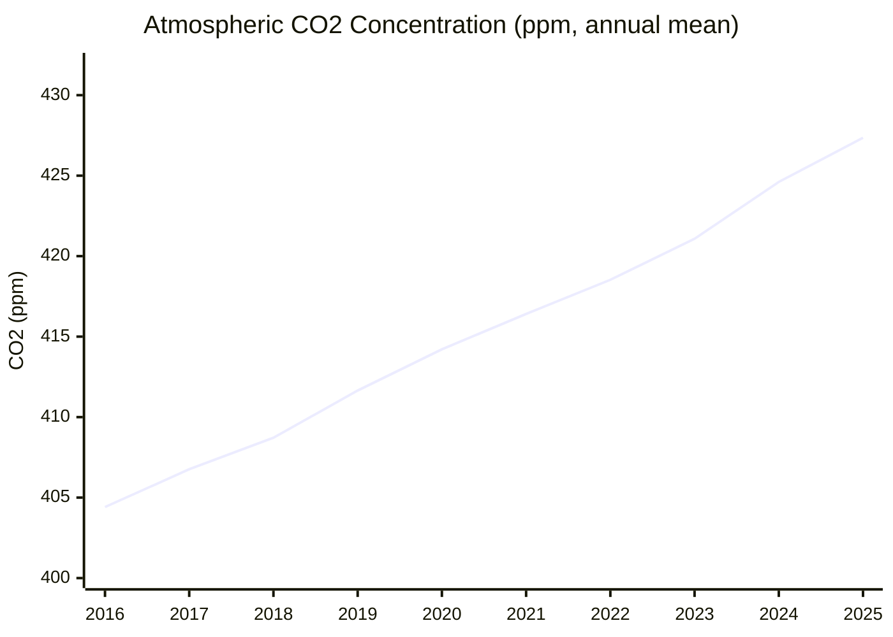
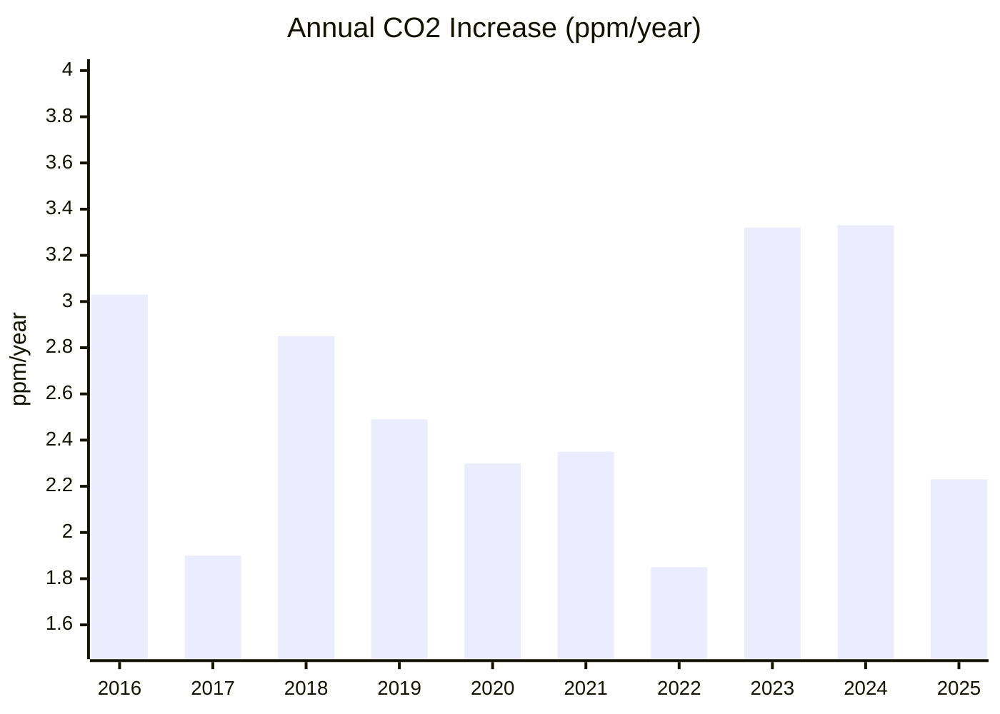

# Climate and Environment — 26H1 (Jan–Jun 2026)

> *Scope note: This is a narrowed toy run for the reporting period 26H1 (Jan–Jun 2026; we are at end of June 2026). It covers only the KPI (atmospheric CO₂ concentration and its recent ppm/year trend) and the single milestone "The Bend." All other milestones and open challenges are out of scope this cycle.*

## Executive Summary

**Bottom line: CO₂ keeps setting records, with no bend in the concentration curve.** The May 2026 seasonal peak hit **432.34 ppm** at Mauna Loa — the highest in the 68-year record[^noaa-trends][^scripps]. The 2025 annual growth of **+2.23 ppm** eased off the El Niño-boosted 2024 record (+3.33 ppm), but remains squarely within the long-run ~2.5–2.6 ppm/year trend[^gr-mlo]. The rise is, if anything, still accelerating versus the ~2.0 ppm/year of the 2000s — not slowing.

As Ralph Keeling, director of the Scripps CO₂ Program, put it: *"Atmospheric CO₂ has continued its relentless rise over the past year, reaching yet another record high… I wish we had better news."*[^scripps]

---

## KPI Dashboard

**KPI: Atmospheric CO₂ concentration (ppm) and recent growth trend (ppm/year)**

| Metric | Value | Source |
|--------|-------|--------|
| **May 2026 seasonal peak (Mauna Loa)** | **432.34 ppm** — highest in the record | [NOAA GML][noaa-trends] |
| May 2026 peak (Scripps instruments) | 432.00 ppm (+1.8 ppm vs May 2025) | [Scripps/UCSD][scripps] |
| Latest weekly value (week of Jun 14, 2026) | 431.17 ppm (seasonal decline has begun) | [NOAA weekly][noaa-weekly] |
| 2025 annual mean (Mauna Loa) | 427.35 ppm | [NOAA annual][noaa-ann-mlo] |
| 2025 annual mean (NOAA global marine) | 425.65 ppm | [NOAA global][noaa-ann-gl] |
| 2025 annual growth (Mauna Loa) | **+2.23 ppm** (down from +3.33 in 2024) | [NOAA growth][gr-mlo] |
| 10-year mean growth (2016–2025) | **~2.57 ppm/yr** (MLO) / ~2.54 (global) | [MLO][gr-mlo] / [global][gr-gl] |

[noaa-trends]: https://gml.noaa.gov/ccgg/trends/
[scripps]: https://today.ucsd.edu/story/annual-carbon-dioxide-peak-reaches-432-parts-per-million
[noaa-weekly]: https://gml.noaa.gov/webdata/ccgg/trends/co2/co2_weekly_mlo.txt
[noaa-ann-mlo]: https://gml.noaa.gov/webdata/ccgg/trends/co2/co2_annmean_mlo.txt
[noaa-ann-gl]: https://gml.noaa.gov/webdata/ccgg/trends/co2/co2_annmean_gl.txt
[gr-mlo]: https://gml.noaa.gov/webdata/ccgg/trends/co2/co2_gr_mlo.txt
[gr-gl]: https://gml.noaa.gov/webdata/ccgg/trends/co2/co2_gr_gl.txt

### Atmospheric CO₂ Concentration (Mauna Loa, annual mean)

*Data: [NOAA Global Monitoring Laboratory][noaa-ann-mlo]. The May 2026 monthly peak of 432.34 ppm sits above the latest annual mean shown.*

### Annual CO₂ Increase Rate (Mauna Loa)

*Data: [NOAA Growth Rates][gr-mlo].*

**Assessment: 🔴 Worsening.** Concentration set a new all-time record in May 2026, and CO₂ rises every year. The 2025 growth rate eased after the 2023–2024 El Niño boost faded, but at +2.23 ppm it remains within recent variability, and the 10-year mean (~2.57 ppm/yr) stays above the ~2.0 ppm/yr pace of the 2000s. There is no bending of the concentration curve.

---

## Milestone Status

### ⚪ "The Bend" — Peak Global Greenhouse-Gas Emissions

**Status: Not assessed this cycle — dedicated research note unavailable.**

A research note for The Bend was planned for 26H1 but was not produced this cycle, so we cannot present updated 2025/2026 emissions figures, China's trajectory, or expert assessments here. To avoid unsupported claims, no emissions numbers are reported.

**What the KPI data does (and does not) tell us:** Atmospheric CO₂ concentration is still rising every year and hit a fresh record (432.34 ppm) in May 2026[^noaa-trends][^scripps]. However, a rising *concentration* does not by itself reveal whether annual *emissions* have peaked — concentration continues to climb as long as net emissions remain positive, even after an emissions peak. So the KPI alone cannot confirm or rule out that "The Bend" is behind us. A definitive assessment awaits the missing emissions research note in a future cycle.

---

## Reference Data

| Series | Source |
|--------|--------|
| Mauna Loa CO₂ trends (overview) | [NOAA GML][noaa-trends] |
| Mauna Loa annual means | [NOAA][noaa-ann-mlo] |
| Global marine annual means | [NOAA][noaa-ann-gl] |
| Annual growth rates (Mauna Loa) | [NOAA][gr-mlo] |
| Annual growth rates (global) | [NOAA][gr-gl] |
| Weekly Mauna Loa values | [NOAA][noaa-weekly] |
| 2026 seasonal peak announcement | [Scripps/UCSD][scripps] |

---

## Footnotes

[^noaa-trends]: [NOAA Global Monitoring Laboratory — CO₂ trends](https://gml.noaa.gov/ccgg/trends/). May 2026 Mauna Loa monthly mean = 432.34 ppm (highest in the record; NOAA "Last updated: Jun 05, 2026"); vs May 2025 = 430.51 ppm.
[^scripps]: [Scripps/UCSD — Annual carbon dioxide peak reaches 432 parts per million (Jun 11, 2026)](https://today.ucsd.edu/story/annual-carbon-dioxide-peak-reaches-432-parts-per-million). Scripps instruments measured the May 2026 peak at 432.00 ppm (+1.8 ppm over May 2025's 430.2 ppm); quote from Ralph Keeling.
[^gr-mlo]: [NOAA — Mauna Loa annual CO₂ growth rates](https://gml.noaa.gov/webdata/ccgg/trends/co2/co2_gr_mlo.txt). 2025 growth = +2.23 ppm; 2023 = +3.32, 2024 = +3.33; 10-year mean (2016–2025) ≈ 2.57 ppm/yr (computed from the NOAA growth-rate file).
