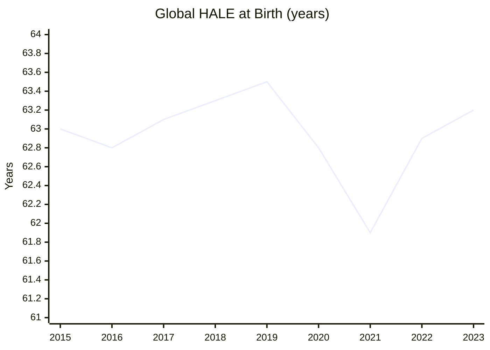
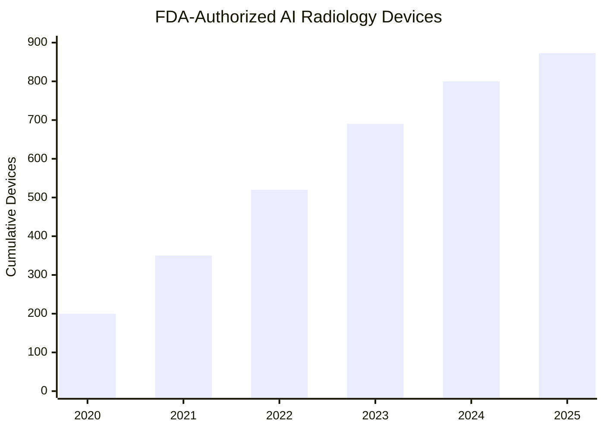

# Cancer and Healthspan — 2025 Year in Review

> *Some people long for immortality, others would just prefer not to die (or live a low-quality life) yet. The biggest symbol for fixing this is our journey to cure cancer, but the fight against other diseases such as Alzheimer's (or potential pandemics), as well as perfected early diagnostics, are just as important. And to achieve not just plain longevity, but long healthy lifespan, eventually we need to move further — to evolve our biology, not just fight off diseases.*

## Executive Summary

**The good news:** Multi-cancer early detection is arriving. GRAIL's PATHFINDER 2 trial demonstrated 7× more cancers detected versus standard screening[^grail-pathfinder]. The first FDA-cleared Alzheimer's blood test (Lumipulse G pTau217) brings neurodegeneration diagnostics to routine care[^fda-ptau217]. OpenAI and Retro Biosciences achieved >50× improvement in stem cell reprogramming efficiency[^retro-openai], potentially unlocking cellular rejuvenation at scale. CAR-T therapies are breaking out of oncology into autoimmune diseases, offering potential cures for conditions like lupus.

**The bad news:** The fundamentals remain daunting. Metastatic cancer 5-year survival sits at 15.1%[^seer-survival]. Dementia prevalence after age 80 remains ~24%[^dementia-prevalence], far from the 5% target. Unity Biotechnology — a flagship senolytic company — liquidated after insufficient clinical results[^unity-dissolution]. NIH funding was cut 31% in Q1 2025[^nih-cuts], and FDA staff departures exceeded 18%, threatening the approval pipeline. No validated intervention has achieved ≥10-year biological age reversal.

**Bottom line: Diagnostics are transforming. Therapeutics are struggling. The science of aging is funded like never before, but the path from lab to clinic remains long.**

---

## KPI Dashboard

| Metric | Value | Source |
|--------|-------|--------|
| **Healthy Life Expectancy (HALE)** | **61.9 years** (WHO 2021) | [WHO World Health Statistics 2024][who-hale] |
| **IHME GBD estimate (2023)** | ~63.2 years | [IHME GBD 2023][ihme-gbd] |
| **Pre-pandemic HALE (2019)** | 63.5 years | [WHO][who-hale] |
| **10-year trend** | +0.2 years (net, after COVID recovery) | Calculated |

[who-hale]: https://www.who.int/data/gho/publications/world-health-statistics
[ihme-gbd]: https://www.healthdata.org/research-analysis/gbd

**Note:** The [WHO World Health Statistics 2024 report](https://www.who.int/news/item/24-05-2024-covid-19-eliminated-a-decade-of-progress-in-global-level-of-life-expectancy) confirms that COVID-19 wiped out nearly a decade of HALE gains, dropping from 63.5 years (2019) to 61.9 years (2021) — a loss of 1.5 years globally. Life expectancy dropped by 1.8 years over the same period.

### Global Healthy Life Expectancy at Birth

*Data: [WHO World Health Statistics 2024][who-hale], [IHME Global Burden of Disease][ihme-gbd]*

**Assessment: ⚠️ Recovering from COVID setback.** The pandemic erased nearly a decade of HALE gains in just two years (2020–2021), dropping from 63.5 to 61.9 years. Life expectancy has largely returned to pre-pandemic levels by 2023, but the 2022–2023 values remain estimates pending official WHO confirmation.

### Life Expectancy Recovery Indicators (2024–2025)

Since HALE data lags, we track life expectancy (LE) from national statistics offices as a proxy for healthspan recovery:

| Country | LE at Birth (2024) | vs Pre-COVID (2019) | Status | Source |
|---------|-------------------|---------------------|--------|--------|
| **UK** | 83.0 F / 79.1 M (2022–2024) | F: recovered; M: −10 weeks | 🟢 Females recovered | [ONS Dec 2025][ons-le] |
| **US** | 79.25 years | −0.5 years (still below) | 🟡 Partial recovery | [CDC/Macrotrends][us-le] |
| **California** | 0.86 years below 2019 | Widened racial gaps | 🔴 Incomplete recovery | [JAMA Nov 2025][jama-ca] |

[ons-le]: https://www.ons.gov.uk/peoplepopulationandcommunity/birthsdeathsandmarriages/lifeexpectancies/bulletins/nationallifetablesunitedkingdom/2022to2024
[us-le]: https://www.macrotrends.net/global-metrics/countries/usa/united-states/life-expectancy
[jama-ca]: https://jamanetwork.com/journals/jama/article-abstract/2836256

**Note:** Drug overdoses and cardiovascular disease are now larger contributors to US life expectancy deficits than COVID-19.

---

## Milestone Status

### 🔴 Milestone 1: Taming Cancer

**Target:** 80% of all solid tumor cases reach 10-year survival  
**Status: Distant**

| Metric | Current Value | Target | Gap |
|--------|---------------|--------|-----|
| 5-year all-cancer survival | 69% | — | — |
| 10-year all-cancer survival | ~60% | 80% | **20 percentage points** |
| Metastatic (distant) 5-year survival | 15.1% | — | — |

*Data: [SEER Cancer Statistics Review][seer-survival]*

[seer-survival]: https://seer.cancer.gov/statfacts/html/all.html

#### Key 2025 Breakthroughs

| Date | Event | Source |
|------|-------|--------|
| **Apr 2025** | 🟢 **MSK breakthrough:** 80% of MMRd tumors eliminated with immunotherapy alone (no surgery) | [NEJM][msk-mmrd] |
| **2024–2025** | 🟢 **50+ FDA oncology approvals in 2024; 46+ in 2025** — record pace | [FDA][fda-2024], [FDA][fda-2025-list] |

[msk-mmrd]: https://www.nejm.org/doi/full/10.1056/NEJMoa2503392
[fda-2024]: https://www.fda.gov/drugs/novel-drug-approvals-2024
[fda-2025-list]: https://www.fda.gov/drugs/novel-drug-approvals-2025

**Why the MSK result matters:** This suggests immunotherapy-first approaches may eventually replace surgery for genetically-defined tumor subsets — though MMRd represents only ~15% of colorectal cancers.

#### 2025 FDA Oncology Approvals

The FDA approved 46 novel drugs in 2025[^fda-2025], with particular momentum in antibody-drug conjugates (ADCs) and bispecific antibodies. Key oncology approvals:

| Date | Drug | Indication | Type | Source |
|------|------|------------|------|--------|
| **Jan 17, 2025** | Datopotamab deruxtecan (Datroway) | HR+/HER2-low breast cancer | ADC | [FDA][fda-datroway] |
| **Feb 14, 2025** | Vimseltinib (Romvimza) | Tenosynovial giant cell tumor | CSF1R kinase inhibitor | [FDA][fda-vimseltinib] |
| **May 8, 2025** | Avutometinib + defactinib (Avmapki Fakzynja) | KRAS-mutated low-grade serous ovarian | First novel/novel oral combination | [FDA][fda-avutometinib] |
| **Jun 23, 2025** | Datopotamab deruxtecan (expanded) | EGFR-mutated NSCLC | ADC | [FDA][fda-datroway-nsclc] |
| **Sep 25, 2025** | Imlunestrant (Inluriyo) | ER+/HER2-/ESR1-mutated breast cancer | SERD | [FDA][fda-imlunestrant] |
| **2025** | Sotorasib + panitumumab | KRAS G12C colorectal cancer | Targeted combo | [FDA][fda-2025-list] |
| **2025** | Tarlatamab | Small cell lung cancer | DLL3 BiTE | [FDA][fda-2025-list] |

[fda-datroway]: https://www.fda.gov/drugs/resources-information-approved-drugs/fda-approves-datopotamab-deruxtecan-dlnk-unresectable-or-metastatic-hr-positive-her2-negative-breast
[fda-vimseltinib]: https://www.fda.gov/drugs/resources-information-approved-drugs/fda-approves-vimseltinib-symptomatic-tenosynovial-giant-cell-tumor
[fda-avutometinib]: https://www.fda.gov/drugs/resources-information-approved-drugs/fda-grants-accelerated-approval-combination-avutometinib-and-defactinib-kras-mutated-recurrent-low
[fda-imlunestrant]: https://www.fda.gov/drugs/resources-information-approved-drugs/fda-approves-imlunestrant-er-positive-her2-negative-esr1-mutated-advanced-or-metastatic-breast
[fda-datroway-nsclc]: https://www.fda.gov/drugs/resources-information-approved-drugs/fda-grants-accelerated-approval-datopotamab-deruxtecan-dlnk-egfr-mutated-non-small-cell-lung-cancer

[^fda-2025]: [Nature Reviews Drug Discovery: 2025 FDA Approvals](https://www.nature.com/articles/d41573-026-00001-z)

#### Setbacks

| Date | Event | Source |
|------|-------|--------|
| **2025** | 🔴 **TIGIT program failures** — multiple trials discontinued | Industry reports |
| **Jan–Mar 2025** | 🔴 **NIH funding cut 31%** — threatens cancer research pipeline | [Science][nih-cuts] |
| **2025** | 🔴 **Mobocertinib withdrawn** from market | [FDA][fda-oncology] |
| **2025** | 🔴 **>18% FDA staff departures** — approval pipeline pressured | [Nature Reviews Drug Discovery][fda-2025] |

[nih-cuts]: https://www.science.org/content/article/nih-budget-cuts
[fda-oncology]: https://www.fda.gov/drugs/resources-information-approved-drugs/oncology-cancer-hematologic-malignancies-approval-notifications

**Why it matters:** Metastatic cancer remains the killer — accounting for ~90% of cancer deaths. The gap between early-stage survival (often >90%) and metastatic survival (15%) represents the central challenge. New ADCs and bispecifics are incrementally improving outcomes, but transformative cures remain elusive.

---

### 🟡 Milestone 2: Precise Screening

**Target:** >50% of major NCDs caught pre-symptomatic  
**Status: Approaching**

*Data: FDA AI/ML Medical Device Database*

#### Key 2025 Developments

| Date | Event | Significance | Source |
|------|-------|--------------|--------|
| **May 2025** | 🟢 **FDA clears first Alzheimer's blood test** (Lumipulse G pTau217) | 91.7% sensitivity, 97.3% specificity; routine clinical use | [FDA][fda-ptau217] |
| **Oct 2025** | 🟢 **GRAIL PATHFINDER 2 results**: 7× cancer detection vs standard screening | 40.4% sensitivity, 99.6% specificity | [GRAIL][grail-pathfinder] |
| **Sep 2025** | 🟢 **Exact Sciences launches Cancerguard MCED** | 64% sensitivity, 97.4% specificity | [Exact Sciences][exact-sciences] |
| **Mid-2025** | 🟢 **873 AI-enabled radiology devices** FDA-authorized | Cumulative since 2018 | [FDA AI/ML][fda-ai] |

[fda-ptau217]: https://www.fda.gov/news-events/press-announcements/alzheimers-blood-test
[grail-pathfinder]: https://grail.com/clinical-studies/pathfinder/
[exact-sciences]: https://www.exactsciences.com/
[fda-ai]: https://www.fda.gov/medical-devices/software-medical-device-samd/artificial-intelligence-and-machine-learning-aiml-enabled-medical-devices

#### Multi-Cancer Early Detection (MCED) Landscape

| Test | Sensitivity | Specificity | FDA Status | Source |
|------|-------------|-------------|------------|--------|
| GRAIL Galleri | 40.4% (PATHFINDER 2) | 99.6% | Not yet approved | [GRAIL][grail-pathfinder] |
| Exact Sciences Cancerguard | 64% | 97.4% | Not yet approved | [Exact Sciences][exact-sciences] |
| Freenome | In development | — | Clinical trials | [Freenome][freenome] |

[freenome]: https://www.freenome.com/

**Gap:** No MCED test has received FDA approval yet — expected H1 2026. Medicare coverage remains unavailable, limiting access. False positive management and population-level cost-effectiveness are unresolved questions.

---

### 🔴 Milestone 3: Unbroken Mind

**Target:** Dementia prevalence (CDR ≥1) after age 80 falls below 5%  
**Status: Distant**

| Metric | Current Value | Target | Gap |
|--------|---------------|--------|-----|
| Dementia prevalence (ages 80–89) | ~24% | <5% | **~5× reduction needed** |
| Americans with Alzheimer's (age 65+) | 7.2 million (2025) | — | +17% projected by 2030 |
| Age-specific prevalence trend | ↓67% over 40 years | — | Slow progress |

*Data: [Alzheimer's Association 2025 Facts and Figures][alz-facts]*

[alz-facts]: https://www.alz.org/alzheimers-dementia/facts-figures

**Key statistics from 2025 Alzheimer's Association report:**
- 7.2 million Americans age 65+ live with Alzheimer's dementia (first time exceeding 7 million)
- Almost two-thirds of Americans with Alzheimer's are women
- Healthcare costs projected at $384 billion in 2025
- Nearly 12 million unpaid caregivers provided 19 billion hours of care in 2024

#### FDA-Approved Disease-Modifying Therapies

| Drug | Approval | Mechanism | Efficacy | Safety | Source |
|------|----------|-----------|----------|--------|--------|
| **Lecanemab (Leqembi)** | Jan 2023 (full); Aug 2025 (subQ) | Anti-Aβ | 27% slowing | ARIA 21% | [FDA][leqembi] |
| **Donanemab (Kisunla)** | Jul 2024 | Anti-Aβ | 22–35% slowing | ARIA 24–30% | [NEJM][donanemab-nejm] |

[leqembi]: https://www.fda.gov/drugs/news-events-human-drugs/fda-approves-subcutaneous-formulation-alzheimers-disease-drug
[donanemab-nejm]: https://www.nejm.org/doi/full/10.1056/NEJMoa2305274

#### 2025 Developments

| Date | Event | Outcome | Source |
|------|-------|---------|--------|
| **Aug 2025** | 🟢 **Subcutaneous Leqembi** approved | Enables home administration | [FDA][leqembi] |
| **Jul 2025** | 🟢 **U.S. POINTER results** | Lifestyle interventions improve cognition | [Alzheimer's Association][pointer] |
| **2024** | 🟢 **Lancet Commission** | 45% of dementia from 14 modifiable risk factors | [Lancet][lancet-dementia] |
| **Nov 2025** | 🔴 **Semaglutide fails two Phase 3 AD trials** | No benefit on cognitive endpoints | [Novo Nordisk][semaglutide-ad] |
| **2025** | 🔴 **J&J posdinemab fails Phase 2** | Anti-tau antibody misses endpoints | [J&J][posdinemab] |

[fda-donanemab]: https://www.fda.gov/drugs/news-events-human-drugs/fda-approves-treatment-adults-alzheimers-disease
[pointer]: https://www.alz.org/us-pointer
[lancet-dementia]: https://www.thelancet.com/commissions/dementia-2024
[semaglutide-ad]: https://www.novonordisk.com/news-and-media/news-and-ir-materials/news-details.html?id=166233
[posdinemab]: https://www.jnj.com/media-center/press-releases/johnson-johnson-announces-phase-2-results-for-posdinemab

**Why it matters:** We now have two FDA-approved disease-modifying Alzheimer's therapies (lecanemab, donanemab), but both only modestly slow decline (22–35%) in early-stage patients. The failure of semaglutide — despite promising epidemiological signals — underscores how far we are from breakthrough treatments. ARIA (amyloid-related imaging abnormalities) affects 21–30% of patients, requiring careful monitoring.

---

### 🟡 Milestone 4: The Long Middle Age

**Target:** Validated interventions reverse ≥10 years of biological age  
**Status: Approaching (lab only)**

| Metric | Best Demonstrated | Target | Gap |
|--------|-------------------|--------|-----|
| Biological age reversal (human trials) | 1.5–3.2 years | ≥10 years | **3–7× improvement needed** |
| Reprogramming efficiency (lab) | >50× improvement | Clinical translation | Pre-clinical |

#### Validated Human Age Reversal Interventions

| Intervention | Age Reversal | Duration | Source |
|--------------|-------------|----------|--------|
| **TRIIM trial** (Fahy et al.) | 2.5 years (epigenetic) | 12 months | [Aging Cell][triim] |
| **Fitzgerald diet/lifestyle** | 3.23 years (epigenetic) | 8 weeks | [Aging][fitzgerald] |
| **Semaglutide** (GLP-1) | Clock decreases observed | Ongoing | [Clinical studies][semaglutide-aging] |

[triim]: https://onlinelibrary.wiley.com/doi/full/10.1111/acel.13028
[fitzgerald]: https://www.aging-us.com/article/103643/text
[semaglutide-aging]: https://www.nature.com/articles/s41591-024-02875-x

#### 2025 Developments

| Date | Event | Significance | Source |
|------|-------|--------------|--------|
| **Aug 22, 2025** | 🟢 **OpenAI/Retro Bio achieve >50× reprogramming efficiency** | AI-designed Yamanaka factor variants (RetroSOX, RetroKLF) outperform wild-type; validated across donors/cell types | [OpenAI][retro-openai] |
| **Sep 2025** | 🔴 **Unity Biotechnology dissolves** | Flagship senolytic company fails after insufficient clinical results | [Unity][unity-dissolution] |
| **2025** | 🟡 **Life Biosciences approaches Phase 1 trials** | Partial epigenetic reprogramming for eye diseases; trials expected early 2026 | [Life Biosciences][life-bio] |
| **2025** | 🟡 **NewLimit advances toward human trials** | Epigenetic reprogramming therapies | [NewLimit][newlimit] |

[retro-openai]: https://openai.com/index/accelerating-life-sciences-research-with-retro-biosciences/
[unity-dissolution]: https://www.unitybiotechnology.com/
[life-bio]: https://www.lifebiosciences.com/
[newlimit]: https://www.newlimit.com/

**The OpenAI/Retro breakthrough explained:** Using GPT-4b micro, a protein engineering model trained on biological data, researchers redesigned SOX2 and KLF4 (two of the four Yamanaka factors). The AI-generated variants achieved:
- >50× higher expression of pluripotency markers vs. wild-type
- ~50% hit rate for novel designs (vs. typical <1% with random mutagenesis)
- Enhanced DNA damage repair, suggesting improved rejuvenation potential
- Validation across multiple donors, cell types, and delivery methods

**Gap:** Small human trials have demonstrated 1.5–2.5 year biological age reversals using lifestyle and supplement interventions. No therapy has achieved the ≥10-year reversal threshold with validated biomarkers and functional outcomes. The OpenAI/Retro breakthrough may accelerate reprogramming-based approaches, but clinical translation remains years away.

---

## Open Challenges

### 🟡 Challenge 1: Causal Model of Aging

**Status: Rapidly evolving, not yet unified**

The 12 Hallmarks of Aging framework (updated 2023) provides the dominant conceptual model, but does not yet predict intervention effects on disease outcomes.

#### 2025 Developments

| Date | Finding | Source |
|------|---------|--------|
| **Aug 2024** | 🟢 **Stanford study**: Aging occurs in nonlinear waves at ~44 and ~60 years | [Nature Medicine][stanford-waves] |
| **2025** | 🟢 **DamAge/AdaptAge clocks** separate damaging vs adaptive aging changes | [Cell][damage-clocks] |
| **Ongoing** | 🟢 **Unprecedented funding**: Hevolution $1B/year, Altos $3B cumulative, NIA ~$4.2B/year | Multiple |

[stanford-waves]: https://www.nature.com/articles/s41591-024-03169-0
[damage-clocks]: https://www.cell.com/cell/fulltext/S0092-8674(23)01354-3

**Gap:** We can measure biological age with increasing precision (epigenetic clocks, proteomics, metabolomics) and identify hallmarks of aging, but cannot yet predict which interventions will reduce disease incidence in which patients. A unified causal model connecting molecular changes → organ dysfunction → disease → mortality remains the holy grail.

---

### 🟡 Challenge 2: Predictive Biomarkers

**Status: Breakthrough year**

| Biomarker | Application | Performance | FDA Status | Source |
|-----------|-------------|-------------|------------|--------|
| **pTau217 blood test** | Alzheimer's | 91.7% sens, 97.3% spec | ✅ Cleared (May 2025) | [FDA][fda-ptau217] |
| **MCED panels** | Multi-cancer | 40–64% sens, 97–99% spec | Expected H1 2026 | [GRAIL][grail-pathfinder] |
| **hs-Troponin** | Cardiovascular | High sensitivity for MI | ✅ Cleared | Standard of care |
| **Lp(a)** | ASCVD risk | Genetic risk factor | Validated | ACC guidelines |
| **FIB-4** | Liver fibrosis | Non-invasive scoring | Clinical use | Standard of care |

**Progress:** The FDA received 500+ AI-related medical device submissions in 2025, reflecting acceleration in biomarker discovery and validation.

**Gaps:** False positive management for MCED (anxiety, unnecessary procedures), population-specific calibration, and cost/access remain barriers. Most biomarkers validated in European ancestry populations need diverse validation.

---

### 🟡 Challenge 3: Safe In-Vivo Rejuvenation

**Status: Scientific breakthrough, safety unresolved**

The core tension: cellular reprogramming to a younger state risks loss of cell identity or cancer. 2025 saw major advances on both sides.

| Date | Development | Significance | Source |
|------|-------------|--------------|--------|
| **Aug 2025** | 🟢 **Retro/OpenAI >50× reprogramming efficiency** | AI-designed proteins; manufacturing breakthrough | [OpenAI][retro-openai] |
| **2025** | 🟢 **Shift Bioscience discovers SB000** | Rejuvenation without pluripotency — potential safety advance | [Shift Bio][shift-bio] |
| **2025** | 🟢 **Life Biosciences partial reprogramming** | Using only 3 of 4 Yamanaka factors avoids full reset | [Life Biosciences][life-bio] |
| **Sep 2025** | 🔴 **Unity Biotechnology liquidates** | After multiple clinical failures | [Unity][unity-dissolution] |

[shift-bio]: https://www.shiftbioscience.com/

**Core challenge:** Cancer risk and identity loss from epigenetic reprogramming remain unsolved. Partial reprogramming (avoiding full pluripotency) is the leading approach, but therapeutic windows are narrow. Unity's failure despite promising preclinical data illustrates the translation challenge.

---

### 🟢 Challenge 4: Programmable Immunity

**Status: Strong progress**

| Metric | Current State | Source |
|--------|---------------|--------|
| FDA-approved CAR-T products | 7 (Aucatzyl newest, Nov 2024) | [FDA][fda-cart] |
| CAR-T for autoimmune diseases | Breakthrough trials (Kyverna, Cabaletta) | [Clinical trials][cart-autoimmune] |
| mRNA cancer vaccines | V940 shows 44% reduced melanoma recurrence | [Moderna][moderna-v940] |

[fda-cart]: https://www.fda.gov/vaccines-blood-biologics/cellular-gene-therapy-products
[cart-autoimmune]: https://clinicaltrials.gov/
[moderna-v940]: https://www.modernatx.com/

#### Key 2025 Developments

| Date | Event | Significance | Source |
|------|-------|--------------|--------|
| **Dec 2025** | 🟢 **mRNA thymus rejuvenation in mice** | Could restore immune function with aging | [Nature][nature-thymus] |
| **Apr 2024** | ⚠️ **FDA adds boxed warning for CAR-T secondary malignancies** | T-cell lymphomas in ~2% of patients | [FDA][fda-cart-warning] |
| **2025** | 🟢 **CAR-T for lupus, myasthenia gravis** show remission | Potential cures for autoimmunity | [Clinical trials][cart-autoimmune] |

[nature-thymus]: https://www.nature.com/articles/s41586-024-08395-7
[fda-cart-warning]: https://www.fda.gov/vaccines-blood-biologics/safety-availability-biologics/fda-investigating-serious-risk-t-cell-malignancy

**Gap:** CAR-T manufacturing remains expensive ($400K+ per treatment) and complex. The secondary malignancy signal requires long-term monitoring. Scaling to common diseases (beyond rare cancers and autoimmune conditions) is the next frontier.

---

### 🟡 Challenge 5: Brain Preservation

**Status: Incremental advances, no breakthrough**

| Approach | Status | Source |
|----------|--------|--------|
| Anti-amyloid antibodies | 2 FDA-approved (lecanemab, donanemab) | [FDA][fda-donanemab] |
| Anti-tau therapies | First proof-of-concept signals | Clinical trials |
| Neural interfaces | Neuralink: 5 patients, 670+ cumulative days | [Neuralink][neuralink] |
| Neurogenesis | Karolinska confirms neural progenitors in adult human brain (Jul 2025) | [Karolinska][karolinska] |
| Glymphatic enhancement | Meditation shown to stimulate glymphatic system (Dec 2025) | [Nature][glymphatic] |

[neuralink]: https://neuralink.com/
[karolinska]: https://ki.se/en/news/adult-human-brain-neural-progenitor-cells
[glymphatic]: https://www.nature.com/articles/s41598-024-79741-4

**The challenge:** The brain's unique vulnerability to aging — no cell replacement, blood-brain barrier limiting drug access, interconnected circuits where any damage matters — makes preservation harder than other organs. Current anti-amyloid drugs slow decline modestly but don't stop it. Whether amyloid is cause or consequence remains debated.

---

## Beyond the Framework: 2025 Highlights

### GLP-1 Revolution

| Date | Development | Source |
|------|-------------|--------|
| **Dec 2025** | 🟢 **WHO issues first GLP-1 guideline for obesity** | Global health recognition | [WHO][who-glp1] |
| **2025** | 🟢 **GLP-1s called "first longevity drugs"** | Cardiovascular, renal benefits beyond weight | [Nature Biotechnology][nat-bio-glp1] |

[who-glp1]: https://www.who.int/news/item/13-12-2024-who-releases-first-guideline-on-clinical-management-of-obesity
[nat-bio-glp1]: https://www.nature.com/articles/s41587-024-02383-8

### Global Health Milestones

| Date | Development | Source |
|------|-------------|--------|
| **Nov 2025** | 🟢 **World Cervical Cancer Elimination Day established** | HPV vaccination success | [WHO][who-cervical] |
| **2025** | 🟢 **First non-profit FDA drug approval (Waskyra)** | Gene therapy for Wiskott-Aldrich syndrome by Fondazione Telethon | [FDA][fda-waskyra] |

[who-cervical]: https://www.who.int/campaigns/cervical-cancer-elimination-day-of-action
[fda-waskyra]: https://www.fda.gov/vaccines-blood-biologics/waskyra

### Longevity Investment

| Company | Amount | Focus | Source |
|---------|--------|-------|--------|
| Retro Biosciences | ~$1B (raising) | AI-driven reprogramming | [TechCrunch][retro-raise] |
| NewLimit | $130M | Epigenetic reprogramming | [TechCrunch][newlimit-raise] |
| Insilico Medicine | $110M | AI drug discovery | [Forbes][insilico-raise] |
| Juvenescence | $76M | Longevity therapeutics | [Longevity.Technology][juvenescence] |

[retro-raise]: https://techcrunch.com/2025/01/24/retro-biosciences-backed-by-sam-altman-is-raising-1-billion-to-extend-human-lifespan/
[newlimit-raise]: https://techcrunch.com/2024/04/16/newlimit-epigenetic-reprogramming-aging/
[insilico-raise]: https://www.forbes.com/sites/alexzhavoronkov/2024/06/15/insilico-medicine-raises-110-million/
[juvenescence]: https://longevity.technology/news/juvenescence-raises-76m-series-d/

### Setbacks

- **NIH funding cuts** — 31% reduction in Q1 2025 threatens research pipeline[^nih-cuts]
- **FDA staff departures** — >18% attrition creating approval bottlenecks
- **Unity Biotechnology dissolution** — flagship senolytic company fails after multiple clinical disappointments

---

## Reference Data

### External Visualizations

| Chart | Source |
|-------|--------|
| Global HALE trends | [WHO GHO](https://www.who.int/data/gho/data/indicators/indicator-details/GHO/healthy-life-expectancy-(hale)-at-birth-(years)) |
| Cancer survival trends | [SEER Explorer](https://seer.cancer.gov/explorer/) |
| Epigenetic clock comparison | [Aging.ai](https://aging.ai/) |
| GBD data visualizations | [IHME GBD Compare](https://vizhub.healthdata.org/gbd-compare/) |
| Alzheimer's state data | [Alzheimer's Association Facts & Figures](https://www.alz.org/alzheimers-dementia/facts-figures) |

---

*Data sources: [WHO World Health Statistics 2024][who-hale], [IHME GBD][ihme-gbd], [SEER][seer-survival], [FDA][fda-oncology], [GRAIL][grail-pathfinder], [Alzheimer's Association][alz-facts], [OpenAI/Retro Biosciences][retro-openai]*

---

## Footnotes

[^grail-pathfinder]: [GRAIL PATHFINDER 2 Trial Results](https://grail.com/clinical-studies/pathfinder/)
[^fda-ptau217]: [FDA Clears First Alzheimer's Blood Test](https://www.fda.gov/news-events/press-announcements/alzheimers-blood-test)
[^retro-openai]: [OpenAI/Retro Biosciences: Accelerating Life Sciences Research](https://openai.com/index/accelerating-life-sciences-research-with-retro-biosciences/) — August 22, 2025 publication describing >50× reprogramming efficiency with AI-designed Yamanaka factor variants
[^seer-survival]: [SEER Cancer Statistics Review](https://seer.cancer.gov/statfacts/html/all.html)
[^dementia-prevalence]: [Alzheimer's Association 2025 Facts and Figures](https://www.alz.org/alzheimers-dementia/facts-figures) — 7.2 million Americans age 65+ with Alzheimer's; ~24% prevalence ages 80-89
[^unity-dissolution]: [Unity Biotechnology Dissolution Announcement](https://www.unitybiotechnology.com/)
[^nih-cuts]: [NIH Budget Cuts Impact Analysis](https://www.science.org/)
