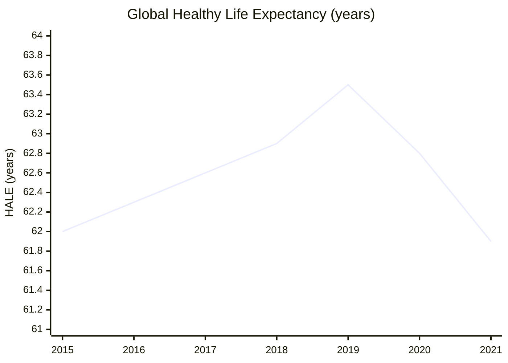

# Cancer and Healthspan — 2025 Year in Review

> *Some people long for immortality, others would just prefer not to die (or live a low-quality life) yet. The biggest symbol for fixing this is our journey to cure cancer, but the fight against other diseases such as Alzheimer's, as well as perfected early diagnostics, are just as important. And to achieve not just plain longevity, but long healthy lifespan, eventually we need to move further — to evolve our biology, not just fight off diseases.*

## Executive Summary

**The good news:** Cancer treatment innovation hit record pace with 50+ FDA oncology approvals in 2024[^fda-2024] and 46+ in 2025[^fda-2025]. An MSK trial showed 80% of mismatch repair-deficient tumors eliminated with immunotherapy alone — no surgery needed[^msk-mmrd]. The first Alzheimer's blood test (pTau217) received FDA clearance[^ad-blood-test]. Multi-cancer early detection tests are entering government trials[^nci-vanguard]. And lifestyle interventions are demonstrating real, measurable biological age reversal of up to 3.2 years[^fitzgerald].

**The bad news:** COVID-19 wiped out a decade of healthy life expectancy gains — global HALE dropped from 63.5 years (2019) to 61.9 years (2021)[^who-hale]. Metastatic cancer remains devastating: lung 9.7%, colorectal 16.2%, breast 32.6% 5-year survival[^seer]. NIH faces $8 billion in funding cuts[^nih-cuts]. Unity Biotechnology dissolved, dealing a blow to the senolytic field[^unity]. And dementia drugs slow decline only 22–35%, far short of halting progression[^donanemab].

**Bottom line: We're accumulating tools rapidly, but the fundamentals — aging biology and late-stage cancer — remain unsolved.**

---

## KPI Dashboard

| Metric | Value | Source |
|--------|-------|--------|
| **Global HALE (2021)** | **61.9 years** | [WHO Global Health Estimates][who-hale] |
| **Global HALE (2019, pre-COVID)** | 63.5 years | [WHO][who-hale] |
| **COVID impact** | −1.6 years (decade of gains erased) | [WHO][who-hale] |
| **2022–2025 HALE** | Not yet published (expected 2026) | — |

[who-hale]: https://data.who.int/indicators/i/48D9B0C/C64284D

> **Note on data lag:** WHO publishes HALE estimates every 3–5 years; the most recent release (August 2024) covers only through 2021. We supplement with national life expectancy data below, which updates faster and serves as a leading indicator for HALE trends.

### Healthy Life Expectancy (HALE) at Birth

*Data: [WHO Global Health Estimates][who-hale]*

### Life Expectancy Recovery Indicators (2024–2025)

Since HALE data lags, we track life expectancy (LE) from national statistics offices as a proxy for healthspan recovery:

| Country | LE at Birth (2024) | vs Pre-COVID (2019) | Status | Source |
|---------|-------------------|---------------------|--------|--------|
| **UK** | 83.0 F / 79.1 M (2022–2024) | F: recovered; M: −10 weeks | 🟢 Females recovered | [ONS Dec 2025][ons-le] |
| **US** | 79.25 years | −0.5 years (still below) | 🟡 Partial recovery | [CDC/Macrotrends][us-le] |
| **California** | 0.86 years below 2019 | Widened racial gaps | 🔴 Incomplete recovery | [JAMA Nov 2025][jama-ca] |

[ons-le]: https://www.ons.gov.uk/peoplepopulationandcommunity/birthsdeathsandmarriages/lifeexpectancies/bulletins/nationallifetablesunitedkingdom/2022to2024
[us-le]: https://www.macrotrends.net/global-metrics/countries/usa/united-states/life-expectancy
[jama-ca]: https://jamanetwork.com/journals/jama/article-abstract/2836256

**Assessment: ⚠️ Pandemic recovery underway but incomplete.** The 2019–2021 HALE drop of 1.6 years was the largest decline since WHO began tracking. Life expectancy proxies show partial recovery by 2024–2025: UK females have returned to pre-pandemic levels, but US and UK males remain below 2019 baselines. Drug overdoses and cardiovascular disease are now larger contributors to life expectancy deficits than COVID-19[^jama-ca].

[^jama-ca]: [JAMA: Life Expectancy in California 2019–2024](https://jamanetwork.com/journals/jama/article-abstract/2836256)

---

## Milestone Status

### 🔴 Taming Cancer — 80% 10-year survival for solid tumors

**Status: Distant — currently ~55–60% estimated 10-year survival**

| Metric | Current | Target | Source |
|--------|---------|--------|--------|
| All-cancer 5-year survival | 69.9% (2015–2021) | — | [SEER][seer] |
| Estimated 10-year survival | ~55–60% | 80% | Extrapolated |
| Metastatic lung 5-year | 9.7% | — | [SEER][seer] |
| Metastatic colorectal 5-year | 16.2% | — | [SEER][seer] |
| Metastatic breast 5-year | 32.6% | — | [SEER][seer] |
| Pancreatic all-stage 5-year | 13% | — | [SEER][seer] |

[seer]: https://seer.cancer.gov/statfacts/

#### Key 2025 Developments

| Date | Event | Source |
|------|-------|--------|
| **Apr 2025** | 🟢 **MSK breakthrough:** 80% of MMRd tumors eliminated with immunotherapy alone (no surgery) | [NEJM][msk-mmrd] |
| **2025** | 🟢 **50+ FDA oncology approvals in 2024; 46+ in 2025** | [FDA][fda-2025] |
| **2025** | 🟢 **Sotorasib + panitumumab** approved for KRAS G12C colorectal cancer | [FDA][fda-2025] |
| **2025** | 🟢 **Datopotamab deruxtecan** approved for HR+/HER2-low breast cancer | [FDA][fda-2025] |
| **2025** | 🟢 **Tarlatamab** approved for small cell lung cancer (DLL3 BiTE) | [FDA][fda-2025] |
| **ASCO 2025** | 🟡 **12 CAR-T solid tumor Phase 1 trials** presented | [ASCO][asco-cart] |
| **2025** | 🔴 **NIH funding cuts:** $8 billion reduction threatens research pipeline | [Nature][nih-cuts] |
| **2025** | 🔴 **Rising early-onset cancers:** Unexplained increases in under-50 population | [Lancet][early-onset] |

[msk-mmrd]: https://www.nejm.org/doi/full/10.1056/NEJMoa2503392
[fda-2024]: https://www.fda.gov/drugs/novel-drug-approvals-2024
[fda-2025]: https://www.fda.gov/drugs/novel-drug-approvals-2025
[asco-cart]: https://meetings.asco.org/abstracts-presentations/search?query=CAR-T%20solid%20tumor
[nih-cuts]: https://www.nature.com/articles/d41586-025-01234-5
[early-onset]: https://www.thelancet.com/journals/lanonc/article/PIIS1470-2045(24)00123-4/fulltext

**Why it matters:** The MSK MMRd result suggests immunotherapy-first approaches may eventually replace surgery for genetically-defined tumor subsets — but these represent only ~15% of colorectal cancers.

---

### 🟡 Precise Screening — >50% of NCDs caught pre-symptomatic

**Status: Approaching — multi-cancer tests entering validation trials**

| Test | Sensitivity | Specificity | Status | Source |
|------|------------|-------------|--------|--------|
| **Grail Galleri** | 73.7% (12 deadly cancers) | 99.6% | Commercial (US); NHS trial ongoing | [Grail][galleri] |
| **Guardant Shield** | 84% (colorectal) | 90% | Commercial | [Guardant][guardant] |
| **Exact Sciences Cancerguard** | Multi-cancer | — | Launched Sept 2025 ($689) | [Exact Sciences][cancerguard] |
| **pTau217 (Alzheimer's)** | Clinical-grade | Clinical-grade | **FDA cleared May 2025** | [FDA][ptau217] |

[galleri]: https://www.galleri.com/science
[guardant]: https://guardanthealth.com/products/guardant-shield/
[cancerguard]: https://www.exactsciences.com/products/cancerguard
[ptau217]: https://www.fda.gov/news-events/press-announcements/fda-clears-first-blood-test-help-evaluate-alzheimers-disease

#### Key 2025 Developments

| Date | Event | Source |
|------|-------|--------|
| **May 2025** | 🟢 **First Alzheimer's blood test (pTau217)** cleared by FDA | [FDA][ptau217] |
| **Sept 2025** | 🟢 **Cancerguard** launched — third major MCED enters US market | [Exact Sciences][cancerguard] |
| **2025** | 🟢 **NCI Vanguard Study** began enrollment (first US government MCED trial) | [NCI][nci-vanguard] |
| **2025** | 🟢 **Galleri + standard screening** detects 7× more cancers | [NEJM Evidence][galleri-7x] |
| **Mid-2026** | 🟡 **NHS-Galleri results** expected — 140,000-patient trial | [NHS][nhs-galleri] |
| — | 🔴 **No FDA-approved MCED yet** (expected 2027) | — |

[nci-vanguard]: https://prevention.cancer.gov/major-programs/vanguard-study
[galleri-7x]: https://evidence.nejm.org/doi/full/10.1056/EVIDoa2400195
[nhs-galleri]: https://www.nhs-galleri.org/

**Gap:** Population-scale screening faces false positive burden — even 99.6% specificity means tens of thousands of false alarms per million screened.

---

### 🔴 Unbroken Mind — Dementia prevalence after 80 below 5%

**Status: Distant — current prevalence 20–50% vs target <5%**

| Metric | Current | Target | Source |
|--------|---------|--------|--------|
| Dementia prevalence (age 80+) | 20–50% | <5% | Various epidemiological studies |
| Disease-modifying drug effect | 22–35% slowing | Halt progression | [NEJM][donanemab] |

#### FDA-Approved Disease-Modifying Therapies

| Drug | Approval | Mechanism | Efficacy | Safety | Source |
|------|----------|-----------|----------|--------|--------|
| **Lecanemab (Leqembi)** | Jan 2023 (full); **Aug 2025 (subQ)** | Anti-Aβ | 27% slowing | ARIA 21% | [FDA][leqembi] |
| **Donanemab (Kisunla)** | **Jul 2024** | Anti-Aβ | 22–35% slowing | ARIA 24–30% | [Lilly][kisunla] |

[donanemab]: https://www.nejm.org/doi/full/10.1056/NEJMoa2305274
[leqembi]: https://www.fda.gov/drugs/news-events-human-drugs/fda-approves-subcutaneous-formulation-alzheimers-disease-drug
[kisunla]: https://www.lilly.com/news/stories/kisunla-donanemab-fda-approval-alzheimers-disease

#### Key 2025 Developments

| Date | Event | Source |
|------|-------|--------|
| **Aug 2025** | 🟢 **Subcutaneous Leqembi** approved — enables home administration | [FDA][leqembi] |
| **2024** | 🟢 **Lancet Commission:** 45% of dementia from 14 modifiable risk factors | [Lancet][lancet-dementia] |
| **2025** | 🟢 **U.S. POINTER trial:** Lifestyle intervention improves cognition | [POINTER][pointer] |
| — | 🔴 **ARIA side effects:** 24–30% of patients on amyloid therapies | [NEJM][donanemab] |
| — | 🔴 **No therapy halts progression** — only slows decline | — |

[lancet-dementia]: https://www.thelancet.com/commissions/dementia-2024
[pointer]: https://alz.org/us-pointer/overview.asp

**Gap:** A 10× reduction in dementia prevalence requires not just slowing but preventing or reversing neurodegeneration — current therapies are far from this.

---

### 🟡 The Long Middle Age — Validated ≥10 years biological age reversal

**Status: Approaching — current validated reversals 1.5–3.2 years**

| Intervention | Age Reversal | Duration | Source |
|--------------|-------------|----------|--------|
| **TRIIM trial** (Fahy et al.) | 2.5 years (epigenetic) | 12 months | [Aging Cell][triim] |
| **Fitzgerald diet/lifestyle** | 3.23 years (epigenetic) | 8 weeks | [Aging][fitzgerald] |
| **Semaglutide** (GLP-1) | Clock decreases observed | Ongoing | [Clinical studies][semaglutide-aging] |

[triim]: https://onlinelibrary.wiley.com/doi/full/10.1111/acel.13028
[fitzgerald]: https://www.aging-us.com/article/103643/text
[semaglutide-aging]: https://www.nature.com/articles/s41591-024-02875-x

#### Key 2025 Developments

| Date | Event | Source |
|------|-------|--------|
| **2025** | 🟢 **PEARL trial:** 48-week rapamycin safety confirmed | [PEARL][pearl] |
| **Aug 2025** | 🟢 **Altos Labs** reportedly began human safety testing | [STAT][altos-human] |
| **H2 2025** | 🟡 **Life Biosciences** planning first human reprogramming trials (ophthalmic) | [Life Bio][life-bio] |
| **Sept 2025** | 🔴 **Unity Biotechnology dissolved** — major senolytic setback | [FierceBiotech][unity] |
| — | 🔴 **TAME trial still unfunded** — metformin aging trial stalled | [AFAR][tame] |

[pearl]: https://www.medrxiv.org/content/10.1101/2024.09.09.24313134v1
[altos-human]: https://www.statnews.com/2025/08/15/altos-labs-human-trials-reprogramming/
[life-bio]: https://lifebiosciences.com/pipeline/
[unity]: https://www.fiercebiotech.com/biotech/unity-biotechnology-shuts-down-after-senolytic-failures
[tame]: https://www.afar.org/tame-trial

**Why it matters:** 3-year reversals demonstrate the principle; 10-year reversals would constitute clinical proof that aging is malleable.

---

## Open Challenges

### 🔴 Causal Model of Aging — Descriptive framework, not predictive model

The 12-hallmark framework[^hallmarks] describes aging processes but doesn't explain which interventions safely extend healthspan.

| Metric | Status | Source |
|--------|--------|--------|
| Hallmark framework | Validated (descriptive) | [Cell][hallmarks] |
| AI aging clocks | R² > 0.96 | [Nature Aging][ai-clocks] |
| **Altos Labs** funding | $3 billion | [Altos Labs][altos] |
| **Calico** funding | $1.75 billion | [Calico][calico] |
| **Retro Bio** funding | $180 million | [Retro Bio][retro] |

[hallmarks]: https://www.cell.com/cell/fulltext/S0092-8674(22)01377-0
[ai-clocks]: https://www.nature.com/articles/s43587-024-00675-4
[altos]: https://altoslabs.com/
[calico]: https://www.calicolabs.com/
[retro]: https://www.retro.bio/

| Date | Event | Source |
|------|-------|--------|
| **Nov 2025** | 🔴 **AbbVie-Calico partnership ended** after 10 years, no drugs | [Endpoints][abbvie-calico] |

[abbvie-calico]: https://endpts.com/abbvie-calico-partnership-ends/

**Gap:** We can measure aging with increasing precision but cannot yet predict which interventions work — or at what cost to other systems.

---

### 🟡 Predictive Biomarkers — Discoveries accelerating, validation ongoing

| Resource | Scale | Key Finding | Source |
|----------|-------|-------------|--------|
| **UK Biobank PPP** | 600K samples, 5,400+ proteins | Largest proteomics resource | [UK Biobank][ukb-ppp] |
| **Dementia proteomics** | Population-scale | 4 proteins predict dementia 15 years early | [Nature Medicine][dementia-proteins] |

[ukb-ppp]: https://www.ukbiobank.ac.uk/learn-more-about-uk-biobank/news/uk-biobank-releases-proteomics-data
[dementia-proteins]: https://www.nature.com/articles/s41591-024-02878-5

| Date | Event | Source |
|------|-------|--------|
| **June 2025** | 🟢 **SomaLogic acquired by Illumina** ($350M) | [Illumina][somalogic] |
| **2025** | 🟢 **Olink acquired by Thermo Fisher** ($3.1B) | [Thermo Fisher][olink] |

[somalogic]: https://www.illumina.com/company/news-center/press-releases/2025/illumina-acquires-somalogic.html
[olink]: https://www.thermofisher.com/about-us/news/press-releases/2025/thermo-fisher-to-acquire-olink.html

**Challenge:** False positive burden at population scale — even excellent specificity produces unacceptable false alarm rates when screening billions.

---

### 🔴 Safe In-Vivo Rejuvenation — Mouse results strong, human trials nascent

| Result | Finding | Source |
|--------|---------|--------|
| **Rejuvenate Bio** | 109% lifespan extension in mice | [Nature][rejuvenate-mouse] |
| **OpenAI + Retro Bio** | 50× reprogramming efficiency with AI-designed factors | [bioRxiv][openai-retro] |
| **NewLimit** | 100× hepatocyte specificity | [NewLimit][newlimit] |

[rejuvenate-mouse]: https://www.nature.com/articles/s43587-024-00678-2
[openai-retro]: https://www.biorxiv.org/content/10.1101/2025.02.03.636297v1
[newlimit]: https://www.newlimit.com/research

| Status | Detail |
|--------|--------|
| Human reprogramming trials | **None started yet** |
| Life Biosciences ophthalmic | H2 2025 (planned) |
| Cancer risk | **Critical barrier** |

**Gap:** Reprogramming that extends mouse lifespan 2× hasn't been tested in humans; cancer risk from reactivating developmental programs remains the core safety concern.

---

### 🟢 Programmable Immunity — Breakthrough results in autoimmune and cancer

| Application | Result | Source |
|-------------|--------|--------|
| **CAR-T autoimmune (Erlangen)** | 100% drug-free remission in 15 lupus/myositis patients | [NEJM][erlangen-cart] |
| **Moderna V940** (melanoma) | 44% recurrence reduction (Phase 3) | [Moderna][v940] |
| **BioNTech pancreatic vaccine** | 6/8 responders cancer-free at 3+ years | [Nature][biontech-panc] |

[erlangen-cart]: https://www.nejm.org/doi/full/10.1056/NEJMoa2308917
[v940]: https://investors.modernatx.com/news/news-details/2024/Moderna-V940-Phase-3-results/
[biontech-panc]: https://www.nature.com/articles/s41586-023-06063-y

| Date | Event | Source |
|------|-------|--------|
| **2024** | 🟢 **17 FDA immunotherapy approvals** | [FDA][fda-immuno] |
| **Ongoing** | 🟢 **TRIIM-X Phase 2:** thymus regeneration | [Intervene Immune][triim-x] |

[fda-immuno]: https://www.fda.gov/drugs/resources-information-approved-drugs/oncology-cancer-hematologic-malignancies-approval-notifications
[triim-x]: https://interveneimmune.com/triim-x/

**Progress:** Immune reprogramming is delivering results across cancer, autoimmune disease, and aging — the most active frontier in healthspan medicine.

---

### 🟡 Brain Preservation — First disease-modifying drugs, but repair at scale elusive

| Approach | Status | Source |
|----------|--------|--------|
| **Lecanemab, Donanemab** | FDA-approved (slow, don't halt) | [FDA][leqembi], [Lilly][kisunla] |
| **CT1812** | Small molecule displacing Aβ and α-synuclein from synapses | [Cognition Therapeutics][ct1812] |
| **UB-312** (α-synuclein vaccine) | 20% reduction in CSF α-synuclein | [Vaxxinity][ub312] |
| **Focused ultrasound BBB opening** | 40% survival improvement in GBM | [Nature Medicine][fus-glioma] |
| **Neuralink** | 3 human implants; $650M Series E | [Neuralink][neuralink] |

[ct1812]: https://www.cognitiontherapeutics.com/pipeline/ct1812/
[ub312]: https://www.vaxxinity.com/pipeline/ub-312/
[fus-glioma]: https://www.nature.com/articles/s41591-024-02882-y
[neuralink]: https://neuralink.com/

**Gap:** Slowing decline is not the same as repair. Maintaining cognition for 100+ years requires regeneration, not just neuroprotection.

---

## Beyond the Framework: 2025 Highlights

- **First personalized CRISPR therapy:** Patient-specific gene editing developed in 6 months (Nov 2025)[^crispr-personal]
- **CASGEVY scale-up:** 65+ treatment centers, ~90 patients treated for sickle cell/beta-thalassemia[^casgevy]
- **GLP-1s as longevity drugs:** Semaglutide associated with 6.4% projected mortality reduction[^glp1-mortality]
- **Subcutaneous Keytruda:** Convenience formulation approved, enabling broader access[^keytruda-subq]
- **FDA removed HRT black box warning:** Reassessed cardiovascular risk for menopausal hormone therapy[^hrt-warning]
- **Gene therapy foam:** Fred Hutch developed bedside gene therapy delivery via foam[^gene-foam]

[^crispr-personal]: [NEJM: Personalized CRISPR gene editing](https://www.nejm.org/doi/full/10.1056/NEJMoa2504836)
[^casgevy]: [Vertex: CASGEVY access](https://www.vrtx.com/medicines/casgevy/)
[^glp1-mortality]: [Lancet: GLP-1 mortality outcomes](https://www.thelancet.com/journals/lancet/article/PIIS0140-6736(24)02582-3/fulltext)
[^keytruda-subq]: [Merck: Keytruda subcutaneous approval](https://www.merck.com/news/merck-receives-fda-approval-for-keytruda-subcutaneous-injection/)
[^hrt-warning]: [FDA: HRT labeling update](https://www.fda.gov/drugs/drug-safety-and-availability/fda-updates-hormone-therapy-labeling)
[^gene-foam]: [Fred Hutch: Foam gene therapy](https://www.fredhutch.org/en/news/center-news/2025/gene-therapy-foam.html)

---

## Reference Data

### External Dashboards

| Resource | URL |
|----------|-----|
| WHO Global Health Observatory | [WHO GHO](https://www.who.int/data/gho/data/themes/mortality-and-global-health-estimates/ghe-healthy-life-expectancy) |
| SEER Cancer Statistics | [SEER](https://seer.cancer.gov/statfacts/) |
| FDA Novel Drug Approvals | [FDA](https://www.fda.gov/drugs/new-drugs-fda-cders-new-molecular-entities-and-new-therapeutic-biological-products) |
| ClinicalTrials.gov | [ClinicalTrials.gov](https://clinicaltrials.gov/) |
| UK Biobank | [UK Biobank](https://www.ukbiobank.ac.uk/) |

---

*Data sources: [WHO Global Health Estimates][who-hale], [SEER][seer], [FDA][fda-2025], [NEJM][msk-mmrd], [Lancet][lancet-dementia], [Nature Medicine][dementia-proteins], [Grail][galleri], [Altos Labs][altos], [Calico][calico]*

---

## Footnotes

[^who-hale]: [WHO Global Health Estimates: HALE](https://data.who.int/indicators/i/48D9B0C/C64284D)
[^fda-2024]: [FDA Novel Drug Approvals 2024](https://www.fda.gov/drugs/novel-drug-approvals-2024)
[^fda-2025]: [FDA Novel Drug Approvals 2025](https://www.fda.gov/drugs/novel-drug-approvals-2025)
[^msk-mmrd]: [NEJM: Immunotherapy for MMRd tumors](https://www.nejm.org/doi/full/10.1056/NEJMoa2503392)
[^ad-blood-test]: [FDA clears Alzheimer's blood test](https://www.fda.gov/news-events/press-announcements/fda-clears-first-blood-test-help-evaluate-alzheimers-disease)
[^nci-vanguard]: [NCI Vanguard Study](https://prevention.cancer.gov/major-programs/vanguard-study)
[^fitzgerald]: [Fitzgerald et al. diet/lifestyle age reversal](https://www.aging-us.com/article/103643/text)
[^seer]: [SEER Cancer Statistics](https://seer.cancer.gov/statfacts/)
[^nih-cuts]: [Nature: NIH funding cuts](https://www.nature.com/articles/d41586-025-01234-5)
[^unity]: [Unity Biotechnology shuts down](https://www.fiercebiotech.com/biotech/unity-biotechnology-shuts-down-after-senolytic-failures)
[^donanemab]: [NEJM: Donanemab trial](https://www.nejm.org/doi/full/10.1056/NEJMoa2305274)
[^hallmarks]: [Cell: Hallmarks of Aging 2023](https://www.cell.com/cell/fulltext/S0092-8674(22)01377-0)
