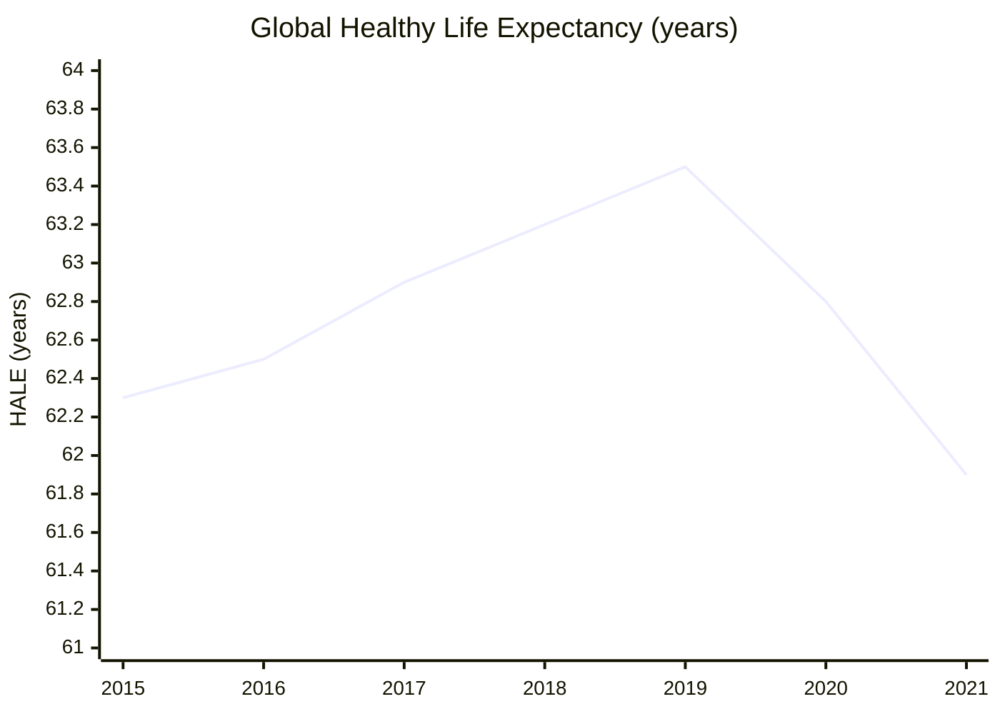

# Cancer and Healthspan — 2025 Year in Review

> *Some people long for immortality, others would just prefer not to die (or live a low-quality life) yet. The biggest symbol for fixing this is our journey to cure cancer, but the fight against other diseases such as Alzheimer's, as well as perfected early diagnostics, are just as important. And to achieve not just plain longevity, but long healthy lifespan, eventually we need to move further — to evolve our biology, not just fight off diseases.*

## Executive Summary

**The good news:** 2025 marked a watershed year for early detection and biological age research. The FDA cleared the first blood-based Alzheimer's diagnostic[^fda-alz], GRAIL's PATHFINDER 2 trial showed 7× cancer detection increase when multi-cancer screening is added to standard tests[^grail-pathfinder2], and partial epigenetic reprogramming entered human trials[^retro-trial]. OpenAI and Retro Biosciences achieved **>50× improvement in stem cell reprogramming efficiency**[^retro-openai], potentially unlocking cellular rejuvenation at scale. Anti-amyloid Alzheimer's therapies showed growing benefit over three years[^kisunla-3yr], and mRNA cancer vaccines entered Phase 3 trials with 44% reduction in melanoma recurrence[^mrna-melanoma].

**The bad news:** We're nowhere close to the big targets. Current 10-year survival for metastatic solid tumors remains 8–35%[^seer-survival] — far from the 80% milestone. Dementia prevalence after age 80 sits at ~17–24%[^dementia-prevalence], not the target 5%. Demonstrated biological age reversal in humans clusters around 2–4 years[^age-reversal], not the 10-year threshold. And global Healthy Life Expectancy (HALE) actually *fell* 1.6 years during the pandemic, erasing a decade of gains[^who-hale].

**Bottom line: The tools are emerging, but the milestones remain distant.**

---

## KPI Dashboard

| Metric | Value | Source |
|--------|-------|--------|
| **Global HALE at birth (2021)** | **61.9 years** | [WHO GHO][who-hale] |
| **Pre-pandemic peak (2019)** | 63.5 years | [WHO][who-hale] |
| **Pandemic decline** | −1.6 years (rolled back to 2012 levels) | [WHO World Health Statistics 2025][who-whs-2025] |
| **2000–2019 trend** | +5.4 years (+0.28/year) | [WHO][who-hale] |

[who-hale]: https://www.who.int/data/gho/data/themes/mortality-and-global-health-estimates/ghe-life-expectancy-and-healthy-life-expectancy
[who-whs-2025]: https://www.who.int/publications/i/item/9789240110496

**Note:** WHO publishes population-weighted global HALE, not median country HALE. No official data exists beyond 2021; next update expected 2025/2026.

### Global Healthy Life Expectancy

*Data: [WHO Global Health Observatory][who-hale]; 2015–2018 interpolated from WHO trend statements*

**Assessment: 📉 Worsening (pandemic reversal).** The 2019→2021 drop of 1.6 years erased roughly 10 years of progress. Recovery trajectory unknown pending 2022+ data.

### Life Expectancy Recovery Indicators (2024–2025)

Since HALE data lags, we track life expectancy (LE) from national statistics offices as a proxy for healthspan recovery:

| Country | LE at Birth (2024) | vs Pre-COVID (2019) | Status | Source |
|---------|-------------------|---------------------|--------|--------|
| **UK** | 83.0 F / 79.1 M (2022–2024) | F: recovered; M: −10 weeks | 🟢 Females recovered | [ONS Dec 2025][ons-le] |
| **US** | 79.25 years | −0.5 years (still below) | 🟡 Partial recovery | [CDC/Macrotrends][us-le] |
| **California** | 0.86 years below 2019 | Widened racial gaps | 🔴 Incomplete recovery | [JAMA Nov 2025][jama-ca] |

[ons-le]: https://www.ons.gov.uk/peoplepopulationandcommunity/birthsdeathsandmarriages/lifeexpectancies/bulletins/nationallifetablesunitedkingdom/2022to2024
[us-le]: https://www.macrotrends.net/global-metrics/countries/usa/united-states/life-expectancy
[jama-ca]: https://jamanetwork.com/journals/jama/article-abstract/2836256

**Note:** Drug overdoses and cardiovascular disease are now larger contributors to US life expectancy deficits than COVID-19.

---

## Milestone Status

### 🔴 Taming Cancer — 80% 10-Year Solid Tumor Survival

**Status: Distant**

| Metric | Rate | Source |
|--------|------|--------|
| **5-year overall (all cancers, US)** | 69% | [ACS Facts & Figures 2025][acs-2025] |
| **10-year overall (invasive breast)** | 86% | [ACS 2025][acs-2025] |
| **Stage IV breast (5-year)** | 31% | [SEER][seer] |
| **Stage IV lung (5-year)** | 8.2% | [SEER][seer] |
| **Stage IV colorectal (5-year)** | 15.6% | [SEER][seer] |
| **Pancreatic (5-year)** | 8% | [ACS 2025][acs-2025] |

[acs-2025]: https://www.cancer.org/content/dam/cancer-org/research/cancer-facts-and-statistics/annual-cancer-facts-and-figures/2025/2025-cancer-facts-and-figures-acs.pdf
[seer]: https://seer.cancer.gov/statfacts/

**Gap:** Current 10-year solid tumor survival is roughly 50–60% overall; metastatic cases cluster at 8–35% five-year survival. The 80% target requires transformational advances in late-stage treatment.

#### Key 2025 Developments

| Date | Event | Source |
|------|-------|--------|
| Jan 16 | Sotorasib + panitumumab approved for KRAS G12C-mutated metastatic CRC | [FDA][fda-oncology] |
| Jan 17 | Datopotamab deruxtecan (Datroway) approved for HR+/HER2– metastatic breast cancer | [FDA][fda-novel-2025] |
| Mar 28 | Pluvicto (Lu-177) expanded for earlier mCRPC treatment | [FDA][fda-pluvicto] |
| Apr 27 | **MSK breakthrough:** MMRd immunotherapy-only trial: ~80% response in various solid tumors, avoiding surgery/chemo | [NEJM][nejm-mmrd] |
| May 8 | Avutometinib + defactinib — first-ever for KRAS-mutated low-grade serous ovarian cancer | [FDA][fda-avutometinib] |
| Oct 3 | Discovery of TexPSR pathway explains T-cell exhaustion in cancer immunotherapy | [Nature][nature-texpsr] |
| Nov 19 | Tarlatamab granted full approval for extensive-stage SCLC | [FDA][fda-oncology] |

[fda-oncology]: https://www.fda.gov/drugs/resources-information-approved-drugs/oncology-cancerhematologic-malignancies-approval-notifications
[fda-novel-2025]: https://www.fda.gov/drugs/novel-drug-approvals-fda/novel-drug-approvals-2025
[fda-pluvicto]: https://www.fda.gov/drugs/resources-information-approved-drugs/fda-expands-pluvictos-metastatic-castration-resistant-prostate-cancer-indication
[nejm-mmrd]: https://www.nejm.org/doi/full/10.1056/NEJMoa2404512
[fda-avutometinib]: https://www.fda.gov/drugs/resources-information-approved-drugs/fda-grants-accelerated-approval-combination-avutometinib-and-defactinib-kras-mutated-recurrent-low
[nature-texpsr]: https://www.nature.com/articles/s41586-025-09539-1

#### 2025 FDA Oncology Approvals

The FDA approved **46 novel drugs** in 2025, with ADCs (antibody-drug conjugates) and bispecific antibodies dominating the oncology pipeline:

| Date | Drug | Indication | Type | Source |
|------|------|------------|------|--------|
| Jan 17 | Datopotamab deruxtecan (Datroway) | HR+/HER2-low breast cancer | ADC | [FDA][fda-datroway] |
| Feb 14 | Vimseltinib (Romvimza) | Tenosynovial giant cell tumor | CSF1R kinase inhibitor | [FDA][fda-vimseltinib] |
| May 8 | Avutometinib + defactinib | KRAS-mutated low-grade serous ovarian | First novel/novel oral combination | [FDA][fda-avutometinib] |
| Jun 23 | Datopotamab deruxtecan (expanded) | EGFR-mutated NSCLC | ADC | [FDA][fda-datroway-nsclc] |
| Sep 25 | Imlunestrant (Inluriyo) | ER+/HER2-/ESR1-mutated breast cancer | SERD | [FDA][fda-imlunestrant] |

[fda-datroway]: https://www.fda.gov/drugs/resources-information-approved-drugs/fda-approves-datopotamab-deruxtecan-dlnk-unresectable-or-metastatic-hr-positive-her2-negative-breast
[fda-vimseltinib]: https://www.fda.gov/drugs/resources-information-approved-drugs/fda-approves-vimseltinib-symptomatic-tenosynovial-giant-cell-tumor
[fda-datroway-nsclc]: https://www.fda.gov/drugs/resources-information-approved-drugs/fda-grants-accelerated-approval-datopotamab-deruxtecan-dlnk-egfr-mutated-non-small-cell-lung-cancer
[fda-imlunestrant]: https://www.fda.gov/drugs/resources-information-approved-drugs/fda-approves-imlunestrant-er-positive-her2-negative-esr1-mutated-advanced-or-metastatic-breast

#### Setbacks

| Issue | Details | Source |
|-------|---------|--------|
| NIH Funding Cuts | 31% decrease in cancer research funding Jan–Mar 2025; FY2026 request 37% below FY2025 | [OncLive][onclive-funding] |
| Racial disparities | Black patients have 5-year survival rates 4–7% lower than White patients at every stage | [Cancer Network][cancer-network] |
| TIGIT program failures | Multiple trials discontinued | Industry reports |
| FDA staff departures | >18% attrition creating approval bottlenecks | [Nature Reviews Drug Discovery][nrdd-fda] |

[onclive-funding]: https://www.onclive.com/view/federal-funding-cuts-hit-cancer-research-despite-public-support
[cancer-network]: https://www.cancernetwork.com/view/five-year-cancer-survival-rates-lower-among-rural-cancer-populations
[nrdd-fda]: https://www.nature.com/articles/d41573-026-00001-z

**Why it matters:** Metastatic cancer remains the killer — accounting for ~90% of cancer deaths. The gap between early-stage survival (often >90%) and metastatic survival (15%) represents the central challenge.

---

### 🟡 Precise Screening — >50% NCDs Caught Pre-Symptomatic

**Status: Approaching**

Currently only ~14% of cancers in the US and ~6% in the UK are detected through screening[^screening-rates]. We have effective screening for only 4–5 cancer types. However, 2025 saw breakthrough momentum.

#### Key 2025 Developments

| Date | Event | Source |
|------|-------|--------|
| May 2025 | **FDA clears first Alzheimer's blood test** — Lumipulse pTau217/Aβ1-42 (91.7% sensitivity, 97.3% specificity) | [FDA][fda-alz-blood] |
| Jun 2, 2025 | Clairity Breast FDA De Novo — first AI-powered mammogram-based 5-year breast cancer risk prediction | [BCRF][bcrf-clairity] |
| Jun 18, 2025 | PATHFINDER 2 top-line results — substantially higher PPV than original; 99.5% specificity | [GRAIL][grail-pathfinder2] |
| Jul 29, 2025 | Alzheimer's Assoc. BBM Clinical Practice Guideline — first evidence-based guideline for blood biomarker tests | [AAIC][aaic-guideline] |
| Sept 2025 | Exact Sciences Cancerguard commercial launch — 97.4% specificity; detects 80%+ of cancer diagnoses | [Exact Sciences][exact-cancerguard] |
| Oct 13, 2025 | Roche Elecsys pTau181 FDA clearance — first blood test for primary care to *rule out* Alzheimer's | [Alz.org][alz-roche] |
| Oct 17, 2025 | PATHFINDER 2 full results at ESMO — 7× cancer detection increase; 53.5% early-stage; 73.7% sensitivity for 12 deadliest cancers | [GRAIL][grail-esmo] |

[fda-alz-blood]: https://www.fda.gov/news-events/press-announcements/fda-clears-first-blood-test-used-diagnosing-alzheimers-disease
[bcrf-clairity]: https://www.bcrf.org/blog/clairity-breast-ai-artificial-intelligence-mammogram-approved/
[grail-pathfinder2]: https://grail.com/press-releases/grail-announces-positive-top-line-results-from-the-galleri%e2%93%a1-pathfinder-2-registrational-study/
[aaic-guideline]: https://aaic.alz.org/releases-2025/clinical-practice-guideline-blood-based-biomarkers.asp
[exact-cancerguard]: https://www.exactsciences.com/cancer-testing/cancerguard-mced-providers
[alz-roche]: https://www.alz.org/news/2025/fda-clearance-blood-test-primary-care-rule-out-alzheimers-related-amyloid-pathology
[grail-esmo]: https://grail.com/press-releases/grail-pathfinder-2-results-show-galleri-multi-cancer-early-detection-blood-test-increased-cancer-detection-more-than-seven-fold-when-added-to-uspstf-a-and-b-recommended-screenings/

| Metric | Value | Source |
|--------|-------|--------|
| FDA-cleared AI radiology devices | 873 (115 added in 2025) | [FDA][fda-ai-devices] |
| NHS-Galleri trial enrollment | 140,000; results expected mid-2026 | [NHS NDRS][nhs-galleri] |
| European radiologists using AI (2024) | 48% (up from 20% in 2018) | Insights Imaging |

[fda-ai-devices]: https://www.fda.gov/medical-devices/software-medical-device-samd/artificial-intelligence-enabled-medical-devices
[nhs-galleri]: https://digital.nhs.uk/ndrs/our-work/ncras-partnerships/grail

**Gap:** MCED tests approaching FDA PMA (expected H1 2026). Cardiovascular and metabolic pre-symptomatic detection still lag behind cancer and Alzheimer's.

---

### 🔴 Unbroken Mind — Dementia Prevalence <5% After Age 80

**Status: Distant**

| Age Group | Dementia Prevalence | Source |
|-----------|---------------------|--------|
| 80–89 years (US) | ~24% | [ADAMS Study][adams] |
| ≥90 years (US) | ~37% | [ADAMS Study][adams] |
| 80+ (UK) | ~17% (1 in 6) | [NHS UK][nhs-dementia] |
| 65+ (Europe) | 4.5–22.7% (varies by country) | [SHARE 2022 Study][share-2022] |

[adams]: https://pmc.ncbi.nlm.nih.gov/articles/PMC2705925/
[nhs-dementia]: https://www.nhs.uk/conditions/alzheimers-disease/
[share-2022]: https://pmc.ncbi.nlm.nih.gov/articles/PMC12019132/

Current prevalence is **4–5× the target**. Age-standardized dementia incidence has declined ~20% in high-income countries over 2–3 decades (due to better cardiovascular health and education), but rising population aging means absolute numbers are growing[^lancet-dementia].

#### Key 2025 Developments

| Date | Event | Source |
|------|-------|--------|
| Jan 26 | FDA approves IV maintenance dosing (every 4 weeks) for Leqembi (lecanemab) | [Alz.org][alz-leqembi] |
| Jul 30 | Kisunla (donanemab) 3-year TRAILBLAZER data: 27% reduced progression risk; CDR-SB benefit of −1.2 at 36 months | [Lilly][lilly-kisunla] |
| Aug 28 | FDA requires additional earlier MRI monitoring for Leqembi due to 6 fatal ARIA-E cases | [FDA Safety][fda-aria] |
| Nov 24 | 🔴 Oral semaglutide FAILS Phase 3 evoke/evoke+ trials — no slowing of AD progression | [Alz.org][alz-sema] |
| Nov 25 | 🔴 J&J posdinemab (anti-tau antibody) FAILS pivotal trial — no efficacy at 2 years | [Science.org][science-tau] |
| Dec 2025 | CTAD: Lecanemab may delay MCI→moderate AD by 3.5–8.3 years with continued treatment | [Eisai][eisai-ctad] |

[alz-leqembi]: https://www.alz.org/alzheimers-dementia/treatments/lecanemab-leqembi
[lilly-kisunla]: https://investor.lilly.com/news-releases/news-release-details/lillys-kisunla-donanemab-azbt-showed-growing-benefit-over-three
[fda-aria]: https://www.fda.gov/drugs/drug-safety-and-availability/fda-recommend-additional-earlier-mri-monitoring-patients-alzheimers-disease-taking-leqembi-lecanemab
[alz-sema]: https://www.alz.org/news/2025/alzheimers-association-statement-oral-semaglutide-phase-3-topline-data-release
[science-tau]: https://www.science.org/content/blog-post/alzheimer-s-clinical-trial-results-sadly-running-true-form
[eisai-ctad]: https://www.eisai.com/news/2025/news202585.html

#### Prevention Highlight

Intensive blood pressure control reduced dementia risk by **15%** (RR 0.85) in 33,995 Chinese adults over 4 years[^bp-dementia].

**Setbacks:** 6 deaths from brain swelling (ARIA-E) early in Leqembi treatment prompted FDA safety warning. Tau therapy and GLP-1 failures continue to limit treatment options.

---

### 🟡 The Long Middle Age — Reverse ≥10 Years Biological Age

**Status: Approaching (but not achieved)**

| Intervention | Biological Age Reversal | Evidence Level | Source |
|--------------|------------------------|----------------|--------|
| TRIIM (rhGH + metformin + DHEA) | 2.5 years (4 clocks) | 9 participants, 2019 | [Aging Cell][triim] |
| TPE + IVIG (Buck Institute) | 2.6 years | RCT, healthy adults 40–75, 2025 | [Aging Cell][tpe-ivig] |
| Diet/lifestyle (Fitzgerald) | 3.23 years (Horvath clock) | RCT, 8-week protocol, 2021 | [Aging 2021][fitzgerald] |
| Rapamycin + Trametinib (mice) | 34.9% lifespan extension (females) | Preclinical, 2025 | [Nature Aging][rapa-tramet] |

[triim]: https://doi.org/10.18632/aging.102355
[tpe-ivig]: https://onlinelibrary.wiley.com/doi/full/10.1111/acel.14572
[fitzgerald]: https://doi.org/10.18632/aging.202913
[rapa-tramet]: https://www.nature.com/articles/s43587-024-00671-5

**Best demonstrated human reversals cluster around 2–4 years — far short of the 10-year threshold.**

#### Key 2025 Developments

| Date | Event | Source |
|------|-------|--------|
| May 2025 | Buck Institute TPE+IVIG trial: 2.6 years biological age reversal via plasma exchange | [Aging Cell][tpe-ivig] |
| Aug 2025 | Life Biosciences announces ER-100 (partial reprogramming) human trial Q1 2026 | [Life Biosciences][life-bio] |
| Sept 2025 | UNITY Biotechnology liquidation approved — Phase 2b senolytics trial narrowly missed primary endpoint | [Fight Aging][unity] |
| Nov 2025 | Semaglutide Phase IIb: 11 organ-system epigenetic clocks showed concordant decreases | [DDW-Online][sema-clocks] |
| Aug 22, 2025 | **OpenAI/Retro Biosciences achieve >50× reprogramming efficiency** — AI-designed Yamanaka factor variants outperform wild-type | [OpenAI][retro-openai] |
| Dec 2025 | Retro Biosciences doses first patient in RTR242 (autophagy-enhancing) trial — first longevity biotech to reach clinical stage | [Longevity Technology][retro] |

[life-bio]: https://www.lifebiosciences.com/life-biosciences-presents-new-data-at-ardd-2025-on-the-companys-partial-epigenetic-reprogramming-platform-in-liver-and-ocular-diseases/
[unity]: https://www.fightaging.org/archives/2025/12/a-look-back-at-2025-progress-towards-the-treatment-of-aging-as-a-medical-condition/
[sema-clocks]: https://www.ddw-online.com/turning-back-the-epigenetic-clock-can-we-reverse-ageing-38601-202511/
[retro]: https://longevity.technology/news/retro-bio-commences-first-in-human-trial/
[retro-openai]: https://openai.com/index/accelerating-life-sciences-research-with-retro-biosciences/

#### The OpenAI/Retro Breakthrough

Using GPT-4b micro (a protein engineering model trained on biological data), researchers redesigned SOX2 and KLF4 (two of the four Yamanaka factors). The AI-generated variants achieved:
- **>50× higher expression** of pluripotency markers vs. wild-type
- ~50% hit rate for novel designs (vs. typical <1% with random mutagenesis)
- Enhanced DNA damage repair, suggesting improved rejuvenation potential
- Validation across multiple donors, cell types, and delivery methods

**2026 Watchpoints:** Life Biosciences ER-100 trial, Retro RTR242 Phase 1 data, large-scale D+Q or fisetin efficacy RCTs.

---

## Open Challenges

### 🟡 Causal Model of Aging — Advancing but incomplete

**Status: Strong observational evidence, lacking causal interventional proof**

#### Landmark 2025 Publication

"**From Geroscience to Precision Geromedicine**" — Kroemer, Maier, Cuervo, Ferrucci et al. (*Cell*, March 2025) introduced **gerogenes** (genes promoting aging) and **gerosuppressors** (genes preventing aging), analogous to oncogenes/tumor suppressors. Proposes tailoring gerotherapeutics based on genetic profile, omics biomarkers, and exposures[^cell-geromedicine].

[^cell-geromedicine]: [Cell 2025](https://www.cell.com/cell/fulltext/S0092-8674(25)00284-3)

#### NIA Interventions Testing Program (20-Year Review)

| Intervention | Lifespan Extension | Notes |
|--------------|-------------------|-------|
| Rapamycin | 15–20% | Most reliable across sexes |
| Rapamycin + Acarbose | 36.6% median | Combination superior |
| SGLT2 inhibitors | 13.6% (males) | Metabolic aging pathway |

*Source: [J Gerontol 2025](https://doi.org/10.1093/gerona/glaf138)*

#### Remaining Gaps

- **Causal vs. Correlational:** Most aging biomarkers correlate with age but don't establish causation
- **Driver vs. Passenger:** Unclear which hallmarks are root causes vs. downstream effects
- **Tradeoff Understanding:** Interventions may extend lifespan but create unknown tradeoffs

---

### 🟢 Predictive Biomarkers — Major 2025 progress

**Status: Breakthrough year for cancer and Alzheimer's; cardiovascular/metabolic lag**

| Domain | 2025 Status | Key Milestone |
|--------|-------------|---------------|
| MCED Cancer Detection | ★★★★☆ | PATHFINDER 2 validation; NHS-Galleri approaching readout |
| Alzheimer's Blood Tests | ★★★★★ | FDA clearance + clinical practice guidelines |
| Biological Age Clocks | ★★★☆☆ | Semaglutide modulation proven; PC clocks validated |
| Proteomics | ★★★☆☆ | SomaScan 7K detects signals >10 years before diagnosis |

#### The Sensitivity-Specificity Tradeoff

| Test Type | Sensitivity | Specificity | Limitation |
|-----------|-------------|-------------|------------|
| MCED (all cancers) | 40–55% | 99%+ | Misses majority of early cancers |
| MCED (12 deadliest) | 68–74% | 99%+ | Still misses ~25–30% |
| p-tau217 blood test | 91.7% | 97.3% | ~3% false positives at scale |

Population-scale screening requires ultra-high specificity to avoid overwhelming healthcare with false positives, mathematically constraining sensitivity.

---

### 🟡 Safe In-Vivo Rejuvenation — Transitioning to human trials

**Status: First human trials of autophagy/reprogramming-adjacent therapies in 2025**

| Approach | 2025 Status | Key Development |
|----------|-------------|-----------------|
| Partial Reprogramming | Preclinical (mostly) | Life Biosciences ER-100 entering trials H1 2026 |
| Senolytics | Phase 2 data | UBX1325: +5.5 letter vision gains in DME; D+Q safe in MCI |
| Autophagy Enhancement | Phase 1 | Retro RTR242 dosed first patient Dec 2025 |

#### Safety Concerns

| Risk | Mitigation |
|------|------------|
| Teratoma formation from OSKM | Cyclic dosing (2 days on/5 off) or OSK without c-MYC |
| Oncogenic risk (c-MYC) | c-MYC exclusion; mRNA-based transient expression |
| Novel safer factor | SB000 shows 7.42-year reversal without pluripotency markers[^sb000] |

[^sb000]: [bioRxiv Jun 2025](https://www.biorxiv.org/content/10.1101/2025.06.05.657370v1.full)

---

### 🟢 Programmable Immunity — Transformative year

**Status: CAR-T expanding to autoimmune diseases; mRNA vaccines entering Phase 3**

#### CAR-T Expansion

7 FDA-approved CAR-T therapies now treat blood cancers. In December 2025, Breyanzi achieved **95.5% response rate** in marginal zone lymphoma (first CAR-T for MZL)[^breyanzi-mzl].

**Autoimmune breakthrough:** CD19 CAR-T achieved **100% DORIS remission** in 8 SLE patients, drug-free for up to 29 months[^car-t-sle].

[^breyanzi-mzl]: [FDA Dec 2025](https://www.fda.gov/news-events/press-announcements/fda-approves-first-car-t-cell-therapy-marginal-zone-lymphoma-us)
[^car-t-sle]: [NEJM 2024](https://www.nejm.org/doi/full/10.1056/NEJMoa2308917)

#### mRNA Cancer Vaccines

| Program | Phase | Key Result |
|---------|-------|------------|
| mRNA-4157/V940 + pembrolizumab (melanoma) | Phase 3 | 44% reduction in recurrence, 65% reduction in distant metastasis |
| Autogene cevumeran (pancreatic) | Phase 1→2 | Immune responses persisting ~4 years |

*Source: [Cromos Pharma](https://cromospharma.com/cancer-vaccines-2025-part-i-the-mrna-revolution/)*

#### Immune Rejuvenation Breakthrough

**MIT/DKFZ (Dec 2025):** mRNA encoding DLL1, FLT3-L, IL-7 delivered to liver via LNP **doubled cytotoxic T-cell response to vaccination** in aged mice — comparable to "several months" rejuvenation[^mit-immune].

[^mit-immune]: [Nature Dec 2025](https://www.nature.com/articles/d41586-025-04082-5)

---

### 🟡 Brain Preservation — Tools emerging, therapies distant

**Status: First human confirmation of glymphatic system; no approved brain repair therapies**

#### Key 2025 Advances

| Area | Development | Source |
|------|-------------|--------|
| Glymphatic system | First confirmation exists and functions in living humans (Oct 2024) | [PNAS][pnas-glymphatic] |
| BBB drug delivery | BCC10 platform enables IV delivery of large therapeutic molecules across BBB | [Nature Biotech][natbiotech-bbb] |
| Brain-computer interfaces | 100 Mbps wireless link; 65,000+ electrodes; rests on brain "like wet tissue paper" | [Nature Electronics][nature-bci] |
| Tau therapeutics | Etalanetug reduced plasma eMTBR-tau243 by >90% at 9 months; FDA Fast Track | [Eisai][eisai-tau] |

[pnas-glymphatic]: https://www.nih.gov/news-events/nih-research-matters/brain-waste-clearance-system-shown-people-first-time
[natbiotech-bbb]: https://www.mountsinai.org/about/newsroom/2024/study-reveals-new-way-to-unlock-blood-brain-barrier-potentially-opening-doors-to-treat-brain-and-nerve-diseases
[nature-bci]: https://www.sciencedaily.com/releases/2025/12/251209234139.htm
[eisai-tau]: https://www.eisai.com/news/2025/news202583.html

**Gap:** 170 tau therapeutics in development, but **no approved drugs directly targeting tau**. All neurogenesis interventions remain preclinical.

---

## Beyond the Framework: 2025 Highlights

### GLP-1 Revolution Expands to Healthspan

GLP-1 agonists (semaglutide, tirzepatide) are revolutionizing metabolic health beyond diabetes and obesity. A 2025 projection suggests **6.4% reduction in all-cause mortality by 2045** from widespread GLP-1 use[^glp1-mortality]. Phase IIb data showed 11 organ-system epigenetic clocks concordantly decreased with semaglutide[^sema-clocks]. However, oral semaglutide failed Phase 3 trials for Alzheimer's disease[^alz-sema].

[^glp1-mortality]: [Nature Biotechnology 2025](https://doi.org/10.1038/s41587-025-02932-1)

### Longevity Biotech Funding

| Company | 2025 Funding | Focus | Source |
|---------|--------------|-------|--------|
| Retro Biosciences | ~$1B (raising) | AI-driven reprogramming | [TechCrunch][retro-raise] |
| NewLimit | $130M Series B | Epigenetic reprogramming | [TechCrunch][newlimit-raise] |
| Insilico Medicine | $110M | AI drug discovery for aging | [Forbes][insilico-raise] |
| Juvenescence | $76M Series B-1 | AI-enabled aging therapeutics | [Longevity.Technology][juvenescence] |
| Generation Lab | $11M seed | SystemAge 19-organ biological age test | [Crunchbase][crunchbase-longevity] |

[retro-raise]: https://techcrunch.com/2025/01/24/retro-biosciences-backed-by-sam-altman-is-raising-1-billion-to-extend-human-lifespan/
[newlimit-raise]: https://techcrunch.com/2024/04/16/newlimit-epigenetic-reprogramming-aging/
[insilico-raise]: https://www.forbes.com/sites/alexzhavoronkov/2024/06/15/insilico-medicine-raises-110-million/
[juvenescence]: https://longevity.technology/news/juvenescence-raises-76m-series-d/
[crunchbase-longevity]: https://news.crunchbase.com/venture/longevity-startup-funding-2025-newlimit-data/

**Setbacks:** Unity Biotechnology liquidated after Phase 2b failure. BioAge Labs shares trading at <50% of IPO price.

### Policy Shifts

- **US:** NIH cancer research funding cut 31% in Q1 2025; FY2026 request 37% below FY2025[^nih-cuts]
- **FDA:** First blood-based Alzheimer's diagnostic cleared; clinical practice guidelines established

[^nih-cuts]: [OncLive](https://www.onclive.com/view/federal-funding-cuts-hit-cancer-research-despite-public-support)

### Cancer Research Breakthroughs (Discovery Stage)

- High-fat diet influence on cancer metastasis via blood clotting molecules (CNIO, Spain)
- DMG childhood brain cancer genetic weak spot identified (Trinity College Dublin)
- Antidepressant mechanism repurposed for cancer drug development targeting NEDD4 (Italy)
- Melanoma immunotherapy resistance mechanism discovered with potential solutions (Manchester)

*Source: [Worldwide Cancer Research](https://www.worldwidecancerresearch.org/our-latest-news/news-and-press/our-top-cancer-research-breakthroughs-of-2025/)*

---

## Reference Data

### External Visualizations

| Chart | Source |
|-------|--------|
| WHO HALE Dashboard | [WHO Data](https://data.who.int/dashboards/global-progress/hale) |
| HALE Interactive Explorer | [Our World in Data](https://ourworldindata.org/grapher/healthy-life-expectancy-at-birth) |
| GBD Compare Visualization | [IHME GBD Compare](https://vizhub.healthdata.org/gbd-compare/) |
| Cancer Statistics Dashboard | [SEER Explorer](https://seer.cancer.gov/statistics-network/explorer/) |
| Dementia Statistics | [Alzheimer's Disease International](https://www.alzint.org/about/dementia-facts-figures/dementia-statistics/) |
| Epigenetic Clock Comparison | [Aging.ai](https://aging.ai/) |
| AI Medical Devices | [FDA List](https://www.fda.gov/medical-devices/software-medical-device-samd/artificial-intelligence-enabled-medical-devices) |
| Alzheimer's State Data | [Alzheimer's Association Facts & Figures](https://www.alz.org/alzheimers-dementia/facts-figures) |

---

*Data sources: [WHO][who-hale], [ACS][acs-2025], [SEER][seer], [FDA][fda-novel-2025], [GRAIL][grail-esmo], [Alzheimer's Association][alz-leqembi], [Nature Medicine](https://www.nature.com/nm), [Cell](https://www.cell.com)*

---

## Footnotes

[^fda-alz]: [FDA clears first blood test for Alzheimer's](https://www.fda.gov/news-events/press-announcements/fda-clears-first-blood-test-used-diagnosing-alzheimers-disease)
[^grail-pathfinder2]: [GRAIL PATHFINDER 2 results](https://grail.com/press-releases/grail-pathfinder-2-results-show-galleri-multi-cancer-early-detection-blood-test-increased-cancer-detection-more-than-seven-fold-when-added-to-uspstf-a-and-b-recommended-screenings/)
[^retro-trial]: [Retro Biosciences first-in-human trial](https://longevity.technology/news/retro-bio-commences-first-in-human-trial/)
[^kisunla-3yr]: [Lilly Kisunla 3-year data](https://investor.lilly.com/news-releases/news-release-details/lillys-kisunla-donanemab-azbt-showed-growing-benefit-over-three)
[^mrna-melanoma]: [mRNA cancer vaccine Phase 3](https://cromospharma.com/cancer-vaccines-2025-part-i-the-mrna-revolution/)
[^seer-survival]: [SEER Cancer Statistics](https://seer.cancer.gov/statfacts/)
[^dementia-prevalence]: [ADAMS Study](https://pmc.ncbi.nlm.nih.gov/articles/PMC2705925/)
[^age-reversal]: [Aging Cell TPE+IVIG study](https://onlinelibrary.wiley.com/doi/full/10.1111/acel.14572)
[^who-hale]: [WHO Global Health Estimates](https://www.who.int/data/gho/data/themes/mortality-and-global-health-estimates/ghe-life-expectancy-and-healthy-life-expectancy)
[^screening-rates]: NORC/NDRS data on cancer detection through screening
[^lancet-dementia]: [Lancet Commission on Dementia 2024](https://www.thelancet.com/commissions-do/dementia-prevention-intervention-and-care)
[^bp-dementia]: [Nature Medicine 2025](https://www.nature.com/articles/s41591-025-03616-8)
[^retro-openai]: [OpenAI/Retro Biosciences: Accelerating Life Sciences Research](https://openai.com/index/accelerating-life-sciences-research-with-retro-biosciences/) — August 22, 2025 publication describing >50× reprogramming efficiency with AI-designed Yamanaka factor variants
