# Climate and Environment — 2025 Year in Review

> *This endeavor is unlike the other four: it is about fixing the past rather than improving the future. Many historic civilizations fell to climate change, and we now have to clean up our mess if we are to survive into a better future.*

## Executive Summary

**The good news:** The clean energy transition is accelerating faster than almost anyone predicted. Renewable deployment hit 666 GW in 2024[^ren-iea], China's emissions have been flat or falling for 18 months[^china-carbon-brief], and one in four cars sold globally is now electric[^ev-iea]. We may be approaching "The Bend" — the year of peak global emissions.

**The bad news:** We haven't crossed it yet. Global fossil CO₂ emissions hit a new record of 38.1 GtCO₂ in 2025[^gcb-2025]. Atmospheric CO₂ concentration breached 430 ppm for the first time[^scripps-430]. The 2023–2024 increase of 3.5 ppm was the largest single-year jump on record[^wmo-ghg]. And 2024 was the first calendar year to exceed 1.5°C above pre-industrial levels[^copernicus-2024].

Carbon removal — the technology we'll need to draw down legacy emissions — remains at ~0.4% of where it needs to be[^cdr-fyi].

**Bottom line: The Bend is in sight. We have not yet crossed it.**

---

## KPI Dashboard

| Metric | Value | Source |
|--------|-------|--------|
| **Atmospheric CO₂ (Nov 2025)** | **426.5 ppm** | [NOAA GML][noaa-trends] |
| **Annual peak (May 2025)** | **430.5 ppm** — first time exceeding 430 | [Scripps][scripps-430] |
| **2024 annual average** | 424.6 ppm (Mauna Loa) / 422.8 ppm (global) | [NOAA][noaa-global] |
| **10-year average trend** | +2.4 ppm/year (2011–2020) | [WMO GHG Bulletin][wmo-ghg] |
| **2023–2024 increase** | **+3.5 ppm** — largest on record | [WMO][wmo-ghg] |

[noaa-trends]: https://gml.noaa.gov/ccgg/trends/
[noaa-global]: https://gml.noaa.gov/ccgg/trends/global.html
[scripps-430]: https://scripps.ucsd.edu/news/annual-carbon-dioxide-peak-passes-another-milestone
[wmo-ghg]: https://wmo.int/news/media-centre/carbon-dioxide-levels-increase-record-amount-new-highs-2024

### Atmospheric CO₂ Concentration (Mauna Loa)

```mermaid
xychart-beta
    title "Atmospheric CO₂ Concentration (ppm)"
    x-axis [2015, 2016, 2017, 2018, 2019, 2020, 2021, 2022, 2023, 2024, 2025]
    y-axis "CO₂ (ppm)" 395 --> 432
    line [400.8, 404.2, 406.6, 408.5, 411.4, 414.2, 416.4, 418.6, 421.1, 424.6, 426.5]
```

*Data: [NOAA Global Monitoring Laboratory][noaa-trends], [Scripps Keeling Curve](https://keelingcurve.ucsd.edu/)*

### Annual CO₂ Increase Rate

*Data: [NOAA Growth Rates](https://gml.noaa.gov/ccgg/trends/gr.html)*

**Assessment: ⚠️ Accelerating in the wrong direction.** The record 2023–2024 jump was driven by continued fossil fuel emissions, El Niño-weakened land carbon sinks, and record wildfires in the Amazon and Africa[^wmo-ghg]. CO₂ growth rates have tripled since the 1960s.

---

## Milestone Status

### 🟡 "The Bend" — Peak Global Emissions

**Status: Approaching, not yet achieved**

```mermaid
xychart-beta
    title "Global Fossil CO₂ Emissions (GtCO₂/year)"
    x-axis [2015, 2016, 2017, 2018, 2019, 2020, 2021, 2022, 2023, 2024, 2025]
    y-axis "GtCO₂" 33 --> 39
    line [35.5, 35.5, 36.0, 36.6, 36.7, 35.3, 36.6, 37.1, 37.4, 37.8, 38.1]
```

*Data: [Global Carbon Budget 2025][gcb-2025]*

| Metric | 2024 | 2025 (projected) | Source |
|--------|------|------------------|--------|
| Global fossil CO₂ | 37.8 GtCO₂ (+0.8%) | 38.1 GtCO₂ (+1.1%) | [Global Carbon Budget 2025][gcb-2025] |
| China CO₂ | +0.4% | Flat to −0.4% | [Carbon Brief (Nov 2025)][china-carbon-brief] |

[gcb-2025]: https://globalcarbonbudget.org/fossil-fuel-co2-emissions-hit-record-high-in-2025/
[china-carbon-brief]: https://www.carbonbrief.org/analysis-chinas-co2-emissions-have-now-been-flat-or-falling-for-18-months/

#### Key 2025 developments

| Date | Event | Source |
|------|-------|--------|
| **Nov 13, 2025** | Global Carbon Budget 2025 released: fossil emissions hit record 38.1 Gt; 1.5°C budget "virtually exhausted" | [Global Carbon Project][gcb-2025] |
| **Nov 11, 2025** | Carbon Brief analysis: China's emissions flat/falling for 18 months; transport emissions down 5% | [Carbon Brief][china-carbon-brief] |
| **Sep 25, 2025** | China submits 2035 NDC (7–10% reduction from peak); Climate Action Tracker calls it insufficient | [CAT][cat-china] |
| **Apr 2025** | First-ever decline in China's CO₂ driven by clean energy (not economic slowdown) | [Carbon Brief][china-q1] |

[cat-china]: https://climateactiontracker.org/press/chinas-new-target-unlikely-to-drive-down-emissions/
[china-q1]: https://www.carbonbrief.org/analysis-clean-energy-just-put-chinas-co2-emissions-into-reverse-for-first-time/

**Why it matters:** China produces 32% of global emissions[^gcb-2025]. Its plateau — driven by 357 GW of solar installed in 2024 alone[^iea-pvps] — may mark the beginning of the end.

---

### 🔴 "The Balance" — Net Zero

**Status: Distant — 53 GtCO₂e/year to eliminate**

Global greenhouse gas emissions hit **53.2 GtCO₂e** in 2024[^edgar], with fossil CO₂ alone reaching a record 38.1 Gt in 2025[^gcb-2025]. To reach "The Balance," these must fall to net zero — currently we remove only a fraction through forests and nascent CDR technology.

#### Net-Zero Commitments

| Metric | Value | Source |
|--------|-------|--------|
| Countries with net-zero targets | **137 of 198** | [Net Zero Tracker][nzt] |
| Legally binding national targets | **35 countries** | [Net Zero Tracker][nzt] |
| Global GDP covered | **77%** (83% incl. US states) | [Net Zero Stocktake 2025][nzt-stocktake] |
| Companies with SBTi targets | **~11,000** (2,325 with net-zero) | [SBTi Dashboard][sbti] |

[nzt]: https://zerotracker.net/
[nzt-stocktake]: https://zerotracker.net/analysis/net-zero-stocktake-2025
[sbti]: https://sciencebasedtargets.org/target-dashboard

#### Major 2025 Developments

| Date | Event | Source |
|------|-------|--------|
| **Jan 2025** | 🔴 **US withdraws from Paris Agreement**, abandons federal net-zero target | [Climate Action Tracker][cat-nz] |
| **Nov 2025** | 🟢 **UK submits ambitious NDC**: 81% emissions cut by 2035 | [WRI][wri-ndc] |
| **Dec 2025** | 🔴 **Major banks exit Net-Zero Banking Alliance** (JP Morgan, HSBC, Barclays) | [The Guardian][guardian-retreat] |
| **Dec 2025** | 🔴 **Morrisons** delays net-zero target from 2035 to 2050 (first major UK retailer) | [The Guardian][guardian-retreat] |
| **Dec 2025** | 🔴 **Ford** announces $19.5B write-down, scraps EV models after US policy changes | [The Guardian][guardian-retreat] |
| **End 2025** | 🔴 **India, Saudi Arabia, Argentina** fail to submit updated NDCs | [Climate Home][climate-home] |

[cat-nz]: https://climateactiontracker.org/global/cat-net-zero-target-evaluations/
[wri-ndc]: https://www.wri.org/insights/assessing-2025-ndcs
[guardian-retreat]: https://www.theguardian.com/environment/2025/dec/20/was-2025-the-year-that-business-retreated-from-net-zero
[climate-home]: https://www.climatechangenews.com/2026/01/02/india-saudi-arabia-and-argentina-fail-to-submit-climate-plans-in-2025/

#### IEA Net Zero Pathway: Where We Stand

| Milestone | Required | Status | Source |
|-----------|----------|--------|--------|
| Emissions cut by 2030 (vs 2019) | −35% (2°C) / −55% (1.5°C) | ❌ Still rising | [IEA NZE Roadmap][iea-nze] |
| Triple renewables by 2030 | 11,000 GW | ✅ On track | [IEA][iea-nze] |
| Double energy efficiency | 4%/year improvement | ❌ Behind (~2%) | [IEA][iea-nze] |
| Phase down coal | Peak before 2025 | ❌ Still growing in Asia | [IEA][iea-nze] |
| Methane reduction | −75% by 2030 | ❌ Far behind | [IEA][iea-nze] |

[iea-nze]: https://www.iea.org/reports/net-zero-roadmap-a-global-pathway-to-keep-the-15-c-goal-in-reach

#### Sector Progress

| Sector | Status |
|--------|--------|
| **Electricity** | 🟢 Renewables produced more power than coal for first time (H1 2025); EU at 50% renewables |
| **Transport** | 🟡 EVs on track (1 in 4 cars); aviation/shipping far behind |
| **Industry** | 🔴 Heavy industry (steel, cement, chemicals) remains far from net-zero |
| **Buildings** | 🔴 Efficiency improvements lagging; heat pump adoption slow outside EU |

[^edgar]: [EDGAR 2025 Report](https://edgar.jrc.ec.europa.eu/report_2025)

**2025 was a year of retreat:** US federal withdrawal, major banks exiting climate alliances, and corporations delaying targets. Corporate net-zero commitments grew (+227% in SBTi targets[^sbti-trend]), but implementation gaps widened.

[^sbti-trend]: [SBTi Trend Tracker 2025](https://sciencebasedtargets.org/reports/sbti-trend-tracker-2025)

---

### 🟡 "The Ceiling" — Below +2°C

**Status: Under pressure**

```mermaid
xychart-beta
    title "Global Temperature Anomaly vs Pre-Industrial (°C)"
    x-axis [2015, 2016, 2017, 2018, 2019, 2020, 2021, 2022, 2023, 2024, 2025]
    y-axis "°C" 0.9 --> 1.7
    line [1.13, 1.29, 1.17, 1.10, 1.21, 1.26, 1.16, 1.16, 1.45, 1.55, 1.48]
```

*Data: [WMO State of Climate 2024][wmo-climate], [Copernicus][copernicus-2024]*

| Agency | 2024 Anomaly (vs 1850–1900) | Source |
|--------|----------------------------|--------|
| WMO (6-dataset average) | **+1.55°C ± 0.13°C** | [WMO][wmo-2024] |
| Copernicus | **+1.60°C** | [Copernicus][copernicus-2024] |
| NASA GISS | +1.47°C | [NASA][nasa-2024] |
| NOAA | +1.46°C | [NOAA][noaa-2024] |

[wmo-climate]: https://wmo.int/publication-series/state-of-global-climate-2024
[wmo-2024]: https://wmo.int/news/media-centre/wmo-confirms-2024-warmest-year-record-about-155degc-above-pre-industrial-level
[copernicus-2024]: https://climate.copernicus.eu/copernicus-2024-first-year-exceed-15degc-above-pre-industrial-level
[nasa-2024]: https://www.nasa.gov/news-release/temperatures-rising-nasa-confirms-2024-warmest-year-on-record/
[noaa-2024]: https://www.ncei.noaa.gov/access/monitoring/monthly-report/global/202413

**2024 was the first calendar year to exceed 1.5°C.** The long-term average (the Paris metric) remains at ~1.3–1.4°C[^wmo-climate], but WMO gives 70% odds the 5-year average (2025–2029) will also exceed 1.5°C[^wmo-5yr].

[^wmo-5yr]: [WMO: Global temperature will continue to increase](https://wmo.int/news/media-centre/wmo-confirms-2024-warmest-year-record-about-155degc-above-pre-industrial-level)

---

## Open Challenges

### 🟢 Net-Zero Transition — Strong progress (emissions side)

#### Renewable Deployment

*Data: [IEA Renewables 2024][iea-ren]*

| Metric | 2024 Value | Source |
|--------|------------|--------|
| Total renewable capacity added | **666 GW** (record) | [IEA Renewables 2024][iea-ren] |
| Solar PV added | ~600 GW | [IEA-PVPS][iea-pvps] |
| China solar installed | 357.3 GW (60% of global) | [IEA-PVPS][iea-pvps] |
| Global cumulative solar | >2.2 TW | [IEA-PVPS][iea-pvps] |

[iea-ren]: https://www.iea.org/reports/renewables-2024/electricity
[iea-pvps]: https://iea-pvps.org/wp-content/uploads/2025/04/Snapshot-of-Global-PV-Markets_2025.pdf

**Renewables will surpass coal as the world's largest electricity source by end of 2025**[^iea-ren-2025].

[^iea-ren-2025]: [IEA Renewables 2025](https://www.iea.org/reports/renewables-2025)

#### Electric Vehicles

| Metric | 2025 Value | Source |
|--------|------------|--------|
| Global EV sales | **1 in 4 cars sold** | [IEA Global EV Outlook 2025][iea-ev] |
| China EV share | >50% of new car sales | [CarNewsChina][china-ev] |
| BYD 2025 sales | 2.26 million EVs (+28%) | [NYT][byd-tesla] |
| Tesla 2025 sales | 1.64 million (−9%) | [Axios][byd-tesla-axios] |

[iea-ev]: https://www.iea.org/reports/global-ev-outlook-2025
[china-ev]: https://carnewschina.com/2025/07/21/report-china-ev-market-situation-in-first-half-of-2025/
[byd-tesla]: https://www.nytimes.com/2026/01/02/business/tesla-electric-vehicles-fourth-quarter-sales.html
[byd-tesla-axios]: https://www.axios.com/2026/01/02/tesla-sales-ev-elon-musk

**BYD overtook Tesla** as the world's largest EV seller for the first time in a full calendar year[^byd-tesla].

#### Investment

*Data: [BloombergNEF][bnef]*

| Metric | 2024 Value | Source |
|--------|------------|--------|
| Total clean energy investment | **$2.1 trillion** (+11%, record) | [BloombergNEF][bnef] |
| China investment | $818 billion (39% of global) | [BloombergNEF][bnef] |
| Net-zero requirement | $5.6 trillion/year | [BloombergNEF][bnef] |

[bnef]: https://about.bnef.com/insights/finance/energy-transition-investment-trends/

#### Policy (COP29, November 2024)

| Outcome | Details | Source |
|---------|---------|--------|
| Climate finance goal | **$300 billion/year by 2035** (up from $100B), broader goal of $1.3T/year | [UNFCCC][cop29] |
| Article 6 carbon markets | Finalized after decade of negotiations | [COP29 Presidency][cop29-art6] |

[cop29]: https://unfccc.int/news/cop29-un-climate-conference-agrees-to-triple-finance-to-developing-countries-protecting-lives-and
[cop29-art6]: https://cop29.az/en/media-hub/news/cop29-achieves-full-operationalisation-of-article-6-of-paris-agreement-unlocks-international-carbon-markets

#### Biological Carbon Uptake (Land Sink)

The "Net-Zero Transition" challenge covers both reducing emissions *and* enhancing biological/geological uptake. While the sections above focus on emissions reduction, the land carbon sink — forests, soils, and agricultural lands — is the other side of the ledger.

| Metric | 2024 Value | Source |
|--------|------------|--------|
| Global land sink | **2.3 ± 1.0 GtC/year** (8.4 GtCO₂) | [Global Carbon Budget 2024][gcb-land] |
| Land-use change emissions | ~4.1 GtCO₂/year (2025 projected) | [Global Carbon Budget 2025][gcb-2025] |
| Net land contribution | **~4.3 GtCO₂/year sink** | Calculated |

[gcb-land]: https://essd.copernicus.org/articles/17/965/2025/

The land sink absorbed ~26% of human emissions in 2024, but this capacity is under pressure. A [Nature study][nature-sink-decline] published alongside the 2025 Global Carbon Budget found land and ocean sinks are **15% weaker** than they would have been without climate impacts — contributing ~8% to the rise in atmospheric CO₂ since 1960.

[nature-sink-decline]: https://www.nature.com/articles/s41586-025-09802-5

**Regenerative Agriculture**

Corporate and government programs are scaling soil carbon sequestration:

| Program | Scale (2024) | Carbon Impact | Source |
|---------|--------------|---------------|--------|
| ADM re:generations™ | 5 million acres, 28,000 farmers | 363,000 tCO₂e sequestered; 1 MtCO₂e reduced vs benchmark | [ADM 2025 Report][adm-regen] |
| USDA Carbon Dioxide Removal | Multiple pathways (soil, BiCRS, enhanced mineralization) | Research/demonstration phase | [DOE CDR Program][doe-cdr] |

[adm-regen]: https://www.adm.com/globalassets/sustainability/2023-landing/2023-policies-and-reports/adm_regen-ag-report-2025_final.pdf
[doe-cdr]: https://netl.doe.gov/carbon-management/carbon-dioxide-removal

**Reforestation Potential**

A [2025 Nature Communications study][nature-reforest] revised global reforestation estimates significantly downward after applying sustainability safeguards:

| Scenario | Available Area | Sequestration Potential |
|----------|----------------|------------------------|
| Previous estimates | 1,000+ Mha | — |
| **Revised (with safeguards)** | **6–195 Mha** | 53–2,225 TgCO₂e/year |

[nature-reforest]: https://www.nature.com/articles/s41467-025-59799-8

The study notes "few locations simultaneously achieve multiple objectives" — reforestation competes with food production, biodiversity, and existing land uses.

**2025 Land Sink Recovery**

After two weak years during El Niño (2023–2024), the land sink is projected to recover to **3.2 GtC** in 2025 — aided by reduced global fire emissions and the transition to neutral ENSO conditions[^gcb-2025-land].

[^gcb-2025-land]: [Carbon Brief: Fossil-fuel CO2 emissions to set new record in 2025, as land sink 'recovers'](https://www.carbonbrief.org/analysis-fossil-fuel-co2-emissions-to-set-new-record-in-2025-as-land-sink-recovers/)

**Gap:** While biological uptake is critical (currently ~10 GtCO₂/year from land + ocean combined), scaling it further faces fundamental limits — land competition, climate feedback weakening sinks, and measurement challenges. Industrial CDR (next section) is needed to close the gap.

---

### 🔴 Permanent Removal — Orders of magnitude short

Even if we stop all emissions tomorrow, we've already put too much CO₂ in the atmosphere. Reaching "The Balance" and staying under "The Ceiling" will require removing billions of tons of legacy carbon per year. Current capacity is nowhere close.

#### The Gap

| Technology | Current Capacity | What's Needed | Gap |
|------------|-----------------|---------------|-----|
| Direct Air Capture (all plants) | ~0.01 MtCO₂/year | — | — |
| Total CCS (all types) | 41 MtCO₂/year | ~10,000 MtCO₂/year | **99.6%** |

*Data: [CDR.fyi Market Snapshot 2025][cdr-fyi]*

[cdr-fyi]: https://www.cdr.fyi/blog/direct-air-capture-market-snapshot-2025

Private DAC investment (2021–H1 2025) totals $2.3 billion[^cdr-fyi], but delivered volumes remain tiny: only **~1,186 tonnes delivered** out of 2.47 million contracted[^cdr-fyi].

#### Major DAC Projects (2025)

| Project | Company | Location | Capacity | Status | Source |
|---------|---------|----------|----------|--------|--------|
| **STRATOS** | Occidental / 1PointFive | Ector County, Texas | 500,000 t/year | Launching end of 2025 | [Carbon Herald][stratos], [1PointFive][1pointfive] |
| **Mammoth** | Climeworks | Iceland | 36,000 t/year (nameplate) | Operational (ramp-up issues) | [Climeworks][mammoth], [Latitude Media][mammoth-issues] |
| **Project Bison** | CarbonCapture Inc. | Wyoming | 5 Mt/year (original target) | **Paused** — relocated due to data center competition | [Carbon Herald][bison] |
| **Heirloom Louisiana** | Heirloom Carbon | NW Louisiana | 17,000 t/year (Phase 1, 2026); 320,000 t/year (full) | $475M investment announced | [Heirloom][heirloom], [Louisiana ED][heirloom-la] |
| **Deep Sky Alpha** | Deep Sky | Alberta, Canada | First cross-technology CDR center | Operational Aug 2025 | [Deep Sky][deepsky] |

[stratos]: https://carbonherald.com/occidentals-stratos-dac-hub-to-launch-operations-by-the-end-of-2025/
[1pointfive]: https://www.1pointfive.com/projects/ector-county-tx
[mammoth]: https://climeworks.com/plant-mammoth
[mammoth-issues]: https://www.latitudemedia.com/news/on-the-ground-at-climeworks-biggest-dac-project/
[bison]: https://carbonherald.com/carboncapture-inc-pauses-development-of-project-bison-in-wyoming/
[heirloom]: https://www.heirloomcarbon.com/news/two-direct-air-capture-facilities-in-northwest-louisiana
[heirloom-la]: https://www.opportunitylouisiana.gov/news/heirloom-carbon-technologies-announces-475-million-investment-to-establish-north-americas-second-direct-air-capture-facility-in-louisiana
[deepsky]: https://www.deepskyclimate.com/blog/deep-sky-completes-north-americas-first-co2-storage-via-direct-air-capture-with-quebec-based-skyrenu

#### Corporate CDR Purchases (2025)

Microsoft leads with ~$8 billion in carbon removal commitments:

| Supplier | Amount | Method | Date | Source |
|----------|--------|--------|------|--------|
| Chestnut Carbon | 7 Mt | Reforestation | Jan 2025 | [TechCrunch][ms-chestnut] |
| CO280 | 3.7 Mt | Pulp mill capture | Apr 2025 | [TechCrunch][ms-co280] |
| Vaulted Deep | 4.9 Mt | Biomass geological storage | Jul 2025 | [TechCrunch][ms-vaulted] |
| C2X | 3.6 Mt | BECCS/biofuels | Dec 2025 | [TechCrunch][ms-c2x] |

[ms-chestnut]: https://techcrunch.com/2025/01/30/microsoft-signs-massive-carbon-credit-deal-with-reforestation-startup-chestnut-carbon/
[ms-co280]: https://techcrunch.com/2025/04/11/microsoft-inks-massive-carbon-removal-deal-thats-powered-by-a-paper-mill/
[ms-vaulted]: https://techcrunch.com/2025/07/17/microsoft-is-buying-tons-of-carbon-removal-from-xprize-startup-vaulted-deep/
[ms-c2x]: https://techcrunch.com/2025/12/12/microsoft-buys-3-6m-metric-tons-of-carbon-removal-from-bioenergy-plant/

#### Costs

| Method | Current Cost | Target | Source |
|--------|-------------|--------|--------|
| DAC | $500–$1,900/tonne | $100–$300/tonne | [IEA][iea-cdr] |
| BECCS (biorefineries) | $40–$50/tonne | — | [IEA][iea-cdr] |
| BECCS (power/pulp) | $95–$120/tonne | — | [IEA][iea-cdr] |

[iea-cdr]: https://www.iea.org/commentaries/driving-down-the-cost-of-carbon-removal-why-innovation-matters

**Bottom line:** CDR is growing fast but remains ~250× short of what's needed for net-zero pathways. Without a dramatic scale-up, "The Balance" stays out of reach.

---

### 🟡 Sunlight Management — Research advancing, governance lagging

#### Key 2025 Developments

| Date | Event | Source |
|------|-------|--------|
| **Oct 24, 2025** | **Stardust** raises $60M for commercial solar geoengineering — largest SRM raise ever; plans stratospheric tests Apr 2026 | [POLITICO][stardust] |
| **Apr 15, 2025** | EPA demands information from **Make Sunsets** (SO₂ balloon startup) under Clean Air Act | [EPA][epa-makesunsets] |
| **Jan 2025** | **Arctic Ice Project** shuts down after SINTEF studies show reflective materials harm Arctic species | [SRM360][arctic-shutdown] |
| **Mar 24, 2025** | NOAA study: SAI would also brighten marine clouds, enhancing cooling ~10% | [NOAA CSL][noaa-sai] |
| **Jun 25, 2025** | NOAA study: Marine cloud brightening could unexpectedly impact ozone layer | [NOAA Research][noaa-mcb] |
| **Sep 9, 2025** | 42 polar scientists warn 5 geoengineering approaches are "environmentally dangerous" | [Frontiers in Science][frontiers-polar] |

[stardust]: https://www.politico.com/news/2025/10/24/global-cooling-startup-raises-60-million-dollars-to-test-sun-reflecting-technology-00620340
[epa-makesunsets]: https://www.epa.gov/newsreleases/epa-demands-answers-unregulated-geoengineering-start-launching-sulfur-dioxide-air
[arctic-shutdown]: https://srm360.org/news-reaction/arctic-ice-project-shuts-down/
[noaa-sai]: https://csl.noaa.gov/news/2025/426_0324.html
[noaa-mcb]: https://research.noaa.gov/marine-cloud-brightening-may-cool-the-earth-but-could-impact-the-ozone-layer/
[frontiers-polar]: https://www.frontiersin.org/journals/science/articles/10.3389/fsci.2025.1527393/full

#### Governance

| Jurisdiction | Action | Source |
|--------------|--------|--------|
| Florida | **SB 56** signed: geoengineering banned as felony (up to 5 years); effective Jul 1, 2025 | [FL Senate][florida-ban] |
| Tennessee | Sunlight modification banned (2024) | [TN Capitol][tennessee-ban] |
| 31+ US states | Anti-geoengineering bills introduced | [SRM360][srm-bans] |
| UK | £50M geoengineering research program announced (Sep 2024) | [EPA summary][epa-gov] |

[florida-ban]: https://www.flsenate.gov/Session/Bill/2025/56
[tennessee-ban]: https://wapp.capitol.tn.gov/apps/BillInfo/default.aspx?BillNumber=SB2691&GA=113
[srm-bans]: https://srm360.org/us-bans/
[epa-gov]: https://www.epa.gov/geoengineering/government-action

No large-scale experiments have been conducted. The tension between commercial actors (Stardust, Make Sunsets) and regulatory frameworks is growing.

---

## Beyond the Framework: 2025 Highlights

- **China's clean energy surge:** 357 GW of solar in 2024[^iea-pvps] — more than most countries' total capacity. China now has over 1 TW of cumulative solar.
- **Coal paradox:** Global coal demand hit 8.8 billion tonnes in 2024 (new high)[^iea-coal], but IEA projects it has plateaued as renewables displace it.
- **Emerging markets leapfrog:** Vietnam (~40% EV share), Thailand (>20%), and Indonesia (15%) now exceed US and Japan EV penetration[^ember].
- **Offshore wind challenges:** Ørsted filed legal challenge over Trump administration halt to $5B Revolution Wind project (Jan 2, 2026)[^orsted].

[^iea-coal]: [IEA Coal 2024](https://www.iea.org/reports/coal-2024)
[^ember]: [Ember: The EV Leapfrog](https://ember-energy.org/latest-insights/the-ev-leapfrog-how-emerging-markets-are-driving-a-global-ev-boom/)
[^orsted]: [CNBC: Ørsted legal challenge](https://www.cnbc.com/2026/01/02/orsted-files-challenge-over-trumps-halt-to-revolution-wind-project.html)

---

## Reference Data

### External Visualizations

| Chart | Source |
|-------|--------|
| Mauna Loa CO₂ (full record) | [NOAA GML PNG](https://gml.noaa.gov/webdata/ccgg/trends/co2_data_mlo.png) |
| Keeling Curve | [Scripps](https://scripps.ucsd.edu/bluemoon/co2_400/mlo_full_record.png) |
| 800,000-year CO₂ record | [Scripps](https://scripps.ucsd.edu/bluemoon/co2_400/co2_800k.png) |
| NASA temperature anomaly map | [NASA SVS](https://svs.gsfc.nasa.gov/5450/) |
| Copernicus temperature indicators | [Copernicus](https://climate.copernicus.eu/climate-indicators/temperature) |

---

*Data sources: [NOAA GML][noaa-trends], [Scripps][scripps-430], [WMO][wmo-ghg], [Global Carbon Project][gcb-2025], [IEA][iea-ren], [BloombergNEF][bnef], [Climate Action Tracker][cat-emissions], [CDR.fyi][cdr-fyi], [Copernicus][copernicus-2024], [NASA][nasa-2024]*

---

## Footnotes

[^ren-iea]: [IEA Renewables 2024](https://www.iea.org/reports/renewables-2024)
[^china-carbon-brief]: [Carbon Brief: China's emissions flat or falling for 18 months](https://www.carbonbrief.org/analysis-chinas-co2-emissions-have-now-been-flat-or-falling-for-18-months/)
[^ev-iea]: [IEA: More than 1 in 4 cars sold worldwide is electric](https://www.iea.org/news/more-than-one-in-four-cars-sold-worldwide-this-year-is-set-to-be-electric-as-ev-sales-continue-to-grow)
[^gcb-2025]: [Global Carbon Budget 2025](https://globalcarbonbudget.org/fossil-fuel-co2-emissions-hit-record-high-in-2025/)
[^scripps-430]: [Scripps: CO₂ peak passes 430 ppm milestone](https://scripps.ucsd.edu/news/annual-carbon-dioxide-peak-passes-another-milestone)
[^wmo-ghg]: [WMO Greenhouse Gas Bulletin](https://wmo.int/news/media-centre/carbon-dioxide-levels-increase-record-amount-new-highs-2024)
[^copernicus-2024]: [Copernicus: 2024 first year to exceed 1.5°C](https://climate.copernicus.eu/copernicus-2024-first-year-exceed-15degc-above-pre-industrial-level)
[^cdr-fyi]: [CDR.fyi DAC Market Snapshot 2025](https://www.cdr.fyi/blog/direct-air-capture-market-snapshot-2025)
[^wmo-climate]: [WMO State of Global Climate 2024](https://wmo.int/publication-series/state-of-global-climate-2024)
[^cat-2025]: [Climate Action Tracker Global Update Nov 2025](https://climateactiontracker.org/global/emissions-pathways/)
[^iea-pvps]: [IEA-PVPS Snapshot of Global PV Markets 2025](https://iea-pvps.org/wp-content/uploads/2025/04/Snapshot-of-Global-PV-Markets_2025.pdf)
[^byd-tesla]: [NYT: Tesla vs BYD 2025 sales](https://www.nytimes.com/2026/01/02/business/tesla-electric-vehicles-fourth-quarter-sales.html)
