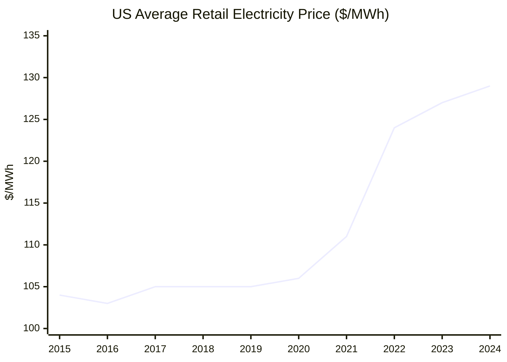
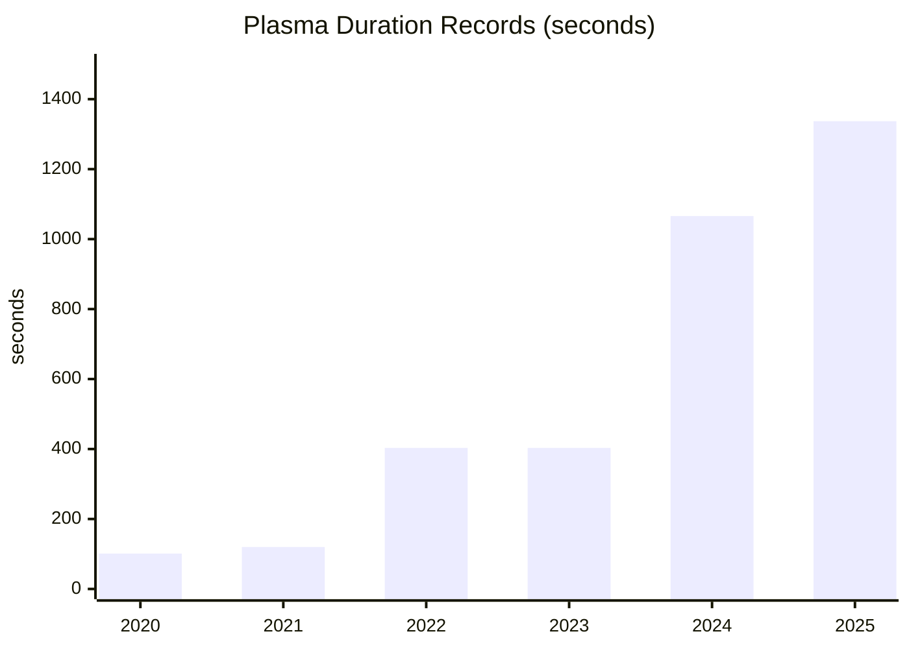
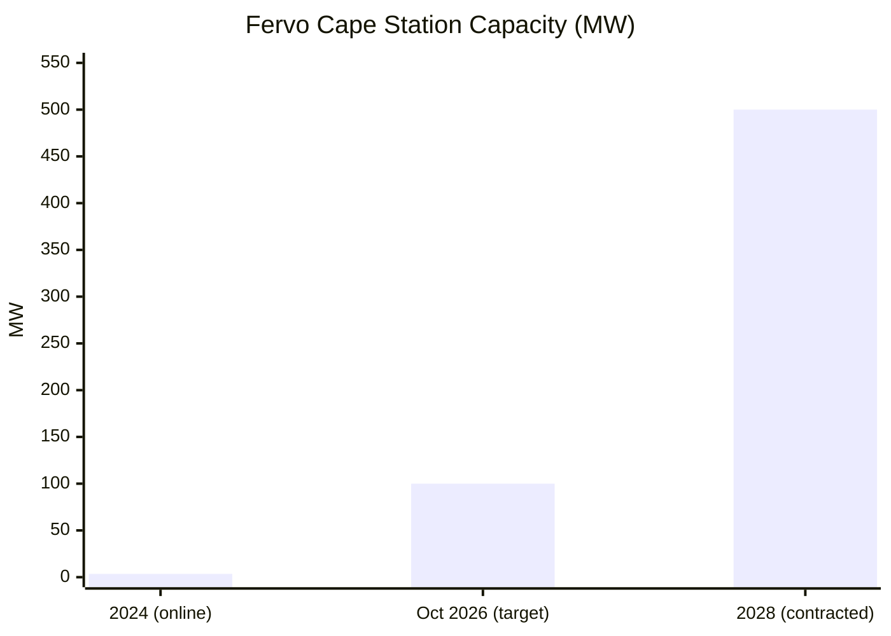

# Fusion and Energy — 2025 Year in Review

> *Energy is the key limiting factor of the material world. It does not have to be. If all electricity bills go to zero, how does that change our lives? There are many short-term fixes, but the long-term approach is unlikely to be anything but nuclear fusion.*

## Executive Summary

**The good news:** 2025 was fusion's breakout year. Private investment surpassed **$10 billion** globally[^iaea-2025]. NIF achieved a record **8.6 MJ yield** (gain 4.1×)[^nif-apr]. CFS is 60% complete on SPARC[^cfs-sparc]. Helion broke ground on the world's first commercial fusion plant site[^helion-orion]. France's WEST tokamak set a plasma duration world record of **22+ minutes**[^west-record]. And the first fusion power purchase agreements were signed—Microsoft with Helion[^helion-microsoft], Google with CFS[^google-cfs].

**The bad news:** No fusion plant has delivered a single watt to a public grid. ITER's first plasma is delayed to **2033–2034**[^iter-delay]. Helion missed its 2024 net-electricity target[^helion-miss]. Fusion LCOE remains theoretical—early plants will likely exceed **$150/MWh**[^lcoe-study]. And the gap between scientific gain (achieved) and engineering gain (wall-plug to grid) remains orders of magnitude[^doe-roadmap].

**The energy context:** Wholesale electricity prices rose 30–40% in H1 2025 across EU/US markets[^iea-prices]. Meanwhile, renewables hit a record **666 GW added** in 2024[^iea-ren] and surpassed coal as the world's largest electricity source in H1 2025[^ember-2025]. Deep geothermal made real commercial progress—Fervo raised $462M[^fervo-e], Eavor achieved world-first closed-loop power production[^eavor-first].

**Bottom line: "The First Watt" is approaching. Grid parity remains distant. The mid-term may belong to geothermal.**

---

## KPI Dashboard

**KPI:** Worldwide average electricity cost ($/MWh)

| Region | H1 2025 Wholesale Price (USD/MWh) | YoY Change | Source |
|--------|-----------------------------------|------------|--------|
| **EU Average** | ~$90 | +30% | [IEA Electricity Mid-Year 2025][iea-prices] |
| **Germany** | ~$100 | +37% | [IEA][iea-prices] |
| **UK** | ~$115 | +40% | [IEA][iea-prices] |
| **United States** | $48 | +40% | [IEA][iea-prices] |
| **Nordics** | ~$40 | −20% | [IEA][iea-prices] |
| **Japan** | $76 | +15% | [IEA][iea-prices] |
| **China (industrial)** | ~$80 | — | [IEA][iea-prices] |
| **India** | $51 | −15% | [IEA][iea-prices] |

[iea-prices]: https://www.iea.org/reports/electricity-mid-year-update-2025/prices-trends-in-wholesale-markets-differ-across-regions

### US Retail Electricity Price (All Sectors)

*Data: [EIA Electric Power Monthly][eia-prices]*

[eia-prices]: https://www.eia.gov/electricity/monthly/epm_table_grapher.php?t=table_5_03

**Assessment: ⚠️ Prices volatile, trending up.** The 2022–2025 period saw significant price increases due to energy crisis aftershocks, gas price volatility, and grid strain. US retail prices rose 24% over the decade (calculated from [EIA][eia-prices]). The promise of fusion—and deep geothermal—is breaking this trend permanently.

---

## Milestone Status

### 🟡 "The First Watt" — First Commercial Fusion Plant Delivers Sustained Electricity to Grid

**Status: Approaching, not yet achieved**

No fusion plant has delivered sustained commercial electricity to a public grid as of January 2026. However, multiple projects have accelerated dramatically.

#### 2025 Key Events

| Date | Event | Source |
|------|-------|--------|
| **Jan 20, 2025** | China's EAST achieves **1,066-second steady-state H-mode plasma** at 100M°C | [Chinese Academy of Sciences][east-record] |
| **Feb 12, 2025** | France's WEST sets **1,337-second plasma duration world record** (22+ min) | [CEA France][west-record] |
| **Apr 7, 2025** | NIF achieves **8.6 MJ yield** from 2.08 MJ input — **gain 4.13×** (record) | [LLNL/NIF][nif-apr] |
| **May 2025** | Wendelstein 7-X sets **triple product world record** for stellarators | [PPPL][w7x-record] |
| **Jul 30, 2025** | **Helion breaks ground** on Orion fusion power plant (WA state) | [Helion][helion-orion] |
| **Sep 4, 2025** | CFS raises **$863M Series B2** to complete SPARC | [CFS][cfs-funding] |
| **Oct 28, 2025** | SPARC vacuum vessel (48 tons) delivered; **~60% complete** | [CFS][cfs-sparc] |
| **Jul 2024** | ITER delays first plasma to **2033–2034**; D-T ops to 2039; €5B cost overrun | [Science\|Business][iter-delay] |

[east-record]: https://english.cas.cn/newsroom/cas_media/202501/t20250121_899052.shtml
[west-record]: https://www.cea.fr/english/Pages/News/nuclear-fusion-west-beats-the-world-record-for-plasma-duration.aspx
[nif-apr]: https://lasers.llnl.gov/science/achieving-fusion-ignition
[w7x-record]: https://www.pppl.gov/news/2025/wendelstein-7-x-sets-new-performance-records-fusion-research
[helion-orion]: https://www.helionenergy.com/articles/helion-secures-land-and-begins-building-site-of-worlds-first-fusion-power-plant/
[cfs-funding]: https://blog.cfs.energy/how-863m-in-new-funding-fast-tracks-commercial-fusion-power/
[cfs-sparc]: https://blog.cfs.energy/half-of-sparcs-heart-a-48-ton-steel-vessel-arrives-at-cfs/
[iter-delay]: https://sciencebusiness.net/news/iter-fusion-project-confirms-more-delays-and-eu5b-cost-overrun

#### Projected Timelines

| Project | Organization | Approach | Projected Grid Connection |
|---------|--------------|----------|---------------------------|
| **Polaris→Orion** | Helion Energy | FRC, D-He³ | **2028** (Microsoft PPA) |
| **SPARC→ARC** | Commonwealth Fusion Systems | HTS tokamak | **Early 2030s** (Google PPA) |
| **ITER** | 33 nations | Tokamak | **2039** (D-T operations) |
| **UK STEP** | UKAEA | Spherical tokamak | Mid-2030s |

**Key progress metrics:**

| Record | Value | Where/When | Source |
|--------|-------|------------|--------|
| Plasma duration (H-mode) | 1,337 seconds | WEST, Feb 2025 | [CEA][west-record] |
| Target gain (Qsci) | 4.13× | NIF, Apr 2025 | [LLNL][nif-apr] |
| Private investment | >$10 billion | Cumulative, 2025 | [IAEA][iaea-2025] |

[iaea-2025]: https://www.iaea.org/newscenter/news/fusion-energy-in-2025-six-global-trends-to-watch

**Why it matters:** Scientific breakeven (Qsci >1) has been repeatedly demonstrated at NIF since December 2022. But engineering breakeven (Qeng >1)—wall-plug energy in vs. grid electricity out—has not. The first PPAs signal commercial confidence, but the milestone remains unachieved.

---

### 🔴 "Grid Parity" — Fusion LCOE < $100/MWh

**Status: Distant — no operational fusion plants exist**

All fusion LCOE figures are projections. No fusion plant has generated commercial electricity.

#### Cost Comparison

| Technology | LCOE ($/MWh) | Status | Source |
|------------|--------------|--------|--------|
| **Natural Gas (CCGT)** | $48–$109 | Operating | [Lazard LCOE+ 2025][lazard] |
| **Utility Solar PV** | $38–$212 | Operating | [Lazard][lazard] |
| **Nuclear Fission** | $141–$220 | Operating | [Lazard][lazard] |
| **Fusion (CFS target)** | $50–$100 | **Projected** | [TIME, Mar 2025][cfs-time] |
| **Fusion (Helion goal)** | $10/MWh | **Projected** (aspirational) | [Helion FAQ][helion-faq] |
| **Fusion (First Light, inertial)** | $25–$80 | **Projected** (mature tech) | [Royal Society][firstlight-rs] |
| **Fusion (early tokamak)** | >$150 | **Projected** (FOAK) | [Lindley et al. 2023][lcoe-study] |

[lazard]: https://www.lazard.com/research-insights/levelized-cost-of-energyplus-lcoeplus/
[cfs-time]: https://time.com/7302543/nuclear-energy-commonwealth-fusion/
[helion-faq]: https://www.helionenergy.com/faq/
[firstlight-rs]: https://royalsocietypublishing.org/doi/10.1098/rsta.2020.0053
[lcoe-study]: https://www.sciencedirect.com/science/article/abs/pii/S0301421523000964

#### Key Cost Drivers

1. **Capital costs** — Superconducting magnets, vacuum vessels, specialized materials (~$6,000/kWe)[^kleinman]
2. **Capacity factor** — Pulsed tokamak operation reduces availability; need >80% uptime
3. **Component lifetime** — Plasma-facing materials degrade rapidly
4. **Tritium breeding** — Closing the fuel cycle remains unsolved
5. **Fleet learning** — FOAK plants expensive; costs drop with nth-of-a-kind builds

**Bottom line:** Fusion must reach $80–$100/MWh by 2040 to compete with incumbent baseload sources[^lcoe-study]. This is plausible at scale but unproven. The milestone will shift from "Distant" to "Approaching" when SPARC (2027) or Orion (2028) demonstrate net electricity and provide real cost data.

---

## Tech Tree Progress

### 🟡 D-T Fusion — Proven ignition, engineering challenges remain

*D-T fusion (deuterium-tritium) is the "easiest" fusion fuel—lowest ignition temperature—but produces 14 MeV neutrons requiring tritium breeding and neutron-resistant materials.*

#### Magnetic Confinement

*Data: [EAST][east-record], [WEST][west-record]*

| Project | 2025 Status | Source |
|---------|-------------|--------|
| **CFS SPARC** | ~60% complete; vacuum vessel delivered; first plasma ~2027 | [CFS][cfs-sparc] |
| **ITER** | Sector Module #7 installed 3 weeks ahead of schedule; first plasma 2033–2034 | [ITER][iter-2025] |
| **Zap Energy** | Achieved **gigapascal plasma pressures** on FuZE-3 (Nov 2025) | [Zap Energy][zap-2025] |
| **JT-60SA** | World's largest superconducting tokamak begins operation Dec 2025 | [PPPL][jt60sa] |

[iter-2025]: https://www.iter.org/project/road-iter
[zap-2025]: https://www.zapenergy.com/news/zap-energy-exceeds-gigapascal-fusion-plasma-pressures-on-new-fusion-device-fuze-3
[jt60sa]: https://www.pppl.gov/news/2025/world's-largest-superconducting-fusion-system-will-use-american-technology-measure-plasma

#### Inertial Confinement

| Date | Event | Source |
|------|-------|--------|
| **Apr 2025** | NIF achieves 8.6 MJ yield (gain 4.13×) | [LLNL][nif-apr] |
| **Sep 2025** | First Light publishes **FLARE** concept—pathway to gain ~1000 | [First Light][flare] |
| **Aug 2025** | Annie Kritcher (NIF principal designer) co-founds **Inertia Enterprises** | [Fortune][inertia] |

[flare]: https://firstlightfusion.com/media/first-light-fusion-publishes-first-plausible-path-to-high-gain-unlocking-cheap-fusion-energy/
[inertia]: https://fortune.com/2025/10/02/nuclear-fusion-online-commercial-ai-power/
[doe-roadmap]: https://www.energy.gov/sites/default/files/2025-10/fusion-s%26t-roadmap-101625.pdf

**ICF commercialization challenges:**

| Challenge | Current | Target | Source |
|-----------|---------|--------|--------|
| Repetition rate | ~1 shot/day | 10 Hz | [DOE Roadmap][doe-roadmap] |
| Target cost | ~$50,000 | <$0.10 | [First Light][flare] |
| Driver efficiency | ~0.7% | >10% | [DOE Roadmap][doe-roadmap] |

#### D-T General Challenges

| Challenge | Status | Source |
|-----------|--------|--------|
| **Tritium breeding (TBR>1)** | MIT BABY experiment: first direct TBR measurement in molten FLiBe (Jan 2025) | [Nuclear Fusion][mit-baby] |
| **Neutron-resistant materials** | U. Michigan: RAFM steel TiC precipitates dissolve at >15 dpa, causing 2% swelling | [Michigan Engineering][rafm] |
| **No Fusion Prototypical Neutron Source** | DOE Roadmap calls for FPNS in 5–10 years | [DOE Roadmap][doe-roadmap] |

[mit-baby]: https://iopscience.iop.org/article/10.1088/1741-4326/ada2ab
[rafm]: https://news.engin.umich.edu/2025/08/a-dual-ion-beam-tests-new-steel-under-fusion-energy-producing-conditions/
[doe-roadmap]: https://www.energy.gov/sites/default/files/2025-10/fusion-s%26t-roadmap-101625.pdf

---

### 🟡 Aneutronic Fusion — Bold promises, significant gaps

*Aneutronic fusion (D-He³, p-B¹¹) produces no neutrons and no tritium—but requires temperatures 10× higher than D-T (600M–3B°C vs. 150M°C).*

#### Helion Energy (D-He³)

| Metric | Status | Source |
|--------|--------|--------|
| **Funding** | >$1B raised; $425M Series F (Jan 2025) | [Helion][helion-funding] |
| **Polaris** | Operational; largest FRC plasmas created; 3,800+ diagnostics | [Helion][helion-polaris] |
| **Orion** | Construction begun Jul 2025; Conditional Use Permit Oct 2025 | [Helion][helion-orion] |
| **Microsoft PPA** | ≥50 MW by 2028; Constellation as power marketer | [Helion][helion-microsoft] |
| **Temperature achieved** | 100M°C (Trenta, 2021) — target: 600M°C | [Helion][helion-100m] |

[helion-funding]: https://www.helionenergy.com/articles/helion-announces-425m-series-f-investment-to-scale-commercialized-fusion-power/
[helion-polaris]: https://www.helionenergy.com/polaris/
[helion-microsoft]: https://www.helionenergy.com/articles/helion-announces-worlds-first-fusion-ppa-with-microsoft/
[helion-100m]: https://www.helionenergy.com/articles/helion-energy-achieves-100-million-degrees-celsius-fusion-fuel-temperature-and-confirms-16-month-continuous-operation-of-its-fusion-generator-prototype/

⚠️ **Concern:** Helion missed its 2024 net-electricity target[^helion-miss]. As of Dec 2025, Polaris has not publicly demonstrated net electricity production.

#### TAE Technologies (p-B¹¹)

| Metric | Status | Source |
|--------|--------|--------|
| **Funding** | >$1.3B raised; $150M round Jun 2025; $6B TMTG merger announced Dec 2025 | [TAE][tae-funding], [CNBC][tae-tmtg] |
| **"Norm" breakthrough** | First NBI-only FRC plasma formation (Apr 2025)—reduces reactor complexity ~50% | [TAE][tae-norm] |
| **Copernicus skipped** | Norm success allows direct jump to Da Vinci (commercial prototype) | [TAE][tae-roadmap] |
| **Temperature achieved** | 70M+ °C (Norm) — target: 3B°C | [TAE][tae-norm] |

[tae-funding]: https://tae.com/tae-technologies-raises-150-million-in-latest-funding-round/
[tae-tmtg]: https://www.cnbc.com/2025/12/18/trump-media-djt-tae-fusion-merger.html
[tae-norm]: https://tae.com/tae-technologies-delivers-fusion-breakthrough-that-dramatically-reduces-cost-of-a-future-power-plant/
[tae-roadmap]: https://tae.com/tae-shortens-device-roadmap-prepares-for-commercial-era/

#### The Aneutronic Challenge

| Fuel | Optimal Temperature | Current Best | Gap | Source |
|------|---------------------|--------------|-----|--------|
| D-T | ~150M°C | Net gain achieved (NIF) | — | [LLNL][nif-apr] |
| D-He³ | ~600M°C | 100M°C (Helion) | 6× | [Helion][helion-100m] |
| p-B¹¹ | ~3B°C | 70M°C (TAE) | 40× | [TAE][tae-norm] |

**Bottom line:** Both companies made genuine technical progress in 2025, but neither has demonstrated net energy gain. Temperature gaps remain substantial. First commercial aneutronic fusion: realistically 2032–2040.

---

### 🟢 Deep Geothermal — The credible mid-term alternative

*Deep geothermal accesses superhot rock (>400°C) via advanced drilling. Unlike fusion, next-gen geothermal companies are already producing commercial power.*

*Data: [Fervo][fervo-shell], [Fervo][fervo-jun], [Fervo][fervo-e]*

#### 2025 Milestones

| Date | Event | Company | Source |
|------|-------|---------|--------|
| **Jul 2025** | **First millimeter-wave drilling to 100m** (world record) | Quaise | [Quaise][quaise-100m] |
| **Dec 2025** | **World's first commercial closed-loop power production** | Eavor | [Eavor][eavor-first] |
| **Dec 2025** | **$462M Series E** (total ~$1.5B raised) | Fervo | [Fervo][fervo-e] |
| **Jun 2025** | $206M financing; 15,000-ft/500°F well drilled | Fervo | [Fervo][fervo-jun] |
| **Apr 2025** | Cape Station reaches 500 MW total PPAs | Fervo | [Fervo][fervo-shell] |

[quaise-100m]: https://www.quaise.energy/news/quaise-energy-achieves-drilling-milestone-with-millimeter-wave-technology
[eavor-first]: https://eavor.com/press-releases/eavor-technologies-achieves-first-electricity-production-at-geretsried-site/
[fervo-e]: https://fervoenergy.com/fervo-energy-raises-462-million-series-e-to-accelerate-geothermal-development-and-meet-surging-energy-demand-with-clean-firm-power/
[fervo-jun]: https://fervoenergy.com/fervo-secures-new-financing-to-accelerate-development/
[fervo-shell]: https://fervoenergy.com/fervo-energy-announces-31-mw-power-purchase-agreement-with-shell-energy/

#### Company Status

| Company | Technology | Status | Key Metric | Source |
|---------|------------|--------|------------|--------|
| **Fervo** | Horizontal EGS (fracking-derived) | **Commercial** | 65% drilling cost reduction over 14 wells | [Fervo][fervo-e] |
| **Eavor** | Closed-loop radiator | **Commercial** (Dec 2025) | 8,145m lateral drilled; no induced seismicity | [Eavor][eavor-first] |
| **Quaise** | Millimeter-wave drilling | **Proof-of-concept** | 100m depth (need 10–20 km) | [Quaise][quaise-100m] |
| **GA Drilling** | Plasma drilling | **R&D** | NREL partnership for downhole power | [ThinkGeoEnergy][ga-nrel] |

[ga-nrel]: https://www.thinkgeoenergy.com/ga-drilling-nrel-collaborate-on-downhole-generator-tech-for-geothermal-drilling/

#### Drilling Technology Maturity

| Technology | TRL (est.) | Challenge |
|------------|------------|-----------|
| Conventional rotary | 9 | Cost escalates exponentially at depth |
| Millimeter-wave (Quaise) | 4–5 | Scaling from 100m to 10+ km |
| Closed-loop (Eavor) | 7–8 | Lower energy density than open systems |
| Horizontal EGS (Fervo) | 8 | Requires suitable geology |

*TRL estimates are author assessments based on public demonstrations and commercial status.*

**Assessment:** Deep geothermal is the **most credible mid-term fusion alternative**. Fervo's execution (65% cost reduction, Google backing) and Eavor's first commercial closed-loop milestone prove the technology works. The question is whether breakthrough drilling (Quaise, GA) can enable superhot rock access "anywhere"—which would match fusion's promise of unlimited clean baseload.

---

## Beyond the Framework

### Fusion Industry Highlights

| Event | Details | Source |
|-------|---------|--------|
| **Pacific Fusion emerges** | $900M Series A (largest fusion startup funding ever); electromagnetic pulse approach | [TechCrunch][pacific] |
| **Google signs CFS PPA** | First major tech company fusion PPA for half of ARC plant output | [TechCrunch][google-cfs] |
| **DOE Fusion S&T Roadmap** | "Build-Innovate-Grow" strategy targeting commercial fusion mid-2030s | [DOE][doe-roadmap] |
| **General Fusion layoffs** | 25% staff cut after cash shortfall; building LM26 device | [TechCrunch][gf-layoffs] |
| **Tokamak Energy Demo4** | First replication of fusion power plant magnetic fields in complete HTS magnet | [Tokamak Energy][te-demo4] |
| **GA completes Central Solenoid** | World's largest pulsed superconducting magnet (1,000+ tons) for ITER | [GA][ga-cs] |

[pacific]: https://techcrunch.com/2025/04/15/heres-how-pacific-fusion-plans-to-build-a-fusion-power-plant/
[google-cfs]: https://techcrunch.com/2025/06/30/google-inks-its-first-fusion-power-deal-with-commonwealth-fusion-systems/
[gf-layoffs]: https://techcrunch.com/2025/05/05/layoffs-hit-general-fusion-as-the-fusion-power-startup-runs-short-on-cash/
[te-demo4]: https://tokamakenergy.com/2025/11/19/tokamak-energy-announces-fusion-power-plant-magnet-technology-breakthrough/
[ga-cs]: https://www.ga.com/ga-marks-completion-of-the-world-s-largest-and-most-powerful-pulsed-superconducting-magnet-for-fusion-energy

### Energy Context

| Development | Source |
|-------------|--------|
| **Renewables surpass coal** (H1 2025) as world's largest electricity source | [Ember][ember-2025] |
| **Record 666 GW renewables added** in 2024 | [IEA Renewables 2024][iea-ren] |
| **Science names renewable surge "Breakthrough of the Year"** | [Science][science-breakthrough] |
| **Trump signs 4 nuclear executive orders** — 400 GW target by 2050 | [DOE][doe-nuclear] |
| **California: 3 years without Flex Alerts** — battery storage eliminated blackout risk | [LA Times][ca-batteries] |

[ember-2025]: https://ember-energy.org/latest-insights/global-electricity-mid-year-insights-2025/
[iea-ren]: https://www.iea.org/reports/renewables-2024
[science-breakthrough]: https://www.science.org/content/article/breakthrough-2025
[doe-nuclear]: https://www.energy.gov/ne/articles/9-key-takeaways-president-trumps-executive-orders-nuclear-energy
[ca-batteries]: https://www.latimes.com/environment/story/2025-10-17/california-made-it-through-another-summer-without-a-flex-alert

---

## Reference Data

### External Visualizations

| Resource | URL |
|----------|-----|
| IAEA Fusion Portal | https://www.iaea.org/resources/databases/fusion-portal |
| Fusion Industry Association Reports | https://www.fusionindustryassociation.org/fusion-industry-reports/ |
| Ember Electricity Data Explorer | https://ember-energy.org/data/electricity-data-explorer |
| IEA Global Energy Review 2025 | https://www.iea.org/reports/global-energy-review-2025 |
| DOE Fusion S&T Roadmap (PDF) | https://www.energy.gov/sites/default/files/2025-10/fusion-s%26t-roadmap-101625.pdf |
| EUROfusion Roadmap | https://euro-fusion.org/eurofusion/roadmap/ |
| IEA Real-Time Electricity Tracker | https://www.iea.org/data-and-statistics/data-tools/real-time-electricity-tracker |

---

*Data sources: [IAEA][iaea-2025], [IEA][iea-prices], [LLNL/NIF][nif-apr], [CFS][cfs-sparc], [Helion][helion-orion], [TAE][tae-norm], [Fervo][fervo-e], [Eavor][eavor-first], [Quaise][quaise-100m], [DOE][doe-roadmap], [Ember][ember-2025], [Lazard][lazard]*

---

## Footnotes

[^iaea-2025]: [IAEA: Fusion Energy in 2025 — Six Global Trends to Watch](https://www.iaea.org/newscenter/news/fusion-energy-in-2025-six-global-trends-to-watch)
[^nif-apr]: [LLNL: NIF Achieving Fusion Ignition](https://lasers.llnl.gov/science/achieving-fusion-ignition)
[^cfs-sparc]: [CFS: Half of SPARC's Heart Arrives](https://blog.cfs.energy/half-of-sparcs-heart-a-48-ton-steel-vessel-arrives-at-cfs/)
[^helion-orion]: [Helion: Worlds First Fusion Power Plant](https://www.helionenergy.com/articles/helion-secures-land-and-begins-building-site-of-worlds-first-fusion-power-plant/)
[^west-record]: [CEA: WEST Beats World Record for Plasma Duration](https://www.cea.fr/english/Pages/News/nuclear-fusion-west-beats-the-world-record-for-plasma-duration.aspx)
[^helion-microsoft]: [Helion: World's First Fusion PPA with Microsoft](https://www.helionenergy.com/articles/helion-announces-worlds-first-fusion-ppa-with-microsoft/)
[^google-cfs]: [TechCrunch: Google Inks First Fusion Power Deal with CFS](https://techcrunch.com/2025/06/30/google-inks-its-first-fusion-power-deal-with-commonwealth-fusion-systems/)
[^iter-delay]: [Science|Business: ITER Fusion Project Confirms More Delays](https://sciencebusiness.net/news/iter-fusion-project-confirms-more-delays-and-eu5b-cost-overrun)
[^lcoe-study]: [Lindley et al. 2023: Fusion LCOE Analysis](https://www.sciencedirect.com/science/article/abs/pii/S0301421523000964)
[^iea-prices]: [IEA Electricity Mid-Year Update 2025](https://www.iea.org/reports/electricity-mid-year-update-2025/prices-trends-in-wholesale-markets-differ-across-regions)
[^iea-ren]: [IEA Renewables 2024](https://www.iea.org/reports/renewables-2024)
[^ember-2025]: [Ember: Global Electricity Mid-Year Insights 2025](https://ember-energy.org/latest-insights/global-electricity-mid-year-insights-2025/)
[^fervo-e]: [Fervo: $462M Series E](https://fervoenergy.com/fervo-energy-raises-462-million-series-e-to-accelerate-geothermal-development-and-meet-surging-energy-demand-with-clean-firm-power/)
[^eavor-first]: [Eavor: First Electricity Production at Geretsried](https://eavor.com/press-releases/eavor-technologies-achieves-first-electricity-production-at-geretsried-site/)
[^helion-miss]: [Wikipedia: Helion Energy — missed 2024 net-electricity target](https://en.wikipedia.org/wiki/Helion_Energy)
[^doe-roadmap]: [DOE Fusion Science & Technology Roadmap 2025](https://www.energy.gov/sites/default/files/2025-10/fusion-s%26t-roadmap-101625.pdf)
[^kleinman]: [Kleinman Center: Bringing Fusion Energy to the Grid](https://kleinmanenergy.upenn.edu/research/publications/bringing-fusion-energy-to-the-grid-challenges-and-pathways/)
