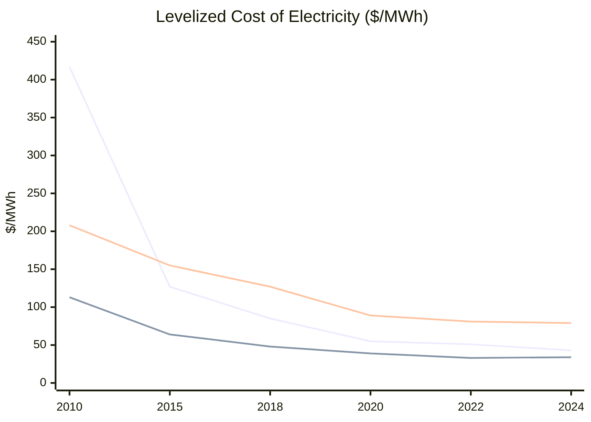
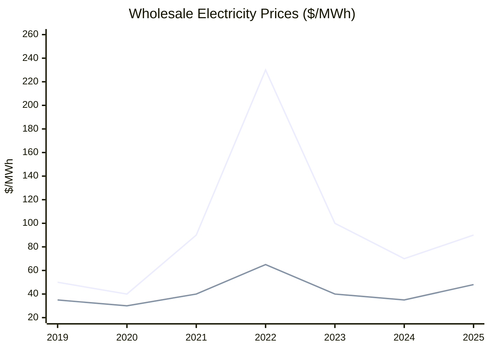

# Fusion and Energy — 2025 Year in Review

> *Energy is the key limiting factor of the material world. It does not have to be. If all electricity bills go to zero, how does that change our lives, from heating to food, to travel, to compute? The long-term approach is unlikely to be anything but nuclear fusion—and superconductors make everything easier.*

## Executive Summary

**The good news:** 2025 was fusion's breakout year. NIF achieved Q=4.13 (8.6 MJ yield)[^nif-apr], private investment surpassed $10 billion cumulative[^fia-2025], and Helion began construction of the world's first commercial fusion power plant[^helion-malaga]. Renewables overtook coal in global electricity generation for the first time (34.3% vs 33.1%)[^ember-h1]. Deep geothermal crossed from demonstration to commercial scale—Fervo's Cape Station is scaling to 500 MW[^fervo-e].

**The bad news:** No fusion plant has yet delivered electricity to a grid—"The First Watt" remains unreached. ITER's first plasma slipped to 2034, D-T operations to 2039[^iter-baseline]. Fusion LCOE estimates start above $150/MWh for first-of-a-kind plants[^lindley-2023]. The industry needs ~$77 billion more to commercialize[^fia-2025]. Meanwhile, wholesale electricity prices rebounded in 2025: EU +30%, US +40% YoY in H1[^iea-midyear].

**Bottom line: "The First Watt" is approaching—expected 2028–2032 if private timelines hold. "Grid Parity" remains distant, contingent on engineering breakthroughs that haven't happened yet.**

---

## KPI Dashboard

**KPI:** Worldwide average electricity cost ($/MWh)

| Metric | Value | Source |
|--------|-------|--------|
| **EU wholesale (H1 2025)** | ~$90/MWh (+30% YoY) | [IEA Mid-Year 2025][iea-midyear] |
| **US wholesale (H1 2025)** | ~$48/MWh (+40% YoY) | [IEA Mid-Year 2025][iea-midyear] |
| **New solar LCOE (2024)** | $43/MWh | [IRENA 2024][irena-lcoe] |
| **New onshore wind LCOE (2024)** | $34/MWh | [IRENA 2024][irena-lcoe] |
| **Gas CCGT LCOE (2024)** | $41–108/MWh | [Lazard LCOE+ 2025][lazard] |
| **New nuclear fission LCOE** | $142–222/MWh | [Lazard LCOE+ 2025][lazard] |
| **Fusion LCOE (projected, FOAK)** | >$150/MWh | [Lindley et al. 2023][lindley] |
| **Fusion LCOE (projected, NOAK)** | $50–100/MWh | [CFS/TIME 2025][time-cfs] |

[iea-midyear]: https://iea.blob.core.windows.net/assets/cc64f0aa-30e4-4497-9cca-1ffae2c55fe5/ElectricityMid-YearUpdate2025.pdf
[irena-lcoe]: https://www.irena.org/Publications/2025/Jun/Renewable-Power-Generation-Costs-in-2024
[lazard]: https://www.lazard.com/media/5tlbhyla/lazards-lcoeplus-june-2025-_vf.pdf
[lindley]: https://www.sciencedirect.com/science/article/abs/pii/S0301421523000964
[time-cfs]: https://time.com/7302543/nuclear-energy-commonwealth-fusion/

### Renewable LCOE Trend ($/MWh)

*Data: [IRENA Renewable Power Generation Costs 2024][irena-lcoe]*

### Wholesale Electricity Prices ($/MWh)

*Data: [IEA Electricity Mid-Year Update 2025][iea-midyear]*

**Assessment: ⚠️ Mixed.** Generation costs for renewables have collapsed (solar −90% since 2010). However, wholesale prices remain volatile due to gas prices, weather, and grid constraints. Fusion remains unproven commercially, with first plants expected to exceed current nuclear costs.

---

## Milestone Status

### 🟡 "The First Watt" — First Commercial Fusion Plant Delivers Electricity to Grid

**Status: Approaching (2028–2032 expected)**

No fusion plant has yet delivered sustained electricity to a public grid. However, 2025 saw record-breaking progress:

| Date | Event | Source |
|------|-------|--------|
| **Apr 7, 2025** | NIF achieves **Q=4.13** (8.6 MJ yield, 2.08 MJ input)—highest fusion gain ever | [LLNL][nif-ignition] |
| **Feb 12, 2025** | WEST tokamak sets plasma duration record: **22 minutes 17 seconds** | [CEA][west-record] |
| **Jul 30, 2025** | **Helion begins construction** of Orion plant in Malaga, WA—first commercial fusion site | [Helion][helion-malaga] |
| **Aug 28, 2025** | CFS raises **$863M** Series B2 (total ~$3B)—largest deep-tech raise of 2025 | [CFS][cfs-funding] |
| **Oct 15, 2025** | Helion secures reactor building permit from Chelan County | [Helion][helion-permit] |
| **Nov 17, 2025** | TAE skips 6th-gen device (Copernicus), accelerates to commercial plant | [TAE][tae-roadmap] |
| **Dec 2025** | Tokamak Energy sets 3 records: 1 MA plasma current, highest triple product (~8×10¹⁸ m⁻³·keV·s) | [Tokamak Energy][te-records] |

[nif-ignition]: https://lasers.llnl.gov/science/achieving-fusion-ignition
[west-record]: https://www.cea.fr/english/Pages/News/nuclear-fusion-west-beats-the-world-record-for-plasma-duration.aspx
[helion-malaga]: https://www.helionenergy.com/articles/starting-to-build-the-worlds-first-fusion-power-plant-in-malaga-wa/
[cfs-funding]: https://cfs.energy/news-and-media/commonwealth-fusion-systems-raises-863-million-series-b2-round-to-accelerate-the-commercialization-of-fusion-energy/
[helion-permit]: https://www.geekwire.com/2025/helion-lands-permit-for-reactor-building-construction-at-washington-site-that-aims-to-be-first-fusion-plant/
[tae-roadmap]: https://tae.com/tae-shortens-device-roadmap-prepares-for-commercial-era/
[te-records]: https://tokamakenergy.com/2025/12/19/knockout-results-from-tokamak-energys-record-breaking-st40-ends-2025-on-a-high/

#### Companies Closest to Grid Connection

| Company | Approach | Announced Timeline | Key 2025 Progress |
|---------|----------|-------------------|-------------------|
| **Helion Energy** | FRC (D-He3) | **2028** (Microsoft PPA) | Construction begun; permits secured; Polaris operational |
| **Commonwealth Fusion** | HTS Tokamak | **Early 2030s** | $863M raised; SPARC assembly underway; Google buying 200 MW |
| **TAE Technologies** | FRC (p-B11) | **Early 2030s** | NBI-only breakthrough; skipped device generation |
| **Tokamak Energy** | Spherical Tokamak | **2030s** | 3 performance records; Demo4 magnet validated |

#### Quantitative Progress

| Metric | Best Achieved | When | Project |
|--------|---------------|------|---------|
| **Fusion Gain (Q)** | **4.13** | Apr 2025 | NIF |
| **Plasma Duration** | **22 min 17 sec** | Feb 2025 | WEST |
| **Plasma Temperature** | 100+ million °C | Achieved | Multiple |
| **HTS Magnet Field** | 20 T | Sep 2021 | CFS |
| **Private Fusion Investment** | **$10B+ cumulative** | 2025 | Industry-wide |

**Why not achieved yet:** Scientific breakeven (Q>1) is proven. Engineering breakeven (net electricity from total plant input) is not. No fusion device has sustained power output to a grid.

---

### 🔴 "Grid Parity" — Fusion LCOE Below $100/MWh

**Status: Distant**

| Source | LCOE ($/MWh) | Status |
|--------|--------------|--------|
| Onshore Wind | $27–73 (avg $50) | Deployed |
| Solar PV | $29–92 (avg $58) | Deployed |
| Gas CCGT | $41–108 (avg $78) | Deployed |
| Nuclear Fission (new) | $142–222 | Deployed |
| **Fusion (FOAK)** | **>$150** | Projected |
| **Fusion (NOAK)** | **$50–100** | Projected |

*Data: [Lazard LCOE+ 2025][lazard], [Lindley et al. 2023][lindley]*

#### Technical Requirements for Grid Parity

| Milestone | Status |
|-----------|--------|
| Scientific breakeven (Q>1) | ✅ Achieved (NIF) |
| Engineering breakeven (Q>10) | ❌ Not achieved |
| Net electricity generation | ❌ Not achieved |
| Plant availability >75% | ❌ Unproven |
| Capital cost <$5,000/kW | ❌ Unknown |

**Bottom line:** Fusion reaching <$100/MWh is plausible for mature plants in the **2040s–2050s**. No fusion plant currently operates; all LCOE figures are projections.

---

## Tech Tree Progress

### 🟡 D-T Fusion — Strong Scientific Progress

D-T (deuterium-tritium) is the easiest fusion reaction to achieve, but produces 14 MeV neutrons requiring tritium breeding and radiation-resistant materials.

#### Magnetic Confinement

| Project | 2025 Progress | Timeline | Source |
|---------|---------------|----------|--------|
| **ITER** | Sector Module #7 installed (3 weeks early); baseline reset: First Plasma 2034, D-T 2039 | +9 years delayed | [ITER][iter] |
| **CFS (SPARC)** | DOE validated magnets ($8M milestone); vacuum vessel delivered; Google 200 MW deal | SPARC: 2026; ARC: early 2030s | [CFS][cfs-funding] |
| **Zap Energy** | FuZE-3 achieves **1.6 GPa plasma pressure** (10,000× atmospheric) | Scaling to FuZE-A | [Zap][zap-pressure] |
| **Tokamak Energy** | 1 MA current, highest private triple product; Demo4 magnet validated at 11.8 T | 2030s commercial | [Tokamak Energy][te-records] |

[iter]: https://www.iter.org/project/road-iter
[zap-pressure]: https://www.zapenergy.com/news/zap-energy-exceeds-gigapascal-fusion-plasma-pressures-on-new-fusion-device-fuze-3

#### Inertial Confinement

| Project | 2025 Progress | Source |
|---------|---------------|--------|
| **NIF** | Q=4.13 (Apr); THOR platform ignition (Jun); Enhanced Yield Capability approved | [LLNL][nif-ignition] |
| **First Light Fusion** | FLARE concept: path to gain ~1,000 at $100–200M (vs $5.3B NIF); pivoted to licensing | [First Light][flf-flare] |

[flf-flare]: https://firstlightfusion.com/media/first-light-fusion-publishes-first-plausible-path-to-high-gain-unlocking-cheap-fusion-energy/

**Key Gaps:**
- Tritium breeding ratio >1.0 not demonstrated at scale
- IFE rep-rate: ~1 shot/day needed → 10 Hz (864,000× gap)
- Target cost: ~$50,000 → $0.10 needed

---

### 🟡 Aneutronic Fusion — Accelerated Timelines

Aneutronic fuels (D-He3, p-B11) avoid neutron damage and tritium, but require 10× higher temperatures.

| Company | Approach | 2025 Milestone | Funding | Timeline |
|---------|----------|----------------|---------|----------|
| **Helion** | D-He3 FRC | Construction begun; Polaris operational; 500+ employees | $1B+ ($425M Series F in Jan 2025) | **2028** |
| **TAE** | p-B11 FRC | NBI-only FRC formation (world first); skipped Copernicus | $1.8B+ ($150M in Jun 2025; $6B merger) | Early 2030s |
| **HB11** | Laser p-B11 | High reaction rates at Phelix/LFEX | $23M | Research stage |

*Sources: [Helion][helion-malaga], [TAE][tae-roadmap], [HB11](https://hb11.energy/)*

**Critical challenge:** Neither Helion nor TAE has demonstrated net energy gain. Helion missed its 2024 net-electricity target[^helion-miss] and now targets 2028 delivery to Microsoft; TAE targets early 2030s. Both timelines are aggressive.

---

### 🟢 Deep Geothermal — Commercial Scale Achieved

Deep geothermal (Enhanced Geothermal Systems) is the most viable mid-term clean baseload alternative.

| Company | Technology | 2025 Milestone | Source |
|---------|-----------|----------------|--------|
| **Fervo Energy** | EGS (horizontal drilling) | 15,765 ft at 520°F; 79% faster drilling; $462M Series E; 500 MW Cape Station by 2028 | [Fervo][fervo] |
| **Quaise Energy** | Millimeter-wave drilling | **100m granite drill** (world first for MMW); targeting 10–20 km | [Quaise][quaise] |
| **Eavor** | Closed-loop | First electricity to German grid (Dec 2025) | [Eavor][eavor] |
| **GA Drilling** | Plasma drilling | $83M raised; Petrobras partnership | [GA Drilling][ga] |
| **Sage Geosystems** | Pressure storage | 3 MW facility; 150 MW Meta deal | [Sage][sage] |

[fervo]: https://fervoenergy.com/fervo-energy-raises-462-million-series-e-to-accelerate-geothermal-development-and-meet-surging-energy-demand-with-clean-firm-power/
[quaise]: https://www.quaise.energy/news/quaise-energy-achieves-drilling-milestone-with-millimeter-wave-technology
[eavor]: https://eavor.com/press-releases/eavor-technologies-achieves-first-electricity-production-at-geretsried-site/
[ga]: https://tracxn.com/d/companies/ga-drilling/__kpZWRFzTXYpocz62jd7fiVz-MAlsMUsEK2bCKMUDNAg
[sage]: https://www.sagegeosystems.com/projects

#### Cost Trajectory

| Timeframe | EGS LCOE | Source |
|-----------|----------|--------|
| Current | $66–109/MWh | [Lazard][lazard] |
| 2030s target | $45–65/MWh | [McKinsey][mckinsey-geo] |
| 2035 projection | $50/MWh (−80%) | [IEA via Eavor][eavor-iea] |

[mckinsey-geo]: https://www.mckinsey.com/industries/electric-power-and-natural-gas/our-insights/is-geothermal-energy-ready-to-make-its-mark-in-the-us-power-mix
[eavor-iea]: https://eavor.com/blog/geothermal-energy-costs-could-drop-80-by-2035/

#### Drilling Technology Maturity

| Technology | TRL (est.) | Challenge |
|------------|------------|-----------|
| Conventional rotary | 9 | Cost escalates exponentially at depth |
| Horizontal EGS (Fervo) | 8 | Requires suitable geology |
| Closed-loop (Eavor) | 7–8 | Lower energy density than open systems |
| Millimeter-wave (Quaise) | 4–5 | Scaling from 100m to 10+ km |
| Plasma drilling (GA) | 3–4 | Early R&D stage |

*TRL estimates are author assessments based on public demonstrations and commercial status.*

**Bottom line:** Deep geothermal is the **most credible mid-term fusion alternative**. Fervo's execution (65% cost reduction, Google backing) and Eavor's first commercial closed-loop milestone prove the technology works. The question is whether breakthrough drilling (Quaise, GA) can enable superhot rock access "anywhere"—which would match fusion's promise of unlimited clean baseload.

---

## Beyond the Framework: 2025 Highlights

### Superconductor Progress
- **Tokamak Energy Demo4** validated 11.8 T HTS magnet system at −243°C (Nov 2025)[^te-magnet]
- **Max Planck Institute** measured superconducting gap in H₃S hydride for first time (Dec 2025)[^hydride]
- **NYU/Queensland** created superconducting germanium at 3.5 K (Oct 2025)[^germanium]

### Nuclear Fission / SMRs
- **NuScale/ENTRA1/TVA** signed 6 GW SMR deal—largest U.S. SMR program ever (Sep 2025)[^nuscale]
- **TerraPower Natrium** secured $650M from NVIDIA/HD Hyundai; NRC draft safety evaluation complete[^terrapower]
- **127 SMR designs** now tracked globally by OECD-NEA[^nea-smr]

### Energy Storage
- **U.S. grid storage hit 40 GW** in Q3 2025—surpassing 2017's 35 GW target[^canary]
- **China released first national solid-state battery standard** (Jan 2026)[^china-ss]

### Renewable Energy
- **Renewables overtook coal** for first time: 34.3% vs 33.1% of global electricity (H1 2025)[^ember-h1]
- **Solar alone met 83%** of global electricity demand growth[^ember-h1]
- ***Science* named renewable energy growth 2025 Breakthrough of the Year**[^science-boty]

### AI in Fusion
- **Princeton Diag2Diag** AI generates synthetic sensor data for real-time plasma control[^princeton-ai]
- **Google DeepMind** partnered with CFS on AI plasma optimization[^cfs-ai]

### Policy & Funding
- **DOE established Office of Fusion** (first standalone since 1990s)[^doe-fusion]
- **UK committed £2.5 billion** to fusion over 5 years[^uk-fusion]
- **Germany signed MOU** for laser fusion plant at Biblis site by 2035[^germany-fusion]

---

## Reference Data

### External Visualizations

| Chart | Source |
|-------|--------|
| IEA Real-Time Electricity Tracker | [iea.org/data-tools/real-time-electricity-tracker](https://www.iea.org/data-and-statistics/data-tools/real-time-electricity-tracker) |
| IRENA LCOE Dashboard | [irena.org/Data/View-data-by-topic/Costs/Global-LCOE-and-Auction-values](https://www.irena.org/Data/View-data-by-topic/Costs/Global-LCOE-and-Auction-values) |
| Ember Global Electricity Data | [ember-energy.org](https://ember-energy.org/) |
| IAEA Fusion Portal | [iaea.org/resources/databases/fusion-portal](https://www.iaea.org/resources/databases/fusion-portal) |
| FIA Global Fusion Report 2025 | [fusionindustryassociation.org](https://www.fusionindustryassociation.org/wp-content/uploads/2025/07/2025-Global-Fusion-Industry-Report.pdf) |
| NEA SMR Dashboard | [oecd-nea.org/smr-dashboard](https://www.oecd-nea.org/jcms/pl_107879/nea-small-modular-reactor-digital-dashboard) |

---

*Data sources: [IEA][iea-midyear], [IRENA][irena-lcoe], [Lazard][lazard], [LLNL][nif-ignition], [FIA][fia-2025], [Ember][ember-h1], [ITER][iter], company announcements*

---

## Footnotes

[^nif-apr]: [LLNL: NIF Achieving Fusion Ignition](https://lasers.llnl.gov/science/achieving-fusion-ignition)
[^fia-2025]: [Fusion Industry Association 2025 Report](https://www.fusionindustryassociation.org/wp-content/uploads/2025/07/2025-Global-Fusion-Industry-Report.pdf)
[^helion-malaga]: [Helion: Starting to Build the World's First Fusion Power Plant](https://www.helionenergy.com/articles/starting-to-build-the-worlds-first-fusion-power-plant-in-malaga-wa/)
[^ember-h1]: [Ember: Global Electricity Mid-Year Insights 2025](https://ember-energy.org/latest-insights/global-electricity-mid-year-insights-2025/)
[^fervo-e]: [Fervo: $462M Series E](https://fervoenergy.com/fervo-energy-raises-462-million-series-e-to-accelerate-geothermal-development-and-meet-surging-energy-demand-with-clean-firm-power/)
[^iter-baseline]: [ITER: New Baseline 2024](https://www.iter.org/few-lines)
[^lindley-2023]: [Lindley et al. 2023, Energy Policy](https://www.sciencedirect.com/science/article/abs/pii/S0301421523000964)
[^iea-midyear]: [IEA Electricity Mid-Year Update 2025](https://iea.blob.core.windows.net/assets/cc64f0aa-30e4-4497-9cca-1ffae2c55fe5/ElectricityMid-YearUpdate2025.pdf)
[^te-magnet]: [Tokamak Energy: Demo4 Magnet Breakthrough](https://tokamakenergy.com/2025/11/19/tokamak-energy-announces-fusion-power-plant-magnet-technology-breakthrough/)
[^hydride]: [ScienceDaily: H₃S Superconducting Gap](https://www.sciencedaily.com/releases/2025/12/251219093328.htm)
[^germanium]: [NYU: Superconducting Germanium](https://www.nyu.edu/about/news-publications/news/2025/october/scientists-create-new-type-of-semiconductor-that-holds-supercond.html)
[^nuscale]: [NuScale: 6 GW TVA Deal](https://www.nuscalepower.com/press-releases/2025/nuscale-power-reports-third-quarter-2025-results)
[^terrapower]: [ANS: TerraPower Natrium Progress](https://www.ans.org/news/2025-04-29/article-6962/industry-updatemay-2025/)
[^nea-smr]: [OECD-NEA SMR Dashboard](https://www.oecd-nea.org/jcms/pl_73678/nea-small-modular-reactor-smr-dashboard)
[^canary]: [Canary Media: Grid Storage Hits 40 GW](https://www.canarymedia.com/articles/energy-storage/grid-storage-industry-crushes-2025-goal)
[^china-ss]: [Electrek: China Solid-State Battery Standard](https://electrek.co/2026/01/02/solid-state-ev-batteries-big-step-forward-china/)
[^science-boty]: [Science: 2025 Breakthrough of the Year](https://www.science.org/content/article/breakthrough-2025)
[^princeton-ai]: [Innovation News Network: Princeton Diag2Diag AI](https://www.innovationnewsnetwork.com/princeton-ai-breakthrough-transforms-fusion-systems-into-reliable-power-sources/62239/)
[^cfs-ai]: [CFS: Google DeepMind Partnership](https://blog.cfs.energy/with-ai-alliance-google-deepmind-and-cfs-take-fusion-to-the-next-level/)
[^doe-fusion]: [CATF: DOE Office of Fusion](https://www.catf.us/2025/12/doe-launched-office-fusion-heres-how-help-industry-scale/)
[^uk-fusion]: [Kleinman Center: Fusion Challenges](https://kleinmanenergy.upenn.edu/research/publications/bringing-fusion-energy-to-the-grid-challenges-and-pathways/)
[^germany-fusion]: [ANS: Germany Laser Fusion Plant MOU](https://www.ans.org/news/2025-04-29/article-6962/industry-updatemay-2025/)
[^helion-miss]: [Wikipedia: Helion Energy — missed 2024 net-electricity target](https://en.wikipedia.org/wiki/Helion_Energy)

[fia-2025]: https://www.fusionindustryassociation.org/wp-content/uploads/2025/07/2025-Global-Fusion-Industry-Report.pdf
[ember-h1]: https://ember-energy.org/latest-insights/global-electricity-mid-year-insights-2025/
