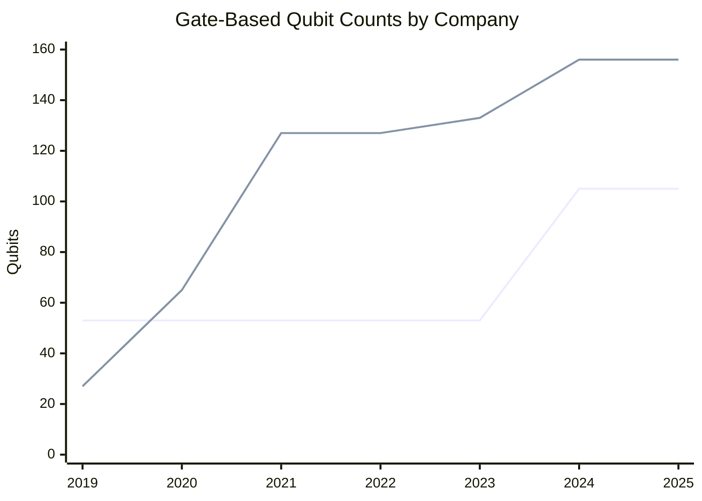
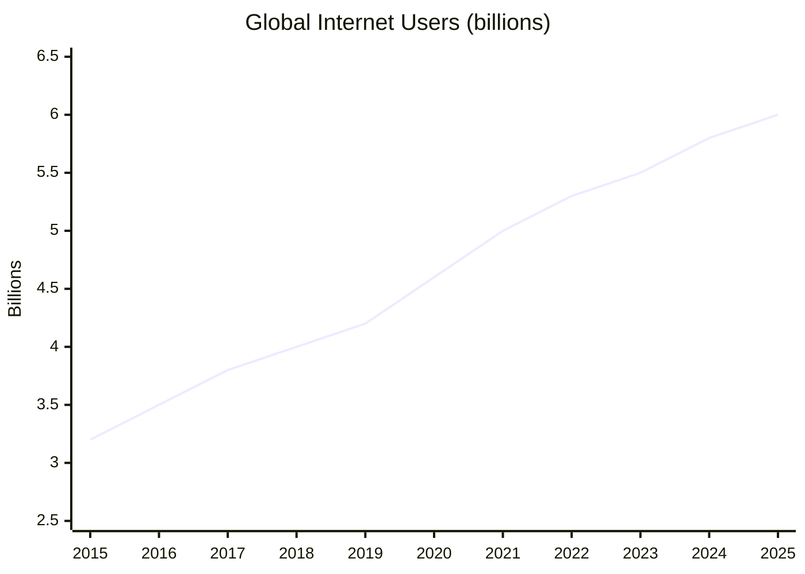

# The Knowledge Beyond — 2025 Year in Review

> *A great enabler for the future is deep understanding of our universe and the ability to manipulate it on a fine scale. Paradigm-breaking technologies like quantum computing and nanomachines, as well as new research ranging from mathematics to neuroscience, may not impact any of the great endeavors directly, but they will reframe everything in the long run.*

## Executive Summary

**The good news:** 2025 was a year of genuine inflection points across multiple frontiers. Google demonstrated the first verifiable quantum advantage (13,000× faster than classical supercomputers). AI achieved gold-medal mathematical reasoning at the IMO. The first personalized CRISPR therapy was delivered to an infant in six months from diagnosis. Brain-computer interfaces reached 12+ human patients with functional computer control. TSMC began mass production of 2nm chips. And global internet access crossed 6 billion people.

**The bad news:** Most breakthroughs remain in laboratory or early-clinical stages. Quantum error rates are still 10,000× too high for practical applications. Microsoft's topological qubit claims remain disputed. 2.2 billion people are still offline, concentrated in low-income countries. The Muon g-2 experiment found no hints of "new physics" beyond the Standard Model. And room-temperature superconductivity at ambient pressure remains elusive.

**Bottom line: The tools to reshape civilization are being forged. Deployment lags discovery by years to decades.**

---

## KPI Dashboard

Unlike the other endeavors, "The Knowledge Beyond" lacks a single KPI — progress is measured across multiple paradigm-breaking domains:

| Domain | Key 2025 Metric | Trend | Source |
|--------|-----------------|-------|--------|
| **Quantum Computing** | First verifiable quantum advantage (13,000× speedup) | 🟡 Approaching utility | [Nature][echoes-nature] |
| **Nanotechnology** | TSMC 2nm mass production begins | 🟢 On track | [TSMC][tsmc-2nm] |
| **Mathematics** | AI gold medal at IMO (35/42 points) | 🟢 Historic | [DeepMind][deepthink] |
| **Neuroscience** | 12+ Neuralink patients, 15,000+ hours BCI use | 🟡 Early clinical | [Neuralink][neuralink] |
| **Global Connectivity** | 6 billion online (74% of humanity) | 🟡 Gap persists | [ITU 2025][itu-2025] |
| **Superconductivity** | Nickelates stabilized at ambient pressure | 🟡 Steady progress | [SLAC][slac-nickelate] |

[echoes-nature]: https://www.nature.com/articles/s41586-025-09526-6
[tsmc-2nm]: https://www.tsmc.com/english/dedicatedFoundry/technology/logic/l_2nm
[deepthink]: https://deepmind.google/blog/advanced-version-of-gemini-with-deep-think-officially-achieves-gold-medal-standard-at-the-international-mathematical-olympiad/
[neuralink]: https://neuralink.com/updates/
[itu-2025]: https://www.itu.int/en/mediacentre/Pages/PR-2025-11-17-Facts-and-Figures.aspx
[slac-nickelate]: https://www6.slac.stanford.edu/news/2025-02-04-first-researchers-stabilize-promising-new-class-high-temperature-superconductors

---

## Quantum Computing

### 🟡 Status: First Advantages Demonstrated, Utility Still Narrow

2025 was declared the **UNESCO International Year of Quantum Science and Technology**. The field crossed critical milestones but remains years from general-purpose utility.

*Data: Google (top), IBM (bottom). Company announcements.*

### Key Achievements

| Achievement | Company | Date | Significance | Source |
|-------------|---------|------|--------------|--------|
| **Below-threshold error correction** | Google (Willow) | Dec 2024 | 105 qubits; exponential error reduction as qubits scale | [Google Blog][willow] |
| **Quantum Echoes — first verifiable advantage** | Google | Oct 2025 | 13,000× faster than Frontier supercomputer; peer-reviewed in Nature | [Nature][echoes-nature] |
| **Topological qubit processor** | Microsoft (Majorana 1) | Feb 2025 | First QPU with Topological Core; designed for 1M qubits per chip | [Microsoft][majorana] |
| **99.99% two-qubit gate fidelity** | IonQ | Oct 2025 | World record; path to 2M qubits by 2030 | [IonQ][ionq] |
| **Helios: 98 qubits, 99.92% fidelity** | Quantinuum | Nov 2025 | Commercial launch; QV 2²⁵; DARPA US2QC Phase B selection | [Quantinuum][helios] |
| **Photonic chipset in Nature** | PsiQuantum (Omega) | Feb 2025 | First manufacturable photonic quantum chips (GlobalFoundries) | [Nature][psiquantum] |

[willow]: https://blog.google/technology/research/google-willow-quantum-chip/
[majorana]: https://azure.microsoft.com/en-us/blog/quantum/2025/02/19/microsoft-unveils-majorana-1-the-worlds-first-quantum-processor-powered-by-topological-qubits/
[ionq]: https://investors.ionq.com/news/news-details/2025/IonQ-Achieves-Landmark-Result-Setting-New-World-Record-in-Quantum-Computing-Performance/
[helios]: https://www.quantinuum.com/press-releases/quantinuum-announces-commercial-launch-of-new-helios-quantum-computer-that-offers-unprecedented-accuracy-to-enable-generative-quantum-ai-genqai
[psiquantum]: https://www.nature.com/articles/s41586-025-08820-7

### Industry & Investment

| Event | Amount | Date | Significance | Source |
|-------|--------|------|--------------|--------|
| Quantinuum raise | $600M at **$10B valuation** | Sep 2025 | Largest quantum valuation | [Quantinuum][quantinuum-raise] |
| IonQ equity offering | $2B | Oct 2025 | Pro-forma cash: $3.5B | [IonQ][ionq-raise] |
| PsiQuantum Series E | $1B at **$7B valuation** | 2025 | Chicago & Brisbane facilities | [McKinsey][mckinsey-q] |
| Q1 2025 sector funding | $1.25B | Q1 2025 | +128% YoY | [SpinQ][spinq] |

[quantinuum-raise]: https://www.quantinuum.com/press-releases/honeywell-announces-600-million-capital-raise-for-quantinuum-at-10b-pre-money-equity-valuation-to-advance-quantum-computing-at-scale
[ionq-raise]: https://investors.ionq.com/news/news-details/2025/IonQ-Announces-Third-Quarter-2025-Financial-Results/
[mckinsey-q]: https://www.mckinsey.com/capabilities/tech-and-ai/our-insights/the-year-of-quantum-from-concept-to-reality-in-2025
[spinq]: https://www.spinquanta.com/news-detail/quantum-computing-funding-explosive-growth-strategic-investment-2025

### Government Investment

| Country | Amount | Key Programs | Source |
|---------|--------|--------------|--------|
| **China** | ~$138B (1T yuan fund) | National venture fund for quantum, AI, biotech | [Gov.cn][china-quantum] |
| **Japan** | ~$7.9B | Surpasses US; AIST R&D bases | [Riverlane][riverlane] |
| **United States** | $625M (DOE renewal) | 5 National QISRCs renewed | [DOE][doe-quantum] |
| **Global total** | **>$55.7B** cumulative | $3.1B invested by governments in 2024 | [Qureca][qureca] |

[china-quantum]: https://english.www.gov.cn/news/202512/26/content_WS694e4e56c6d00ca5f9a08486.html
[riverlane]: https://www.riverlane.com/quantum-error-correction-report-2025
[doe-quantum]: https://www.energy.gov/articles/energy-department-announces-625-million-advance-next-phase-national-quantum-information
[qureca]: https://www.qureca.com/quantum-initiatives-worldwide/

### Setbacks & Reality Checks

- **Microsoft Majorana 1 disputed:** *Nature* editorial stated results "do not represent evidence for MZMs"[^majorana-dispute]
- **D-Wave "supremacy" replicated:** Independent researchers matched some results on classical laptop[^dwave-dispute]
- **Error rates:** Current ~0.1–1% vs <0.0001% needed for useful applications (10,000× gap)
- **Talent shortage:** Only 600–700 QEC specialists globally; need 5,000–16,000 by 2030[^riverlane-talent]

[^majorana-dispute]: [New Scientist](https://www.newscientist.com/article/2508083-microsoft-made-a-splash-with-a-controversial-quantum-computer-in-2025/)
[^dwave-dispute]: [Scientific American](https://www.scientificamerican.com/article/controversial-quantum-advantage-claim-made-by-computing-firm-d-wave/)
[^riverlane-talent]: [Riverlane QEC Report 2025](https://www.riverlane.com/quantum-error-correction-report-2025)

---

## Nanotechnology

### 🟢 Status: 2nm Chips Enter Production

2025 marked the first fundamental transistor architecture change in 13 years — the transition from FinFET (2012–2024) to GAA nanosheet transistors.

### Semiconductor Manufacturing

| Company | Node | Status | Date | Key Details | Source |
|---------|------|--------|------|-------------|--------|
| **TSMC** | 2nm (N2) | **Mass production** | Dec 30, 2025 | Fab 22 Kaohsiung; first GAA nanosheet; 15 customers | [TSMC][tsmc-2nm] |
| **Samsung** | 2nm (SF2) | **Mass production** | Nov 2025 | First GAA competitor; AI accelerator focus | [Samsung][samsung-2nm] |
| **Intel** | 18A | **High-volume production** | Dec 2025 | Fab 52 Arizona; D0 <0.40 yields | [CNBC][intel-18a] |

[samsung-2nm]: https://news.samsung.com/global/samsung-electronics-begins-mass-production-of-2nm-process-node-with-gaa-technology
[intel-18a]: https://www.cnbc.com/2025/12/19/intel-aims-to-find-clients-and-catch-tsmc-with-new-chip-fab-in-arizona.html

**TSMC 2nm Specifications:**
- Performance: 10–15% increase at same power vs N3E
- Power reduction: 25–30% at same performance
- Density increase: 15–20%

### Nanomedicine

| Treatment | Stage | Results | Source |
|-----------|-------|---------|--------|
| **SNA leukemia therapy** | Animal studies | 10,000× more effective than standard chemo | [Northwestern][northwestern-sna] |
| **Yutrepia (PRINT tech)** | **FDA approved** (May 2025) | Pulmonary hypertension | [FDA][fda-yutrepia] |
| **Self-amplifying mRNA** | **EU approved** (Feb 2025) | LNP COVID-19 vaccine | [EMA][ema-samrna] |

[northwestern-sna]: https://news.northwestern.edu/stories/2025/10/new-nanomedicine-wipes-out-leukemia-in-animal-study
[fda-yutrepia]: https://www.fda.gov/news-events/
[ema-samrna]: https://www.ema.europa.eu/

### Molecular Machines

- **Self-driving molecular motor** (U. Bristol, July 2025): First enzyme-powered autonomous rotation[^bristol-motor]
- **DNA nanorobot "hand"** (UIUC): Grabs viruses for diagnostics
- **Programmable DNA nanorobots** (LMU Munich): SEPP technology for precise molecular transport

[^bristol-motor]: [C&EN/ACS](https://cen.acs.org/materials/molecular-machines/Watch-new-self-driving-molecular/103/web/2025/07)

**U.S. National Nanotechnology Initiative:** Record **>$2.2 billion** FY2025 budget; cumulative investment since 2001 exceeds $45 billion[^nni].

[^nni]: [NNI FY2025 Budget Supplement](https://www.nano.gov/sites/default/files/pub_resource/NNI-FY25-Budget-Supplement.pdf)

---

## Mathematics

### 🟢 Status: Historic Year — Major Conjectures Fall, AI Achieves Gold

2025 saw "once-in-a-century" proofs and AI systems performing at elite human levels.

### Major Theorem Proofs

| Problem | Status | Researchers | Significance | Source |
|---------|--------|-------------|--------------|--------|
| **3D Kakeya Conjecture** | ✅ Proven | Hong Wang (NYU), Joshua Zahl (UBC) | 50-year problem; Terence Tao called it "spectacular" | [Quanta][kakeya] |
| **Hilbert's Sixth Problem** | ✅ Proven | Yu Deng, Zaher Hani, Xiao Ma | 125-year problem; rigorous derivation of fluid mechanics from Newton's laws | [arXiv][hilbert6] |
| **Geometric Langlands** | ✅ Proven (2024) | Dennis Gaitsgory + 8 others | 30+ years; ~1,000 pages; Breakthrough Prize awarded 2025 | [MPI][langlands] |
| **Moving Sofa Problem** | 🟡 Under review | Jineon Baek (KIAS) | 60-year problem; at *Annals of Mathematics* | [arXiv][sofa] |

[kakeya]: https://www.quantamagazine.org/once-in-a-century-proof-settles-maths-kakeya-conjecture-20250314/
[hilbert6]: https://arxiv.org/abs/2503.01800
[langlands]: https://www.mpg.de/24476145/breakthrough-prize-mathematics-2025
[sofa]: https://arxiv.org/abs/2411.19826

### AI Mathematical Reasoning

| System | Achievement | Date | Details | Source |
|--------|-------------|------|---------|--------|
| **Gemini Deep Think** | **IMO Gold Medal** | Jul 2025 | 35/42 points (5/6 problems); natural language proofs within time limit | [DeepMind][deepthink] |
| **OpenAI o3** | IMO Gold Medal | Jul 2025 | 35/42 points; verified by IMO coordinators | [GitHub][openai-imo] |
| **AlphaProof** | Published in Nature | Nov 2025 | Methodology for IMO 2024 silver-level performance | [Nature][alphaproof] |

[openai-imo]: https://github.com/aw31/openai-imo-2025-proofs/
[alphaproof]: https://www.nature.com/articles/s41586-025-09833-y

**Key advance:** 2024's best AI scored 28/42 (silver) using days of computation and formal language translation. 2025's systems scored 35/42 (gold) in natural language within the 4.5-hour time limit.

### Major Awards 2025

| Award | Laureate | Citation |
|-------|----------|----------|
| **Abel Prize** | Masaki Kashiwara | "Fundamental contributions to algebraic analysis and representation theory" |
| **Breakthrough Prize ($3M)** | Dennis Gaitsgory | "Proof of the geometric Langlands conjecture in characteristic 0" |

---

## Neuroscience

### 🟡 Status: Brain-Computer Interfaces Reach Clinical Viability

2025 shifted neuroscience from observing the brain to interacting with it.

### Brain-Computer Interfaces

| Company | Patients | FDA Status | Key Capability | Source |
|---------|----------|------------|----------------|--------|
| **Neuralink** | 12+ implanted; 15,000+ hours use | Breakthrough Device (Speech, Blindsight) | 9+ bits/sec mouse control; computer/robotic control | [Neuralink][neuralink] |
| **Paradromics** | First-in-human June 2025 | **IDE approved** Nov 2025 | 200+ bits/sec (preclinical); speech restoration | [Paradromics][paradromics] |
| **Synchron** | ~10 in trials | Pivotal trial prep | Native Apple device integration | [Synchron][synchron] |
| **Precision Neuroscience** | Acute studies | **510(k) cleared** Apr 2025 | Minimally invasive cortical array | [Nature][precision] |

[paradromics]: https://www.paradromics.com/news/paradromics-receives-fda-approval-for-the-connect-one-clinical-study-with-the-connexus-brain-computer-interface
[synchron]: https://synchron.com/news
[precision]: https://www.nature.com/articles/d41586-025-03849-0

**BISC chip** (Columbia/Stanford/Penn, Dec 2025): 65,536 electrodes, 100 Mbps wireless — orders of magnitude beyond current implants[^bisc].

[^bisc]: [Nature Electronics](https://www.sciencedaily.com/releases/2025/12/251209234139.htm)

### Connectomics: Method of the Year 2025

| Achievement | Details | Source |
|-------------|---------|--------|
| **Complete adult Drosophila connectome** | ~140,000 neurons, ~50 million synapses | [Nature Collections][flywire] |
| **1 mm³ mouse cortex connectome** | 200,000+ neurons, 523 million synapses (MICrONS) | [Nature][microns] |
| **EM connectomics** | Named "Method of the Year 2025" by *Nature Methods* | [Nature Methods][methods-2025] |

[flywire]: https://www.nature.com/collections/hgcfafejia
[microns]: https://www.nature.com/articles/s41586-025-08790-w
[methods-2025]: https://www.nature.com/articles/s41592-025-02988-6

### Neurological Treatments

| Condition | Treatment | Status | Source |
|-----------|-----------|--------|--------|
| **Alzheimer's** | Lecanemab (Leqembi), Donanemab (Kisunla) | FDA/EU approved; 27% slowing | [Eisai][eisai], [Lilly][lilly] |
| **Alzheimer's** | Blood diagnostic test | FDA approved (2025) | [TouchNeurology][touchneuro] |
| **Parkinson's** | Bilateral focused ultrasound | FDA approved (Jul 2025) | [FUS Foundation][fus] |
| **Parkinson's** | Tavapadon (D1 agonist) | NDA submitted (Sep 2025) | [MJFF][mjff] |

[eisai]: https://www.eisai.com/news/2025/news202585.html
[lilly]: https://investor.lilly.com/news-releases/news-release-details/lillys-kisunla-donanemab-receives-marketing-authorization-0
[touchneuro]: https://touchneurology.com/insight/a-year-in-review-expert-voices-on-the-developments-that-defined-2025/
[fus]: https://www.fusfoundation.org/newsletters/july-10-2025-parkinsons-disease-fda-approval-and-more-news/
[mjff]: https://www.michaeljfox.org/news/new-parkinsons-drug-tavapadon-submitted-fda-review

---

## Global Connectivity

### 🟡 Status: 6 Billion Online, Digital Divide Persists

*Data: [ITU Facts and Figures 2025][itu-2025]*

| Metric | 2025 | 2024 | Change |
|--------|------|------|--------|
| Internet users | **6 billion** | 5.8 billion | +240 million |
| % of world population | **74%** | 71% | +3pp |
| People offline | **2.2 billion** | 2.3 billion | −100 million |
| 5G subscriptions | ~3 billion | — | First year at scale |

### Digital Divide

| Group | Internet Usage |
|-------|----------------|
| High-income countries | 94% |
| Low-income countries | **23%** |
| Urban areas | 85% |
| Rural areas | 58% |
| Rural in low-income countries | **14%** |

### Satellite Internet

| Constellation | 2025 Milestones | Source |
|---------------|-----------------|--------|
| **Starlink** | 9M subscribers; 9,357 satellites; 150+ countries | [Starlink][starlink] |
| **Amazon Leo** | 180 satellites; enterprise preview began Nov 2025 | [Amazon][amazon-leo] |
| **Eutelsat OneWeb** | 654 satellites; global coverage | [Eutelsat][eutelsat] |

[starlink]: https://starlink.com/updates/network-update
[amazon-leo]: https://www.aboutamazon.com/news/innovation-at-amazon/project-kuiper-satellite-rocket-launch-progress-updates
[eutelsat]: https://www.satellitetoday.com/finance/2025/09/04/eutelsat-unifies-brand-keeps-oneweb-constellation-name/

### 6G Development

| Milestone | Status | Source |
|-----------|--------|--------|
| 3GPP technical studies | Initiated Jun 2025 | [Ericsson][ericsson-6g] |
| US Presidential Memorandum | "Winning the 6G Race" (Dec 2025) | [White House][wh-6g] |
| Commercial deployment | Projected 2030 | Industry consensus |

[ericsson-6g]: https://www.ericsson.com/en/blog/2025/6/blog-6g-standardization-technology-step-to-publish
[wh-6g]: https://www.whitehouse.gov/presidential-actions/2025/12/national-security-presidential-memorandum-nspm-8-0bda/

---

## Beyond the Framework: 2025 Highlights

### Superconductivity Progress

| Breakthrough | Institution | Significance |
|--------------|-------------|--------------|
| **Nickelates stabilized at ambient pressure** | SLAC/Stanford (Feb 2025) | First high-Tc superconductor stable without extreme pressure[^slac] |
| **V-shaped gap in magic-angle graphene** | MIT (Nov 2025) | Evidence of unconventional superconductivity mechanism[^mit-graphene] |
| **H₃S gap measured (60 meV)** | Max Planck (Dec 2025) | First direct measurement in hydrogen-rich superconductors |
| **LK-99 definitively closed** | Multiple labs | Confirmed to be an insulator, not a superconductor |

[^slac]: [SLAC](https://www6.slac.stanford.edu/news/2025-02-04-first-researchers-stabilize-promising-new-class-high-temperature-superconductors)
[^mit-graphene]: [MIT News](https://news.mit.edu/2025/physicists-observe-evidence-unconventional-superconductivity-graphene-1106)

### Gene Editing

| Milestone | Date | Details | Source |
|-----------|------|---------|--------|
| **First personalized CRISPR therapy** | May 2025 | Infant KJ treated for CPS1 deficiency; bespoke therapy designed in 6 months | [NEJM][nejm-crispr] |
| **ZEVASKYN FDA approval** | Apr 2025 | Gene therapy for epidermolysis bullosa | [FDA][fda-zevaskyn] |
| **Casgevy expansion** | 2025 | Now in US, UK, EU, Canada, UAE; 50+ patients treated | [IGI][igi-casgevy] |

[nejm-crispr]: http://www.nejm.org/doi/full/10.1056/NEJMoa2504747
[fda-zevaskyn]: https://www.fda.gov/vaccines-blood-biologics/zevaskyn
[igi-casgevy]: https://innovativegenomics.org/news/crispr-clinical-trials-2025/

**Pipeline:** 679 gene therapy asset-indications at clinical stage (Q2 2025); 36 gene therapies globally approved[^asgct].

[^asgct]: [ASGCT Landscape Report Q2 2025](https://www.asgct.org/uploads/files/general/Landscape-Report-2025-Q2.pdf)

### Scientific Infrastructure

| Project | 2025 Status | Source |
|---------|-------------|--------|
| **LHC Run 3** | Record luminosity; extended to July 2026 | [CERN][cern-lhc] |
| **Future Circular Collider** | FCC-ee recommended; **€860M** private pledges | [CERN][cern-fcc] |
| **Vera C. Rubin Observatory** | **First light** Jun 2025; discovered 2,104 asteroids in 10 hours | [Rubin][rubin] |
| **Square Kilometre Array** | Phase 1 construction advancing; first signals detected | [SKAO][skao] |

[cern-lhc]: https://home.cern/news/news/accelerators/lhc-delivers-record-number-particle-collisions-2025
[cern-fcc]: https://home.cern/news/press-release/cern/private-donors-pledge-860-million-euros-cerns-future-circular-collider
[rubin]: https://rubinobservatory.org/news/first-imagery-rubin
[skao]: https://www.skao.int/en/explore/construction-journey

### Other Paradigm-Breaking Science

| Discovery | Significance |
|-----------|--------------|
| **Muon g-2 final result** | Agrees with Standard Model (lattice QCD triumph); no new physics hints |
| **Dragon Man = Denisovan** | DNA from dental plaque confirmed; first face of this human relative |
| **First 2D metals** | Atomically thin sheets of bismuth, tin, lead, indium, gallium created |
| **Heat-resistant rice** | QT12 gene protects crops from climate-induced yield/quality loss |

---

## Reference Data

### External Visualizations

| Resource | Source |
|----------|--------|
| IBM Quantum Roadmap | [IBM](https://www.ibm.com/quantum/roadmap) |
| ITU Global Connectivity Dashboard | [ITU](https://www.itu.int/itu-d/reports/statistics/global-connectivity-report-2025/) |
| Nature Methods Year in Review | [Nature Methods](https://www.nature.com/articles/s41592-025-02988-6) |
| CERN Highlights 2025 | [CERN](https://home.cern/news/news/cern/cern-highlights-2025) |
| Quanta Year in Mathematics | [Quanta](https://www.quantamagazine.org/the-biggest-discoveries-in-math-in-2025-20251218/) |

---

*Data sources: [Google DeepMind][deepthink], [TSMC][tsmc-2nm], [Neuralink][neuralink], [ITU 2025][itu-2025], [Quanta Magazine][kakeya], [Nature][microns], [Riverlane][riverlane], [DOE][doe-quantum], [CERN][cern-fcc]*

---

## Footnotes

[^majorana-dispute]: [New Scientist: Microsoft Majorana controversy](https://www.newscientist.com/article/2508083-microsoft-made-a-splash-with-a-controversial-quantum-computer-in-2025/)
[^dwave-dispute]: [Scientific American: D-Wave claims challenged](https://www.scientificamerican.com/article/controversial-quantum-advantage-claim-made-by-computing-firm-d-wave/)
[^riverlane-talent]: [Riverlane QEC Report 2025](https://www.riverlane.com/quantum-error-correction-report-2025)
[^bristol-motor]: [C&EN: Self-driving molecular motor](https://cen.acs.org/materials/molecular-machines/Watch-new-self-driving-molecular/103/web/2025/07)
[^nni]: [NNI FY2025 Budget Supplement](https://www.nano.gov/sites/default/files/pub_resource/NNI-FY25-Budget-Supplement.pdf)
[^bisc]: [ScienceDaily: BISC implant](https://www.sciencedaily.com/releases/2025/12/251209234139.htm)
[^slac]: [SLAC: Nickelate superconductors](https://www6.slac.stanford.edu/news/2025-02-04-first-researchers-stabilize-promising-new-class-high-temperature-superconductors)
[^mit-graphene]: [MIT: Unconventional superconductivity in graphene](https://news.mit.edu/2025/physicists-observe-evidence-unconventional-superconductivity-graphene-1106)
[^asgct]: [ASGCT Landscape Report Q2 2025](https://www.asgct.org/uploads/files/general/Landscape-Report-2025-Q2.pdf)
