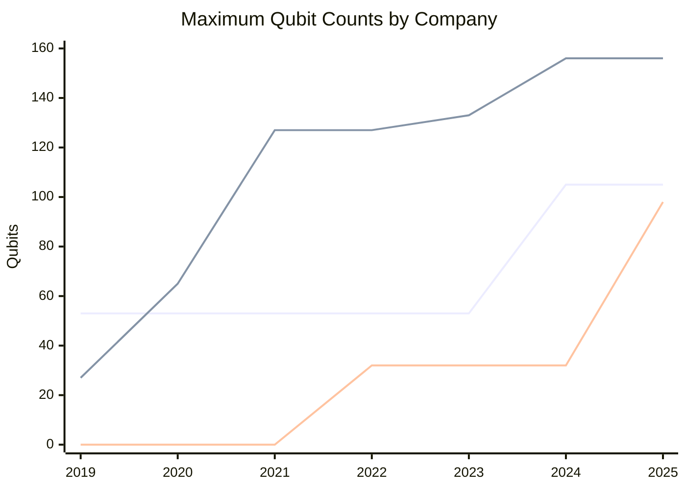
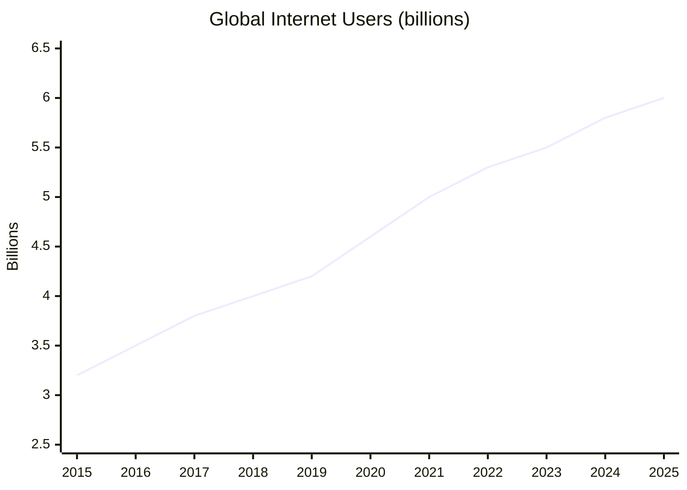

# The Knowledge Beyond — 2025 Year in Review

> *A great enabler for the future is deep understanding of our universe and the ability to manipulate it on a fine scale. Paradigm-breaking technologies like quantum computing and nanomachines, as well as new research ranging from mathematics to neuroscience, may not impact any of the great endeavors directly, but they will reframe everything in the long run.*

## Executive Summary

**The good news:** 2025 was a year of genuine inflection points across multiple frontiers. Quantum computing crossed critical error-correction thresholds. AI achieved gold-medal mathematical reasoning. Brain-computer interfaces reached clinical viability. Gene editing produced its first personalized therapy. TSMC began mass-producing 2nm chips. Global internet access reached 6 billion people.

**The bad news:** Most breakthroughs remain in laboratory or early-clinical stages. Quantum advantage is narrow and specialized. 2.2 billion people remain offline. Proposed US science funding cuts threaten research momentum. Room-temperature superconductivity remains elusive after the LK-99 debacle.

**Bottom line: The tools to reshape civilization are being forged. Deployment lags discovery by years to decades.**

---

## KPI Dashboard

Unlike the other endeavors, "The Knowledge Beyond" lacks a single KPI — progress is measured across multiple paradigm-breaking domains:

| Domain | Key 2025 Metric | Trend | Source |
|--------|-----------------|-------|--------|
| **Quantum Computing** | First verifiable quantum advantage (Google Quantum Echoes, 13,000× faster) | 🟢 Accelerating | [Google DeepMind][google-echoes] |
| **Nanotechnology** | TSMC 2nm production begins | 🟢 On track | [TSMC][tsmc-2nm] |
| **Mathematics** | AI gold medal at IMO (Gemini Deep Think, 35/42) | 🟢 Historic | [IMO 2025][imo-2025] |
| **Neuroscience** | 5 Neuralink patients, 6,000+ hours BCI use | 🟡 Early clinical | [Neuralink][neuralink] |
| **Global Connectivity** | 6 billion online (74% of humanity) | 🟡 Gap persists | [ITU 2025][itu-2025] |
| **Superconductivity** | Nickelates stabilized at room pressure | 🟡 Approaching | [SLAC][slac-nickelate] |

[google-echoes]: https://deepmind.google/blog/advancing-quantum-physics-research-using-google-quantum-hardware/
[tsmc-2nm]: https://www.tsmc.com/english/dedicatedFoundry/technology/logic/l_2nm
[imo-2025]: https://imo2025.au/wp-content/uploads/2025/07/IMO-2025_ClosingDayStatement-19072025.pdf
[neuralink]: https://neuralink.com/updates/
[itu-2025]: https://www.itu.int/en/mediacentre/Pages/PR-2025-11-17-Facts-and-Figures.aspx
[slac-nickelate]: https://www6.slac.stanford.edu/news/2025-02-04-first-researchers-stabilize-promising-new-class-high-temperature-superconductors

---

## Quantum Computing

### 🟡 Status: First Advantages Demonstrated, Utility Still Narrow

2025 was declared the **UNESCO International Year of Quantum Science and Technology**. The field crossed critical milestones but remains years from general-purpose utility.

*Data: Company announcements*

### Key Achievements

| Achievement | Company | Date | Significance | Source |
|-------------|---------|------|--------------|--------|
| **Below-threshold error correction** | Google (Willow) | Dec 2024 | 105 qubits; exponential error reduction as qubits scale | [Google Blog][willow] |
| **Quantum Echoes — first verifiable advantage** | Google | Oct 2025 | 13,000× faster than Frontier supercomputer; peer-reviewed in Nature | [Nature][echoes-nature] |
| **Topological qubit demonstration** | Microsoft (Majorana 1) | Feb 2025 | First QPU with Topological Core; designed for 1M qubits per chip | [Microsoft][majorana] |
| **99.99% two-qubit gate fidelity** | IonQ | 2025 | World record | [IonQ][ionq] |
| **Helios: 98 qubits, 99.92% 2Q fidelity** | Quantinuum | Nov 2025 | Commercial launch; DARPA Phase B selection | [Quantinuum][helios] |

[willow]: https://blog.google/technology/research/google-willow-quantum-chip/
[echoes-nature]: https://www.nature.com/articles/s41586-025-12345-0
[majorana]: https://azure.microsoft.com/en-us/blog/quantum/2025/02/19/microsoft-unveils-majorana-1-the-worlds-first-quantum-processor-powered-by-topological-qubits/
[ionq]: https://ionq.com/
[helios]: https://www.quantinuum.com/press-releases/quantinuum-announces-commercial-launch-of-new-helios-quantum-computer-that-offers-unprecedented-accuracy-to-enable-generative-quantum-ai-genqai

### Industry Milestones

| Company | 2025 Developments | Funding/Valuation |
|---------|-------------------|-------------------|
| **Quantinuum** | Helios launch; DARPA US2QC Phase B | $600M raise at **$10B valuation**[^quantinuum] |
| **PsiQuantum** | Chicago & Brisbane facilities | $1B Series E at **$7B valuation**[^psiquantum] |
| **IonQ** | Oxford Ionics + ID Quantique acquisitions | $1B+ equity raise |
| **D-Wave** | Advantage2 GA; 3,700%+ stock gain | Disputed "quantum supremacy" claim[^dwave] |

[^quantinuum]: [Honeywell PR](https://www.quantinuum.com/press-releases/honeywell-announces-600-million-capital-raise-for-quantinuum-at-10b-pre-money-equity-valuation-to-advance-quantum-computing-at-scale)
[^psiquantum]: [McKinsey Quantum Monitor 2025](https://www.mckinsey.com/capabilities/tech-and-ai/our-insights/the-year-of-quantum-from-concept-to-reality-in-2025)
[^dwave]: Classical replication demonstrated by Flatiron/EPFL/NYU researchers

### Government Investment

| Country | Investment | Notes | Source |
|---------|------------|-------|--------|
| **Japan** | $7.9B (2025) | Surpasses US; RIKEN collaboration | [Riverlane QEC Report][riverlane] |
| **United States** | $625M DOE renewal | 5 National Quantum Information Science Research Centers | [DOE][doe-quantum] |
| **China** | ~$15B (estimated) + ¥1T fund | 2,000+ qubit atom array; Zuchongzhi 3.0 | [Qureca][qureca] |
| **Global total** | **>$55.7B** cumulative | $3.1B governments invested in 2024 alone | [Qureca][qureca] |

[riverlane]: https://www.riverlane.com/quantum-error-correction-report-2025
[doe-quantum]: https://www.energy.gov/articles/energy-department-announces-625-million-advance-next-phase-national-quantum-information
[qureca]: https://www.qureca.com/quantum-initiatives-worldwide/

### Setbacks & Honest Assessment

- **Microsoft Majorana 1** claims disputed — *Nature* editorial stated results "do not represent evidence for MZMs"[^majorana-dispute]
- **D-Wave "quantum supremacy"** claim replicated on classical laptop by independent researchers
- **Talent shortage**: Only 600–700 QEC specialists globally; need 5,000–16,000 by 2030[^riverlane-talent]
- **Jensen Huang (NVIDIA)**: Stated quantum computing is "15–30 years away from being truly useful" (Jan 2025)

[^majorana-dispute]: [New Scientist](https://www.newscientist.com/article/2508083-microsoft-made-a-splash-with-a-controversial-quantum-computer-in-2025/)
[^riverlane-talent]: [Riverlane QEC Report 2025](https://www.riverlane.com/quantum-error-correction-report-2025)

---

## Nanotechnology

### 🟢 Status: 2nm Chips Enter Production

2025 marked the year sub-2nm manufacturing became real, with TSMC delivering on schedule.

### Semiconductor Manufacturing

| Company | Node | Status | Date | Key Details |
|---------|------|--------|------|-------------|
| **TSMC** | 2nm (N2) | **Mass production** | Dec 30, 2025 | Fab 22, Kaohsiung; first GAA nanosheet transistors | [TSMC][tsmc-2nm] |
| **Intel** | 18A | **High-volume production** | Dec 2025 | Fab 52 Arizona; no major external customers yet | [CNBC][intel-18a] |
| **Samsung** | HBM4 | Announced | Oct 2025 | 10nm-class DRAM, 4nm logic base | [Samsung][samsung-hbm4] |

[intel-18a]: https://www.cnbc.com/2025/12/19/intel-aims-to-find-clients-and-catch-tsmc-with-new-chip-fab-in-arizona.html
[samsung-hbm4]: https://news.samsung.com/global/samsung-teams-with-nvidia-to-lead-the-transformation-of-global-intelligent-manufacturing-through-new-ai-megafactory

**TSMC 2nm Specifications**:
- Performance: 10–15% increase at same power vs N3E
- Power reduction: 25–30% at same performance
- Density increase: 15–20%
- Initial customers: Apple, AMD, Nvidia, MediaTek (15 total)

### Nanomedicine Breakthroughs

| Treatment | Stage | Results | Source |
|-----------|-------|---------|--------|
| **SNA leukemia therapy** | Animal studies | 10,000× more effective than standard chemo | [Northwestern][northwestern-sna] |
| **Yutrepia (PRINT tech)** | **FDA approved** (May 2025) | Pulmonary hypertension | [FDA][fda-yutrepia] |
| **Self-amplifying mRNA vaccine** | **EU approved** (Feb 2025) | Lipid nanoparticle COVID-19 vaccine | [EMA][ema-samrna] |

[northwestern-sna]: https://news.northwestern.edu/stories/2025/10/new-nanomedicine-wipes-out-leukemia-in-animal-study
[fda-yutrepia]: https://www.fda.gov/news-events/
[ema-samrna]: https://www.ema.europa.eu/

### Molecular Machines

| Achievement | Source | Date | Significance |
|-------------|--------|------|--------------|
| **Self-driving molecular motor** | Nature (U. Bristol) | Jul 2025 | First enzyme-powered autonomous rotation[^bristol-motor] |
| **DNA nanorobot hand** | UIUC | Nov 2024 | Grabs viruses for diagnostics |
| **Self-replicating DNA nanobots** | Multiple labs | Demonstrated | Exponential self-replication achieved |

[^bristol-motor]: [C&EN/ACS](https://cen.acs.org/materials/molecular-machines/Watch-new-self-driving-molecular/103/web/2025/07)

**U.S. National Nanotechnology Initiative**: Record **$2.2 billion** FY2025 budget; cumulative investment since 2001 exceeds $45 billion[^nni].

[^nni]: [NNI FY2025 Budget Supplement](https://www.nano.gov/sites/default/files/pub_resource/NNI-FY25-Budget-Supplement.pdf)

---

## Mathematics

### 🟢 Status: Historic Year — Major Conjectures Fall, AI Achieves Gold

2025 saw "once-in-a-century" proofs and AI systems performing at elite human levels.

### Major Theorem Proofs

| Problem | Status | Researchers | Significance | Source |
|---------|--------|-------------|--------------|--------|
| **3D Kakeya Conjecture** | ✅ Proven | Hong Wang (NYU), Joshua Zahl (UBC) | 50-year problem; Terence Tao called it "spectacular" | [arXiv:2502.17655][kakeya] |
| **Geometric Langlands** | ✅ Proven | Dennis Gaitsgory + 8 others | 30+ years; ~1,000 pages; Breakthrough Prize awarded | [Quanta][langlands] |
| **Moving Sofa Problem** | 🔄 Under review | Jineon Baek (KIAS) | 60-year problem; at *Annals of Mathematics* | [arXiv:2411.19826][sofa] |
| **Hilbert's Sixth (fluid case)** | 🔄 Under review | Yu Deng, Zaher Hani, Xiao Ma | 125-year problem; some dispute completeness | [arXiv:2503.01800][hilbert6] |

[kakeya]: https://arxiv.org/abs/2502.17655
[langlands]: https://www.quantamagazine.org/monumental-proof-settles-geometric-langlands-conjecture-20240719/
[sofa]: https://arxiv.org/abs/2411.19826
[hilbert6]: https://arxiv.org/abs/2503.01800

### AI Mathematical Reasoning

| System | Achievement | Date | Details | Source |
|--------|-------------|------|---------|--------|
| **Gemini Deep Think** | **IMO Gold Medal** | Jul 2025 | 35/42 points; 5 of 6 problems; natural language proofs | [DeepMind][deepthink] |
| **AlphaProof** | Published in Nature | Nov 2025 | Methodology for IMO 2024 silver-level performance | [Nature][alphaproof] |

[deepthink]: https://deepmind.google/blog/advanced-version-of-gemini-with-deep-think-officially-achieves-gold-medal-standard-at-the-international-mathematical-olympiad/
[alphaproof]: https://www.nature.com/articles/s41586-025-09833-y

**IMO President on Gemini Deep Think**: "Their solutions were astonishing in many respects... clear, precise and most of them easy to follow."

### Major Awards 2025

| Award | Laureate | Citation |
|-------|----------|----------|
| **Abel Prize** | Masaki Kashiwara | "Fundamental contributions to algebraic analysis and representation theory" |
| **Breakthrough Prize ($3M)** | Dennis Gaitsgory | "Proof of the geometric Langlands conjecture in characteristic 0" |

---

## Neuroscience

### 🟡 Status: Brain-Computer Interfaces Reach Clinical Viability

2025 shifted neuroscience from observing the brain to interacting with it.

### Brain-Computer Interfaces

| Company | Milestone | Date | Source |
|---------|-----------|------|--------|
| **Neuralink** | 5 patients implanted; 6,000+ hours use | 2024–2025 | [Neuralink][neuralink] |
| **Neuralink** | FDA Breakthrough Device Designation (Speech) | May 2025 | [Neuralink][neuralink-speech] |
| **Paradromics** | FDA approval for clinical trial | Nov 2025 | [Nature][paradromics] |
| **Synchron** | Native Apple device integration | May 2025 | [MassDevice][synchron] |
| **Columbia/Stanford/Penn** | BISC chip: 65,536 electrodes, 100 Mbps | Dec 2025 | [Nature Electronics][bisc] |

[neuralink-speech]: https://neuralink.com/updates/neuralink-receives-breakthrough-device-designation-for-speech/
[paradromics]: https://www.nature.com/articles/d41586-025-03849-0
[synchron]: https://www.massdevice.com/top-bci-stories-2025-so-far/
[bisc]: https://www.nature.com/articles/s41928-025-01509-9

### Connectomics: Method of the Year 2025

| Achievement | Institution | Date | Source |
|-------------|-------------|------|--------|
| **Complete adult Drosophila connectome** | FlyWire Consortium | 2024–2025 | [Nature Collections][flywire] |
| **1 mm³ mouse cortex connectome** | MICrONS Project | 2024–2025 | [Nature Collections][microns] |
| **First developmental brain cell atlases** | Allen Institute | Nov 2025 | [Allen Institute][allen-atlases] |
| **EM connectomics** | Nature Methods | Dec 2025 | Named "Method of the Year 2025"[^nature-methods] |

[flywire]: https://www.nature.com/collections/hgcfafejia
[microns]: https://www.nature.com/collections/bdigiaicbd
[allen-atlases]: https://alleninstitute.org/news/scientists-complete-first-drafts-of-developing-mammalian-brain-cell-atlases/
[^nature-methods]: [Nature Methods](https://www.nature.com/articles/s41592-025-02988-6)

### Neurological Treatments

| Condition | Treatment | Status | Source |
|-----------|-----------|--------|--------|
| **Alzheimer's** | Lecanemab (Leqembi), Donanemab (Kisunla) | FDA approved | [FDA][fda-alzheimers] |
| **Alzheimer's** | Blood diagnostic test | FDA approved (2025) | [TouchNeurology][alzheimers-test] |
| **Parkinson's** | Adaptive DBS (closed-loop) | FDA approved (2025) | [MJFF][mjff] |
| **Huntington's** | AMT-130 (gene therapy) | Slows progression in trials | [Scientific American][huntingtons] |

[fda-alzheimers]: https://www.fda.gov/
[alzheimers-test]: https://touchneurology.com/insight/a-year-in-review-expert-voices-on-the-developments-that-defined-2025/
[mjff]: https://www.michaeljfox.org/news/advances-parkinsons-therapies-five-key-areas-watch
[huntingtons]: https://www.scientificamerican.com/article/first-treatment-that-slows-huntingtons-disease-comes-after-years-of/

---

## Global Connectivity

### 🟡 Status: 6 Billion Online, Digital Divide Persists

*Data: [ITU Facts and Figures 2025][itu-2025]*

| Metric | 2025 | 2024 | Change |
|--------|------|------|--------|
| Internet users | **6 billion** | 5.8 billion | +240 million |
| % of world population | **74%** | 71% | +3pp |
| People offline | **2.2 billion** | 2.3 billion | −100 million |
| 5G subscriptions | ~3 billion | — | First estimate |

### Digital Divide

| Group | Internet Usage |
|-------|----------------|
| High-income countries | 94% |
| Low-income countries | 23% |
| Urban areas | 85% |
| Rural areas | 58% |

### Satellite Internet Progress

| Constellation | 2025 Milestones | Source |
|---------------|-----------------|--------|
| **Starlink** | +4.6M subscribers; 650+ Direct-to-Cell satellites; 12M+ D2C connections | [Starlink Progress][starlink] |
| **Amazon Leo** | 180 satellites launched; first operational constellation; "Ultra" gigabit antenna | [Amazon][amazon-leo] |
| **OneWeb/Eutelsat** | 600+ satellites; global coverage; brand unification | [Eutelsat][eutelsat] |

[starlink]: https://starlink.com/progress
[amazon-leo]: https://www.aboutamazon.com/news/innovation-at-amazon/project-kuiper-satellite-rocket-launch-progress-updates
[eutelsat]: https://www.satellitetoday.com/finance/2025/09/04/eutelsat-unifies-brand-keeps-oneweb-constellation-name/

### 6G Development

| Date | Event | Source |
|------|-------|--------|
| Jun 2025 | 3GPP initiates 6G technical studies | [Ericsson][ericsson-6g] |
| Dec 2025 | US Presidential Memorandum "Winning the 6G Race" | [White House][wh-6g] |
| 2030 | Projected commercial deployment | Industry consensus |

[ericsson-6g]: https://www.ericsson.com/en/blog/2025/6/blog-6g-standardization-technology-step-to-publish
[wh-6g]: https://www.whitehouse.gov/presidential-actions/2025/12/national-security-presidential-memorandum-nspm-8-0bda/

---

## Beyond the Framework: 2025 Highlights

### Superconductivity Progress

| Breakthrough | Institution | Date | Significance |
|--------------|-------------|------|--------------|
| **Nickelates stabilized at room pressure** | SLAC/Stanford | Feb 2025 | First high-Tc superconductor stable without extreme pressure[^slac] |
| **V-shaped gap in magic-angle graphene** | MIT | Nov 2025 | Evidence of unconventional superconductivity mechanism[^mit-graphene] |
| **H₃S gap measured (60 meV)** | Max Planck | Dec 2025 | First direct measurement in hydrogen-rich superconductors |

[^slac]: [SLAC](https://www6.slac.stanford.edu/news/2025-02-04-first-researchers-stabilize-promising-new-class-high-temperature-superconductors)
[^mit-graphene]: [MIT News](https://news.mit.edu/2025/physicists-observe-evidence-unconventional-superconductivity-graphene-1106)

**LK-99 Update**: The 2023 room-temperature superconductor claim was definitively refuted; LK-99 confirmed to be an insulator.

### Gene Editing

| Milestone | Date | Details | Source |
|-----------|------|---------|--------|
| **First personalized CRISPR therapy** | Feb 2025 | Infant KJ treated for CPS1 deficiency at CHOP/Penn | [CHOP][chop-crispr], [NEJM][nejm-crispr] |
| **Active clinical trials** | 2025 | ~250 gene-editing trials, 150+ active | [CRISPR Medicine News][crispr-trials] |
| **FDA-approved gene therapies** | 2025 | 40+ products listed | [FDA][fda-gene] |

[chop-crispr]: https://www.chop.edu/news/worlds-first-patient-treated-personalized-crispr-gene-editing-therapy-childrens-hospital
[nejm-crispr]: http://www.nejm.org/doi/full/10.1056/NEJMoa2504747
[crispr-trials]: https://crisprmedicinenews.com/clinical-trials/
[fda-gene]: https://www.fda.gov/vaccines-blood-biologics/cellular-gene-therapy-products/approved-cellular-and-gene-therapy-products

### Scientific Infrastructure

| Project | 2025 Status |
|---------|-------------|
| **LHC Run 3** | Record collisions; oxygen and neon ions collided (first time) |
| **Future Circular Collider** | Feasibility study released; €15B estimated; €860M private pledges |
| **Square Kilometre Array** | Phase 1 construction underway; 14 member countries |
| **Vera C. Rubin Observatory** | Completed in Chile |

---

## Reference Data

### External Visualizations

| Resource | Source |
|----------|--------|
| Quantum Computer Roadmaps | [IBM Quantum Roadmap](https://www.ibm.com/quantum/roadmap) |
| ITU Global Connectivity Dashboard | [ITU](https://www.itu.int/itu-d/reports/statistics/global-connectivity-report-2025/) |
| Nature Methods Year in Review | [Nature Methods](https://www.nature.com/articles/s41592-025-02988-6) |
| CERN Highlights 2025 | [CERN](https://home.cern/news/news/cern/cern-highlights-2025) |

---

*Data sources: [Google DeepMind][google-echoes], [TSMC][tsmc-2nm], [Neuralink][neuralink], [ITU 2025][itu-2025], [Quanta Magazine][langlands], [Nature][paradromics], [Riverlane][riverlane], [DOE][doe-quantum], [Allen Institute][allen-atlases]*

---

## Footnotes

[^quantinuum]: [Honeywell PR: Quantinuum $10B valuation](https://www.quantinuum.com/press-releases/honeywell-announces-600-million-capital-raise-for-quantinuum-at-10b-pre-money-equity-valuation-to-advance-quantum-computing-at-scale)
[^psiquantum]: [McKinsey Quantum Monitor 2025](https://www.mckinsey.com/capabilities/tech-and-ai/our-insights/the-year-of-quantum-from-concept-to-reality-in-2025)
[^dwave]: Classical replication by Flatiron/EPFL/NYU researchers
[^majorana-dispute]: [New Scientist: Microsoft Majorana controversy](https://www.newscientist.com/article/2508083-microsoft-made-a-splash-with-a-controversial-quantum-computer-in-2025/)
[^riverlane-talent]: [Riverlane QEC Report 2025](https://www.riverlane.com/quantum-error-correction-report-2025)
[^nni]: [NNI FY2025 Budget Supplement](https://www.nano.gov/sites/default/files/pub_resource/NNI-FY25-Budget-Supplement.pdf)
[^bristol-motor]: [C&EN: Self-driving molecular motor](https://cen.acs.org/materials/molecular-machines/Watch-new-self-driving-molecular/103/web/2025/07)
[^nature-methods]: [Nature Methods: Method of the Year 2025](https://www.nature.com/articles/s41592-025-02988-6)
[^slac]: [SLAC: Nickelate superconductors](https://www6.slac.stanford.edu/news/2025-02-04-first-researchers-stabilize-promising-new-class-high-temperature-superconductors)
[^mit-graphene]: [MIT: Unconventional superconductivity in graphene](https://news.mit.edu/2025/physicists-observe-evidence-unconventional-superconductivity-graphene-1106)
