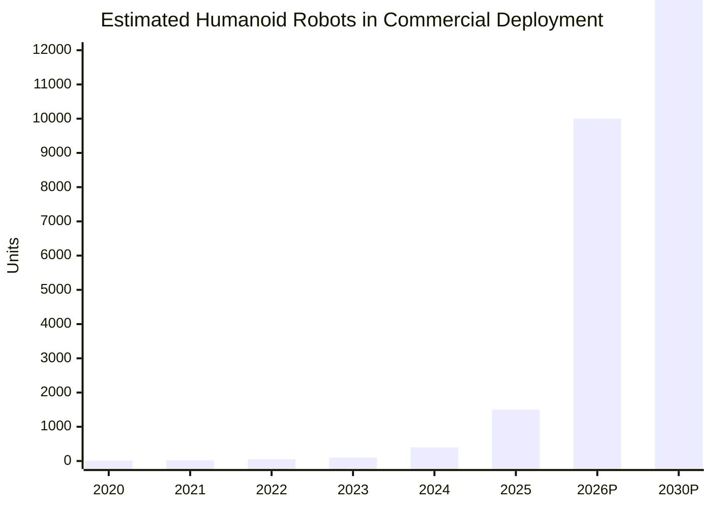
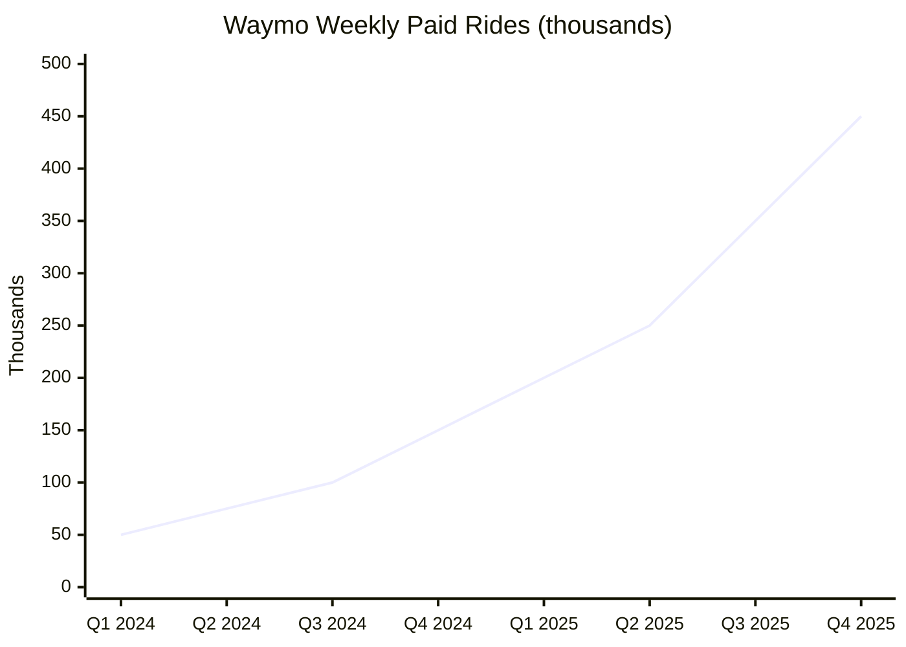

# Robots (Hardware) — 2025 Year in Review

> *Humans have been looking to automate their lives in one way or another for most of their existence. From early domesticated animals to microwave ovens and freighter ships, automation adds a huge multiplier on human labor. The current frontier is automating physical work through robots — and 2025 was the year humanoids went from lab demos to factory floors.*

## Executive Summary

**The good news:** 2025 marked the transition from "humanoid hype" to "humanoid deployment." Figure 02 completed an 11-month production run at BMW, accumulating 1,250+ hours and contributing to 30,000+ vehicles[^figure-bmw]. Agility Digit moved 100,000+ totes at GXO warehouses[^digit-100k]. VC investment rose 81% year-over-year to $1.71B[^tracxn]. Unitree proved sub-$15k humanoids are viable with the G1[^unitree-g1], while Waymo crossed 450,000 weekly robotaxi rides and Baidu achieved per-vehicle profitability in Wuhan[^waymo-year][^baidu-weekly].

**The bad news:** Fleet sizes remain tiny — most single-site deployments are 2–10 units, though UBTech contracted 500+ units across Chinese factories[^ubtech]. Tesla abandoned its 5,000 Optimus target for 2025[^tesla-abandon]. No city has robotaxis outnumbering human taxis (SF is closest at ~50% of licensed taxis). The Wozniak Test (robot makes coffee in unseen home) remains unachieved. Battery life is stuck at 2–5 hours typical; experts estimate a decade before 8-hour single-charge operation[^globalspec].

**Bottom line: The commercial humanoid era has begun. We're in Year 1 of deployment — but true "working alongside humans" remains aspirational.**

---

## KPI Dashboard

**KPI: Largest Active Commercial Fleet of General-Purpose Humanoids (Single Site)**

| Metric | Value | Source |
|--------|-------|--------|
| **Current Leader** | Agility Robotics Digit at GXO Logistics, Flowery Branch, GA | [Agility][digit-gxo] |
| **Fleet Size** | Small (2–5 units estimated; exact number undisclosed) | Industry estimates |
| **Verified Output** | **100,000+ totes moved** (as of Nov 2025) | [Agility][digit-100k] |
| **Longest Production Deployment** | Figure 02 @ BMW: 1,250+ hours, 11 months | [Figure AI][figure-bmw-link] |
| **Estimated Global Deployed Units** | ~1,000-2,000 (across all sites) | Industry estimates |

[digit-gxo]: https://www.agilityrobotics.com/content/digit-deployed-at-gxo-in-historic-humanoid-raas-agreement
[digit-100k]: https://www.agilityrobotics.com/content/digit-moves-over-100k-totes
[digit-specs]: https://www.agilityrobotics.com/content/agility-robotics-announces-new-innovations-for-market-leading-humanoid-robot-digit
[figure-bmw-link]: https://www.figure.ai/news/production-at-bmw

**Note:** No company has publicly disclosed exact fleet counts at single sites. The industry uses throughput/runtime metrics rather than unit counts.

### Commercial Humanoid Deployments (2025)

| Company | Robot | Site | Status | Key Metrics | Source |
|---------|-------|------|--------|-------------|--------|
| **Agility Robotics** | Digit | GXO, Flowery Branch, GA | ✅ Deployed | 100K+ totes moved | [Agility][digit-gxo] |
| **Agility Robotics** | Digit | Mercado Libre, San Antonio, TX | 🆕 Announced | Commerce fulfillment | [Agility][mercado-libre] |
| **Figure AI** | Figure 02 | BMW Spartanburg, SC | ⏹️ Completed | 1,250+ hrs, 90K parts, 30K vehicles | [Figure][figure-bmw] |
| **Tesla** | Optimus | Fremont/Texas factories | 🔄 Pilot | Internal testing; production target abandoned | [TechSpot][tesla-halt] |
| **Boston Dynamics** | Electric Atlas | Hyundai, GA | 🔜 Pilot | Manufacturing (Oct 2025 start) | [Korea JoongAng][atlas-hyundai] |
| **Apptronik** | Apollo | Mercedes-Benz Berlin | 🔄 Testing | Intralogistics | [Mercedes-Benz][apollo-mercedes] |
| **UBTech** | Walker S2 | BYD, VW, Audi (China) | ✅ Deployed | 500+ units contracted | [Korea JoongAng][korean-humanoids] |

[mercado-libre]: https://www.agilityrobotics.com/content/mercado-libre-and-agility-robotics-announce-commercial-agreement
[figure-bmw]: https://www.assemblymag.com/articles/99678-humanoid-robots-complete-trial-project-at-bmw-assembly-plant
[tesla-halt]: https://www.techspot.com/news/109781-tesla-temporarily-halts-mass-production-optimus-robots-citing.html
[atlas-hyundai]: https://koreajoongangdaily.joins.com/news/2025-07-03/business/industry/Exclusive-Hyundais-Georgia-plant-to-use-Boston-Dynamics-Atlas-humanoid-robot-from-October/2342998
[apollo-mercedes]: https://media.mbusa.com/releases/release-cf381cd2fcff624ae37d3911631103dc
[korean-humanoids]: https://koreajoongangdaily.joins.com/news/2025-10-13/business/industry/AI-gets-physical-Humanoid-robots-hit-factory-floors-/2408411

### Historical Progression

*Data: Bank of America, BCC Research, company announcements. 2026+ are projections.*

**Assessment: 📈 Exponential growth.** The industry crossed from "pilot" to "commercial deployment" in 2025. Fleet sizes remain small (single digits to low dozens per site in most deployments), but throughput milestones prove economic viability. Bank of America projects mass adoption starting 2028[^boa].

---

## Milestone Status

### 🟡 Robotaxi Saturation — Autonomous robotaxis outnumber human-driven taxis in a major metro

**Status: Approaching, not yet achieved**

*Data: [Waymo 2025 Year in Review][waymo-year], [Forbes][waymo-forbes]*

| Operator | Fleet Size | Weekly Rides | Cities | Source |
|----------|-----------|--------------|--------|--------|
| **Waymo** (US) | ~2,500 | 450,000+ | 6 US cities | [Forbes][waymo-forbes] |
| **Baidu Apollo Go** (China) | 1,000+ (Wuhan) | 250,000+ | 22 cities globally | [Car News China][baidu-weekly] |
| **Pony.ai** (China) | 720+ | Not disclosed | 4 tier-1 cities | [Pony.ai][pony-ai] |
| **Zoox** (US) | ~50 | Not disclosed | SF, Las Vegas | [Reuters][zoox] |
| **Tesla** (US) | ~30–50 (Austin) | Not disclosed | Austin (pilot) | [CNBC][tesla-robotaxi] |
| **Cruise** (US) | **0** | N/A | Shut down Dec 2024 | [Wikipedia][cruise-wiki] |

[waymo-year]: https://waymo.com/blog/2025/12/2025-year-in-review
[waymo-forbes]: https://www.forbes.com/sites/alanohnsman/2025/12/10/waymo-targets-1-million-robotaxi-rides-a-week/
[baidu-weekly]: https://carnewschina.com/2025/11/13/baidus-apollo-go-robotaxi-leads-global-autonomous-driving-with-17m-orders-targets-profit-this-year/
[pony-ai]: https://ir.pony.ai/news-releases/news-release-details/pony-ai-inc-kicks-fully-driverless-commercial-services-gen-7
[zoox]: https://www.reuters.com/business/media-telecom/driverless-future-gains-momentum-with-global-robotaxi-deployments-2025-12-22/
[tesla-robotaxi]: https://www.cnbc.com/2025/11/18/tesla-obtains-permit-to-operate-ride-hail-service-in-arizona.html
[cruise-wiki]: https://en.wikipedia.org/wiki/Cruise_(autonomous_vehicle)

#### Comparison to Human Taxi Fleets

| City | Robotaxi Fleet | Human Taxi Fleet | Robotaxi % |
|------|---------------|------------------|------------|
| **San Francisco** | ~1,000 (Waymo) | ~2,000 licensed taxis | **~50%** — closest to parity |
| **Wuhan** | ~1,000 (Baidu) | ~15,000–20,000 est. | ~5–7% |
| **Los Angeles** | ~700 (Waymo) | ~2,000+ licensed | ~35% |
| **Phoenix** | ~500 (Waymo) | ~3,000–5,000 metro | ~10–15% |

*Note: Uber/Lyft drivers vastly outnumber licensed taxis in US cities; including rideshare, robotaxis remain <5% everywhere.*

#### Key 2025 Events

| Date | Event | Source |
|------|-------|--------|
| **Mar 2025** | Waymo + Uber launch in Austin | [CNBC][waymo-austin] |
| **Apr 2025** | Waymo hits 250,000 weekly / 1M monthly rides | [Forbes][waymo-forbes] |
| **Jul 2025** | Waymo reaches 100 million autonomous miles | [Waymo][waymo-year] |
| **Oct 2025** | Pony.ai gets first city-wide permit (all of Shenzhen) | [CNBC][pony-citywide] |
| **Nov 2025** | Waymo launches freeway operations (SF, LA, Phoenix) | [Waymo][waymo-freeway] |
| **Nov 2025** | Baidu achieves per-vehicle profitability in Wuhan | [Car News China][baidu-weekly] |
| **Dec 2024** | 🔴 Cruise shut down — GM ends robotaxi funding after $12.1B invested | [Guardian][cruise-guardian] |

[waymo-austin]: https://www.cnbc.com/2025/03/04/waymo-uber-begin-offering-robotaxi-rides-in-austin-ahead-of-sxsw.html
[pony-citywide]: https://www.cnbc.com/2025/11/20/global-robotaxi-race-heats-up-between-us-and-chinese-rivals.html
[waymo-freeway]: https://waymo.com/blog/2025/11/taking-riders-further-safely-with-freeways
[cruise-guardian]: https://www.theguardian.com/technology/2024/dec/11/general-motors-self-driving-cruise-robotaxi

#### Setbacks

| Event | Date | Impact | Source |
|-------|------|--------|--------|
| Cruise pedestrian dragging → shutdown | Oct 2023–Dec 2024 | Major competitor eliminated | [Guardian][cruise-incident] |
| Waymo kills cat | Oct 2025 | Sensor detection questions | [Forbes][waymo-forbes] |
| Waymo kills dog | Nov 2025 | Second animal fatality | [Forbes][waymo-forbes] |
| Tesla misses all 2025 robotaxi targets | Dec 2025 | Promised driverless in 8–10 cities; none achieved | [InsideEVs][tesla-missed] |
| Baidu accident in Zhengzhou | Dec 2025 | Two in intensive care | [Car News China][baidu-accident] |
| Waymo recalls vehicles | Dec 2025 | 19+ school bus violations | [Reuters][waymo-recall] |

[cruise-incident]: https://www.theguardian.com/technology/2023/nov/08/cruise-recall-self-driving-cars-gm
[tesla-missed]: https://insideevs.com/news/783157/musk-promises-2025-eoy-robotaxis/
[baidu-accident]: https://carnewschina.com/2025/12/06/baidus-robotaxi-causes-accident-in-a-central-city-of-china-leaves-two-in-intensive-care/
[waymo-recall]: https://www.reuters.com/world/waymo-issue-recall-over-self-driving-vehicles-driving-past-stopped-school-buses-2025-12-05/

**Why approaching, not achieved:** San Francisco is closest (~50% of *licensed* taxis), but Uber/Lyft still dominate. All deployments are geofenced L4 — true L5 (any road, any condition) remains unachieved.

---

### 🔴 The Wozniak Test — Robot makes coffee in a random, unseen home

**Status: Distant**

No robot has passed the Wozniak Test. The closest 2025 achievement: Physical Intelligence's π₀.5 model performed cleaning tasks in **homes never seen during training**[^pi05]. Figure's Helix VLA can grasp "virtually any" novel household object[^helix]. But no robot has publicly demonstrated making coffee in a random, previously unseen home.

| Date | Development | Company | Source |
|------|-------------|---------|--------|
| **Mar 2025** | Gemini Robotics VLA with 2x+ generalization improvement | Google DeepMind | [DeepMind][gemini-robotics] |
| **Apr 2025** | π₀.5 generalizes to unseen homes (cleaning tasks) | Physical Intelligence | [PI Blog][pi05] |
| **Oct 2025** | Figure 03 + Helix VLA picks up novel objects via language | Figure AI | [Figure][helix] |
| **Oct 2025** | NEO pre-orders open ($20K / $499 mo subscription) | 1X Technologies | [1X][neo-home] |
| **2024** | Mobile ALOHA cooking demos | Stanford | Requires ~50 demos *in target environment*[^mobile-aloha] |

[pi05]: https://www.physicalintelligence.company/blog/pi05
[helix]: https://www.figure.ai/news/helix
[neo-home]: https://www.1x.tech/discover/neo-home-robot
[gemini-robotics]: https://deepmind.google/blog/gemini-robotics-brings-ai-into-the-physical-world/

#### Gap Analysis

| Requirement | Current State | Gap |
|-------------|---------------|-----|
| Enter unfamiliar home | π₀.5 demonstrated in unseen homes | ✅ Achieved |
| Navigate to kitchen | Mobile manipulators can navigate | ⚠️ Limited real-world validation |
| Find coffee machine/supplies | Zero-shot grasping demonstrated | ⚠️ Cluttered cabinets challenging |
| Operate machine buttons | Demos exist | ⚠️ Multi-step tasks cause freezing |
| Handle liquids | Pouring demos fail with real liquids | ❌ Unreliable |
| Full autonomy | Best models: 20–50% success zero-shot | ❌ Reliability gap is core blocker |

**Remaining challenges:** Generalization to truly novel kitchens, dexterous manipulation of unfamiliar coffee machines, navigation in cluttered unknown spaces, and safety around humans/pets. Agility Robotics explicitly states: "Until you can prove the robot is not going to fall on a baby, it's not going into the home"[^agility-home].

**Realistic timeline:** Given 2025 progress, reliable home deployment with error recovery is 2–4 years away for constrained tasks. Full Wozniak Test may require until **2027–2030** for near-100% reliability.

---

### 🟡 The Fukushima Test — Robot autonomously performs disaster zone repair

**Status: Approaching**

The key word is **"autonomously."** Current disaster-zone robots remain primarily **teleoperated** for critical manipulation tasks. TEPCO retrieved only ~0.9g of fuel debris total in 2024–2025 — a "drop in the ocean" of the 880 tonnes remaining[^tepco-debris].

| Capability | Status |
|------------|--------|
| Navigate disaster zone autonomously | ✅ Demonstrated (SubT Challenge, Spot, Ghost Robotics) |
| Survive extreme radiation | ✅ Spot: 413 rem (82 years of worker dose) |
| Turn valves/manipulate switches | ✅ Demonstrated (Spot Arm, DRC robots) |
| **Autonomous decision to perform repair** | ❌ Not demonstrated |

#### Key 2024-2025 Events

| Date | Event | Source |
|------|-------|--------|
| **Nov 2024** | First fuel debris sample (~0.19g) retrieved via telescopic device | [Nippon.com][fukushima-sample] |
| **Apr 2025** | Second debris retrieval (~0.69g) | [METI Report][meti-fukushima] |
| **Jun 2025** | UK NDA launches £9.5M Auto-SAS project for autonomous nuclear waste sorting | [GOV.UK][uk-nuclear] |
| **Aug 2025** | Boston Dynamics + TRI demonstrate Atlas with Large Behavior Models | [Toyota][trifbd] |
| **Oct 2025** | DARPA Triage Challenge Event 2 — robots navigate crash scenarios | [DARPA][darpa-triage] |
| **2025** | ANYmal deployed at Northern Lights CCS for CO₂ monitoring | [ANYbotics][anymal-ccs] |
| **Ongoing** | Boston Dynamics Spot deployed at Fukushima, Chernobyl, Sellafield for inspections | [Boston Dynamics][spot-fukushima] |

[fukushima-sample]: https://www.nippon.com/en/japan-topics/g02501/
[meti-fukushima]: https://www.meti.go.jp/press/2025/09/20250929003/20250929003-3.pdf
[uk-nuclear]: https://www.gov.uk/government/news/nda-launches-pioneering-robotics-partnership-to-manage-nuclear-waste
[trifbd]: https://pressroom.toyota.com/ai-powered-robot-by-boston-dynamics-and-toyota-research-institute-takes-a-key-step-towards-general-purpose-humanoids/
[darpa-triage]: https://www.darpa.mil/news/2025/dart-msai-triumph-darpa-triage-challenge
[anymal-ccs]: https://www.anybotics.com/news/equinor-deploys-anymal-at-northern-lights-ccs-facility/
[spot-fukushima]: https://bostondynamics.com/case-studies/spot-in-fukushima-daiichi/

**Key gap:** Full autonomy for valve/switch manipulation in disaster conditions remains 5–10 years away. With electric Atlas's manipulation capabilities and advancing AI for robotics, this milestone is approaching within 3-5 years.

---

### 🟡 The Blue Collar Shift — Robot completes 8-hour shift alongside humans

**Status: Approaching**

No humanoid robot has completed a verified, continuous 8-hour **fully autonomous** shift. However:

| Achievement | Robot | Details | Source |
|-------------|-------|---------|--------|
| **10-hour shifts, M-F for 11 months** | Figure 02 @ BMW | 1,250+ hours total; 90K+ parts; required support staff | [Figure AI][figure-bmw] |
| **8-hour livestream on single charge** | Kepler K2 | Trade show demo, not production | [RockingRobots][kepler-k2] |
| **100K+ totes moved** | Agility Digit @ GXO | Commercial production; 4 hrs/battery with autonomous docking | [Agility][digit-100k] |

[kepler-k2]: https://www.rockingrobots.com/kepler-debuts-humanoid-robot-with-eight-hour-endurance/

#### What's Missing

1. **Task diversity:** All current deployments perform 1–2 repetitive tasks, not varied collaborative work
2. **Reliability:** Robots require human intervention for resets and error recovery
3. **True collaboration:** Robots work in isolated workcells, not freely among humans
4. **Autonomy:** Tesla Optimus demos are "often remotely controlled by human engineers"[^wsj-optimus]

**Projected timeline:** Industry consensus points to 2027–2030 for broader production deployments; full collaborative work capability remains speculative.

---

## Open Challenges

### 🟡 Dexterous Manipulation — Human-level hands for 10,000+ object types

**Status: Significant progress, substantial gaps remain**

2025 saw major investments in robotic hands, but human-level dexterity across diverse objects — especially deformables — remains elusive.

#### Key Developments

| Company | Development | Date | Source |
|---------|-------------|------|--------|
| **GelSight/Meta AI** | Digit 360: 18+ sensing modalities; 1 millinewton force detection | 2025 | [Robot Report][digit-360] |
| **Figure AI** | Custom tactile sensors detecting 3g force; Figure 03 hands | Sep 2025 | [Figure][figure-03] |
| **Shadow Robot** | £11M ARIA grant for systematic hand design (OGRES/UPWARD projects) | 2025 | [Shadow Robot][shadow-aria] |
| **Sanctuary AI** | 20 DoF hands with haptic feedback; Gen 7 Phoenix | 2025 | [Sanctuary][sanctuary-gen7] |
| **NVIDIA/UT Austin** | DexMimicGen: 20,000+ bimanual demos from 60 human demos | ICRA 2025 | [DexMimicGen][dexmimicgen] |
| **MIT** | Vine-inspired gripper for heavy/fragile objects | Dec 2025 | [MIT News][mit-vine] |

[digit-360]: https://www.therobotreport.com/gelsight-meta-ai-release-digit-360-tactile-sensor-for-robotic-fingers/
[figure-03]: https://www.figure.ai/news/introducing-figure-03
[shadow-aria]: https://shadowrobot.com/blog/aria-announces-funded-projects-with-shadow-robot-company/
[sanctuary-gen7]: https://www.sanctuary.ai/blog/a-transformational-few-months-for-sanctuary-ai
[dexmimicgen]: https://dexmimicgen.github.io/
[mit-vine]: https://news.mit.edu/2025/vine-inspired-robotic-gripper-gently-lifts-heavy-and-fragile-objects-1210

#### Gap to Human-Level

| Capability | Human Benchmark | Current Best | Gap |
|------------|-----------------|--------------|-----|
| Degrees of freedom (hand) | 27 | 20 (Sanctuary Phoenix) | 26% |
| Touch receptors | 17,000 | ~50 | **99.7%** |
| Object types handled reliably | Unlimited | ~1,000 trained | 90%+ |
| Deformable object success | Natural | <50% on cloth folding | 50%+ |

**Deformables remain hard:** No unified framework exists for cloth, cables, and food manipulation. ICRA 2025 held its 5th workshop on this persistent challenge[^icra-deformable].

---

### 🟢 Generalization — Few-shot skill acquisition across environments

**Status: Strong progress — foundation models breakthrough year**

2025 marked the rise of Vision-Language-Action (VLA) models as the dominant paradigm for robot generalization.

#### Foundation Models (2025)

| Model | Developer | Key Capability | Source |
|-------|-----------|----------------|--------|
| **π₀.5** | Physical Intelligence | Generalizes to unseen homes; 88-100% on trained tasks | [PI Blog][pi05] |
| **Helix** | Figure AI | Full upper-body VLA (35 DoF @ 200Hz) | [Figure][helix] |
| **GR00T N1** | NVIDIA | First open humanoid foundation model | [NVIDIA][groot-n1] |
| **Gemini Robotics** | Google DeepMind | Multi-embodiment VLA + reasoning | [DeepMind][gemini-robotics] |
| **OpenVLA-OFT** | Berkeley/Stanford | 25–50× faster inference; +16.5% over RT-2-X | [OpenVLA][openvla] |
| **RT-2-X** | Google DeepMind | Chain-of-thought reasoning, emergent skills; 3× over RT-1 | [DeepMind][rt2x] |

[groot-n1]: https://nvidianews.nvidia.com/news/nvidia-isaac-gr00t-n1-open-humanoid-robot-foundation-model-simulation-frameworks
[openvla]: https://github.com/openvla/openvla
[rt2x]: https://robotics-transformer2.github.io/

#### Remaining Gaps

| Challenge | Evidence | Source |
|-----------|----------|--------|
| **Generalization fragile** | REALM benchmark: π₀, GR00T N1.5 struggle with perturbations | [arXiv][realm] |
| **Failure recovery absent** | VLAs can't reason about failures; external supervision needed | [FailSafe][failsafe] |
| **Long-horizon unreliable** | Multi-step tasks fragile; compounding errors | [10 Challenges][ten-challenges] |
| **Sim-to-real gap** | SIMPLER evaluation uncorrelated with real performance for some policies | [AutoEval][autoeval] |

[realm]: https://arxiv.org/abs/2512.19562
[failsafe]: https://arxiv.org/html/2510.01642v1
[ten-challenges]: https://arxiv.org/html/2511.05936v1
[autoeval]: https://www2.eecs.berkeley.edu/Pubs/TechRpts/2025/EECS-2025-42.pdf

**Failure recovery improving:** FailSafe system achieves +22.6% improvement on π₀, OpenVLA through automatic failure detection[^failsafe-paper]. STAR framework reaches 78% recovery rate[^star].

---

### 🔴 Power/Efficiency/Cost — 8-hour runtime at viable price

**Status: Major gap remains — 2–4× improvement needed**

#### Current Robot Specifications

| Robot | Runtime | Payload | Est. Cost | Source |
|-------|---------|---------|-----------|--------|
| **Optimus Gen 3** | 8–12 hrs (light tasks, target) | 20 kg | $20,000–30,000 (target) | [Tesla][tesla-optimus] |
| **Digit** | **4 hours** (auto docking/charging) | 16 kg | ~$250,000 | [Agility][digit-specs] |
| **Figure 02** | 5–6 hrs | 20 kg | Est. $50-150k | [Figure][figure-02-specs] |
| **Apollo** | 4–5 hrs (up to 22 hrs spec) | 25 kg | <$50,000 (target) | [Apptronik][apollo-specs] |
| **Unitree G1** | 2–3 hrs | Limited | **$13,500** | [Unitree][unitree-g1] |
| **Unitree R1** | ~1 hr | Limited | **$5,900** | [Unitree][unitree-r1] |
| **Electric Atlas** | Not disclosed | 25+ kg | ~$140,000–150,000 | [Korea JoongAng][atlas-hyundai] |
| **Kepler K2** | 8 hrs (demo) | — | ~$34,600 | [Kepler][kepler-k2] |

[tesla-optimus]: https://www.teslaacessories.com/blogs/news/tesla-optimus-production-revolution
[figure-02-specs]: https://www.eesel.ai/blog/figure-ai-pricing
[apollo-specs]: https://apptronik.com/our-work
[unitree-g1]: https://www.unitree.com/g1
[unitree-r1]: https://www.iotworldtoday.com/robotics/humanoid-robot-priced-under-6k-unveiled

#### Gap Analysis

| Challenge | Current State | Required | Gap |
|-----------|--------------|----------|-----|
| **Runtime** | 2–6 hours typical | 8+ hours | **2–4× improvement** |
| **Battery density** | ~200 Wh/kg | ~400–500 Wh/kg | Solid-state 3–5 years away |
| **Actuator cost** | 30–50% of BOM | <15% for viability | 10× reduction needed |
| **Unit cost** | $50,000–250,000 | $20,000–30,000 | 2–10× reduction |

#### Technology Advances

- **Alva Industries:** Samsung invested in FiberPrinting™ ultra-compact motor technology (Dec 2025)[^alva]
- **E-magy:** Silicon-anode batteries (40% higher density) entering production H1 2026[^e-magy]
- **Agility Digit:** Autonomous docking/charging enables continuous operations despite 4-hr battery

**Workarounds in use:** Hot-swappable batteries (Apptronik Apollo, UBTech Walker S2), fast charging (Digit: 9 minutes for 90-minute runtime), tethered operation.

**Cost breakthrough:** Unitree has proven sub-$15k humanoids are viable today, though with capability tradeoffs.

---

## Beyond the Framework: 2025 Highlights

### Major Funding Rounds

| Company | Round | Amount | Notable Investors | Source |
|---------|-------|--------|-------------------|--------|
| **Figure AI** | Series C | **$1B+** | Parkway VC, NVIDIA, Intel, LG | [Figure][figure-series-c] |
| **Physical Intelligence** | Series B | $600M | OpenAI, Tiger Global | [Robot Report][pi-funding] |
| **Apptronik** | Series A | $403M | Google, Mercedes-Benz, ARK | [Apptronik][apptronik-funding] |
| **NEURA Robotics** | Series B | €120M | Lingotto, Volvo Cars Tech Fund | [Humanoid Robotics Tech][neura-funding] |
| **Fourier** | Series E | $109M | Guoxin, Prosperity7 | [Humanoid Robotics Tech][fourier-funding] |
| **1X Technologies** | Seeking | Up to $1B | Target $10B+ valuation | [The Information][1x-funding] |

[figure-series-c]: https://www.figure.ai/news/series-c
[apptronik-funding]: https://apptronik.com/news-collection/apptronik-closes-additional-series-a-funding
[neura-funding]: https://humanoidroboticstechnology.com/articles/humanoid-funding-rounds-in-2025/
[fourier-funding]: https://humanoidroboticstechnology.com/articles/humanoid-funding-rounds-in-2025/
[pi-funding]: https://www.therobotreport.com/physical-intelligence-raises-600m-advance-robot-foundation-models/
[1x-funding]: https://www.theinformation.com/articles/humanoid-robot-developer-1x-targets-1-billion-new-funding

**Total humanoid sector funding (2025):** ~$1.71B — **81% increase vs. 2024**[^tracxn]

### China's Robot Push

- **150+ humanoid companies** in China; NDRC warns of bubble[^china-bubble]
- **UBTech** plans 500→5,000→10,000 robots (2025-2027)
- **Unitree** planning ~$7B IPO[^unitree-ipo]
- **"Embodied AI"** included in Xi Jinping's 15th Five-Year Plan as strategic priority
- **World Humanoid Robot Games** (Beijing, Aug 2025): 500+ humanoids from 16 countries competed[^robot-olympics]

### Viral Demos & Public Attention

- **Tesla Optimus Gen 3** serving popcorn at Tesla Diner[^viral-moments]
- **XPeng IRON** humanoid reveal (dramatic "skin peel" proving authenticity)[^viral-moments]
- **UBTECH Walker S2** marching army demo — 15M+ TikTok views[^viral-moments]
- **Figure 03** autonomous home tasks (dishwashing) — 5.5M+ YouTube views

### Strategic Moves

| Event | Date | Significance | Source |
|-------|------|--------------|--------|
| **Hugging Face acquires Pollen Robotics** | Apr 2025 | Open-source robotics acceleration; Reachy 2 on sale ($70K) | [Hugging Face][hf-pollen] |
| **ABB sells Robotics to SoftBank** | Dec 2025 | $5.375B — major industry consolidation | [Robotics247][abb-softbank] |
| **iRobot bankruptcy** | Dec 2025 | Acquired by Chinese creditor after failed Amazon deal | [Robot Report][irobot-bankruptcy] |

[hf-pollen]: https://huggingface.co/blog/hugging-face-pollen-robotics-acquisition
[abb-softbank]: https://www.robotics247.com/article/top_10_robotics_automation_investment_funding_mergers_and_acquisitions_news_of_2025/
[irobot-bankruptcy]: https://www.therobotreport.com/irobot-to-enter-chapter-11-acquired-chinese-creditor/

### Policy Developments

| Jurisdiction | Action | Source |
|--------------|--------|--------|
| **China** | Draft AI robot regulations: emotional manipulation controls, elderly protection | [Reuters][china-regs] |
| **Trump Admin** | Commerce Secretary meeting with robotics CEOs; executive order under consideration | [Politico][trump-robotics] |
| **California** | AI employment decision restrictions effective Oct 1, 2025 | [Sheppard Mullin][ca-ai] |

[china-regs]: https://www.reuters.com/world/asia-pacific/china-issues-drafts-rules-regulate-ai-with-human-like-interaction-2025-12-27/
[trump-robotics]: https://www.politico.com/news/2025/12/03/trump-administration-ai-robotics-00674204
[ca-ai]: https://www.laboremploymentlawblog.com/2025/07/articles/artificial-intelligence/california-approves-rules-regulating-ai-in-employment-decision-making/

### Other Domains

- **Surgical robots:** Medtronic Hugo (Dec 4) and CMR Versius Plus (Dec 17) received FDA clearance, challenging Intuitive's dominance[^surgical]
- **Agricultural robots:** John Deere, Naïo advancing autonomous tractors with AI decision platforms[^ag-robots]
- **Quadrupeds:** Unitree R1 launched at $5,900; Pudu D5 industrial series at iREX 2025[^quadrupeds]

### Sobering Moments

- **iRobot bankruptcy** (Dec 15, 2025): Roomba maker filed after Amazon deal collapsed
- **Tesla Optimus falls over** at Miami demo — viral moment revealing teleoperation dependence[^optimus-fall]
- **Cruise shutdown** after $12.1B invested, following 2023 pedestrian incident
- Expert consensus: **"World just not quite ready for humanoids yet"** — multiple VCs predict scaled adoption still years away[^not-ready]

---

## Reference Data

### External Dashboards

| Resource | Link |
|----------|------|
| Tracxn Humanoid Market Dashboard | [tracxn.com/humanoid-robot](https://tracxn.com/d/trending-business-models/startups-in-humanoid-robot/__XaLjGJXRCO_tCHXYL7TDcFDV2Kbfu3MNQXSVaa4xkas) |
| RBR50 2025 Robotics Innovation Awards | [therobotreport.com/rbr50-2025](https://www.therobotreport.com/rbr50-2025/) |
| Waymo Blog | [waymo.com/blog](https://waymo.com/blog) |
| IFR World Robotics Statistics | https://ifr.org/ |
| The Robot Report | https://www.therobotreport.com/ |

### Market Projections

| Source | 2025 | 2030 | 2035/2050 |
|--------|------|------|-----------|
| BCC Research | $1.9B | $11B | — |
| Goldman Sachs | — | — | $38B (2035) |
| Morgan Stanley | — | — | $5T (2050) |
| Bank of America | 18,000 units | 10M/year | — |

---

*Data sources: [Agility Robotics][digit-gxo], [Figure AI][figure-bmw], [Waymo][waymo-year], [Baidu/Car News China][baidu-weekly], [Physical Intelligence][pi05], [Boston Dynamics][spot-fukushima], [NVIDIA][groot-n1], [Tracxn][tracxn-link]*

[tracxn-link]: https://tracxn.com/d/trending-business-models/startups-in-humanoid-robot/__XaLjGJXRCO_tCHXYL7TDcFDV2Kbfu3MNQXSVaa4xkas

---

## Footnotes

[^figure-bmw]: [Figure AI: Production at BMW](https://www.figure.ai/news/production-at-bmw) / [Assembly Mag](https://www.assemblymag.com/articles/99678-humanoid-robots-complete-trial-project-at-bmw-assembly-plant)
[^digit-100k]: [Agility Robotics: Digit Moves Over 100K Totes](https://www.agilityrobotics.com/content/digit-moves-over-100k-totes)
[^tracxn]: [Tracxn: Humanoid Robot Startups](https://tracxn.com/d/trending-business-models/startups-in-humanoid-robot/__XaLjGJXRCO_tCHXYL7TDcFDV2Kbfu3MNQXSVaa4xkas)
[^unitree-g1]: [Unitree G1](https://www.unitree.com/g1)
[^waymo-year]: [Waymo 2025 Year in Review](https://waymo.com/blog/2025/12/2025-year-in-review)
[^baidu-weekly]: [Car News China: Baidu Apollo Go 17M Orders](https://carnewschina.com/2025/11/13/baidus-apollo-go-robotaxi-leads-global-autonomous-driving-with-17m-orders-targets-profit-this-year/)
[^ubtech]: [Korea JoongAng: AI Gets Physical](https://koreajoongangdaily.joins.com/news/2025-10-13/business/industry/AI-gets-physical-Humanoid-robots-hit-factory-floors-/2408411)
[^tesla-abandon]: [TechSpot: Tesla Halts Optimus Mass Production](https://www.techspot.com/news/109781-tesla-temporarily-halts-mass-production-optimus-robots-citing.html)
[^globalspec]: [GlobalSpec: Humanoid Robots Are Tripping Over Their High Energy Demands](https://insights.globalspec.com/article/24246/humanoid-robots-are-tripping-over-their-high-energy-demands)
[^pi05]: [Physical Intelligence: π₀.5 Blog](https://www.physicalintelligence.company/blog/pi05)
[^helix]: [Figure AI: Helix Announcement](https://www.figure.ai/news/helix)
[^mobile-aloha]: [Stanford News: Mobile ALOHA](https://news.stanford.edu/stories/2024/04/meet-robot-that-can-saute-shrimp)
[^agility-home]: [Agility Robotics Blog: From Warehouse to House](https://www.agilityrobotics.com/content/humanoid-robots-from-warehouse-to-your-house)
[^tepco-debris]: [Nippon.com: Fukushima Fuel Debris Retrieval](https://www.nippon.com/en/japan-topics/g02501/)
[^wsj-optimus]: [WSJ: Elon Musk Optimus Robots](https://www.wsj.com/tech/elon-musk-optimus-robots-7196d53e)
[^icra-deformable]: [ICRA 2025 Deformable Workshop](https://deformable-workshop.github.io/icra2025/)
[^failsafe-paper]: [arXiv: FailSafe](https://arxiv.org/abs/2510.01642)
[^star]: [arXiv: STAR Framework](https://arxiv.org/abs/2503.06060)
[^boa]: [Forbes: Bank of America Humanoid Report](https://www.forbes.com/sites/johnkoetsier/2025/04/30/humanoid-robot-mass-adoption-will-start-in-2028-says-bank-of-america/)
[^alva]: [Alva Industries: Samsung Investment](https://www.alvaindustries.com/post/samsung-invests-in-alva-industries-to-support-accelerated-scaling)
[^e-magy]: [UST: High-Energy Batteries for Robotics](https://www.unmannedsystemstechnology.com/2025/11/high-energy-density-lithium-ion-batteries-for-uavs-robotics/)
[^china-bubble]: [CNBC: China humanoid robot companies](https://www.cnbc.com/2025/12/30/elon-musk-wants-robots-everywhere-china-is-making-that-a-reality.html)
[^unitree-ipo]: [CNBC: Unitree IPO](https://www.cnbc.com/2025/09/09/chinas-unitree-plans-7-billion-ipo-valuation-as-humanoid-robot-race-heats-up.html)
[^robot-olympics]: [WSJ: World Humanoid Robot Games](https://www.wsj.com/tech/world-humanoid-robot-games-bejing-298ab3c0)
[^viral-moments]: [KraneShares: Top 5 Viral Humanoid Moments](https://kraneshares.com/top-5-viral-humanoid-moments-that-made-2025-the-year-of-robotics/)
[^surgical]: [MedTech Dive: Surgical Robot Roundup 2025](https://www.medtechdive.com/news/Surgical-robot-news-roundup-2025/808235/)
[^ag-robots]: [Farmonaut: Autonomous Farming 2025](https://farmonaut.com/precision-farming/autonomous-farming-technology-recent-advances-2025)
[^quadrupeds]: [Pudu Robotics D5 Launch](https://www.pudurobotics.com/en/news/pudu-robotics-pudu-d5-series-irex-2025)
[^optimus-fall]: [Forbes: Optimus demo failure](https://www.forbes.com/sites/annatong/2025/12/31/2025-another-year-of-humanoid-hype/)
[^not-ready]: [TechCrunch: Not Ready for Humanoids](https://techcrunch.com/2025/10/10/the-world-is-just-not-quite-ready-for-humanoids-yet/)
