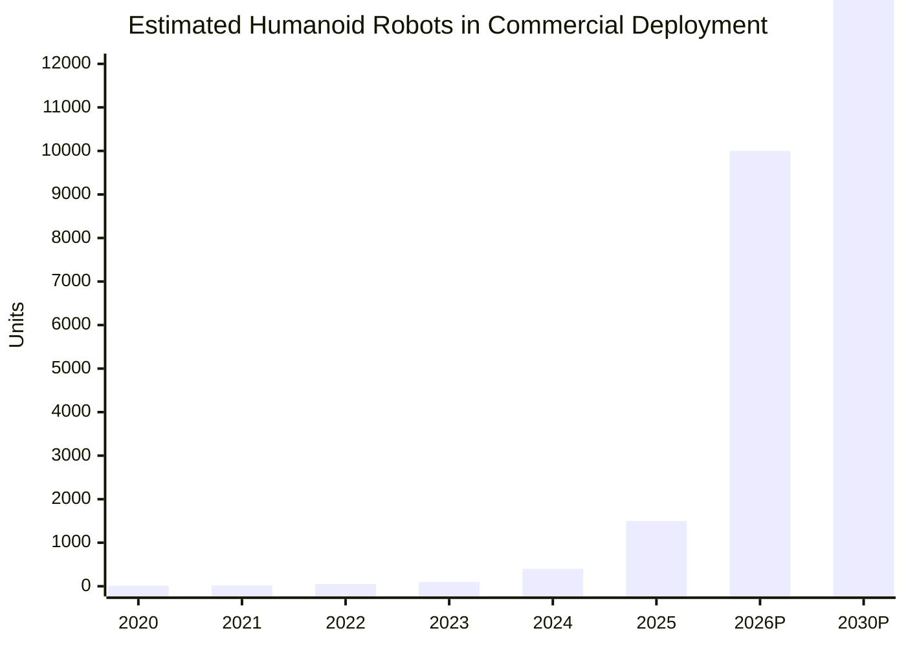
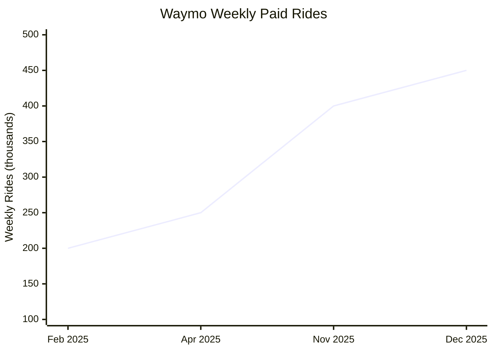
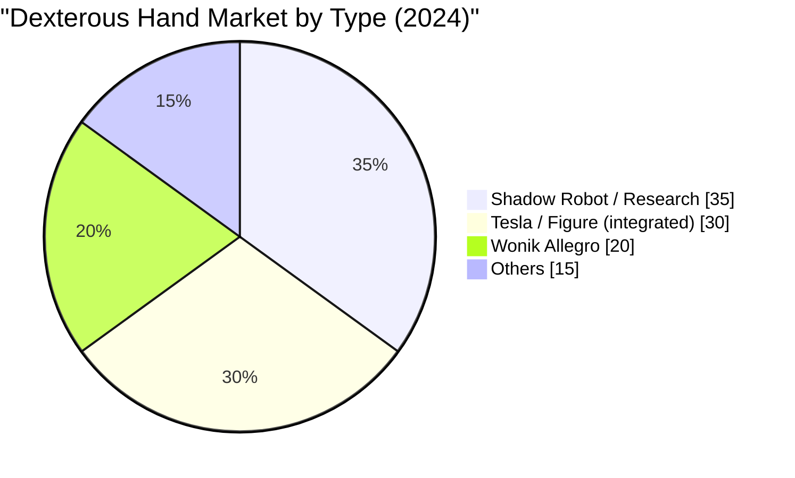
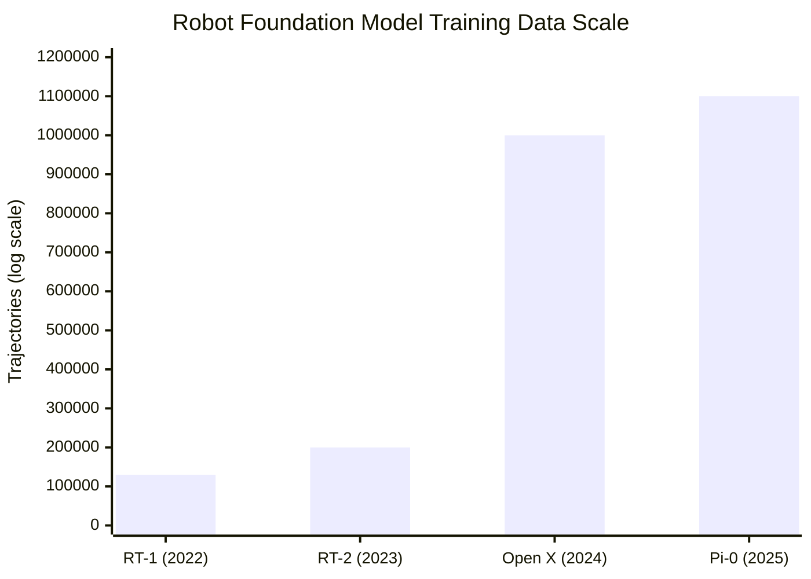

# Robots (Hardware) — 2025 Year in Review

> *Humans have been looking to automate their lives in one way or another for most of their existence. From early domesticated animals to microwave ovens and freighter ships, automation adds a huge multiplier on human labor. The current frontier is automating physical work through robots — and 2025 was the year humanoids went from lab demos to factory floors.*

## Executive Summary

**The good news:** 2025 marked the transition from "humanoid hype" to "humanoid deployment." Figure 02 completed an 11-month production run at BMW, accumulating 1,250+ hours and contributing to 30,000+ vehicles[^figure-bmw]. Agility Digit moved 100,000+ totes at GXO warehouses[^agility-gxo]. VC investment nearly tripled year-over-year to $4.6B[^vc-3x]. Unitree proved sub-$15k humanoids are viable with the G1[^unitree-g1], while Waymo crossed 450,000 weekly robotaxi rides[^waymo-2025].

**The bad news:** No humanoid has completed a fully autonomous 8-hour shift — most still require interventions[^figure-bmw]. Battery life remains stuck at 2-5 hours, with experts estimating a decade before 8-hour single-charge operation[^globalspec]. Cruise, after $12.1B invested, shut down entirely[^cruise-shutdown]. True L5 autonomy (all conditions, all locations) remains unachieved; robotaxis still operate in geofenced areas only.

**Bottom line: The commercial humanoid era has begun. We're in Year 1 of deployment, not Year 1 of capability.**

---

## KPI Dashboard

**KPI: Largest Active Commercial Fleet of General-Purpose Humanoids (Single Site)**

| Metric | Value | Source |
|--------|-------|--------|
| **Leading Site** | **GXO Flowery Branch, GA** (Agility Digit) | [Agility Robotics][agility-gxo] |
| **Throughput Milestone** | 100,000+ totes moved (Nov 2025) | [Agility Robotics][agility-gxo] |
| **Longest Production Deployment** | Figure 02 @ BMW: 1,250+ hours, 11 months | [Figure AI][figure-bmw] |
| **Estimated Global Deployed Units** | ~1,000-2,000 (across all sites) | Industry estimates |

[agility-gxo]: https://www.agilityrobotics.com/content/digit-moves-over-100k-totes
[figure-bmw]: https://www.figure.ai/news/production-at-bmw

**Note:** No company has publicly disclosed exact fleet counts at single sites. The industry uses throughput/runtime metrics rather than unit counts.

### Commercial Humanoid Deployments (2025)

*Data: Bank of America, BCC Research, company announcements. 2026+ are projections.*

### 2025 Deployment Table

| Company | Robot | Customer/Site | Status | Key Metrics | Source |
|---------|-------|---------------|--------|-------------|--------|
| **Agility** | Digit | GXO Flowery Branch, GA | **Deployed** | 100K+ totes moved | [Agility][agility-gxo] |
| **Figure AI** | Figure 02 | BMW Spartanburg, SC | **Completed** (11 mo) | 1,250+ hrs, 90K parts, 30K vehicles | [Figure][figure-bmw] |
| **Tesla** | Optimus | Tesla Fremont/Texas | Pilot | Internal testing; production target abandoned | [WSJ][wsj-optimus] |
| **Apptronik** | Apollo | Mercedes-Benz Germany | Pilot | Component transport, quality inspections | [Reuters][mercedes-apollo] |
| **Boston Dynamics** | Atlas | Hyundai Georgia | Planned Oct 2025 | Parts sequencing | [Korea JoongAng][hyundai-atlas] |
| **UBTech** | Walker S2 | BYD, VW, Audi (China) | **Deployed** | 500+ units contracted | [Korea JoongAng][korean-humanoids] |

[wsj-optimus]: https://timesofindia.indiatimes.com/technology/tech-news/teslas-optimus-robot-on-which-elon-musk-is-betting-the-future-may-not-be-ready-yet-report-claims/articleshow/126320994.cms
[mercedes-apollo]: https://www.reuters.com/business/autos-transportation/mercedes-benz-takes-stake-robotics-maker-apptronik-tests-robots-factories-2025-03-18/
[hyundai-atlas]: https://koreajoongangdaily.joins.com/news/2025-07-03/business/industry/Exclusive-Hyundais-Georgia-plant-to-use-Boston-Dynamics-Atlas-humanoid-robot-from-October/2342998
[korean-humanoids]: https://koreajoongangdaily.joins.com/news/2025-10-13/business/industry/AI-gets-physical-Humanoid-robots-hit-factory-floors-/2408411

**Assessment: 📈 Exponential growth.** The industry crossed from "pilot" to "commercial deployment" in 2025. Fleet sizes remain small (likely single digits to low dozens per site), but throughput milestones prove economic viability. Bank of America projects mass adoption starting 2028[^boa].

---

## Milestone Status

### 🟡 Robotaxi Saturation — Autonomous robotaxis outnumber human-driven taxis in a major metro

**Status: Approaching, not yet achieved**

*Data: [Waymo Year in Review][waymo-2025]*

[waymo-2025]: https://waymo.com/blog/2025/12/2025-year-in-review

| Company | Fleet Size | Weekly Rides | Cities | Source |
|---------|-----------|--------------|--------|--------|
| **Waymo** (US) | 2,500 | 450,000 | 5 active + 20+ planned | [Waymo][waymo-2025] |
| **Apollo Go/Baidu** (China) | 1,000+ (Wuhan) | 250,000 | 22 cities | [CarNewsChina][apollo-go] |
| **Pony.ai** (China) | 720+ | Not disclosed | 4 tier-1 cities | [Pony.ai][pony-ai] |
| **Zoox** (US) | ~50 | Not disclosed | SF, Las Vegas | [Reuters][zoox] |
| **Tesla** (US) | ~135 | Minimal | Austin, SF Bay | [Wikipedia][tesla-robotaxi] |
| **Cruise** (US) | **0 (shutdown)** | N/A | Folded into GM | [GM Authority][cruise-shutdown] |

[apollo-go]: https://carnewschina.com/2025/11/13/baidus-apollo-go-robotaxi-leads-global-autonomous-driving-with-17m-orders-targets-profit-this-year/
[pony-ai]: https://ir.pony.ai/news-releases/news-release-details/pony-ai-inc-kicks-fully-driverless-commercial-services-gen-7
[zoox]: https://www.reuters.com/business/media-telecom/driverless-future-gains-momentum-with-global-robotaxi-deployments-2025-12-22/
[tesla-robotaxi]: https://en.wikipedia.org/wiki/Tesla_Robotaxi
[cruise-shutdown]: https://gmauthority.com/blog/2025/12/the-amount-gm-spent-on-its-defunct-cruise-robotaxi-service-will-shock-you/

#### Key 2025 Events

| Date | Event | Source |
|------|-------|--------|
| Mar 4, 2025 | Waymo + Uber launch in Austin | [CNBC][waymo-austin] |
| Jun 22, 2025 | Tesla Robotaxi pilot launched (supervised) | [Wikipedia][tesla-robotaxi] |
| Oct 31, 2025 | Pony.ai gets first city-wide permit (all of Shenzhen) | [CNBC][pony-shenzhen] |
| Nov 18, 2025 | Waymo announces 5 new cities (Miami, Dallas, Houston, San Antonio, Orlando) | [Waymo][waymo-expansion] |
| Dec 10, 2024 | **Cruise shuts down** after $12.1B spent | [Guardian][cruise-guardian] |
| Dec 5, 2025 | Waymo recalls vehicles for 19+ school bus violations | [Reuters][waymo-recall] |

[waymo-austin]: https://www.cnbc.com/2025/03/04/waymo-uber-begin-offering-robotaxi-rides-in-austin-ahead-of-sxsw.html
[pony-shenzhen]: https://www.cnbc.com/2025/10/31/chinas-ponyai-gets-the-first-permit-for-robotaxis-in-all-of-shenzhen.html
[waymo-expansion]: https://waymo.com/blog/2025/11/safe-routine-ready-autonomous-driving-in-new-cities
[cruise-guardian]: https://www.theguardian.com/technology/2024/dec/11/general-motors-self-driving-cruise-robotaxi
[waymo-recall]: https://www.reuters.com/world/waymo-issue-recall-over-self-driving-vehicles-driving-past-stopped-school-buses-2025-12-05/

**The gap:** In Austin (Waymo's strongest US market), robotaxis capture ~20% of Uber rides within their operating zone — but only ~6% metro-wide[^driverless-digest]. No city is close to robotaxis outnumbering human taxis. True L5 (all conditions without geofencing) remains unachieved.

---

### 🔴 The "Wozniak" Test — Robot makes coffee in a random, unseen home

**Status: Distant**

No robot has passed the Wozniak Test. The closest demonstrations (Stanford Mobile ALOHA cooking, Tesla Optimus chores, 1X NEO) occur in **controlled environments** with either prior training in that specific space or remote human operators providing guidance[^mobile-aloha].

#### Key 2025 Developments

| Development | Company/Lab | Capability | Limitation | Source |
|-------------|------------|------------|------------|--------|
| **1X NEO** | 1X Technologies | Household tasks, 22-DoF hands | Human "Experts" teleoperate for new tasks | [1X.tech][1x-neo] |
| **NVIDIA DreamGen** | NVIDIA | Zero-shot 22 new behaviors in unseen environments | Pick-and-place tasks only, not multi-step | [arXiv][dreamgen] |
| **Mobile ALOHA** | Stanford | Cooking shrimp, dishwasher loading | Requires ~50 demos *in target environment* | [Stanford News][mobile-aloha] |
| **Optimus chores demo** | Tesla | Vacuuming, stirring pot, opening cabinets | Robot fell over at Miami demo; teleoperated | [WSJ][wsj-optimus] |

[1x-neo]: https://www.1x.tech/neo
[dreamgen]: https://arxiv.org/abs/2505.12705
[mobile-aloha]: https://news.stanford.edu/stories/2024/04/meet-robot-that-can-saute-shrimp

**Remaining challenges:** Generalization to truly novel kitchens, dexterous manipulation of unfamiliar coffee machines, navigation in cluttered unknown spaces, and safety around humans/pets. Agility Robotics explicitly states: "Until you can prove the robot is not going to fall on a baby, it's not going into the home"[^agility-home].

---

### 🟡 The "Fukushima" Test — Robot autonomously performs disaster zone repair

**Status: Approaching**

The key word is **"autonomously."** Current disaster-zone robots remain primarily **teleoperated** for critical manipulation tasks.

| Capability | Status |
|------------|--------|
| Navigate disaster zone autonomously | ✅ Demonstrated (SubT Challenge, Spot, Ghost Robotics) |
| Survive extreme radiation | ✅ Spot: 413 rem (82 years of worker dose) |
| Turn valves/manipulate switches | ✅ Demonstrated (Spot Arm, DRC robots) |
| **Autonomous decision to perform repair** | ❌ Not demonstrated |

#### Key 2024-2025 Events

| Date | Event | Source |
|------|-------|--------|
| Nov 2, 2024 | Telesco robot retrieves first radioactive fuel sample from Fukushima Unit 2 | [Guardian][fukushima-guardian] |
| Jun 26, 2025 | UK NDA launches £9.5M Auto-SAS project for autonomous nuclear waste sorting | [GOV.UK][uk-nuclear] |
| Aug 2025 | Boston Dynamics Spot deployed at Fukushima, Chernobyl, Sellafield for inspections | [Boston Dynamics][spot-fukushima] |

[fukushima-guardian]: https://www.theguardian.com/environment/2024/nov/02/robot-retrieves-radioactive-fuel-sample-from-fukushima-nuclear-reactor
[uk-nuclear]: https://www.gov.uk/government/news/nda-launches-pioneering-robotics-partnership-to-manage-nuclear-waste
[spot-fukushima]: https://bostondynamics.com/case-studies/spot-in-fukushima-daiichi/

**Timeline:** With electric Atlas's manipulation capabilities and advancing AI for robotics, this milestone is approaching within 3-5 years.

---

### 🟡 The "Blue Collar" Shift — Robot completes 8-hour shift alongside humans

**Status: Approaching**

No humanoid robot has completed a verified, continuous 8-hour **fully autonomous** shift. However:

| Achievement | Robot | Details | Source |
|-------------|-------|---------|--------|
| **10-hour shifts, M-F for 11 months** | Figure 02 @ BMW | 1,250+ hours total; required support staff | [Figure AI][figure-bmw] |
| **8-hour livestream on single charge** | Kepler K2 | Trade show demo, not production | [RockingRobots][kepler-k2] |
| **100K+ totes moved** | Agility Digit @ GXO | Commercial production; runtime undisclosed | [Agility][agility-gxo] |

[kepler-k2]: https://www.rockingrobots.com/kepler-debuts-humanoid-robot-with-eight-hour-endurance/

**The gap:** Most deployments still require human interventions. Battery life remains 2-5 hours typical; hot-swappable batteries and fast charging provide workarounds.

---

## Open Challenges

### 🟡 Dexterous Manipulation — Human-level hands for 10,000+ object types

**Status: Significant progress, substantial gap remains**

*Data: Intel Market Research[^dex-market]*

#### Current Best Systems

| System | Objects Handled | Success Rate | Source |
|--------|-----------------|--------------|--------|
| MIT CSAIL (2021) | 2,000+ | ~100% (spheres), ~30% (scissors) | [MIT][mit-dex] |
| Physical Intelligence π₀ | Cross-domain generalization | 88-100% on trained tasks | [Physical Intelligence][pi-zero] |
| Human baseline | 10,000+ | >95% | — |

[mit-dex]: https://www.eecs.mit.edu/dexterous-robotic-hands-manipulate-thousands-of-objects-with-ease/
[pi-zero]: https://www.physicalintelligence.company/blog/pi0

#### Key 2025 Developments

| Development | Details | Source |
|-------------|---------|--------|
| **Digit 360** | 18+ sensing modalities; 1 millinewton force detection; micron resolution | [GelSight/Meta AI][digit-360] |
| **Physical Intelligence π₀** | $1.1B raised; generalizes to unseen homes; folding laundry | [Bloomberg][pi-funding] |
| **UK ARIA Programme** | £57M for robot dexterity research | [ARIA][aria-uk] |

[digit-360]: https://www.therobotreport.com/gelsight-meta-ai-release-digit-360-tactile-sensor-for-robotic-fingers/
[pi-funding]: https://www.bloomberg.com/news/articles/2025-11-20/robotics-startup-physical-intelligence-valued-at-5-6-billion-in-new-funding
[aria-uk]: https://www.aria.org.uk/robot-dexterity/

**Deformables remain hard:** No unified framework exists for cloth, cables, and food manipulation. ICRA 2025 held its 5th workshop on this persistent challenge[^icra-deformable].

---

### 🟢 Generalization — Few-shot skill acquisition across environments

**Status: Strong progress — foundation models breakthrough year**

*Data: Google DeepMind, Physical Intelligence[^open-x]*

| Model | Parameters | Capability | Improvement | Source |
|-------|-----------|------------|-------------|--------|
| **RT-2-X** | 55B | Chain-of-thought reasoning, emergent skills | 3× over RT-1 | [DeepMind][rt2x] |
| **OpenVLA** | 7B (open-source) | 29 tasks, cross-embodiment | +16.5% over RT-2-X | [OpenVLA][openvla] |
| **π₀** | 3B | Laundry folding, box assembly in unseen environments | 88-100% success | [Physical Intelligence][pi-zero] |
| **GR00T N1** | 2B | Humanoid-focused, open weights | SOTA on simulation | [NVIDIA][groot] |

[rt2x]: https://robotics-transformer2.github.io/
[openvla]: https://openvla.github.io/
[groot]: https://arxiv.org/abs/2503.14734

**Failure recovery improving:** FailSafe system achieves +22.6% improvement on π₀, OpenVLA through automatic failure detection[^failsafe]. STAR framework reaches 78% recovery rate[^star].

---

### 🔴 Power/Efficiency/Cost — 8-hour runtime at viable price

**Status: Major gap remains**

| Robot | Battery Life | Price | Source |
|-------|--------------|-------|--------|
| Agility Digit | Up to 8 hrs (duty dependent); ~4 typical | ~$250,000 | [Agility][agility-spec] |
| Tesla Optimus | ~2 hrs (target: "full day light duty") | Target: $20-30k | [Tesla][tesla-optimus] |
| Figure 02 | ~5 hrs | Est. $50-150k | [Figure][figure-spec] |
| **Unitree G1** | ~2 hrs | **$13,500** | [Unitree][unitree-g1] |
| Unitree R1 | ~1 hr | **$4,500-5,900** | [Unitree][unitree-r1] |
| Kepler K2 | 8 hrs (demo) | ~$34,600 | [Kepler][kepler-k2] |

[agility-spec]: https://www.tophumanoidrobots.com/items/digit/
[tesla-optimus]: https://www.tesla.com/AI
[figure-spec]: https://humanoid.guide/product/figure-02/
[unitree-g1]: https://www.unitree.com/g1
[unitree-r1]: https://shop.unitree.com/collections/humanoid-robot

**Battery technology:** Current Li-ion achieves 150-250 Wh/kg; 8-hour operation needs ~350-400 Wh/kg. Solid-state batteries remain 2-3 years away from humanoid integration[^solid-state].

**Workarounds in use:**
- Hot-swappable batteries (Apptronik Apollo, UBTech Walker S2)
- Fast charging (Digit: 9 minutes for 90-minute runtime)
- Tethered operation

**Cost breakthrough:** Unitree has proven sub-$15k humanoids are viable today, though with capability tradeoffs.

---

## Beyond the Framework: 2025 Highlights

### Major Funding Rounds

| Company | Amount | Valuation | Source |
|---------|--------|-----------|--------|
| **Figure AI** | >$1B Series C | **$39B** | [Figure AI][figure-series-c] |
| **Apptronik** | $403M Series A | $5B | [TechCrunch][apptronik-funding] |
| **Physical Intelligence** | $600M Series B | $5.6B | [Bloomberg][pi-funding] |
| **1X Technologies** | Seeking up to $1B | $10B+ target | [The Information][1x-funding] |

[figure-series-c]: https://www.figure.ai/news/series-c
[apptronik-funding]: https://techcrunch.com/2025/02/13/apptronik-raises-350m-to-build-humanoid-robots-with-help-from-google/
[1x-funding]: https://www.theinformation.com/articles/humanoid-robot-developer-1x-targets-1-billion-new-funding

Total VC into humanoid robotics: **$4.6B in 2025** (~3× year-over-year)[^vc-3x].

### China's Robot Push

- **150+ humanoid companies** in China; NDRC warns of bubble[^china-bubble]
- **UBTech** plans 500→5,000→10,000 robots (2025-2027)
- **Unitree** planning ~$7B IPO[^unitree-ipo]
- **"Embodied AI"** included in Xi Jinping's 15th Five-Year Plan as strategic priority
- **World Humanoid Robot Games** (Beijing, Aug 2025): 500+ humanoids from 16 countries competed[^robot-olympics]

[^china-bubble]: [CNBC: China humanoid robot companies](https://www.cnbc.com/2025/12/30/elon-musk-wants-robots-everywhere-china-is-making-that-a-reality.html)
[^unitree-ipo]: [CNBC: Unitree IPO](https://www.cnbc.com/2025/09/09/chinas-unitree-plans-7-billion-ipo-valuation-as-humanoid-robot-race-heats-up.html)
[^robot-olympics]: [WSJ: World Humanoid Robot Games](https://www.wsj.com/tech/world-humanoid-robot-games-bejing-298ab3c0)

### Policy Developments

| Jurisdiction | Action | Source |
|--------------|--------|--------|
| **China** | Draft AI robot regulations: emotional manipulation controls, elderly protection | [Reuters][china-regs] |
| **Trump Admin** | Commerce Secretary meeting with robotics CEOs; executive order under consideration | [Politico][trump-robotics] |
| **California** | AI employment decision restrictions effective Oct 1, 2025 | [Sheppard Mullin][ca-ai] |

[china-regs]: https://www.reuters.com/world/asia-pacific/china-issues-drafts-rules-regulate-ai-with-human-like-interaction-2025-12-27/
[trump-robotics]: https://www.politico.com/news/2025/12/03/trump-administration-ai-robotics-00674204
[ca-ai]: https://www.laboremploymentlawblog.com/2025/07/articles/artificial-intelligence/california-approves-rules-regulating-ai-in-employment-decision-making/

### Sobering Moments

- **iRobot bankruptcy** (Dec 15, 2025): Roomba maker filed after Amazon deal collapsed[^irobot]
- **Tesla Optimus falls over** at Miami demo — viral moment revealing teleoperation dependence[^optimus-fall]
- **Cruise shutdown** after $12.1B invested, following 2023 pedestrian incident[^cruise-shutdown]

[^irobot]: [NYT: iRobot bankruptcy](https://www.nytimes.com/2025/12/15/business/roomba-irobot-bankruptcy.html)
[^optimus-fall]: [Forbes: Optimus demo failure](https://www.forbes.com/sites/annatong/2025/12/31/2025-another-year-of-humanoid-hype/)

---

## Reference Data

### External Visualizations

| Resource | URL |
|----------|-----|
| IFR World Robotics Statistics | https://ifr.org/ |
| CB Insights Robotics VC Report | https://www.cbinsights.com/research/report/venture-trends-q3-2025/ |
| Humanoid Robotics Technology News | https://humanoidroboticstechnology.com/ |
| The Robot Report | https://www.therobotreport.com/ |

### Market Projections

| Source | 2025 | 2030 | 2035/2050 |
|--------|------|------|-----------|
| BCC Research | $1.9B | $11B | — |
| Goldman Sachs | — | — | $38B (2035) |
| Morgan Stanley | — | — | $5T (2050) |
| Bank of America | 18,000 units | 10M/year | — |

---

## Footnotes

[^figure-bmw]: [Figure AI: Production at BMW](https://www.figure.ai/news/production-at-bmw)
[^agility-gxo]: [Agility Robotics: Digit Moves Over 100K Totes](https://www.agilityrobotics.com/content/digit-moves-over-100k-totes)
[^vc-3x]: [Forbes: 2025 — Another Year of Humanoid Hype](https://www.forbes.com/sites/annatong/2025/12/31/2025-another-year-of-humanoid-hype/)
[^unitree-g1]: [Unitree G1](https://www.unitree.com/g1)
[^waymo-2025]: [Waymo: 2025 Year in Review](https://waymo.com/blog/2025/12/2025-year-in-review)
[^cruise-shutdown]: [GM Authority: Cruise Robotaxi Costs](https://gmauthority.com/blog/2025/12/the-amount-gm-spent-on-its-defunct-cruise-robotaxi-service-will-shock-you/)
[^globalspec]: [GlobalSpec: Humanoid Robots Are Tripping Over Their High Energy Demands](https://insights.globalspec.com/article/24246/humanoid-robots-are-tripping-over-their-high-energy-demands)
[^mobile-aloha]: [Stanford News: Mobile ALOHA](https://news.stanford.edu/stories/2024/04/meet-robot-that-can-saute-shrimp)
[^agility-home]: [Agility Robotics Blog: From Warehouse to House](https://www.agilityrobotics.com/content/humanoid-robots-from-warehouse-to-your-house)
[^driverless-digest]: [The Driverless Digest: Waymo Stats 2025](https://www.thedriverlessdigest.com/p/waymo-stats-2025-funding-growth-coverage)
[^boa]: [Forbes: Bank of America Humanoid Report](https://www.forbes.com/sites/johnkoetsier/2025/04/30/humanoid-robot-mass-adoption-will-start-in-2028-says-bank-of-america/)
[^dex-market]: [Intel Market Research: Robot Dexterous Hand 2025-2032](https://www.intelmarketresearch.com/robot-multi-fingered-dexterous-hand-2025-2032-886-2616)
[^icra-deformable]: [ICRA 2025 Deformable Workshop](https://deformable-workshop.github.io/icra2025/)
[^open-x]: [Open X-Embodiment](https://robotics-transformer-x.github.io/)
[^failsafe]: [arXiv: FailSafe](https://arxiv.org/abs/2510.01642)
[^star]: [arXiv: STAR Framework](https://arxiv.org/abs/2503.06060)
[^solid-state]: [Chinese Academy of Sciences: Solid-State Battery Progress](https://english.casad.cas.cn/newsroom/ma/202510/t20251015_1089469.html)
