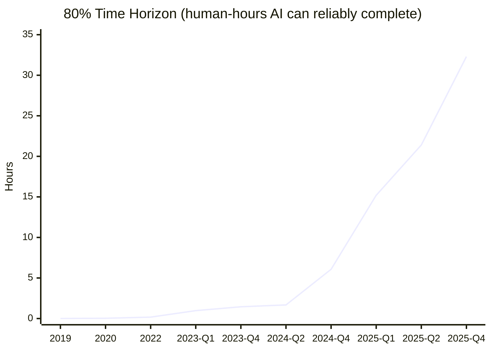
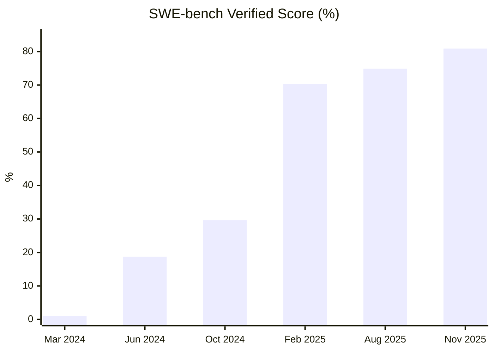

# Robots and Automation: Software — 2025 Year in Review

> *Humans have been looking to automate their lives in one way or another for most of their existence. The current frontier is automating intelligence — the software (AI). From coding assistants to autonomous agents, 2025 marked the year AI moved from novelty to infrastructure.*

## Executive Summary

**The good news:** AI capabilities are doubling every 7 months on METR's task benchmarks. Models can now reliably complete tasks that take humans ~30 hours — full workweek-scale problems. Claude Code crossed $1B revenue. 41% of all code is now AI-generated or AI-assisted[^stack-overflow]. AI solved a 130-year-old open math problem[^lyapunov] and achieved IMO gold-medal performance[^imo-gold]. >75 AI-derived drug molecules are in clinical trials with 80–90% Phase I success rates[^ai-drugs].

**The bad news:** METR's RCT found experienced developers are **19% slower** with AI tools[^metr-rct]. 95% of enterprise AI pilots fail to reach production[^mit-fail]. Hallucination rates on reasoning models are *increasing* — o3 hallucinates 33% on PersonQA (vs 16% for o1)[^simpleqa]. Linux kernel maintainers remain hostile to AI-generated code, and Nature explicitly bans AI authorship. Catastrophic forgetting remains unsolved.

**Bottom line: AI capability is accelerating exponentially. Reliability and integration lag behind. AI builds software; it doesn't yet run businesses.**

---

## KPI Dashboard

**KPI:** 80-percentile METR task length equivalent (Human-hours)

METR (Model Evaluation & Threat Research) measures the length of real-world software tasks that AI agents can complete autonomously. The 80% time horizon indicates tasks where the AI succeeds 80% of the time — a measure of reliable capability.

| Metric | Value | Source |
|--------|-------|--------|
| **Current best (80% horizon)** | **32.3 hours** (GPT-5.1-Codex-Max) | [METR benchmark][metr-yaml] |
| **Current best (50% horizon)** | **288.9 hours** (Claude Opus 4.5) | [METR benchmark][metr-yaml] |
| **Doubling time** | ~7 months | [METR paper][metr-paper] |
| **Doubling time (2024–2025)** | ~4 months (accelerating) | [METR][metr-blog] |
| **Since 2019** | ~5,000× improvement | [METR][metr-blog] |
| **SWE-bench Verified (SOTA)** | **80.9%** (Claude Opus 4.5) | [SWE-bench][swebench] |

[metr-yaml]: https://metr.org/assets/benchmark_results.yaml
[metr-paper]: https://arxiv.org/abs/2503.14499
[metr-blog]: https://metr.org/blog/2025-03-19-measuring-ai-ability-to-complete-long-tasks/
[swebench]: https://www.swebench.com/

### AI Task Completion Capability (80% Time Horizon)

*Data: [METR Benchmark Results][metr-yaml]. Models: GPT-2 (2019) → GPT-3 (2020) → GPT-3.5 (2022) → GPT-4 (2023) → GPT-4o/Claude 3.5 (2024) → Claude 3.7/o3 (Q1 2025) → GPT-5/Opus 4.5 (Q3-Q4 2025)*

### SWE-bench Verified Performance

*Data: [SWE-bench leaderboard][swebench]. Models: GPT-4 baseline → Claude 3.5 Sonnet → Claude 3.5 Sonnet (new) → Claude 3.7 Sonnet → GPT-5 → Claude Opus 4.5*

### Model Comparison (November 2025)

| Model | Release | 80% Horizon (hrs) | 50% Horizon (hrs) | Avg Score |
|-------|---------|-------------------|-------------------|-----------|
| GPT-5.1-Codex-Max | Nov 2025 | **32.3** | 173.3 | 0.721 |
| Claude Opus 4.5 | Nov 2025 | 27.2 | **288.9** | 0.750 |
| GPT-5 | Aug 2025 | 26.6 | 137.7 | 0.698 |
| o3 | Apr 2025 | 21.4 | 94.0 | 0.659 |
| Claude 4 Opus | May 2025 | 20.9 | 85.6 | 0.649 |
| Gemini 2.5 Pro | Jun 2025 | 9.3 | 39.5 | 0.558 |

**Assessment: 🟢 Strong progress.** AI can now reliably complete tasks taking humans a full workweek. Extrapolating: AI agents handling day-long tasks reliably by ~2027, week-long tasks by ~2029.

**Caveat:** METR's RCT (July 2025) found experienced open-source developers were **19% slower** using AI tools, despite believing they were 20% faster[^metr-rct]. Benchmark performance does not yet translate to real-world productivity gains.

---

## Milestone Status

### 🟡 "The $10M Solopreneur" — Approaching

**Status: Approaching**

**Definition:** A single-person company reaches $10M ARR with <10 hours/week human oversight — proving AI handles ongoing business operations autonomously.

No verified case meets the strict criteria, but multiple founders are approaching the threshold:

| Founder/Company | Revenue | Team | AI-Heavy? | Source |
|-----------------|---------|------|-----------|--------|
| **BuiltWith** (Gary Brewer) | $14M/year | 1 | Partial (pre-AI era) | [tinyteams.xyz][tinyteams] |
| **Magnific AI** | $10M ARR | 2 | ✅ | [tinyteams.xyz][tinyteams] |
| **Pieter Levels** (PhotoAI, NomadList) | ~$3.1M ARR | 1 | ✅ | [John Collison interview][levels] |
| **HeadshotPro** | $3M ARR | 1 | ✅ | [tinyteams.xyz][tinyteams] |
| **Base44** (Maor Shlomo) | $3.5M ARR → $80M exit | 1 | ✅ Built with Cursor | [CNBC][base44-cnbc] |

[tinyteams]: https://tinyteams.xyz/
[levels]: https://www.linkedin.com/posts/andros-wong-2b066943_pieter-levels-is-one-of-the-most-successful-activity-7357099950561746945-GsA8
[base44-cnbc]: https://chiefaiofficer.com/blog/the-bootstrapped-ai-company-that-hit-300000-users-in-6-months-and-made-every-funded-startup-look-slow/

**What We Don't Have:** No public evidence of a solo founder where AI handles *ongoing operations* — customer acquisition, support, pricing, fulfillment — with minimal human oversight. Current examples demonstrate AI as a coding accelerator, not an autonomous operator.

**Market signals:**
- Solo-founded startups rose from 22% (2015) to 38% (2024) of new US startups[^forbes-solo]
- AI-native startups are 8× more likely to reach $10M ARR in 12 months[^openview]
- Cursor: $200M ARR with ~20 people; Midjourney: $200-300M ARR with ~50 people

**Sam Altman** (OpenAI): "One-person billion-dollar company coming soon" (Jan 2024). **Dario Amodei** (Anthropic): 70-80% certainty by 2026[^amodei-prediction].

---

### 🔴 "The Linux Kernel Patch" — Distant

**Status: Distant**

**Definition:** An AI-submitted large (10k+ lines diff) patch to the Linux Kernel (or equivalent critical infrastructure) is accepted by maintainers.

The largest confirmed AI-generated patch merged into the Linux kernel is **~50 lines** — 200× smaller than the target. This single patch (merged in Linux 6.15) contained a bug and sparked controversy over undisclosed AI authorship.

| Date | Event | Source |
|------|-------|--------|
| **Apr 2024** | 🔴 **Gentoo bans AI-generated code** — first major project | [Gentoo][gentoo-ban] |
| **Jun 2025** | LWN reveals 100% LLM-generated patch merged to 6.15 without disclosure | [LWN][lwn-ai-patch] |
| **Jul 2025** | AUTOSEL AI system revealed — LLMs for kernel backport selection | [LWN][autosel] |
| **Jul 2025** | Sasha Levin proposes CLAUDE.md/Copilot config RFC for kernel | [LKML][lkml-claude] |
| **Nov 2025** | Dave Hansen proposes "generated-content.rst" guidelines (TAB-authored) | [LKML][lkml-generated] |
| **Dec 2025** | Linus Torvalds: "**huge believer**" in AI but only for maintenance, not code writing | [ZDNet][linus-ai] |
| **Dec 2025** | LLVM publishes "human in the loop" AI policy RFC | [LLVM Discourse][llvm-ai] |

[gentoo-ban]: https://wiki.gentoo.org/wiki/Project:Council/AI_policy
[lwn-ai-patch]: https://lwn.net/Articles/1027100/
[autosel]: https://lwn.net/Articles/984063/
[lkml-claude]: https://lkml.org/lkml/2025/7/25/988
[lkml-generated]: https://lkml.org/lkml/2025/11/5/1802
[linus-ai]: https://www.zdnet.com/article/linus-torvalds-ai-tool-maintaining-linux-code/
[llvm-ai]: https://discourse.llvm.org/t/rfc-llvm-ai-tool-policy-human-in-the-loop/89159

#### Setbacks and Pushback

| Project | Action | Source |
|---------|--------|--------|
| **Gentoo** | Banned AI-generated contributions (Apr 2024) | [Gentoo Policy][gentoo-ban] |
| **NetBSD** | Banned AI tools for code submission | [Phoronix][netbsd] |
| **Git** | Rejected AI-generated patches | [Git ML][git-ai] |
| **QEMU** | Prohibits AI-generated code | [QEMU Wiki][qemu] |
| **FreeBSD** | Rejected exFAT code — license contamination via LLM | [FreeBSD][freebsd] |

[netbsd]: https://www.phoronix.com/news/NetBSD-AI-Generated-Code
[git-ai]: https://lore.kernel.org/git/
[qemu]: https://wiki.qemu.org/Contribute/SubmitAPatch
[freebsd]: https://lists.freebsd.org/

**Why it's distant:**
1. **Scale gap:** Largest accepted AI patch (~50 lines) is 200× smaller than 10k target
2. **Policy headwinds:** Major projects (Gentoo, NetBSD, Git, QEMU) banning/restricting AI code
3. **DCO problem:** Developer's Certificate of Origin may be legally inapplicable to AI output
4. **Quality concerns:** The one merged patch had a bug
5. **Trust deficit:** Undisclosed AI code now seen as community norm violation

**AI in maintenance roles:** AI is being adopted for patch selection (AUTOSEL), CVE triage, and code review assistance — auxiliary roles where trust is lower-stakes.

---

### 🔴 "The Nature Author" — Distant

**Status: Distant (structurally blocked)**

**Definition:** An AI-generated research paper is accepted by a top-tier journal (Nature/Science) with AI credited as primary author.

All major scientific journals explicitly prohibit AI authorship. The barrier is not capability but policy: authorship requires legal and ethical accountability, which AI cannot assume.

| Journal | AI as Author? | Policy |
|---------|---------------|--------|
| **Nature Portfolio** | ❌ Prohibited | "LLMs do not currently satisfy our authorship criteria" |
| **Science (AAAS)** | ❌ Prohibited | "AI tools cannot be authors" |
| **Cell Press** | ❌ Prohibited | Disclosure required; no authorship |
| **JAMA/Lancet/BMJ** | ❌ Prohibited | Follow ICMJE human accountability requirements |

*Sources: [Nature AI Policy][nature-ai], [Science Editorial Policies][science-ai]*

[nature-ai]: https://www.nature.com/nature-portfolio/editorial-policies/ai
[science-ai]: https://www.science.org/content/page/science-journals-editorial-policies

#### Closest Approaches

| Date | Event | Outcome | Source |
|------|-------|---------|--------|
| **Apr 2025** | Sakana AI Scientist-v2 paper accepted at ICLR workshop | First AI-generated paper to pass peer review; **withdrawn** per ethical agreement | [Sakana AI][sakana] |
| **Oct 2024** | AlphaFold2 wins Nobel Prize in Chemistry | Prize to human creators (Hassabis, Jumper), not the AI | [Nobel Prize][nobel] |
| **Sep 2025** | 36% of cancer paper abstracts found AI-generated; only 9% disclosed | Undisclosed AI use rising | [Science][undisclosed-ai] |

[sakana]: https://sakana.ai/ai-scientist-first-publication/
[nobel]: https://www.nobelprize.org/prizes/chemistry/2024/press-release/
[undisclosed-ai]: https://www.science.org/content/article/far-more-authors-use-ai-write-science-papers-admit-it-publisher-reports

**Why it's blocked:** Authorship requires accountability — the ability to be sued, retract claims, and vouch for data integrity. No journal is willing to create precedent for AI authorship until these legal and ethical frameworks exist.

---

## Open Challenges

### 🔴 Reliability — Getting Worse Before Better

**Definition:** Reducing hallucinations and error compounding in long chains of reasoning.

Counterintuitively, as reasoning models became more powerful at math and code, their hallucination rates on factual questions *increased*. The core insight: training and evaluation systems *reward guessing* over admitting uncertainty.

#### The Root Cause (September 2025)

OpenAI's research formally established that hallucinations arise because accuracy-based benchmarks penalize abstention. A model saying "I don't know" scores 0; guessing has a chance of being right[^openai-halluc].

| Model | Abstention Rate | Error Rate | Source |
|-------|-----------------|------------|--------|
| **gpt-5-thinking-mini** | 52% | **26%** | [OpenAI][openai-halluc-paper] |
| **o4-mini** | 1% | **75%** | [OpenAI][openai-halluc-paper] |

[openai-halluc-paper]: https://openai.com/index/why-language-models-hallucinate/

#### Quantitative Assessment

| Metric | Value | Source |
|--------|-------|--------|
| AI search hallucination (citing news) | **37–94%** (Perplexity best, Grok-3 worst) | [Columbia Journalism Review][cjr] |
| NewsGuard hallucination rate YoY | 18% (2024) → **35%** (2025) | [Forbes][forbes-halluc] |
| Enterprise AI pilot failure rate | **95%** | [MIT][mit-enterprise] |
| First sub-1% rates achieved | Gemini-2.0-Flash (0.7%), o3-mini-high (0.8%) | [SimpleQA][simpleqa-bench] |
| Legal AI hallucination | >17% despite "hallucination-free" marketing | [Stanford][stanford-legal] |

[cjr]: https://www.cjr.org/tow_center/we-compared-eight-ai-search-engines-theyre-all-bad-at-citing-news.php
[forbes-halluc]: https://www.forbes.com/sites/ronschmelzer/2025/12/30/from-hype-to-harm-a-retrospective-on-ais-biggest-misses-of-2025/
[mit-enterprise]: https://fortune.com/2025/08/18/mit-report-95-percent-generative-ai-pilots-at-companies-failing-cfo/
[simpleqa-bench]: https://openai.com/index/introducing-simpleqa/
[stanford-legal]: https://law.stanford.edu/publications/hallucination-free-assessing-the-reliability-of-leading-ai-legal-research-tools/

#### Mechanistic Understanding (March 2025)

Anthropic's "Tracing Thoughts" research mapped the internal circuits causing hallucinations. Claude has a *default refusal circuit* that is "on" by default — but a "known entity" feature can incorrectly suppress it, triggering hallucinations[^anthropic-tracing]. They can now detect when Claude is "bullshitting" vs. doing faithful reasoning.

**Assessment: 🔴 Getting worse before better.** Best-case hallucination rates have improved dramatically (sub-1%), but reasoning models (the frontier) are regressing. o3 hallucinates 33% on PersonQA (vs 16% for o1). The gap between best benchmarks and real-world reliability remains large.

---

### 🟡 Agency — Crossing Practical Thresholds

**Definition:** Robust goal decomposition and self-correction over long time horizons.

2025 is definitively "the year of the AI agent" — a fundamental shift from AI that suggests to AI that acts. According to McKinsey, 62% of organizations are experimenting with AI agents[^mckinsey-ai].

#### Agent Benchmark Performance

| Benchmark | SOTA | Human | Model | Source |
|-----------|------|-------|-------|--------|
| **SWE-bench Verified** | 80.9% | — | Claude Opus 4.5 | [SWE-bench][swebench] |
| **OSWorld (desktop use)** | **72.6%** | 72.4% | Simular Agent S | [Simular][simular] |
| **WebArena (browsing)** | 58.1% | 78.2% | OpenAI CUA | [OpenAI][openai-cua] |

[simular]: https://www.simular.ai/articles/simulars-computer-use-agent-outperforms-humans
[openai-cua]: https://openai.com/index/computer-using-agent/

**First to exceed human baseline:** Simular's Agent S achieved 72.6% on OSWorld (Dec 2025), exceeding human performance of 72.4%[^simular-human].

#### Major Agent Launches (2025)

| Agent | Company | Date | Capability |
|-------|---------|------|------------|
| **Operator** | OpenAI | Jan 2025 | Computer-Using Agent (CUA); GPT-4o + RL for GUI |
| **Claude Code** | Anthropic | May 2025 | $1B revenue milestone; sustained multi-hour tasks |
| **Project Mariner** | Google | 2025 | Multimodal browser agent; runs 10 parallel tasks |
| **Devin** | Cognition | 2025 | Autonomous coding agent |
| **Anthropic Agent SDK** | Anthropic | 2025 | Effort control & context compaction |

#### Limitations Persist

| Metric | Value | Source |
|--------|-------|--------|
| Hierarchical planning (HTN benchmarks) | **3% correct plans** | [HPlan 2025][hplan] |
| Long-horizon decomposition | **0% correct** | [HPlan 2025][hplan] |
| Agent benchmark reliability | 8/10 have "severe issues" | [ddkang][ddkang] |
| Benchmark vs. reality gap | 38% test pass → **0% mergeable** PRs | [SWE-bench analysis][swe-gap] |

[hplan]: https://arxiv.org/abs/2505.17918
[ddkang]: https://ddkang.substack.com/p/ai-agent-benchmarks-are-broken
[swe-gap]: https://www.arxiv.org/abs/2410.06992

**Assessment: 🟡 Mixed.** Benchmarks show impressive gains (82% SWE-bench), but real-world deployment reveals agents fail at meta-decisions: when to branch, backtrack, or ask for help.

---

### 🟡 Continuous Learning — Workarounds, Not Solutions

**Definition:** Universal mechanism for rapidly adjusting long-term behavior based on past experiences.

| Category | Status | 2025 State |
|----------|--------|------------|
| **Context Windows** | 🟢 Solved | 1M+ tokens (Gemini, Claude); 10M (Llama 4 Scout) |
| **Persistent Memory** | 🟡 Workaround | All labs deployed external memory (ChatGPT Apr 2025, Claude Sep 2025) |
| **Post-training Adaptation** | 🟡 Partial | RLVR/GRPO/DPO standard, but batch-only |
| **True Continual Learning** | 🔴 Unsolved | Catastrophic forgetting remains the barrier |

**Progress:**
- **Memory architectures maturing:** Google's Titans/MIRAS (2M+ context), Mem0, Zep Graphiti demonstrate scalable external memory[^titans]
- **Production deployments:** ChatGPT memory now default for 88% of organizations using AI[^mckinsey]
- **Efficient fine-tuning:** LoRA/QLoRA democratized; consumer GPUs viable
- **RLVR breakthrough:** Reinforcement Learning with Verifiable Rewards (DeepSeek) removes human labeling bottleneck for verifiable domains[^deepseek-r1]

**Fundamental limitations:**
- **Catastrophic forgetting unsolved:** Sebastian Raschka (Dec 2025): "no new or substantial breakthrough in continual learning"[^raschka]
- **Context window effective limits:** Research shows Maximum Effective Context Window far below advertised; models degrade at 1,000 tokens for some tasks[^mecw]

**Assessment: 🟡 Workarounds, not solutions.** We've engineered excellent workarounds (long context, external memory, retrieval) that simulate continuous learning, but models remain fundamentally static after training.

---

### 🟢 Novelty — Genuine Discoveries Emerging

**Definition:** Consistently producing original connections beyond interpolations of existing knowledge.

Evidence now strongly suggests AI systems are producing outputs that go beyond simple interpolation — particularly in mathematics, drug discovery, and formal verification.

#### Mathematics: Proofs Humans Hadn't Found

| Discovery | System | Why It Matters | Source |
|-----------|--------|----------------|--------|
| **Lyapunov functions** | Axiom Math / Meta | Solved 130-year-old open problem (since Poincaré 1892) | [Meta Research][lyapunov] |
| **Kissing number (11D)** | AlphaEvolve | New lower bound on 300-year-old geometry problem | [Nature][alphaevolve] |
| **4×4 complex matrix multiplication** | AlphaEvolve | Beat Strassen's 1969 algorithm—first improvement in 56 years | [Nature][alphaevolve] |
| **IMO gold (35/42 pts)** | Gemini Deep Think | End-to-end in natural language within time limit (Jul 2025) | [Google DeepMind][deepmind-imo] |
| **Goedel-Prover-V2** | Princeton | 90% on miniF2F theorem proving | [Princeton][princeton-prover] |

[lyapunov]: https://ai.meta.com/research/publications/solving-lyapunov-with-neural-networks/
[alphaevolve]: https://www.nature.com/articles/d41586-025-01555-x
[deepmind-imo]: https://deepmind.google/blog/advanced-version-of-gemini-with-deep-think-officially-achieves-gold-medal-standard-at-the-international-mathematical-olympiad/
[princeton-prover]: https://ai.princeton.edu/news/2025/princeton-researchers-unveil-improved-mathematical-theorem-prover-powered-ai

#### Drug Discovery: AI-Native Candidates in Trials

| Drug | Company | Status | Key Innovation |
|------|---------|--------|----------------|
| **Rentosertib (ISM001-055)** | Insilico Medicine | Phase IIb/III | First drug where **both target AND molecule** were AI-discovered |
| **NDI-034858** (TYK2) | Schrödinger/Nimbus | Phase III | Could be first AI-influenced approved drug |
| **NG1 & DN1** | MIT | Preclinical | Generative AI designed atom-by-atom antibiotics |

**>75 AI-derived molecules** in clinical trials by mid-2025 (vs. ~0 in 2020). Phase I success rates for AI-native biotechs: **80–90%** (vs. industry average 40–65%)[^ai-drugs].

#### The Stochastic Parrot Debate: Evolving

**antirez** (Redis creator): *"In 2025 finally almost everybody stopped saying [stochastic parrots]."*[^antirez]

**The New Yorker** (Nov 2025): *"Only the most hardcore skeptics can deny these systems are doing things many of us didn't think were going to be achieved."*[^newyorker-thinking]

**Wharton research** (Sep 2025): AI raises baseline quality but **reduces diversity of ideas** when used in early ideation[^wharton-creativity].

**Caveats:**
- All systems required massive compute (AlphaProof: hundreds of TPU-days)
- AlphaEvolve "cheats" via loopholes — Terence Tao: "very bright, but very amoral"[^tao]
- Requires human problem formulation and verification

**Assessment: 🟢 Strong progress.** AI *can* produce genuinely novel discoveries, improving on best-known human solutions. The debate is shifting from "can AI be creative?" to "how best to combine AI pattern-finding with human insight?"

---

## Beyond the Framework: 2025 Highlights

### Major Model Releases

| Date | Release | Significance |
|------|---------|--------------|
| **Jan 2025** | **DeepSeek R1** | Open-source reasoning model rivaling GPT-4 at ~$6M training cost; caused Nvidia ~$600B market cap drop |
| **Apr 2025** | **Llama 4** (Scout, Maverick) | 16-128 experts, 10M context; open-weight competition |
| **May 2025** | **Claude 4** (Opus, Sonnet) | 72.5% SWE-bench; Claude Code GA |
| **Aug 2025** | **GPT-5** | Unified routing, 45% fewer hallucinations than o3 |
| **Nov 2025** | **Gemini 3** (Pro, Deep Think) | Tops benchmarks; "code red" at OpenAI |
| **Dec 2025** | **GPT-5.2** | Rapid response to Gemini 3 threat |

### AI Coding Market

- **Cursor:** Raised $2.3B at $29.3B valuation; crossed $1B ARR (Nov 2025)[^cursor]
- **41%** of all code is now AI-generated or AI-assisted[^stack-overflow]
- **84%** of developers use or plan to use AI tools
- **21%** of Google's code is AI-assisted
- **Only 2.6%** of experienced devs "highly trust" AI outputs
- Market size: $4.91B → $30.1B by 2032 (27.1% CAGR)[^secondtalent]

### Funding

AI startups raised **$150 billion in 2025** — shattering 2021's $92B record[^pitchbook].

| Company | Valuation | Notes |
|---------|-----------|-------|
| **OpenAI** | $300B → $500B → targeting $1T IPO | $40B round (largest private ever) |
| **Anthropic** | $183B | $16.5B raised in 2025 |
| **xAI** | $200-230B | Elon Musk's lab |
| **Cursor** | $29.3B | Fastest-growing AI coding tool |

### Developer Sentiment

Despite high adoption, developer satisfaction with AI tools **dropped to 60%** (from 70%+ in 2023–24) — hype meeting reality[^stack-overflow].

### Safety Concerns Intensifying

- **UK AISI** (Dec 2025): Model capabilities doubling every 8 months in some domains; self-replication success >60% in controlled tests[^aisi]
- **FLI AI Safety Index**: "Self-regulation simply isn't working" — most frontier labs score **D-F** on safety frameworks[^fli]
- **David Dalrymple** (UK Aria): "We may not have time to get ahead of it from a safety perspective"[^guardian-safety]

---

## Reference Data

### External Visualizations

| Resource | Description | URL |
|----------|-------------|-----|
| METR Benchmark Results | Task horizon data (YAML) | [metr.org/assets/benchmark_results.yaml](https://metr.org/assets/benchmark_results.yaml) |
| METR Interactive Graph | 50%/80% horizon toggle | [metr.org/blog][metr-blog] |
| SWE-bench Leaderboard | GitHub issue resolution | [swebench.com](https://www.swebench.com/) |
| Epoch AI Data | Training compute, models, data centers | [epoch.ai/data](https://epoch.ai/data) |
| Stanford AI Index | Annual comprehensive report | [hai.stanford.edu/ai-index](https://hai.stanford.edu/ai-index/2025-ai-index-report) |
| LMArena Leaderboard | Real-time model ELO rankings | [lmarena.ai/leaderboard](https://lmarena.ai/leaderboard) |
| FLI AI Safety Index | Quarterly safety assessments | [futureoflife.org/ai-safety-index](https://futureoflife.org/ai-safety-index-summer-2025/) |

---

*Data sources: [METR][metr-blog], [SWE-bench][swebench], [Anthropic][anthropic-research], [OpenAI][openai-halluc-paper], [DeepMind][alphaevolve], [McKinsey][mckinsey-ai], [Stack Overflow 2025][so-2025], [UK AISI][aisi]*

[anthropic-research]: https://www.anthropic.com/research/tracing-thoughts-language-model
[mckinsey-ai]: https://www.mckinsey.com/capabilities/quantumblack/our-insights/the-state-of-ai
[so-2025]: https://survey.stackoverflow.co/2025/ai
[aisi]: https://www.gov.uk/government/publications/ai-safety-institute-approach-to-evaluations

---

## Footnotes

[^stack-overflow]: [Stack Overflow Developer Survey 2025](https://survey.stackoverflow.co/2025/ai)
[^lyapunov]: [Meta AI: Solving Lyapunov with Neural Networks](https://ai.meta.com/research/publications/solving-lyapunov-with-neural-networks/)
[^imo-gold]: [Google DeepMind: IMO Gold Medal](https://deepmind.google/discover/blog/imo-gold-medal-solving-olympiad-geometry-without-human-demonstrations/)
[^metr-rct]: [METR: Early 2025 AI Experienced OS Dev Study](https://metr.org/blog/2025-07-10-early-2025-ai-experienced-os-dev-study/)
[^mit-fail]: [MIT: 95% of AI Pilots Fail](https://fortune.com/2025/08/18/mit-report-95-percent-generative-ai-pilots-at-companies-failing-cfo/)
[^simpleqa]: [OpenAI SimpleQA Benchmark](https://openai.com/index/introducing-simpleqa/)
[^forbes-solo]: [Forbes: The Future is Solo](https://www.forbes.com/sites/michaelashley/2025/02/17/the-future-is-solo-ai-is-creating-billion-dollar-one-person-companies/)
[^openview]: [Kyle Poyar/OpenView Research](https://www.linkedin.com/posts/ldstevens_surprised-this-hasnt-gone-viral-nice-dose-activity-7384775733744852992-Bijf)
[^amodei-prediction]: Dario Amodei interview, 2025
[^openai-halluc]: [OpenAI: Why Language Models Hallucinate](https://openai.com/index/why-language-models-hallucinate/) — September 2025
[^anthropic-tracing]: [Anthropic: Tracing Thoughts of a Large Language Model](https://www.anthropic.com/research/tracing-thoughts-language-model)
[^mckinsey-ai]: [McKinsey State of AI 2025](https://www.mckinsey.com/capabilities/quantumblack/our-insights/the-state-of-ai)
[^simular-human]: [Simular: Agent S Outperforms Humans](https://www.simular.ai/articles/simulars-computer-use-agent-outperforms-humans)
[^ai-drugs]: [ScienceDirect: AI Drug Discovery Review](https://www.sciencedirect.com/science/article/abs/pii/S0031699725075118)
[^antirez]: [antirez.com: AI in 2025](https://antirez.com/news/157)
[^newyorker-thinking]: [The New Yorker: The Case That AI Is Thinking](https://www.newyorker.com/magazine/2025/11/10/the-case-that-ai-is-thinking)
[^wharton-creativity]: [Wharton: How AI Shapes Creativity](https://ai.wharton.upenn.edu/updates/how-ai-shapes-creativity-expanding-potential-or-narrowing-possibilities/)
[^titans]: [Google Research: Titans & MIRAS](https://research.google/blog/titans-miras-helping-ai-have-long-term-memory/)
[^mckinsey]: [McKinsey: State of AI 2025](https://www.mckinsey.com/capabilities/quantumblack/our-insights/the-state-of-ai)
[^deepseek-r1]: [DeepSeek R1 Technical Report](https://arxiv.org/abs/2501.12948)
[^raschka]: [Sebastian Raschka: State of LLMs 2025](https://magazine.sebastianraschka.com/p/state-of-llms-2025)
[^mecw]: [Maximum Effective Context Window Research](https://arxiv.org/pdf/2509.21361)
[^tao]: [Terence Tao's comments on AlphaEvolve](https://mathstodon.xyz/@tao/114509767046538606)
[^cursor]: [CNBC: Cursor Funding](https://www.cnbc.com/2025/11/13/cursor-ai-startup-funding-round-valuation.html)
[^secondtalent]: [Second Talent: AI Coding Assistant Statistics](https://www.secondtalent.com/resources/ai-coding-assistant-statistics/)
[^pitchbook]: [PitchBook Q4 2025 Report](https://pitchbook.com/news/reports/q4-2025-pitchbook-analyst-note-ai-megadeals-and-the-making-of-a-concentrated-venture-market)
[^aisi]: [UK AISI Approach to Evaluations](https://www.gov.uk/government/publications/ai-safety-institute-approach-to-evaluations)
[^fli]: [FLI AI Safety Index Summer 2025](https://futureoflife.org/ai-safety-index-summer-2025/)
[^guardian-safety]: [The Guardian: World May Not Have Time](https://www.theguardian.com/technology/2026/jan/04/world-may-not-have-time-to-prepare-for-ai-safety-risks-says-leading-researcher)
