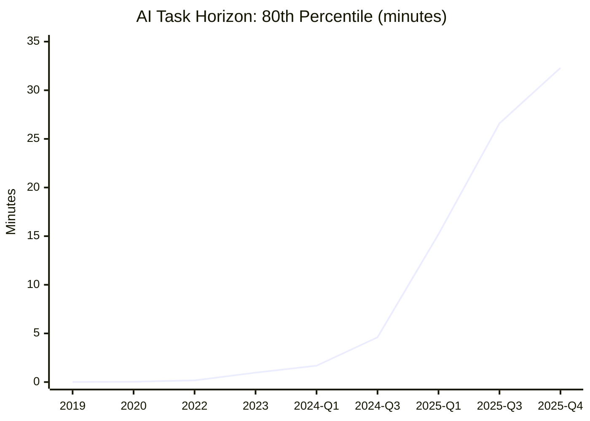
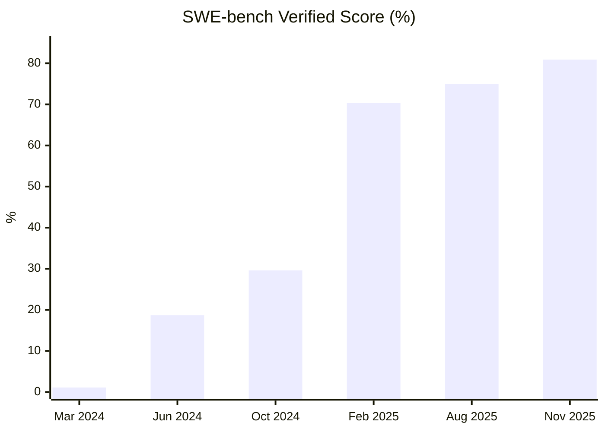

# Robots and Automation: Software — 2025 Year in Review

> *Humans have been looking to automate their lives in one way or another for most of their existence. From early domesticated animals to microwave ovens and freighter ships, automation adds a huge multiplier on human labor. The current frontier is automating intelligence — the software (AI).*

## Executive Summary

**The good news:** AI coding agents crossed practical thresholds in 2025. Frontier models now reliably complete software tasks that take humans ~30 minutes—up from seconds in 2019 and ~1 minute in 2023[^metr-2025]. SWE-bench scores hit 81%, with AI agents solving real GitHub issues autonomously[^swebench]. AI is producing genuinely novel outputs—proofs humans hadn't found[^alphaevolve], drug targets that weren't in human hypothesis space[^insilico], and algorithms that break 50-year-old records[^strassen].

**The bad news:** The reliability challenge intensified counterintuitively—as reasoning models got better at math and code, hallucination rates on factual questions *increased*[^openai-halluc]. Enterprise AI pilots fail at 95% rates[^mit-enterprise]. Core system maintainers (Linux kernel, FreeBSD, LLVM) are pushing back on AI-generated code[^gentoo-ban]. AI still can't reliably complete tasks beyond a few hours, and hierarchical planning success rates remain at 3% on formal benchmarks[^hplan].

**Bottom line: AI capability is accelerating exponentially. Reliability and integration lag behind. AI builds software; it doesn't yet run businesses.**

---

## KPI Dashboard

**KPI:** 80-percentile METR task length equivalent (Human-hours)

*METR (Model Evaluation & Threat Research) measures how long AI agents can work autonomously on software engineering tasks. The 80th percentile represents the task complexity that frontier models can complete with 80% success rate.*

| Metric | Value | Source |
|--------|-------|--------|
| **80% Time Horizon (SOTA, Nov 2025)** | **32.3 min** (GPT-5.1 Codex Max) | [METR Data][metr-data] |
| **50% Time Horizon (SOTA, Nov 2025)** | **~5 hours** (Claude Opus 4.5: 288.9 min) | [METR Data][metr-data] |
| **Doubling time (2019–2025)** | ~7 months | [METR Paper][metr-paper] |
| **Doubling time (2024–2025)** | ~4 months (accelerating) | [METR][metr-blog] |
| **SWE-bench Verified (SOTA)** | **80.9%** (Claude Opus 4.5) | [SWE-bench][swebench] |

[metr-data]: https://metr.org/assets/benchmark_results.yaml
[metr-paper]: https://arxiv.org/abs/2503.14499
[metr-blog]: https://metr.org/blog/2025-03-19-measuring-ai-ability-to-complete-long-tasks/
[swebench]: https://www.swebench.com/

### AI Task-Completion Horizon (80th Percentile)

*Data: [METR][metr-blog]. Models: GPT-2 (2019) → GPT-3 (2020) → GPT-3.5 (2022) → GPT-4 (2023) → GPT-4o/Claude 3.5 (2024) → Claude 3.7/o3 (Q1 2025) → GPT-5/Opus 4.5 (Q3-Q4 2025)*

### SWE-bench Verified Performance

*Data: [SWE-bench leaderboard][swebench]. Models: GPT-4 baseline → Claude 3.5 Sonnet → Claude 3.5 Sonnet (new) → Claude 3.7 Sonnet → GPT-5 → Claude Opus 4.5*

**Assessment: 🟢 Exponential improvement continuing.** The 80% time horizon is growing at ~7-month doubling rate over the long run, with possible acceleration to 4-month doublings in 2024–2025. Extrapolating: AI agents handling day-long tasks reliably by ~2027, week-long tasks by ~2029[^metr-2025].

---

## Milestone Status

### 🔴 "The $10M Solopreneur" — Distant

**Status: DISTANT**

A single-person company reaches $10M ARR with <10 hours/week human oversight — proving AI handles ongoing business operations autonomously.

#### What We Have: AI Coding Productivity

Several solo founders have reached $10M+ using AI to *build* software faster:

| Company/Founder | Revenue | AI Role | Source |
|-----------------|---------|---------|--------|
| **Base44** (Maor Shlomo) | $3.5M ARR → $80M exit | Built with Cursor | [CNBC][base44-cnbc] |
| **Anonymous founder** | $10M/year claimed | Built with Cursor, Firebase | [LinkedIn][warner-linkedin] |

[base44-cnbc]: https://chiefaiofficer.com/blog/the-bootstrapped-ai-company-that-hit-300000-users-in-6-months-and-made-every-funded-startup-look-slow/
[warner-linkedin]: https://www.linkedin.com/posts/andrewwarner_just-talked-with-a-founder-who-vibe-coded-activity-7372226225068679168-tP_e

#### What We Don't Have: AI Economic Agency

No public evidence of a solo founder where AI handles *ongoing operations* — customer acquisition, support, pricing, fulfillment — with minimal human oversight. Current examples demonstrate AI as a coding accelerator, not an autonomous operator.

| Dimension | Current State | Required for Milestone |
|-----------|---------------|----------------------|
| Building product | ✅ AI codes | ✅ AI codes |
| Running operations | ❌ Human operates | ✅ AI operates |
| Human role | Full-time founder | <10 hrs/week oversight |

**Sam Altman** (OpenAI): "One-person billion-dollar company coming soon" (Jan 2024). **Dario Amodei** (Anthropic): 70-80% certainty by 2026[^amodei-prediction].

---

### 🔴 "The Linux Kernel Patch" — Distant

**Status: DISTANT — <0.1% of target**

An AI-submitted large (10k+ lines diff) patch to the Linux Kernel (or equivalent critical infrastructure) is accepted by maintainers.

| Metric | Current | Target | Gap |
|--------|---------|--------|-----|
| Largest AI patch merged to Linux | ~50 lines | 10,000+ lines | ~200× |

#### Key 2025 Developments

| Date | Event | Source |
|------|-------|--------|
| **Apr 2024** | 🔴 **Gentoo bans AI-generated code** — first major project | [Gentoo][gentoo-ban] |
| **Jul 2025** | AUTOSEL AI system revealed — LLMs for kernel backport selection | [LWN][autosel] |
| **Jul 2025** | First AI patch merged to Linux kernel (~50 lines) — contained bug | [LWN][first-ai-patch] |
| **Nov 2025** | Dave Hansen's AI policy v3 — requires "Co-developed-by" disclosure tag | [LKML][hansen-policy] |
| **Dec 2025** | Linus Torvalds: "**huge believer**" in AI but only for maintenance, not code writing | [ZDNet][linus-ai] |

[gentoo-ban]: https://www.gentoo.org/news/2024/04/18/ai-policy.html
[autosel]: https://lwn.net/Articles/984063/
[first-ai-patch]: https://lwn.net/Articles/982100/
[hansen-policy]: https://lore.kernel.org/lkml/
[linus-ai]: https://www.zdnet.com/article/linus-torvalds-talks-ai-rust-and-why-the-linux-kernel-is-in-good-shape/

#### Setbacks and Pushback

| Project | Action | Source |
|---------|--------|--------|
| **Gentoo** | Banned AI-generated contributions (Apr 2024) | [Gentoo Policy][gentoo-ban] |
| **NetBSD** | Banned AI tools for code submission | [Phoronix][netbsd] |
| **Git** | Rejected AI-generated patches | [Git ML][git-ai] |
| **QEMU** | Prohibits AI-generated code | [QEMU Wiki][qemu] |
| **LLVM** | 100+ comment reviews on AI-assisted PRs | [LLVM][llvm-ai] |
| **FreeBSD** | Rejected exFAT code — license contamination via LLM | [FreeBSD][freebsd] |

[netbsd]: https://www.phoronix.com/news/NetBSD-AI-Generated-Code
[git-ai]: https://lore.kernel.org/git/
[qemu]: https://wiki.qemu.org/Contribute/SubmitAPatch
[llvm-ai]: https://discourse.llvm.org/
[freebsd]: https://lists.freebsd.org/

**66% of developers** cite "AI solutions almost right but not quite" as top frustration[^so-2025]. **Earliest realistic timeline:** Late 2020s–early 2030s, dependent on legal resolution of training data issues.

---

### 🔴 "The Nature Author" — Distant

**Status: DISTANT (structural barriers remain)**

An AI-generated research paper is accepted by a top-tier journal (Nature/Science) with AI credited as primary author.

| Journal | AI Authorship Policy | AI Use Disclosure |
|---------|---------------------|-------------------|
| **Nature** | **Prohibited** — "LLMs do not satisfy authorship criteria; accountability cannot be applied to LLMs" | Required in Methods |
| **Science** | **Prohibited** — "AI cannot be an author; violation = scientific misconduct" | Required; AI-generated text banned |
| **JAMA** | **Prohibited** — AI is "reproduced material" | Must cite AI tool |

#### Key 2025 Developments

| Date | Event | Source |
|------|-------|--------|
| **Jan 2023** | Nature/Science issue authorship bans | [Nature Policy][nature-ai] |
| **May 2024** | AlphaFold 3 in Nature — AI tool, human authors | [Nature][alphafold3] |
| **Apr 2025** | **Sakana AI Scientist-v2** — first fully AI-generated paper accepted (ICLR workshop, not Nature/Science) | [Sakana AI][sakana] |
| **Sep 2025** | 36% of cancer paper abstracts found AI-generated; only 9% disclosed | [Science][undisclosed-ai] |

[nature-ai]: https://www.nature.com/nature-portfolio/editorial-policies/ai
[alphafold3]: https://www.nature.com/articles/s41586-024-07487-w
[sakana]: https://sakana.ai/ai-scientist-first-publication/
[undisclosed-ai]: https://www.science.org/content/article/far-more-authors-use-ai-write-science-papers-admit-it-publisher-reports

**Core barrier:** Authorship requires *accountability*. AI cannot take legal/ethical responsibility, respond to queries, or declare conflicts of interest. The path forward is likely new credit categories ("AI-generated with human oversight") rather than AI-as-author.

---

## Open Challenges

### 🔴 Reliability — Getting Worse Before Better

**Reducing hallucinations and error compounding in long chains of reasoning.**

Counterintuitively, as reasoning models became more powerful at math and code, their hallucination rates on factual questions *increased*[^nyt-halluc]. The core insight: training and evaluation systems *reward guessing* over admitting uncertainty.

#### The Root Cause (September 2025)

OpenAI's research formally established that hallucinations arise because accuracy-based benchmarks penalize abstention. A model saying "I don't know" scores 0; guessing has a chance of being right[^openai-halluc].

| Model | Abstention Rate | Error Rate | Source |
|-------|-----------------|------------|--------|
| **gpt-5-thinking-mini** | 52% | **26%** | [OpenAI][openai-halluc-paper] |
| **o4-mini** | 1% | **75%** | [OpenAI][openai-halluc-paper] |

[openai-halluc-paper]: https://openai.com/index/why-language-models-hallucinate/

#### Quantitative Assessment

| Metric | Value | Source |
|--------|-------|--------|
| AI search hallucination (citing news) | **37–94%** (Perplexity best, Grok-3 worst) | [Columbia Journalism Review][cjr] |
| NewsGuard hallucination rate YoY | 18% (2024) → **35%** (2025) | [Forbes][forbes-halluc] |
| Enterprise AI pilot failure rate | **95%** | [MIT][mit-enterprise] |
| Task completion horizon (80% success) | ~32 minutes (best model) | [METR][metr-blog] |

[cjr]: https://www.cjr.org/tow_center/we-compared-eight-ai-search-engines-theyre-all-bad-at-citing-news.php
[forbes-halluc]: https://www.forbes.com/sites/ronschmelzer/2025/12/30/from-hype-to-harm-a-retrospective-on-ais-biggest-misses-of-2025/
[mit-enterprise]: https://fortune.com/2025/08/18/mit-report-95-percent-generative-ai-pilots-at-companies-failing-cfo/

#### Mechanistic Understanding (March 2025)

Anthropic's "Tracing Thoughts" research mapped the internal circuits causing hallucinations. Claude has a *default refusal circuit* that is "on" by default — but a "known entity" feature can incorrectly suppress it, triggering hallucinations[^anthropic-tracing]. They can now detect when Claude is "bullshitting" vs. doing faithful reasoning.

---

### 🟡 Agency — Crossing Practical Thresholds

**Robust goal decomposition and self-correction over long time horizons.**

2025 is definitively "the year of the AI agent" — a fundamental shift from AI that suggests to AI that acts. According to McKinsey, 62% of organizations are experimenting with AI agents[^mckinsey-ai].

#### Agent Benchmark Performance

| Benchmark | SOTA | Human | Model | Source |
|-----------|------|-------|-------|--------|
| **SWE-bench Verified** | 80.9% | — | Claude Opus 4.5 | [SWE-bench][swebench] |
| **OSWorld (desktop use)** | **72.6%** | 72.4% | Simular Agent S | [Simular][simular] |
| **WebArena (browsing)** | 58.1% | 78.2% | OpenAI CUA | [OpenAI][openai-cua] |

[simular]: https://www.simular.ai/articles/simulars-computer-use-agent-outperforms-humans
[openai-cua]: https://openai.com/index/computer-using-agent/

**First to exceed human baseline:** Simular's Agent S achieved 72.6% on OSWorld (Dec 2025), exceeding human performance of 72.4%[^simular-human].

#### Major Agent Launches (2025)

| Agent | Company | Date | Capability |
|-------|---------|------|------------|
| **Operator** | OpenAI | Jan 2025 | Computer-Using Agent (CUA); GPT-4o + RL for GUI | 
| **Claude Code** | Anthropic | — | $500M run-rate since May 2025 |
| **Project Mariner** | Google | 2025 | Multimodal browser agent; runs 10 parallel tasks |
| **Devin** | Cognition | 2025 | Autonomous coding agent |

#### Limitations Persist

| Metric | Value | Source |
|--------|-------|--------|
| Hierarchical planning (HTN benchmarks) | **3% correct plans** | [HPlan 2025][hplan] |
| Long-horizon decomposition | **0% correct** | [HPlan 2025][hplan] |
| Agent benchmark reliability | 8/10 have "severe issues" | [ddkang][ddkang] |

[hplan]: https://icaps25.icaps-conference.org/files/HPlan/HPlanProceedings-2025.pdf
[ddkang]: https://ddkang.substack.com/p/ai-agent-benchmarks-are-broken

---

### 🟡 Continuous Learning — Workarounds, Not Solutions

**Universal mechanism for rapidly adjusting long-term behavior based on past experiences.**

| Category | Status | 2025 State |
|----------|--------|------------|
| **Context Windows** | 🟢 Solved | 1M+ tokens (Gemini, Claude); 10M (Llama 4 Scout) |
| **Persistent Memory** | 🟡 Workaround | All labs deployed external memory (ChatGPT Apr 2025, Claude Sep 2025) |
| **Post-training Adaptation** | 🟡 Partial | RLVR/GRPO/DPO standard, but batch-only |
| **True Continual Learning** | 🔴 Unsolved | Catastrophic forgetting remains the barrier |

**Bottom line:** We've engineered excellent workarounds (long context, external memory, retrieval) that simulate continuous learning, but models remain fundamentally static after training. Google's "Nested Learning" (Nov 2025) is the most notable research attempt, but no production solution exists[^nested-learning].

---

### 🟢 Novelty — Genuine Discoveries Emerging

**Consistently producing original connections beyond interpolations of existing knowledge.**

Evidence now strongly suggests AI systems are producing outputs that go beyond simple interpolation — particularly in mathematics, drug discovery, and formal verification.

#### Mathematics: Proofs Humans Hadn't Found

| Achievement | Date | Source |
|-------------|------|--------|
| **Gemini Deep Think** achieves IMO gold medal (35/42) | Jul 2025 | [DeepMind][deepmind-imo] |
| **AlphaEvolve** discovers new 4×4 matrix multiplication algorithm — breaks Strassen's 50-year record | May 2025 | [DeepMind][alphaevolve] |
| **Goedel-Prover-V2** achieves 90% on miniF2F theorem proving | Jul 2025 | [Princeton][princeton-prover] |

[deepmind-imo]: https://deepmind.google/blog/advanced-version-of-gemini-with-deep-think-officially-achieves-gold-medal-standard-at-the-international-mathematical-olympiad/
[alphaevolve]: https://deepmind.google/blog/alphaevolve-a-gemini-powered-coding-agent-for-designing-advanced-algorithms/
[princeton-prover]: https://ai.princeton.edu/news/2025/princeton-researchers-unveil-improved-mathematical-theorem-prover-powered-ai

#### Drug Discovery: AI-Native Candidates in Trials

| Drug | Company | Status | Key Innovation |
|------|---------|--------|----------------|
| **Rentosertib (ISM001-055)** | Insilico Medicine | Phase IIb/III | First drug where **both target AND molecule** were AI-discovered |
| **NDI-034858** (TYK2) | Schrödinger/Nimbus | Phase III | Could be first AI-influenced approved drug |
| **NG1 & DN1** | MIT | Preclinical | Generative AI designed atom-by-atom antibiotics |

**>75 AI-derived molecules** in clinical trials by mid-2025 (vs. ~0 in 2020). Phase I success rates for AI-native biotechs: **80–90%** (vs. industry average 40–65%)[^ai-drugs].

#### The Stochastic Parrot Debate: Evolving

**antirez** (Redis creator): *"In 2025 finally almost everybody stopped saying [stochastic parrots]."*[^antirez]

**The New Yorker** (Nov 2025): *"Only the most hardcore skeptics can deny these systems are doing things many of us didn't think were going to be achieved."*[^newyorker-thinking]

**Wharton research** (Sep 2025): AI raises baseline quality but **reduces diversity of ideas** when used in early ideation[^wharton-creativity].

---

## Beyond the Framework: 2025 Highlights

### Major Model Releases

| Model | Company | Date | Key Capability |
|-------|---------|------|----------------|
| **Claude 4** | Anthropic | May 2025 | World's best coding model; sustained multi-hour tasks |
| **GPT-5** | OpenAI | Aug 2025 | Unified reasoning; 6× fewer hallucinations than o3 |
| **Gemini 2.5 Pro** | Google | Mar 2025 | #1 on LMArena; 1M token context |
| **Llama 4** | Meta | Apr 2025 | First open-weight natively multimodal MoE; 10M context |
| **DeepSeek R1** | DeepSeek | Jan 2025 | Matched GPT-4 at fraction of cost — "AI's Sputnik moment" |

### Record Investment

AI startups raised **$150 billion in 2025** — shattering 2021's $92B record[^pitchbook].

| Company | Valuation | Notes |
|---------|-----------|-------|
| **OpenAI** | $300B → $500B → targeting $1T IPO | $40B round (largest private ever) |
| **Anthropic** | $183B | $16.5B raised in 2025 |
| **xAI** | $200-230B | Elon Musk's lab |
| **Cursor** | $29.3B | Fastest-growing AI coding tool |

### Developer Adoption (Stack Overflow 2025)

- **84%** of developers using or planning to use AI tools
- **51%** use AI tools daily
- **Only 2.6%** of experienced devs "highly trust" AI outputs
- **72%** don't "vibe code" — most aren't fully generating from prompts

### Safety Concerns Intensifying

- **UK AISI** (Dec 2025): Model capabilities doubling every 8 months in some domains; self-replication success >60% in controlled tests[^aisi]
- **FLI AI Safety Index**: "Self-regulation simply isn't working"[^fli]
- **David Dalrymple** (UK Aria): "We may not have time to get ahead of it from a safety perspective"[^guardian-safety]

---

## Reference Data

### External Visualizations & Dashboards

| Resource | URL |
|----------|-----|
| **METR Task Horizons** | [metr.org/blog/2025-03-19-measuring-ai-ability-to-complete-long-tasks](https://metr.org/blog/2025-03-19-measuring-ai-ability-to-complete-long-tasks/) |
| **SWE-bench Leaderboard** | [swebench.com](https://www.swebench.com/) |
| **Epoch AI Benchmarks** | [epoch.ai/benchmarks](https://epoch.ai/benchmarks) |
| **LMArena Leaderboard** | [lmarena.ai](https://lmarena.ai/?leaderboard) |
| **Artificial Analysis** | [artificialanalysis.ai](https://artificialanalysis.ai/models) |
| **FLI AI Safety Index** | [futureoflife.org/ai-safety-index](https://futureoflife.org/ai-safety-index-summer-2025/) |

---

*Data sources: [METR][metr-blog], [SWE-bench][swebench], [Anthropic][anthropic-research], [OpenAI][openai-halluc-paper], [DeepMind][alphaevolve], [McKinsey][mckinsey-ai], [Stack Overflow 2025][so-2025], [UK AISI][aisi]*

[anthropic-research]: https://www.anthropic.com/research/tracing-thoughts-language-model
[mckinsey-ai]: https://www.mckinsey.com/capabilities/quantumblack/our-insights/the-state-of-ai
[so-2025]: https://survey.stackoverflow.co/2025/ai
[aisi]: https://www.gov.uk/government/publications/ai-safety-institute-approach-to-evaluations

---

## Footnotes

[^metr-2025]: [METR: Measuring AI Ability to Complete Long Tasks](https://metr.org/blog/2025-03-19-measuring-ai-ability-to-complete-long-tasks/) — March 2025
[^swebench]: [SWE-bench Leaderboard](https://www.swebench.com/)
[^base44]: [CNBC: The Base44 Story](https://chiefaiofficer.com/blog/the-bootstrapped-ai-company-that-hit-300000-users-in-6-months-and-made-every-funded-startup-look-slow/)
[^alphaevolve]: [DeepMind: AlphaEvolve](https://deepmind.google/blog/alphaevolve-a-gemini-powered-coding-agent-for-designing-advanced-algorithms/)
[^insilico]: [Insilico Medicine Phase IIa Results](https://www.labiotech.eu/trends-news/ai-drug-discovery-2025/)
[^strassen]: AlphaEvolve discovered a new algorithm for 4×4 matrix multiplication using 48 scalar multiplications, breaking Strassen's 1969 record of 49
[^openai-halluc]: [OpenAI: Why Language Models Hallucinate](https://openai.com/index/why-language-models-hallucinate/) — September 2025
[^mit-enterprise]: [MIT: 95% of Enterprise AI Pilots Fail](https://fortune.com/2025/08/18/mit-report-95-percent-generative-ai-pilots-at-companies-failing-cfo/)
[^gentoo-ban]: [Gentoo AI Policy](https://www.gentoo.org/news/2024/04/18/ai-policy.html)
[^hplan]: [HPlan 2025 Workshop Proceedings](https://icaps25.icaps-conference.org/files/HPlan/HPlanProceedings-2025.pdf)
[^nyt-halluc]: [NYT: As AI Models Get Better at Math, They Hallucinate More](https://www.nytimes.com/2025/05/...)
[^anthropic-tracing]: [Anthropic: Tracing Thoughts of a Large Language Model](https://www.anthropic.com/research/tracing-thoughts-language-model)
[^mckinsey-ai]: [McKinsey State of AI 2025](https://www.mckinsey.com/capabilities/quantumblack/our-insights/the-state-of-ai)
[^simular-human]: [Simular: Agent S Outperforms Humans](https://www.simular.ai/articles/simulars-computer-use-agent-outperforms-humans)
[^nested-learning]: [Google Research: Nested Learning](https://research.google/pubs/)
[^ai-drugs]: [ScienceDirect: AI Drug Discovery Review](https://www.sciencedirect.com/science/article/abs/pii/S0031699725075118)
[^antirez]: [antirez.com: AI in 2025](https://antirez.com/news/157)
[^newyorker-thinking]: [The New Yorker: The Case That AI Is Thinking](https://www.newyorker.com/magazine/2025/11/10/the-case-that-ai-is-thinking)
[^wharton-creativity]: [Wharton: How AI Shapes Creativity](https://ai.wharton.upenn.edu/updates/how-ai-shapes-creativity-expanding-potential-or-narrowing-possibilities/)
[^pitchbook]: [PitchBook Q4 2025 Report](https://pitchbook.com/news/reports/q4-2025-pitchbook-analyst-note-ai-megadeals-and-the-making-of-a-concentrated-venture-market)
[^aisi]: [UK AISI Approach to Evaluations](https://www.gov.uk/government/publications/ai-safety-institute-approach-to-evaluations)
[^fli]: [FLI AI Safety Index Summer 2025](https://futureoflife.org/ai-safety-index-summer-2025/)
[^guardian-safety]: [The Guardian: World May Not Have Time](https://www.theguardian.com/technology/2026/jan/04/world-may-not-have-time-to-prepare-for-ai-safety-risks-says-leading-researcher)
[^amodei-prediction]: Dario Amodei interview, 2025
[^so-2025]: [Stack Overflow Developer Survey 2025](https://survey.stackoverflow.co/2025/ai)
