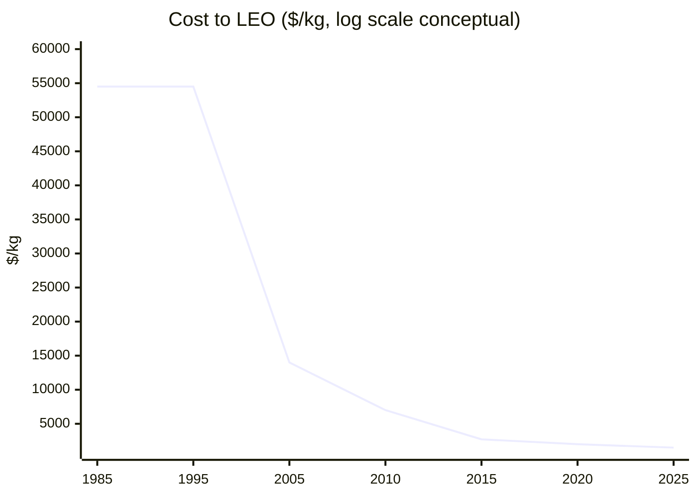
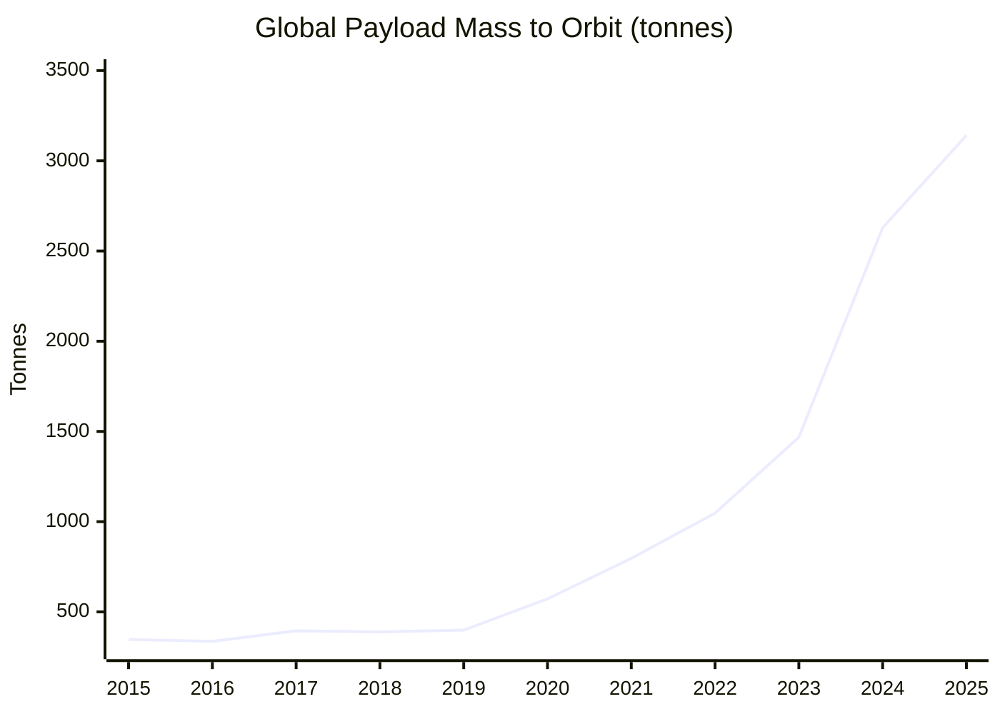
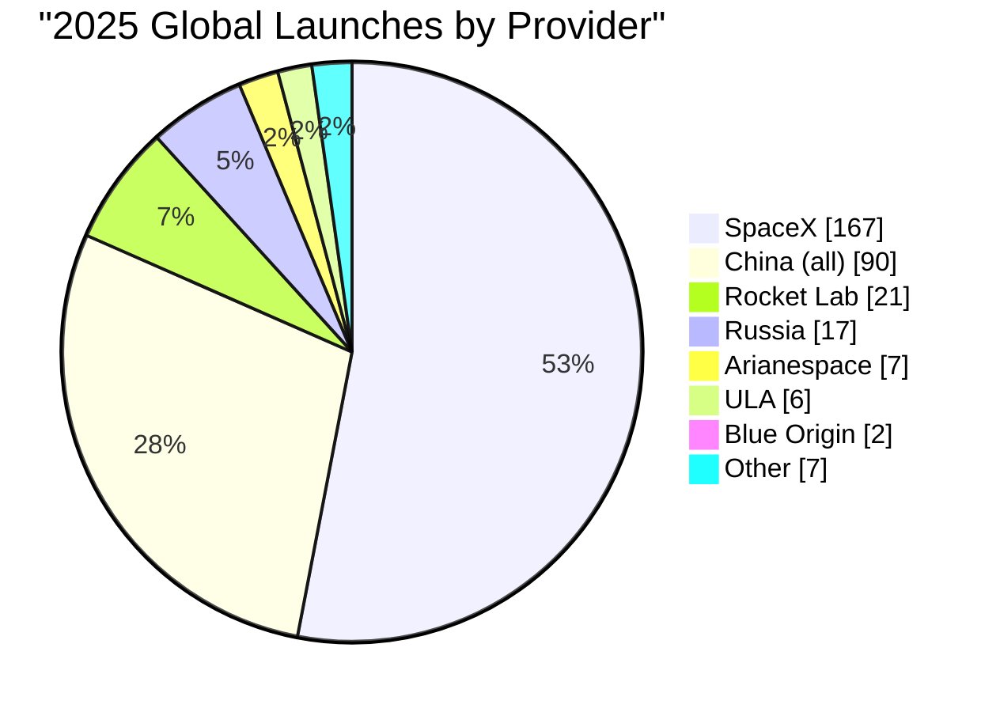

# Rockets and Space — 2025 Year in Review

> *What child hasn't looked at the starry sky in wonder? The universe promises many worlds humanity could spread to — removing some eggs from the "one basket," a new age of discovery, making all raw materials cheap, and vast opportunities for community independence.*

## Executive Summary

**The good news:** We are in a golden age of spaceflight. SpaceX completed 167 orbital launches in 2025 — more than any entity in history[^spacex-167]. Humanity delivered **~3,100 tonnes to orbit** — a new record, though still ~3% of the 100,000 tonne "Deluge" threshold[^jsr]. Launch costs continue to fall, with Falcon Heavy delivering cargo for **$1,500/kg**[^spacex-cost]. Blue Origin's New Glenn achieved the first non-SpaceX propulsive booster landing[^newglenn]. Varda Space Industries completed five in-space manufacturing missions[^varda], and commercial space stations are now in flight article production.

**The bad news:** The harder milestones — permanent lunar bases, space-manufactured products on pharmacy shelves, and Mars settlement — remain years or decades away. VIPER (the ice-prospecting rover) was cancelled, then revived[^viper]. Starship HLS delays pushed the first crewed lunar landing to 2028[^artemis]. Radiation shielding for Mars transit remains unsolved — a round-trip will deliver ~1.2 Sv, double NASA's career limit[^radiation]. Boeing Starliner stranded astronauts for 9 months[^starliner]. And the Trump administration's FY2026 budget proposed significant NASA cuts including potential SLS termination[^nasa-cuts].

**Bottom line: Launch is solved. Settlement is not.**

---

## KPI Dashboard

### Cost to LEO ($/kg)

| Provider | Vehicle | Cost/kg (2025) | Source |
|----------|---------|----------------|--------|
| **SpaceX** | Falcon Heavy | **$1,500** | [SpaceXStock][spacex-cost] |
| **SpaceX** | Falcon 9 (reusable) | **$2,720** | [SpaceXStock][spacex-cost] |
| Blue Origin | New Glenn | ~$1,500–$2,000 | [SpaceXStock][spacex-cost] |
| ULA | Vulcan | $4,044 | [SpaceXStock][spacex-cost] |
| China | Long March 3B | $4,412 | [China-in-Space][china-cost] |
| Rocket Lab | Electron | $19,039 | [Wikipedia][electron] |
| *Historical* | Space Shuttle | $54,500 | [CSIS][csis] |
| *Projected* | Starship (with reuse) | ~$100 | [NextBigFuture][nbf-starship] |

[spacex-cost]: https://spacexstock.com/spacex-vs-competitors-launch-market-share-2025/
[china-cost]: https://www.china-in-space.com/p/what-is-the-cost-of-a-long-march
[electron]: https://en.wikipedia.org/wiki/Rocket_Lab_Electron
[csis]: https://aerospace.csis.org/data/space-launch-to-low-earth-orbit-how-much-does-it-cost/
[nbf-starship]: https://www.nextbigfuture.com/2025/08/spacex-launch-will-be-five-times-lower-cost-for-end-of-2025.html

### Cost to LEO Historical Trend

*Data: [CSIS Aerospace Security][csis], [Our World in Data](https://ourworldindata.org/grapher/cost-space-launches-low-earth-orbit)*

### Global Launches & Payload Mass

*Data: [Jonathan's Space Report][jsr]*

[jsr]: https://planet4589.org/space/stats/out/msatannual.txt

**Assessment: 🟢 Strongly improving.** A 40× reduction from the Space Shuttle era ($54,500/kg → $1,500/kg for Falcon Heavy). With Starship operational, another 10–100× reduction is possible by 2030.

---

## Milestone Status

### 🔴 "The Deluge" — 100,000 Tonnes to Orbit

**Status: Distant — Currently at 3.1%**

Annual mass to orbit reached **3,141 tonnes** in 2025 — a new record, but still ~30× short of the 100,000 tonne threshold. This milestone requires ~1,000 Starship-class flights per year — achievable only with fully operational Starship reuse and multiple launch sites. **Earliest plausible: early 2030s.**

| Year | Mass to Orbit (tonnes) | Growth | SpaceX Share |
|------|------------------------|--------|--------------|
| 2020 | 572 | +43% | 60% |
| 2021 | 797 | +39% | — |
| 2022 | 1,047 | +31% | — |
| 2023 | 1,468 | +40% | — |
| 2024 | 2,629 | +79% | ~86% |
| **2025** | **3,141** | **+19%** | **~85%** |

*Source: [Jonathan's Space Report][jsr], [Ill-Defined Space 2025 Summary][ids-2025]*

[ids-2025]: https://www.illdefined.space/the-ill-defined-space-global-orbital-launch-summary-2025/

#### Starship Development (2025)

| Flight | Date | Outcome | Source |
|--------|------|---------|--------|
| **Flight 7** | Jan 16 | ❌ Ship 33 exploded; booster caught | [SpaceX][spacex-7] |
| **Flight 8** | Mar 6 | ❌ Ship 34 lost during ascent | [NASASpaceflight][nsf-10] |
| **Flight 9** | May 27 | ⚠️ First booster reuse; booster lost | [NBC News][nbc-9] |
| **Flight 10** | Aug 26 | ✅ First payload deploy demo; ship ocean landing | [Scientific American][sciam-10] |
| **Flight 11** | Oct 13 | ✅ All objectives met; Block 2 retired | [Scientific American][sciam-11] |

[spacex-7]: https://www.spacex.com/launches/mission/?missionId=starship-flight-7
[nsf-10]: https://www.nasaspaceflight.com/2025/09/ten-flights-starship-program-successes-failures/
[nbc-9]: https://www.nbcnews.com/science/space/live-blog/spacex-launch-rocket-starship-musk-live-updates-rcna209210
[sciam-10]: https://www.scientificamerican.com/article/spacex-successfully-launches-starship-spacecraft-after-string-of-mishaps/
[sciam-11]: https://www.scientificamerican.com/article/spacexs-starship-succeeds-in-final-test-flight-of-2025/

**SpaceX now accounts for ~53% of global launches and ~85% of mass to orbit.** At current growth rates (~20–40% annually), reaching 100,000 tonnes would take 15–20 years — unless Starship achieves multiple daily flights as SpaceX targets.

---

### 🔴 "The Homestead" — Permanent Crewed Base

**Status: Distant — Targeting mid-2030s**

A permanent crewed base operating 1+ year using local resources (ISRU) on Moon or Mars remains years away. No crewed lunar landing has occurred since Apollo 17 (1972). The earliest realistic timeline: **crewed landing 2027-2028**, permanent base **mid-2030s**.

| Program | Next Major Milestone | Timeline | Source |
|---------|---------------------|----------|--------|
| **Artemis II** | Crewed lunar flyby | NET Apr 2026 | [NASA][artemis] |
| **Artemis III** | First crewed landing | NET mid-2027 (official) / Sep 2028 (SpaceX internal) | [NASA][artemis], [Reuters][reuters-hls] |
| **NASA Gateway** | PPE + HALO launch | 2027 | [NASA][gateway] |
| **China crewed lunar landing** | First crewed landing | ~2030 | [Reuters][china-moon] |
| **China ILRS** | Basic lunar base | 2035 | [China-in-Space][ilrs] |

[artemis]: https://www.nasa.gov/blogs/missions/2025/03/24/nasas-artemis-ii-core-stage-integration-complete-at-kennedy/
[reuters-hls]: https://www.reuters.com/science/us-seek-rival-bids-artemis-3-spacex-lags-nasa-chief-says-2025-10-20/
[gateway]: https://www.nasa.gov/missions/artemis/nasa-prepares-gateway-lunar-space-station-for-journey-to-moon/
[china-moon]: https://www.reuters.com/business/energy/china-led-lunar-base-include-nuclear-power-plant-moons-surface-space-official-2025-04-23/
[ilrs]: https://www.china-in-space.com/p/china-ilrs-lunar-base

#### Key 2025 Events

| Date | Event | Source |
|------|-------|--------|
| **Mar 2** | 🟢 Blue Ghost M1 lands at Mare Crisium — first fully successful CLPS mission | [NASA][clps] |
| **Mar 6** | 🟡 IM-2 lands at lunar south pole (86°S), but lander tipped over | [NASA][im2] |
| **Mar 2025** | 🟢 PRIME-1 drill demonstrated on lunar surface | [NASA][prime1] |
| **Jul 2024** | 🔴 VIPER rover cancelled ($450M spent) | [NASA][viper-cancel] |
| **Sep 2025** | 🟢 VIPER revived — Blue Origin delivery contract ($190M, late 2027) | [NASA][viper] |
| **Sep 2025** | NASA selects 10 new astronaut candidates from 8,000 applicants | [NASA][astros] |
| **Oct 20** | NASA opens SpaceX HLS contract to competitors due to Starship delays | [Reuters][reuters-hls] |
| **Dec 16** | 59 nations signed Artemis Accords | [NASA][accords] |

[clps]: https://www.nasa.gov/news-release/liftoff-nasa-tech-science-en-route-to-moon-with-intuitive-machines/
[im2]: https://www.nasa.gov/news-release/nasa-receives-some-data-before-intuitive-machines-ends-lunar-mission/
[prime1]: https://www.nasa.gov/missions/artemis/nasas-lunar-drill-technology-passes-tests-on-the-moon/
[viper-cancel]: https://www.nasa.gov/news-release/nasa-cancels-viper-lunar-rover/
[astros]: https://www.nasa.gov/news-release/nasa-selects-all-american-2025-class-of-astronaut-candidates/
[viper]: https://www.nasa.gov/news-release/nasa-selects-blue-origin-to-deliver-viper-rover-to-moons-south-pole/
[accords]: https://www.nasa.gov/artemis-accords/

**Why it matters:** ISRU remains unproven on planetary surfaces. VIPER's cancellation (July 2024) and revival (September 2025) highlights the fragility of the pathway to finding usable lunar water ice. Without confirmed ice deposits, the Homestead timeline stretches further.

**SpaceX Starship HLS remains the critical path.** Internal documents suggest a crewed landing is unlikely before 2028, pending orbital refueling demonstrations (10–12 flights required)[^politico-starship].

---

### 🟡 "The Export" — Space-Manufactured Product Sold on Earth

**Status: Approaching — First products expected 2026–2027**

No space-manufactured product is on retail shelves yet. However, technical demonstrations are accelerating rapidly:

| Company | Product | 2025 Status | Source |
|---------|---------|-------------|--------|
| **Varda Space Industries** | Pharmaceutical crystals | 5 missions completed; W-5 launched Nov 28, 2025 | [TechCrunch][varda] |
| **Flawless Photonics** | ZBLAN optical fiber | 12+ km produced on ISS; quality verification ongoing | [ISS National Lab][flawless] |
| **Redwire** | 3D-printed tissues | First live human heart tissue bioprinted in space; 14 PIL-BOXes launched 2025 | [Redwire][redwire] |
| **Space Forge** | Semiconductor materials | Returned first payload May 2025 | [Space Forge][spaceforge] |

[varda]: https://techcrunch.com/2025/11/30/varda-says-it-has-proven-space-manufacturing-works-now-it-wants-to-make-it-boring/
[flawless]: https://issnationallab.org/press-releases/release-ng20-flawless-photonics-fiber-optics/
[redwire]: https://redwirespace.com/newsroom/redwire-creates-first-live-human-heart-tissue-in-space-launches-spacemd-to-enable-new-drug-creation/
[spaceforge]: https://spaceforge.co/news/space-forge-successfully-returns-second-payload-back-to-earth-after-mission-to-manufacture-semiconductors-in-space/

**Varda's path to commercialization:**
1. ✅ Capsule reentry (W-1, Feb 2024: first commercial land reentry in U.S.)
2. ✅ Repeat manufacturing (5 missions, 5 successful reentries)
3. ⏳ Clinical trials (explicitly stated as next goal)
4. ⏳ FDA approval and commercial sales

**Timeline projection:** First FDA clinical trial using space-manufactured compounds: 2026–2027. First commercial drug sale: late 2020s.

#### Commercial Space Stations (Manufacturing Platforms)

| Station | Company | Launch | Status |
|---------|---------|--------|--------|
| **Haven-1** | Vast | May 2026 | Flight article complete |
| **Axiom Station** | Axiom Space | 2027 (PPTM) | Module 1 welds complete |
| **Starlab** | Voyager/Airbus | 2028 | Detail design phase |

*Source: [Vast][vast], [Axiom][axiom]*

[vast]: https://www.vastspace.com/haven-1
[axiom]: https://www.axiomspace.com/news/year-in-review-2025

**Market forecast:** In-space manufacturing market projected to reach $4.6B by 2030, $62.8B by 2040[^ism-market].

[^ism-market]: [MarketsandMarkets: In-Space Manufacturing](https://www.marketsandmarkets.com/PressReleases/in-space-manufacturing.asp)

---

## Open Challenges

### 🔴 Radiation Shielding — Critical gap for Mars

Protecting crew from galactic cosmic rays (GCR) and solar particle events (SPE) during months-long deep space transit remains **the most critical unsolved problem** for human Mars exploration.

| Exposure | Dose | Context |
|----------|------|---------|
| **Mars round-trip transit** | ~0.66 Sv | Transit phases only |
| **500-day Mars surface stay** | ~0.34 Sv | Added to transit |
| **Total Mars mission** | ~1.0-1.2 Sv | 5% increased fatal cancer risk |
| **NASA career limit** | 0.6 Sv | Universal for all astronauts |
| **Artemis I (Helga manikin)** | 30.7 mSv | 13 years of Earth exposure equivalent |

*Sources: [NASA RAD][rad], [Nature 2024][mare]*

[rad]: https://www.swri.org/newsroom/press-releases/swri-scientists-publish-first-radiation-measurements-the-surface-of-mars
[mare]: https://www.nature.com/articles/s41586-024-07927-7

**Key takeaway:** A Mars mission will likely deliver ~2× NASA's career limit per mission. Current solutions:

| Approach | Status | Effectiveness |
|----------|--------|---------------|
| Passive shielding (polyethylene) | ISS crew quarters | 30-55% dose reduction |
| AstroRad vest | Tested on Artemis I | Protects stem cells/sensitive organs |
| Active magnetic shielding | 60+ years of study | Still conceptual (TRL 2–3) |
| Faster transit (advanced propulsion) | Development | Reduces exposure time — most viable path |
| Pharmaceutical countermeasures | Early research | No approved drugs |

**2025 development:** Cosmic Shielding Corporation received $4M AFRL contract for nanocomposite shielding — 7 systems now in space[^cosmic].

**Artemis I validation:** The mission (2022) provided first deep-space radiation data since Apollo, validating that Orion's storm shelter design can limit solar particle event exposure to <150 mSv[^nature-rad].

[^cosmic]: [SpaceNews: Cosmic Shielding](https://spacenews.com/startups-radiation-shield-tech-could-bring-high-performance-ai-chips-to-space/)
[^nature-rad]: [Nature 634: Artemis I radiation measurements](https://www.nature.com/articles/s41586-024-07927-7)

---

### 🟡 Closed-Loop Life Support — 98% water recovery achieved, food remains open

Years-long operation without resupply from Earth requires near-complete recycling of water, oxygen, and eventually food. ISS has achieved **~90-93% closure** for water/atmosphere loops, but food remains 100% resupply-dependent.

| System | Technology | Recovery Rate | Source |
|--------|------------|---------------|--------|
| **Water (ISS)** | UPA + WPA + Brine Processor | **98%** | [NASA][water] |
| **O₂ from CO₂ (ISS)** | Sabatier CRA | **50%** | [NASA][scor] |
| **O₂ from CO₂ (target)** | SCOR/Bosch | >75% (goal: 100%) | [NASA][scor] |
| **Food (ISS)** | Veggie, APH experiments | **0%** (all resupply) | [NASA][veggie] |

[water]: https://www.nasa.gov/missions/station/iss-research/nasa-achieves-water-recovery-milestone-on-international-space-station/
[scor]: https://www.nasa.gov/spacecraft-oxygen-recovery-scor/
[veggie]: https://science.nasa.gov/directorates/smd/astronauts-plant-seed-pillows-in-new-space-agriculture-study/

**June 2023:** NASA achieved 98% water recovery on ISS using the Brine Processor Assembly — meeting the Mars threshold.

**China's Tiangong** has independently achieved 100% O₂ regeneration and >95% water recovery[^tiangong].

[^tiangong]: [SCIO: China's space station achieves 100% oxygen regeneration](http://english.scio.gov.cn/chinavoices/2023-04/14/content_85229262.htm)

#### Food Production Research

| Facility | Results |
|----------|---------|
| **EDEN ISS (Antarctica)** | 268 kg fresh produce from 12.5 m² over 9 months |
| **Lunar Palace 1 (China)** | 105-day test with 3 crew; 80% food self-sufficiency demonstrated |

*Sources: [Frontiers 2020][eden], [npj Microgravity 2025][lunar-palace]*

[eden]: https://www.frontiersin.org/journals/plant-science/articles/10.3389/fpls.2020.00656/full
[lunar-palace]: https://www.nature.com/articles/s41526-025-00518-4

**Gap:** Full closure for Mars (multi-year missions) requires 75%+ oxygen recovery and significant food production — both still TRL 4-6. Timeline to full closure: **2030s** for physical/chemical loops; **2040s** for bioregenerative food.

---

### 🔴 ISRU at Scale — Demonstrated, not production-ready

Production-level extraction of fuel, oxygen, and materials from planetary resources remains unachieved. All demonstrations so far are laboratory-scale.

| Achievement | Demonstrated | Required | Gap |
|-------------|--------------|----------|-----|
| Mars O₂ rate | 12 g/hr (MOXIE) | 2,000 g/hr | 167× |
| Mars propellant | 122 g total | 30,000 kg | ~250,000× |
| Lunar water mined | 0 kg | 2,450 t/year | ∞ |

#### MOXIE Results (Mars)

| Metric | Value | Source |
|--------|-------|--------|
| Total oxygen produced | **122 grams** | [NASA][moxie] |
| Peak production rate | 12 g/hour (2× design goal) | [NASA][moxie] |
| Purity | 98%+ | [NASA][moxie] |
| Mission status | Completed Sep 2024 | [NASA][moxie] |

[moxie]: https://www.nasa.gov/missions/mars-2020-perseverance/perseverance-rover/nasas-oxygen-generating-experiment-moxie-completes-mars-mission/

**Key achievement:** First ISRU demonstration on another planet. **But:** 122g = ~6 hours of breathable air. Starship return propellant requires **1,200 MT per vehicle** (10 million × MOXIE output).

#### Lunar ISRU Status

| Event | Date | Outcome |
|-------|------|---------|
| **IM-2/PRIME-1 landing** | Mar 6, 2025 | Southernmost lunar landing (86°S); lander tipped; TRIDENT drill validated but no ice sampling |
| **VIPER cancelled** | Jul 17, 2024 | $450M spent; budget constraints |
| **VIPER revived** | Sep 19, 2025 | Blue Origin delivery contract; late 2027 launch |
| **NASA Kennedy MRE** | May 2025 | First molecular O₂ produced from regolith simulant in vacuum |
| **LIFT-1 lunar oxygen demo** | — | Not funded |

*Sources: [NASA][prime1], [NASA][viper], [NASA][mre]*

[mre]: https://www.nasa.gov/centers-and-facilities/kennedy/nasa-kennedy-breathes-life-into-moon-soil-testing/

**Critical gap:** No confirmed accessible water ice deposits at the lunar poles. VIPER (2027) is essential for ground-truth data. Without it, the lunar propellant depot concept remains speculative.

| Gap | Current State | Requirement |
|-----|---------------|-------------|
| Polar ice prospecting | No confirmed accessible deposits | Ground-truth ice location |
| Power systems | Kilowatts demonstrated | Megawatts required |
| End-to-end integration | None | Excavation → processing → storage → use |
| Long-duration ops | Hours of testing | Years of continuous operation |

**Timeline to production ISRU:** Lunar oxygen plant: **2030-2035** (low confidence). Mars propellant production: **2040s** (very low confidence).

---

## Beyond the Framework: 2025 Highlights

### Launch Industry Transformation

- **SpaceX: 167 launches in 2025** — all-time record (85% of US orbital missions)
- **Blue Origin New Glenn** reached orbit on first attempt (Jan 16); landed booster on second flight (Nov 13, ESCAPADE Mars mission)
- **China Zhuque-3** reached orbit but failed landing — first Chinese reusable rocket attempt
- **China Long March 12A** — first CASC reusable attempt; orbit success, landing failed
- **Falcon 9 B1067** became first booster to fly 30 times

### Satellite Mega-Constellations

- **Starlink:** 9,300+ satellites in orbit; dominates global broadband
- **Amazon Kuiper:** First 27 production satellites launched April 2025; 180 deployed by year-end
- **China Guowang:** 12+ batches launched for 13,000-satellite broadband constellation[^guowang]

[^guowang]: [SpaceNews: Guowang Launches](https://spacenews.com/china-launches-12th-group-of-guowang-broadband-satellites-as-rocket-milestone-highlights-accelerating-launch-rate/)

### Human Spaceflight

- **Starliner strands astronauts 9 months**: Wilmore & Williams returned on SpaceX Crew-9 (March 18)[^starliner]
- **Boeing Starliner downgraded**: Reduced to 4 missions (from 6); next flight cargo-only
- **Fram2**: First crewed polar orbit spaceflight (90.01° inclination) — 4 civilians flew over Earth's poles (April)[^fram2]
- **China Shenzhou-20 damaged by debris**: Emergency Shenzhou-22 launched in 16 days (Nov)[^shenzhou]
- **Axiom-4**: First Indian astronaut to ISS (Gaganyaan prep); Poland's first since 1978
- **ISS 8 spacecraft docked**: First time all docking ports occupied simultaneously (Dec 1)
- **First wheelchair user in space**: Blue Origin NS-37 (Dec 20)

[^starliner]: [Space.com: Boeing Starliner won't carry NASA astronauts on next flight](https://www.space.com/space-exploration/human-spaceflight/boeing-starliner-wont-carry-nasa-astronauts-next-flight)
[^fram2]: [Wikipedia: Fram2](https://en.wikipedia.org/wiki/Fram2)
[^shenzhou]: [Reuters: China emergency Shenzhou-22 launch](https://www.reuters.com/business/media-telecom/china-launch-shenzhou-22-spaceship-0411-gmt-state-media-reports-2025-11-25/)

### International Milestones

- **India SpaDeX docking** (Jan 16): 4th country to demonstrate autonomous satellite docking (after US, Russia, China)
- **China Tianwen-2** (May 28): Asteroid sample return mission extends China's deep solar system reach

### Policy & Leadership

- **Jared Isaacman confirmed as NASA Administrator** (Dec 18)[^isaacman]
- **Trump Executive Order**: Dissolved National Space Council, set 2028 Moon goal, prioritized commercial[^eo-space]
- **59 Artemis Accords signatories**: Continued international lunar cooperation

[^isaacman]: [Spaceflight Now: Jared Isaacman confirmed as NASA Administrator](https://spaceflightnow.com/2025/12/18/senate-confirms-jared-isaacman-as-15th-nasa-administrator/)
[^eo-space]: [White House: Ensuring American Space Superiority](https://www.whitehouse.gov/presidential-actions/2025/12/ensuring-american-space-superiority/)

### Space Environment

**Space debris:** ESA reports 40,000+ tracked objects, 1.2 million debris >1cm[^esa-debris].

[^esa-debris]: [ESA Space Environment Report 2025](https://www.sdo.esoc.esa.int/publications/Space_Environment_Report_I9R1_20251021.pdf)

---

## Reference Data

### External Visualizations

| Resource | Source |
|----------|--------|
| Launch cost history | [CSIS Aerospace](https://aerospace.csis.org/data/space-launch-to-low-earth-orbit-how-much-does-it-cost/) |
| Jonathan's Space Report (payload stats) | [planet4589.org](https://planet4589.org/space/stats/) |
| SpaceX Launch Tracker | [spacex.com/launches](https://www.spacex.com/launches) |
| ESA Space Environment Report | [ESA SDO](https://www.sdo.esoc.esa.int/) |
| Our World in Data: Launch Costs | [ourworldindata.org](https://ourworldindata.org/grapher/cost-space-launches-low-earth-orbit) |
| 2025 Orbital Launches | [Gunter's Space Page](https://space.skyrocket.de/doc_chr/lau2025.htm) |
| Live satellite tracker | [N2YO](https://www.n2yo.com/) |

---

*Data sources: [Jonathan's Space Report][jsr], [Ill-Defined Space][ids-2025], [NASA][artemis], [SpaceXStock][spacex-cost], [Varda][varda], [ESA][esa-isru], [Nature][mare], [CSIS][csis], [Bryce Tech](https://brycetech.com/reports)*

[esa-isru]: https://www.esa.int/Enabling_Support/Space_Engineering_Technology/ESA_opens_oxygen_plant_making_air_out_of_moondust

---

## Footnotes

[^spacex-167]: [Space.com: SpaceX Shatters Launch Record](https://www.space.com/space-exploration/private-spaceflight/spacex-shatters-its-rocket-launch-record-yet-again-167-orbital-flights-in-2025)
[^jsr]: [Jonathan's Space Report: Payload Statistics](https://planet4589.org/space/stats/out/msatannual.txt)
[^spacex-cost]: [SpaceXStock: Competitors Launch Market Share 2025](https://spacexstock.com/spacex-vs-competitors-launch-market-share-2025/)
[^newglenn]: [CNN: New Glenn First Booster Landing](https://edition.cnn.com/2025/11/13/science/new-glenn-launch-blue-origin-mars)
[^varda]: [TechCrunch: Varda Space Industries](https://techcrunch.com/2025/11/30/varda-says-it-has-proven-space-manufacturing-works-now-it-wants-to-make-it-boring/)
[^viper]: [NASA: VIPER Rover Selection](https://www.nasa.gov/news-release/nasa-selects-blue-origin-to-deliver-viper-rover-to-moons-south-pole/)
[^artemis]: [NASA Artemis II Integration](https://www.nasa.gov/blogs/missions/2025/03/24/nasas-artemis-ii-core-stage-integration-complete-at-kennedy/)
[^radiation]: [ANS Nuclear Newswire: Deep Space Radiation Controls](https://www.ans.org/news/article-7149/deep-space-the-new-frontier-of-radiation-controls/)
[^nasa-cuts]: [SpaceNews: Trump FY2026 Budget](https://spacenews.com/nasa-budget/)
[^politico-starship]: [Politico/Space.com: SpaceX Starship delays Artemis 3 to 2028](https://www.space.com/space-exploration/spacex-starship-timeline-delays-astronaut-moon-landing-for-nasas-artemis-3-mission-to-2028-report)
