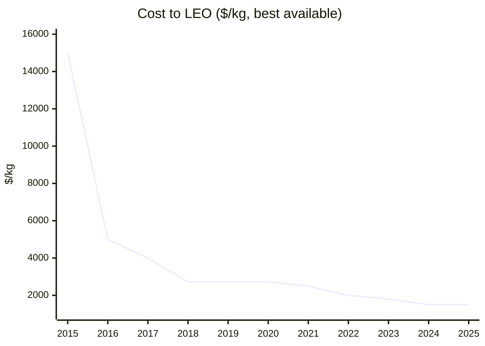
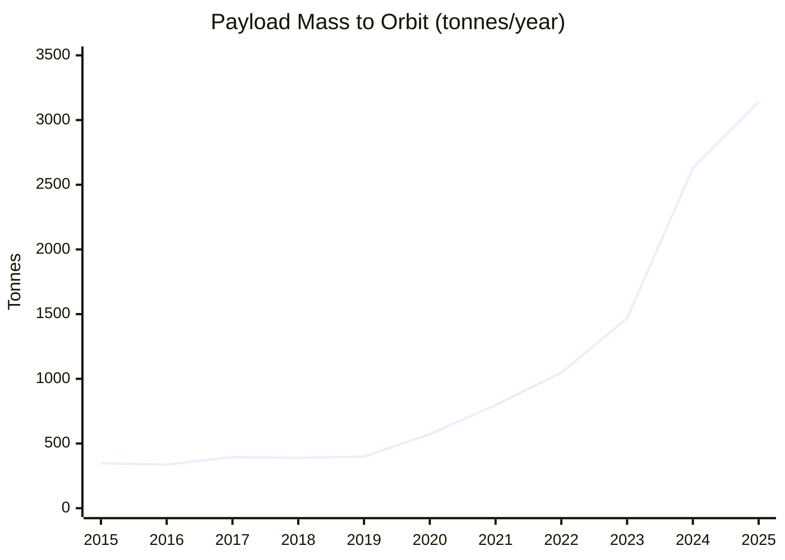

# Rockets and Space — 2025 Year in Review

> *What child hasn't looked at the starry sky in wonder? The universe promises many worlds humanity could spread to — removing some eggs from the "one basket", a new age of discovery, making all raw materials cheap, and vast opportunities for community independence.*

## Executive Summary

**The good news:** We are in a golden age of spaceflight. SpaceX completed 167 orbital launches in 2025 — more than any entity in history[^spacex-167]. Humanity delivered **~3,100 tonnes to orbit** — a new record, though still ~3% of the 100,000 tonne "Deluge" threshold[^jsr]. Launch costs continue to fall, with Falcon Heavy delivering cargo for **$1,500/kg**[^spacex-cost]. Blue Origin's New Glenn achieved the first non-SpaceX propulsive booster landing[^newglenn]. Varda Space Industries completed five in-space manufacturing missions[^varda], and commercial space stations are now in flight article production.

**The bad news:** The harder milestones — permanent lunar bases, space-manufactured products on pharmacy shelves, and Mars settlement — remain years or decades away. VIPER (the ice-prospecting rover) was cancelled, then revived[^viper]. Starship HLS delays pushed the first crewed lunar landing to 2028[^artemis]. Radiation shielding for Mars transit remains unsolved — a round-trip will deliver ~1.2 Sv, double NASA's career limit[^radiation]. And the Trump administration's FY2026 budget proposed significant NASA cuts including potential SLS termination[^nasa-cuts].

**Bottom line: All three milestones remain distant. The physics problems — radiation, life support, ISRU — have no shortcuts.**

---

## KPI Dashboard

**KPI:** Cost to LEO ($/kg)

| Provider | Vehicle | Cost/kg (2025) | Source |
|----------|---------|----------------|--------|
| **SpaceX** | Falcon Heavy | **$1,500** | [SpaceXStock][spacex-cost] |
| **SpaceX** | Falcon 9 (reusable) | **$2,720** | [SpaceXStock][spacex-cost] |
| Blue Origin | New Glenn | ~$1,500-$2,000 | [SpaceXStock][spacex-cost] |
| ULA | Vulcan | $4,044 | [SpaceXStock][spacex-cost] |
| China | Long March 3B | $4,412 | [China-in-Space][china-cost] |
| Rocket Lab | Electron | $19,039 | [Wikipedia][electron] |

[spacex-cost]: https://spacexstock.com/spacex-vs-competitors-launch-market-share-2025/
[china-cost]: https://www.china-in-space.com/p/what-is-the-cost-of-a-long-march
[electron]: https://en.wikipedia.org/wiki/Rocket_Lab_Electron

### Cost to LEO Trend ($/kg, best available)

*Data: [NASA Technical Report 2018][nasa-cost], [SpaceXStock][spacex-cost], industry estimates*

[nasa-cost]: https://ntrs.nasa.gov/api/citations/20200001093/downloads/20200001093.pdf

**Assessment: 🟢 Strongly improving.** A 10× reduction from the Space Shuttle era ($54,500/kg → $2,720/kg for Falcon 9), with Falcon Heavy achieving ~40× reduction. SpaceX's Starship targets **$100/kg** — not yet demonstrated.

---

## Milestone Status

### 🔴 "The Deluge" — 100,000 Tonnes to Orbit

**Status: DISTANT**

Annual mass to orbit reached **3,141 tonnes** in 2025 — a new record, but still ~30× short of the 100,000 tonne threshold. This milestone requires ~1,000 Starship-class flights per year — achievable only with fully operational Starship reuse and multiple launch sites. **Earliest plausible: early 2030s.**

*Data: [Jonathan's Space Report][jsr]*

[jsr]: https://planet4589.org/space/stats/out/msatannual.txt

| Year | Global Tonnage | SpaceX Share | Launches |
|------|----------------|--------------|----------|
| 2020 | 572 | 60% | 128 |
| 2024 | 2,629 | ~86% | 254 |
| **2025** | **3,141** | **~85%** | **315** |

*Source: [Ill-Defined Space 2025 Summary][ids-2025]*

[ids-2025]: https://www.illdefined.space/the-ill-defined-space-global-orbital-launch-summary-2025/

#### Key 2025 Events

| Date | Event | Source |
|------|-------|--------|
| **Jan 16** | Blue Origin New Glenn reaches orbit on first attempt | [AP News][newglenn] |
| **Jan 16** | Starship Flight 7: Second Super Heavy booster catch | [Space.com][ft7] |
| **Mar 6** | Starship Flight 8: Third booster catch; first Ship ocean landing | [NASASpaceflight][ft8] |
| **Aug 15** | Starship Flight 10: First Starlink deployment from Starship | [NextSpaceflight][nsf] |
| **Nov 13** | New Glenn second flight: First non-SpaceX booster landing; ESCAPADE Mars mission launched | [CNN][ng-escapade] |
| **Dec 2025** | SpaceX completes 167 orbital launches — all-time record | [Space.com][spacex-167] |

[newglenn]: https://apnews.com/article/blue-origin-new-glenn-rocket-jeff-bezos-2466fb0e114a09d88a46f71a1e647d50
[ft7]: https://www.space.com/space-exploration/launches-spacecraft/spacex-catches-super-heavy-booster-on-starship-flight-7-test-but-loses-upper-stage-video-photos
[ft8]: https://www.nasaspaceflight.com/2025/03/starship-flight-8/
[nsf]: https://nextspaceflight.com/starship/
[ng-escapade]: https://edition.cnn.com/2025/11/13/science/new-glenn-launch-blue-origin-mars

**SpaceX now accounts for ~53% of global launches and ~85% of mass to orbit.** Starship completed 11 flights in 2025 (6 successful, 5 failures), with Block 2 hardware demonstrating progress toward operational payload delivery.

---

### 🔴 "The Homestead" — Permanent Crewed Base

**Status: DISTANT**

A permanent crewed base operating 1+ year using local resources (ISRU) on Moon or Mars remains years away. No crewed lunar landing has occurred since Apollo 17 (1972). The earliest realistic timeline: **crewed landing 2027-2028**, permanent base **mid-2030s**.

| Program | Next Major Milestone | Timeline | Source |
|---------|---------------------|----------|--------|
| **Artemis II** | Crewed lunar flyby | NET Apr 2026 | [NASA][artemis] |
| **Artemis III** | First crewed landing | NET mid-2027 (official) / Sep 2028 (SpaceX internal) | [NASA][artemis], [Reuters][reuters-hls] |
| **NASA Gateway** | PPE + HALO launch | 2027 | [NASA][gateway] |
| **China ILRS** | Basic lunar base | 2035 | [China-in-Space][ilrs] |

[artemis]: https://www.nasa.gov/blogs/missions/2025/03/24/nasas-artemis-ii-core-stage-integration-complete-at-kennedy/
[reuters-hls]: https://www.reuters.com/science/us-seek-rival-bids-artemis-3-spacex-lags-nasa-chief-says-2025-10-20/
[gateway]: https://www.nasa.gov/missions/artemis/nasa-prepares-gateway-lunar-space-station-for-journey-to-moon/
[ilrs]: https://www.china-in-space.com/p/china-ilrs-lunar-base

#### Key 2025 Events

| Date | Event | Source |
|------|-------|--------|
| **Mar 2** | Firefly Blue Ghost Mission One lands on Moon (first commercial CLPS landing of 2025) | [NASA][clps] |
| **Mar 6** | Intuitive Machines Nova C lands — southernmost lunar landing ever (86°S), but lander tipped over | [NASA][im2] |
| **Sep 2025** | NASA selects 10 new astronaut candidates from 8,000 applicants | [NASA][astros] |
| **Oct 20** | NASA opens SpaceX HLS contract to competitors due to Starship delays | [Reuters][reuters-hls] |
| **Nov 2025** | NASA selects Blue Origin for VIPER delivery ($190M, late 2027) | [NASA][viper] |
| **Dec 16** | 59 nations signed Artemis Accords | [NASA][accords] |

[clps]: https://www.nasa.gov/news-release/liftoff-nasa-tech-science-en-route-to-moon-with-intuitive-machines/
[im2]: https://www.nasa.gov/news-release/nasa-receives-some-data-before-intuitive-machines-ends-lunar-mission/
[astros]: https://www.nasa.gov/news-release/nasa-selects-all-american-2025-class-of-astronaut-candidates/
[viper]: https://www.nasa.gov/news-release/nasa-selects-blue-origin-to-deliver-viper-rover-to-moons-south-pole/
[accords]: https://www.nasa.gov/artemis-accords/

**Why it matters:** ISRU remains unproven on planetary surfaces. VIPER's cancellation (July 2024) and revival (September 2025) highlights the fragility of the pathway to finding usable lunar water ice. Without confirmed ice deposits, the Homestead timeline stretches further.

---

### 🟡 "The Export" — Space-Manufactured Product Sold on Earth

**Status: APPROACHING**

No space-manufactured product is on retail shelves yet. However, technical demonstrations are accelerating rapidly:

| Company | Product | 2025 Status | Source |
|---------|---------|-------------|--------|
| **Varda Space Industries** | Pharmaceutical crystals | 5 missions completed; W-5 launched Nov 28, 2025 | [TechCrunch][varda] |
| **Flawless Photonics** | ZBLAN optical fiber | 11.9 km produced on ISS (Feb-Mar 2024); analysis ongoing | [ISS National Lab][flawless] |
| **Redwire** | 3D-printed tissues | Bristol-Myers Squibb, Purdue partnerships; 14 PIL-BOXes launched 2025 | [Redwire][redwire] |

[varda]: https://techcrunch.com/2025/11/30/varda-says-it-has-proven-space-manufacturing-works-now-it-wants-to-make-it-boring/
[flawless]: https://issnationallab.org/press-releases/release-ng20-flawless-photonics-fiber-optics/
[redwire]: https://ir.redwirespace.com/news-events/press-releases/detail/207

**Varda's path to commercialization:**
1. ✅ Capsule reentry (W-1, Feb 2024: first commercial land reentry in U.S.)
2. ✅ Repeat manufacturing (5 missions, 5 successful reentries)
3. ⏳ Clinical trials (explicitly stated as next goal)
4. ⏳ FDA approval and commercial sales

#### Commercial Space Stations (Manufacturing Platforms)

| Station | Company | Launch | Status |
|---------|---------|--------|--------|
| **Haven-1** | Vast | May 2026 | Flight article complete |
| **Axiom Station** | Axiom Space | 2027 (PPTM) | Module 1 welds complete |
| **Starlab** | Voyager/Airbus | 2028 | Detail design phase |

*Source: [Vast][vast], [Axiom][axiom]*

[vast]: https://www.vastspace.com/haven-1
[axiom]: https://www.axiomspace.com/news/year-in-review-2025

**Market forecast:** In-space manufacturing market projected to reach $4.6B by 2030, $62.8B by 2040[^ism-market].

[^ism-market]: [MarketsandMarkets: In-Space Manufacturing](https://www.marketsandmarkets.com/PressReleases/in-space-manufacturing.asp)

---

## Open Challenges

### 🔴 Radiation Shielding — Critical gap for Mars

Protecting crew from galactic cosmic rays (GCR) and solar particle events (SPE) during months-long deep space transit remains **the most critical unsolved problem** for human Mars exploration.

| Exposure | Dose | Context |
|----------|------|---------|
| **Mars round-trip transit** | ~0.66 Sv | Transit phases only |
| **500-day Mars surface stay** | ~0.34 Sv | Added to transit |
| **Total Mars mission** | ~1.0-1.2 Sv | 5% increased fatal cancer risk |
| **NASA career limit** | 0.6 Sv | Universal for all astronauts |
| **Artemis I (Helga manikin)** | 30.7 mSv | 13 years of Earth exposure equivalent |

*Sources: [NASA RAD][rad], [Nature 2024][mare]*

[rad]: https://www.swri.org/newsroom/press-releases/swri-scientists-publish-first-radiation-measurements-the-surface-of-mars
[mare]: https://www.nature.com/articles/s41586-024-07927-7

**Key takeaway:** A Mars mission will likely deliver ~2× NASA's career limit per mission. Current solutions:

| Approach | Status | Effectiveness |
|----------|--------|---------------|
| Passive shielding (polyethylene) | ISS crew quarters | 30-55% dose reduction |
| AstroRad vest | Tested on Artemis I | Protects stem cells/sensitive organs |
| Active magnetic shielding | 60+ years of study | Still conceptual |
| Faster transit (advanced propulsion) | Development | Reduces exposure time |
| Pharmaceutical countermeasures | Early research | No approved drugs |

**2025 development:** Cosmic Shielding Corporation received $4M AFRL contract for nanocomposite shielding — 7 systems now in space[^cosmic].

[^cosmic]: [SpaceNews: Cosmic Shielding](https://spacenews.com/startups-radiation-shield-tech-could-bring-high-performance-ai-chips-to-space/)

---

### 🟡 Closed-Loop Life Support — 90% closed, food remains open

Years-long operation without resupply from Earth requires near-complete recycling of water, oxygen, and eventually food. ISS has achieved **~90-93% closure** for water/atmosphere loops, but food remains 100% resupply-dependent.

| System | Technology | Recovery Rate | Source |
|--------|------------|---------------|--------|
| **Water (ISS)** | UPA + WPA + Brine Processor | **98%** | [NASA][water] |
| **O₂ from CO₂ (ISS)** | Sabatier CRA | **50%** | [NASA][scor] |
| **O₂ from CO₂ (target)** | SCOR/Bosch | >75% (goal: 100%) | [NASA][scor] |
| **Food (ISS)** | Veggie, APH experiments | **0%** (all resupply) | [NASA][veggie] |

[water]: https://www.nasa.gov/missions/station/iss-research/nasa-achieves-water-recovery-milestone-on-international-space-station/
[scor]: https://www.nasa.gov/spacecraft-oxygen-recovery-scor/
[veggie]: https://science.nasa.gov/directorates/smd/astronauts-plant-seed-pillows-in-new-space-agriculture-study/

#### Food Production Research

| Facility | Results |
|----------|---------|
| **EDEN ISS (Antarctica)** | 268 kg fresh produce from 12.5 m² over 9 months |
| **Lunar Palace 1 (China)** | 105-day test with 3 crew; 80% food self-sufficiency demonstrated |

*Sources: [Frontiers 2020][eden], [npj Microgravity 2025][lunar-palace]*

[eden]: https://www.frontiersin.org/journals/plant-science/articles/10.3389/fpls.2020.00656/full
[lunar-palace]: https://www.nature.com/articles/s41526-025-00518-4

**Gap:** Full closure for Mars (multi-year missions) requires 75%+ oxygen recovery and significant food production — both still TRL 4-6. Timeline to full closure: **2030s** for physical/chemical loops; **2040s** for bioregenerative food.

---

### 🔴 ISRU at Scale — Demonstrated, not production-ready

Production-level extraction of fuel, oxygen, and materials from planetary resources remains unachieved. All demonstrations so far are laboratory-scale.

#### MOXIE Results (Mars)

| Metric | Value | Source |
|--------|-------|--------|
| Total oxygen produced | **122 grams** | [NASA][moxie] |
| Peak production rate | 12 g/hour (2× design goal) | [NASA][moxie] |
| Purity | 98%+ | [NASA][moxie] |
| Mission status | Completed Sep 2024 | [NASA][moxie] |

[moxie]: https://www.nasa.gov/missions/mars-2020-perseverance/perseverance-rover/nasas-oxygen-generating-experiment-moxie-completes-mars-mission/

**Key achievement:** First ISRU demonstration on another planet. **But:** 122g = ~6 hours of breathable air. Starship return propellant requires **1,200 MT per vehicle** (10 million × MOXIE output).

#### Lunar ISRU Status

| Event | Date | Outcome |
|-------|------|---------|
| **IM-2/PRIME-1 landing** | Mar 6, 2025 | Southernmost lunar landing (86°S); lander tipped; TRIDENT drill validated but no ice sampling | [NASA][prime1] |
| **VIPER cancelled** | Jul 17, 2024 | $450M spent; budget constraints |
| **VIPER revived** | Sep 19, 2025 | Blue Origin delivery contract; late 2027 launch | [NASA][viper] |
| **NASA Kennedy MRE** | May 2025 | First molecular O₂ produced from regolith simulant in vacuum | [NASA][mre] |

[prime1]: https://www.nasa.gov/news-release/nasa-receives-some-data-before-intuitive-machines-ends-lunar-mission/
[mre]: https://www.nasa.gov/centers-and-facilities/kennedy/nasa-kennedy-breathes-life-into-moon-soil-testing/

**Critical gap:** No confirmed accessible water ice deposits at the lunar poles. VIPER (2027) is essential for ground-truth data. Without it, the lunar propellant depot concept remains speculative.

| Gap | Current State | Requirement |
|-----|---------------|-------------|
| Polar ice prospecting | No confirmed accessible deposits | Ground-truth ice location |
| Power systems | Kilowatts demonstrated | Megawatts required |
| End-to-end integration | None | Excavation → processing → storage → use |
| Long-duration ops | Hours of testing | Years of continuous operation |

**Timeline to production ISRU:** Lunar oxygen plant: **2030-2035** (low confidence). Mars propellant production: **2040s** (very low confidence).

---

## Beyond the Framework: 2025 Highlights

| Date | Development | Significance |
|------|-------------|--------------|
| **Jan 16** | India SpaDeX docking | 4th country to demonstrate autonomous satellite docking (after US, Russia, China) |
| **Apr 1** | Fram2 polar orbit | First crewed polar orbit spaceflight (90.01° inclination) |
| **Apr 28** | Amazon Kuiper launches begin | 180 satellites deployed by year-end; Starlink competitor emerging |
| **May 28** | China Tianwen-2 | Asteroid sample return mission extends China's deep solar system reach |
| **Jun 25** | Axiom-4 | First Indian astronaut to ISS (Gaganyaan prep); Poland's first since 1978 |
| **Nov 24** | Boeing Starliner downgraded | Reduced to 4 missions (from 6); next flight cargo-only |
| **Dec 1** | ISS 8 spacecraft docked | First time all docking ports occupied simultaneously |
| **Dec 3** | China Zhuque-3 | First non-US reusable rocket booster landing attempt (crash landing) |
| **Dec 20** | First wheelchair user in space | Blue Origin NS-37 |
| **Dec 23** | Long March 12A | China's first CASC reusable attempt; orbit success, landing failed |

**Space debris:** ESA reports 40,000+ tracked objects, 1.2 million debris >1cm[^esa-debris].

[^esa-debris]: [ESA Space Environment Report 2025](https://www.sdo.esoc.esa.int/publications/Space_Environment_Report_I9R1_20251021.pdf)

**Mega-constellations:** China launched 12+ batches for its 13,000-satellite Guowang broadband constellation, joining the race with Starlink (7,000+) and Kuiper[^guowang].

[^guowang]: [SpaceNews: Guowang Launches](https://spacenews.com/china-launches-12th-group-of-guowang-broadband-satellites-as-rocket-milestone-highlights-accelerating-launch-rate/)

---

## Reference Data

### External Visualizations

| Resource | Source |
|----------|--------|
| Jonathan's Space Report (payload stats) | [planet4589.org](https://planet4589.org/space/stats/) |
| SpaceX Launch Tracker | [spacex.com/launches](https://www.spacex.com/launches) |
| ESA Space Environment Report | [ESA SDO](https://www.sdo.esoc.esa.int/) |
| Our World in Data: Launch Costs | [ourworldindata.org](https://ourworldindata.org/grapher/cost-space-launches-low-earth-orbit) |
| 2025 Orbital Launches | [Gunter's Space Page](https://space.skyrocket.de/doc_chr/lau2025.htm) |

---

*Data sources: [Jonathan's Space Report][jsr], [Ill-Defined Space][ids-2025], [NASA][artemis], [SpaceXStock][spacex-cost], [Varda][varda], [ESA][esa-isru], [Nature][mare]*

[esa-isru]: https://www.esa.int/Enabling_Support/Space_Engineering_Technology/ESA_opens_oxygen_plant_making_air_out_of_moondust

---

## Footnotes

[^spacex-167]: [Space.com: SpaceX Shatters Launch Record](https://www.space.com/space-exploration/private-spaceflight/spacex-shatters-its-rocket-launch-record-yet-again-167-orbital-flights-in-2025)
[^jsr]: [Jonathan's Space Report: Payload Statistics](https://planet4589.org/space/stats/out/msatannual.txt)
[^spacex-cost]: [SpaceXStock: Competitors Launch Market Share 2025](https://spacexstock.com/spacex-vs-competitors-launch-market-share-2025/)
[^newglenn]: [CNN: New Glenn First Booster Landing](https://edition.cnn.com/2025/11/13/science/new-glenn-launch-blue-origin-mars)
[^varda]: [TechCrunch: Varda Space Industries](https://techcrunch.com/2025/11/30/varda-says-it-has-proven-space-manufacturing-works-now-it-wants-to-make-it-boring/)
[^viper]: [NASA: VIPER Rover Selection](https://www.nasa.gov/news-release/nasa-selects-blue-origin-to-deliver-viper-rover-to-moons-south-pole/)
[^artemis]: [NASA Artemis II Integration](https://www.nasa.gov/blogs/missions/2025/03/24/nasas-artemis-ii-core-stage-integration-complete-at-kennedy/)
[^radiation]: [ANS Nuclear Newswire: Deep Space Radiation Controls](https://www.ans.org/news/article-7149/deep-space-the-new-frontier-of-radiation-controls/)
[^nasa-cuts]: [SpaceNews: Trump FY2026 Budget](https://spacenews.com/nasa-budget/)
