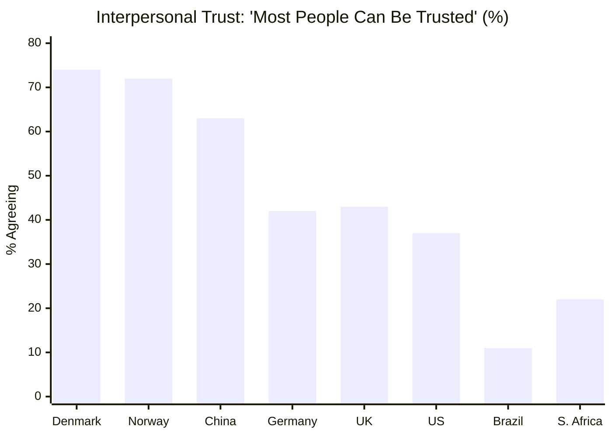
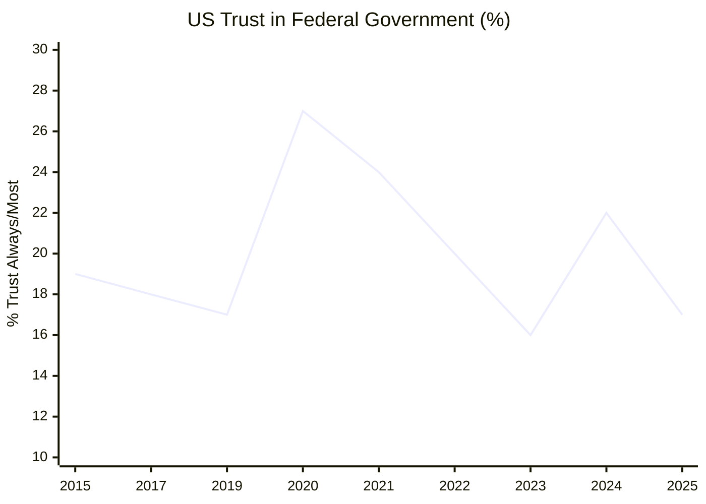
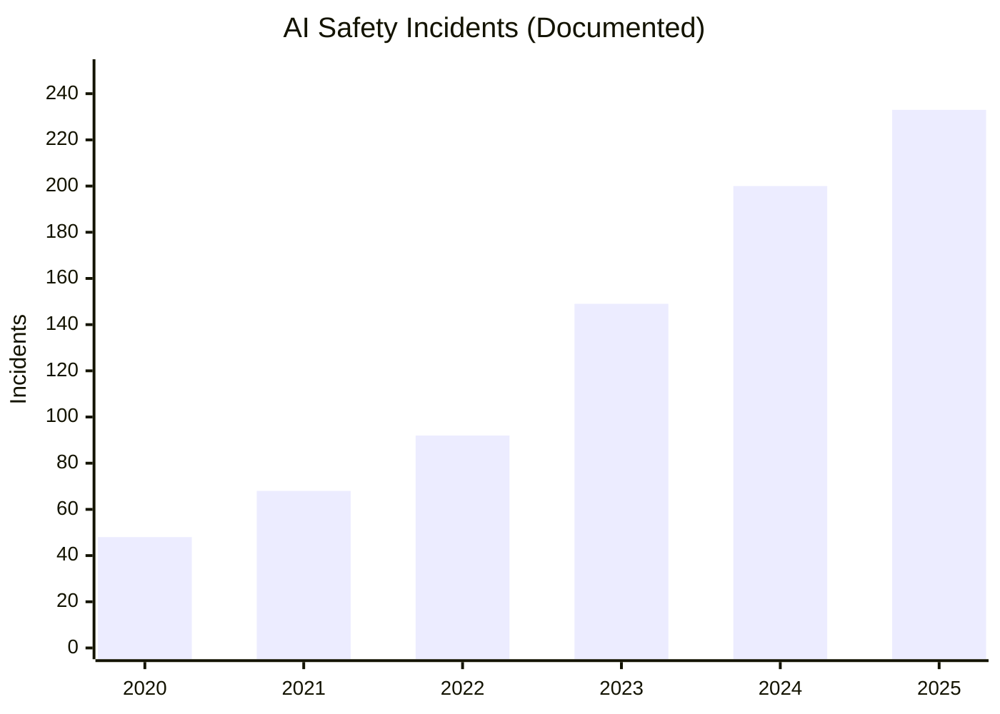
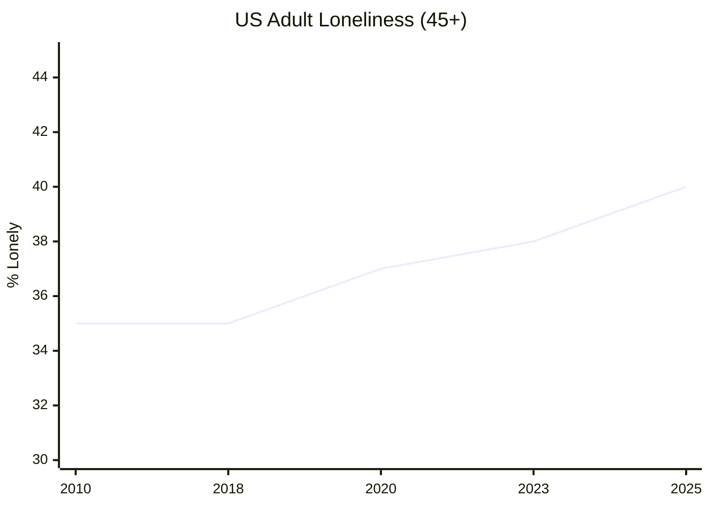
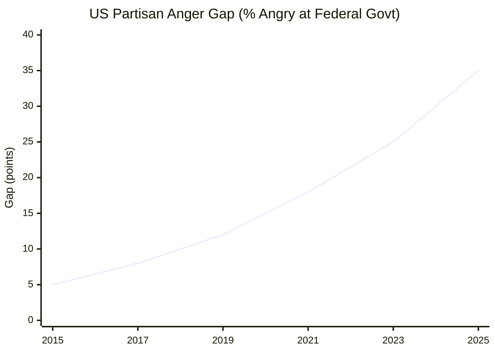

# Society and Cohesion — 2025 Year in Review

> *As humanity progresses in its great endeavors, many challenges await our society. To survive into the future, we must pass the great filters — avoid wiping ourselves out with weapons of mass destruction, align our robots and learn to coexist with them, and keep humans in meaningful relationships with one another and the physical world.*

## Executive Summary

**The good news:** Social technologies are evolving. Alternative platforms like Bluesky reached 40M+ users[^bluesky]. Deliberative democracy is institutionalizing — the Council of Europe and OECD are mainstreaming citizen assemblies[^coe-deliberative]. Australia became the first country to implement a national under-16 social media ban[^aus-ban]. Community Notes expanded to Meta's 3B+ users[^meta-notes]. Youth-led protests toppled governments in Nepal, Bangladesh, and Mongolia, demonstrating Gen Z's capacity for collective action[^carnegie-genz]. South Korea's martial law attempt was reversed within 6 hours by citizens and parliament — democracy's immune response functioning[^sk-crisis].

**The bad news:** The great filters loom closer than ever. The Doomsday Clock stands at 89 seconds to midnight — the closest in history[^doomsday]. For the first time in 20+ years, autocracies (91) outnumber democracies (88); 72% of the world's population now lives under autocratic rule[^vdem]. Loneliness kills about 871,000 people annually[^who-loneliness]. Trust stagnates while grievance grows: 61% globally hold institutional grievances[^edelman]. Documented AI safety incidents surged 56%[^ai-incidents], and multiple families are suing AI companies over chatbot-related deaths[^cnn-lawsuits][^guardian-openai]. The last major nuclear arms control treaty (New START) expires in weeks with no replacement[^newstart].

**Bottom line: Society's immune system is being tested. The antibodies are forming, but the infection is spreading faster.**

---

## KPI Dashboard

| Metric | Value | Trend | Source |
|--------|-------|-------|--------|
| **Interpersonal Trust (Global)** | **~30–35%** (WVS median) | Flat | [Our World in Data][owid-trust] |
| **Institutional Trust (28-country avg)** | **56%** | Flat | [Edelman 2025][edelman-2025] |
| **Trust in Government (OECD)** | **39%** high trust | Flat | [OECD Trust Survey][oecd-trust] |
| **US Trust in Government** | **17%** | ↓ Near historic low | [Pew Dec 2025][pew-trust] |
| **World in Autocracies** | **72%** of population | ↑ Worsening | [V-Dem 2025][vdem-2025] |
| **Doomsday Clock** | **89 seconds** to midnight | ↑ Closest ever | [Bulletin of Atomic Scientists][doomsday-clock] |
| **Loneliness Prevalence** | **1 in 6** globally (~16%) | ↑ Worsening | [WHO 2025][who-loneliness] |

[owid-trust]: https://ourworldindata.org/trust
[edelman-2025]: https://www.edelman.com/trust/2025/trust-barometer
[oecd-trust]: https://www.oecd.org/en/publications/oecd-survey-on-drivers-of-trust-in-public-institutions-2024-results_9a20554b-en.html
[pew-trust]: https://www.pewresearch.org/politics/2025/12/04/public-trust-in-government-1958-2025/
[vdem-2025]: https://www.v-dem.net/documents/60/V-dem-dr__2025_lowres.pdf
[doomsday-clock]: https://thebulletin.org/doomsday-clock/2025-statement/
[who-loneliness]: https://www.who.int/news/item/30-06-2025-social-connection-linked-to-improved-heath-and-reduced-risk-of-early-death

### Interpersonal Trust by Country

*Data: [World Values Survey Wave 7 (2022)][wvs]*

[wvs]: https://www.worldvaluessurvey.org/WVSOnline.jsp

### US Trust in Federal Government (1958–2025)

*Data: [Pew Research][pew-trust]*

**Assessment: ⚠️ Stable but fragile.** Global institutional trust stagnates at 56% while interpersonal trust shows modest post-COVID recovery in some democracies. The dominant 2025 theme is **"grievance"** — 6 in 10 people globally feel institutions work against them, and unprecedented numbers now view hostile activism as legitimate (40% approve[^edelman]).

---

## Milestone Status

### 🔴 "Avoiding the Great Filters" — Existential Risk

**Status: Critical — 89 seconds to midnight**

The Doomsday Clock, set by the Bulletin of the Atomic Scientists, reached its closest point to catastrophe on January 28, 2025[^doomsday]. Multiple escalation pathways remain active. The era of post-Cold War nuclear reductions is ending — all nine nuclear states are modernizing or expanding arsenals.

| Threat Vector | 2025 Status | Source |
|---------------|-------------|--------|
| Nuclear arsenals | ~12,241 warheads globally; all major powers modernizing | [SIPRI Yearbook 2025][sipri] |
| New START | Expires Feb 5, 2026; Russia suspended inspections 2023; no replacement | [State Dept][state-start] |
| Iran nuclear | IAEA declared non-compliance (first in 20 years); Israeli/US strikes destroyed centrifuge program | [IAEA][iaea-iran] |
| Autonomous weapons | UNGA resolution passed (156-5), but no binding treaty | [Stop Killer Robots][stopkillerrobots] |
| Biosecurity | First H5N5 human fatality (Nov 2025); H5N1 in US (71 cases, 2 deaths) | [WHO][who-h5n5], [CDC][cdc-h5n1] |

[sipri]: https://www.sipri.org/yearbook/2025
[state-start]: https://www.state.gov/new-start-treaty
[iaea-iran]: https://www.iaea.org/newscenter/focus/iran/iaea-and-iran-iaea-board-reports
[stopkillerrobots]: https://www.stopkillerrobots.org/news/156-states-support-unga-resolution/
[cdc-h5n1]: https://www.cdc.gov/bird-flu/situation-summary/index.html

#### Key 2025 Events

| Date | Event | Source |
|------|-------|--------|
| Jan 28, 2025 | **Doomsday Clock moved to 89 seconds** — closest ever to midnight | [Bulletin][doomsday-clock] |
| Jun 12, 2025 | IAEA formally declares Iran in breach of non-proliferation obligations | [IAEA][iaea-iran] |
| Jun 13–24, 2025 | Israeli/US strikes destroy ~22,000 Iranian centrifuges | [ISIS Reports][isis-iran] |
| Nov 6, 2025 | **UNGA adopts autonomous weapons resolution**: 156 for, 5 against | [Stop Killer Robots][stopkillerrobots] |
| Nov 15, 2025 | First H5N5 human fatality (US) — novel influenza subtype | [WHO][who-h5n5] |
| Dec 29–30, 2025 | China's largest-ever military exercise encircling Taiwan | [Reuters][reuters-taiwan] |

[isis-iran]: https://isis-online.org/isis-reports/analysis-of-iaea-iran-verification-and-monitoring-and-npt-safeguards-reports-september-2025
[who-h5n5]: https://www.who.int/emergencies/disease-outbreak-news/item/2025-DON590
[reuters-taiwan]: https://www.reuters.com/world/china/chinas-military-conduct-live-fire-exercises-around-taiwan-tuesday-2025-12-28/

---

### 🟡 "AI Alignment and Coexistence" — Learning to Live with Machines

**Status: Mixed — governance accelerating, but capability growth outpacing safety**

The alignment problem remains fundamentally unsolved. The FLI Safety Index found **no major AI company scores above D in existential safety**[^fli-safety]. Real-world harms — teen suicides linked to chatbots[^guardian-characterai][^guardian-openai], state-sponsored AI-enabled cyber operations[^guardian-cyberattack], and accelerating job displacement[^adp-displacement] — demonstrate we are coexisting with AI systems before we have aligned them.

*Data: [Stanford AI Index / Responsible AI Labs][stanford-ai]*

[stanford-ai]: https://responsibleailabs.ai/knowledge-hub/articles/ai-safety-incidents-2024

| Metric | Status | Source |
|--------|--------|--------|
| AI safety incidents | **+56%** YoY (233 in 2025) | [Stanford AI Index][stanford-ai] |
| Major labs existential safety grade | **D average** (FLI) | [Future of Life Institute][fli-safety] |
| EU AI Act | In force; prohibitions effective Feb 2025 | [EU Digital Strategy][eu-ai-act] |
| US federal framework | None; Trump EO preempts state regulations | [White House][whitehouse-ai] |
| Job displacement (early-career tech) | **−20%** in AI-exposed roles since late 2022 | [ADP/Stanford][adp-ai-jobs] |
| Expert extinction estimates | 10–20% (Hinton); median 5–10% (2022 survey) | [The Guardian][guardian-hinton] |

[fli-safety]: https://futureoflife.org/ai-safety-index-winter-2025/
[eu-ai-act]: https://digital-strategy.ec.europa.eu/en/policies/regulatory-framework-ai
[whitehouse-ai]: https://www.whitehouse.gov/presidential-actions/2025/12/eliminating-state-law-obstruction-of-national-artificial-intelligence-policy/
[adp-ai-jobs]: https://www.adpresearch.com/yes-ai-is-affecting-employment-heres-the-data/
[guardian-hinton]: https://www.theguardian.com/technology/2024/dec/27/godfather-of-ai-raises-odds-of-the-technology-wiping-out-humanity-over-next-30-years

#### Key 2025 Events

| Date | Event | Source |
|------|-------|--------|
| Feb 2, 2025 | **EU AI Act prohibited practices take effect** | [EU][eu-ai-act] |
| May 22, 2025 | Anthropic activates ASL-3 CBRN protections for Claude Opus 4 — industry first | [Anthropic][anthropic-asl3] |
| Aug 13, 2025 | Geoffrey Hinton: 10–20% chance of AI extinction in 30 years | [CNN][cnn-hinton] |
| Oct 29, 2025 | **Character.AI bans all users under 18** after suicide lawsuits | [The Guardian][guardian-characterai] |
| Dec 2025 | **All 8 major AI labs receive D grade** on existential safety (FLI) | [FLI][fli-safety] |
| Dec 11, 2025 | Trump EO preempts state AI regulations, focuses on "dominance" over safety | [White House][whitehouse-ai] |

[anthropic-asl3]: https://www.anthropic.com/news/activating-asl3-protections
[cnn-hinton]: https://www.cnn.com/2025/08/13/tech/ai-geoffrey-hinton
[guardian-characterai]: https://www.theguardian.com/technology/2025/oct/29/character-ai-suicide-children-ban

---

### 🔴 "Preserving Human Connection" — The Loneliness Epidemic

**Status: Critical — 871,000 deaths annually from loneliness**

The WHO's first-ever global report on social connection quantified the crisis: loneliness kills 100 people every hour[^who-loneliness]. The health impact equals smoking 15 cigarettes/day[^surgeon-general].

*Data: [AARP Loneliness Studies][aarp]*

[aarp]: https://www.aarp.org/pri/topics/social-leisure/relationships/loneliness-social-connections-2025/

| Metric | 2025 Value | Source |
|--------|------------|--------|
| Global loneliness | **1 in 6** people (~16%) | [WHO][who-loneliness] |
| Deaths from loneliness | **~871,000/year** (model-based estimate) | [WHO][who-loneliness] |
| US adults 45+ lonely | **40%** (up from 35% in 2018) | [AARP][aarp] |
| US adults feeling isolated | **54%** | [APA Nov 2025][apa-stress] |
| Gen Z mental health challenges | **40%** of high schoolers persistently sad/hopeless | [CDC YRBSS][cdc-yrbss] |
| Global daily screen time | **6h 40min** | [DataReportal][datareportal] |

[surgeon-general]: https://www.hhs.gov/sites/default/files/surgeon-general-social-connection-advisory.pdf
[apa-stress]: https://www.apa.org/news/press/releases/2025/11/nation-suffering-division-loneliness
[cdc-yrbss]: https://www.cdc.gov/children-mental-health/data-research/index.html
[datareportal]: https://explodingtopics.com/blog/screen-time-stats

#### Policy Response (2025)

| Jurisdiction | Action | Date | Source |
|--------------|--------|------|--------|
| **WHO** | First WHA Resolution treating loneliness as public health priority | May 2025 | [WHO][who-loneliness] |
| **Australia** | Under-16 social media ban takes effect — world first | Dec 10, 2025 | [Reuters][reuters-aus] |
| **California** | Newsom executive order addressing boys/young men loneliness | Aug 4, 2025 | [EdSource][edsource-newsom] |
| **Denmark** | Announces under-15 social media ban | Oct 7, 2025 | [The Guardian][guardian-denmark] |

[reuters-aus]: https://www.reuters.com/legal/litigation/australia-social-media-ban-takes-effect-world-first-2025-12-09/
[edsource-newsom]: https://edsource.org/2025/newsom-addresses-loneliness-crisis-mental-health-care/737866
[guardian-denmark]: https://www.theguardian.com/world/2025/oct/07/danish-pm-plans-to-ban-social-medimmfor-under-15s-warning-it-is-stealing-childhood

---

## Open Challenges

### 🔴 Trust Erosion and Polarization

**Status: Critical — record grievances, fact-checking retreating**

The verification infrastructure is fragmenting as synthetic content explodes. Meta retreated from fact-checking[^meta-cn] while ~8 million deepfakes now circulate online — up 900% since 2023[^deepstrike]. Europe enforces; America retreats.

*Data: [Pew Research][pew-anger]*

[pew-anger]: https://www.pewresearch.org/short-reads/2025/12/04/as-democrats-anger-spikes-americans-feelings-about-the-federal-government-grow-more-polarized/

| Metric | 2025 Value | Source |
|--------|------------|--------|
| Global grievance holders | **61%** | [Edelman 2025][edelman-2025] |
| US partisan anger gap | **35 points** (record) | [Pew][pew-anger] |
| Agree parties can't agree on facts | **80%** | [Pew][pew-facts] |
| Deepfakes online | **~8 million** (+900% since 2023, vendor estimate) | [DeepStrike][deepstrike] |
| Community Notes effectiveness | 46% reduction in reposts when shown | [PNAS][pnas-cn] |

[pew-facts]: https://www.pewresearch.org/politics/2024/09/09/partisan-antipathy-more-intense-extensive/
[deepstrike]: https://deepstrike.io/blog/deepfake-statistics-2025
[pnas-cn]: https://www.pnas.org/doi/10.1073/pnas.2503413122

#### Key 2025 Events

| Date | Event | Source |
|------|-------|--------|
| Jan 7, 2025 | **Meta ends US fact-checking**, shifts to Community Notes model | [Meta][meta-cn] |
| Feb 13, 2025 | EU integrates Disinformation Code into Digital Services Act | [EC][ec-dsa] |
| Nov 2025 | 200,000+ US Community Notes contributors on Meta | [Meta Transparency][meta-transparency] |
| Dec 5, 2025 | **EU fines X €120M** — first DSA enforcement for deceptive blue checkmarks | [EC][ec-x-fine] |

[meta-cn]: https://about.fb.com/news/2025/01/meta-more-speech-fewer-mistakes/
[ec-dsa]: https://ec.europa.eu/commission/presscorner/detail/en/ip_25_505
[meta-transparency]: https://transparency.meta.com/features/community-notes/
[ec-x-fine]: https://ec.europa.eu/commission/presscorner/detail/en/ip_24_4639

---

### 🔴 Simulacra vs Reality

**Status: Critical — first AI chatbot-related deaths, lawsuits mounting**

The line between virtual and real is blurring with fatal consequences. Multiple families have filed wrongful death lawsuits against AI companies. 72% of US teens have tried AI companions; 48% use them for mental health support[^electroiq].

| Metric | 2025 Value | Source |
|--------|------------|--------|
| Teen AI companion usage | **72%** have tried; **52%** regular users | [TechCrunch][tc-ai-teens] |
| ChatGPT users showing suicidal intent | **1M+/week** | [The Guardian][guardian-openai] |
| Wrongful death lawsuits against AI companies | **8+** | [CNN][cnn-lawsuits] |
| AI companion market | **$37B** (2025); projected **$552B** by 2035 | [Precedence Research][precedence] |
| Italy fine against Replika | **€5M** (GDPR violations) | [EDPB][edpb-replika] |

[electroiq]: https://electroiq.com/stats/ai-companions-statistics/
[tc-ai-teens]: https://www.americanactionforum.org/insight/ai-companions-opportunities-risks-and-policy-implications/
[guardian-openai]: https://www.theguardian.com/technology/2025/oct/27/chatgpt-suicide-self-harm-openai
[cnn-lawsuits]: https://www.cnn.com/2025/11/06/us/openai-chatgpt-suicide-lawsuit-invs-vis
[precedence]: https://www.precedenceresearch.com/ai-companion-market
[edpb-replika]: https://www.edpb.europa.eu/news/national-news/2025/ai-italian-supervisory-authority-fines-company-behind-chatbot-replika_en

#### Key 2025 Events

| Date | Event | Source |
|------|-------|--------|
| May 19, 2025 | **TAKE IT DOWN Act** signed — first federal law on AI intimate imagery | [Congress.gov][congress-takedown] |
| Sept 11, 2025 | **FTC launches investigation** into 7 AI companion companies | [FTC][ftc-inquiry] |
| Oct 13, 2025 | **California SB 243** — first state to regulate AI companion chatbots | [TechCrunch][tc-ca-sb243] |
| Oct 29, 2025 | **Character.AI bans all users under 18** after lawsuits | [Character.AI][characterai-ban] |
| Dec 12, 2025 | OpenAI/Microsoft sued over ChatGPT's alleged role in murder-suicide | [Le Monde][lemonde-murder] |

[congress-takedown]: https://www.congress.gov/bill/119th-congress/senate-bill/146
[ftc-inquiry]: https://www.ftc.gov/news-events/news/press-releases/2025/09/ftc-launches-inquiry-ai-chatbots-acting-companions
[tc-ca-sb243]: https://techcrunch.com/2025/10/13/california-becomes-first-state-to-regulate-ai-companion-chatbots/
[characterai-ban]: https://blog.character.ai/u18-chat-announcement/
[lemonde-murder]: https://www.lemonde.fr/en/pixels/article/2025/12/12/open-ai-microsoft-face-lawsuit-over-chatgpt-s-alleged-role-in-a-murder-suicide_6748404_13.html

---

### 🟡 Social Technologies — Building New Infrastructure

**Status: Mixed — exit working, voice failing**

Users are migrating to decentralized alternatives ("exit" strategy gaining traction). But participation in existing governance mechanisms is declining ("voice" strategy struggling). 

| Technology | Status | Key Metric | Source |
|------------|--------|-----------|--------|
| **Bluesky** | 🟢 Thriving | 40M+ users (Nov 2025), tripled YoY | [Backlinko][backlinko-bluesky] |
| **Community Notes** | 🟡 Scaling | 200K+ contributors on Meta; 14-day publish lag on X | [Meta][meta-transparency] |
| **Deliberative Democracy** | 🟢 Institutionalizing | OECD tracking 700+ assemblies; EU accelerator | [People Powered][peoplepowered] |
| **DAOs** | 🔴 Declining | −60–90% proposals YoY; power concentrating | [DL News][dlnews-dao] |
| **Open Source** | 🟡 Fragile | $8.8T value, but 10 foundations warn of funding crisis | [Linux Foundation][lf-oss] |
| **Prediction Markets** | 🟢 Booming | Kalshi $1B+/week, +1000% YoY | [Kalshi][kalshi] |

[backlinko-bluesky]: https://backlinko.com/bluesky-statistics
[peoplepowered]: https://www.peoplepowered.org/news-content/2025-rewind-top-5-participatory-democracy-wins
[dlnews-dao]: https://www.dlnews.com/articles/defi/daos-grew-quieter-in-2025-per-state-of-defi-report/
[lf-oss]: https://www.linuxfoundation.org/blog/the-state-of-open-source-software-in-2025
[kalshi]: https://kalshi.com

#### Key 2025 Events

| Date | Event | Source |
|------|-------|--------|
| Jan 2025 | Mastodon announces restructuring as European non-profit | [Mastodon Blog][mastodon] |
| Apr 2025 | Meta Community Notes goes live in US | [Meta][meta-cn] |
| Sept 23, 2025 | **10 OSS foundations** publish joint statement on funding fragility | [OpenSSF][openssf] |
| Nov 28, 2025 | Council of Europe advances deliberative democracy in New Democratic Pact | [CoE][coe-deliberative] |

[mastodon]: https://blog.joinmastodon.org/2025/01/the-people-should-own-the-town-square/
[openssf]: https://openssf.org/blog/2025/09/23/open-infrastructure-is-not-free-a-joint-statement-on-sustainable-stewardship/
[coe-deliberative]: https://www.coe.int/en/web/congress/-/moving-forward-on-deliberative-democracy-congress-contributes-to-new-democratic-pact

---

## Beyond the Framework: 2025 Highlights

### Democratic Backsliding

- **V-Dem 2025:** For the first time in 20+ years, autocracies (91) outnumber democracies (88)[^vdem]. 72% of world population lives under autocratic rule (vs 49% in 2004). Liberal democracies at lowest level since 1990.
- **Freedom House:** 19th consecutive year of global freedom decline[^fh]. 60 countries deteriorated; only 34 improved.
- **Romania:** Presidential election annulled due to Russian-linked TikTok bot campaign — first European election cancelled for cyber warfare[^romania].
- **Georgia:** EU accession suspended; ongoing mass protests after disputed elections[^georgia].
- **US:** V-Dem flagged "fastest evolving episode of autocratization in modern history"[^vdem-us].

### Democratic Resilience

- **South Korea:** Martial law attempt reversed in 6 hours by National Assembly vote (190-0); President Yoon impeached within 11 days, removed by Constitutional Court (8-0) in April 2025[^sk-crisis].
- **Bangladesh:** Student-led protests ousted autocratic PM Hasina after 15 years[^bangladesh].

### Gen Z Global Protest Wave

Youth-led anti-corruption protests swept 70+ countries in 2025, using the *One Piece* Jolly Roger flag as unifying symbol[^carnegie-genz]:

| Country | Outcome |
|---------|---------|
| **Nepal** | PM Oli resigned after youth movement |
| **Bangladesh** | PM Hasina resigned after 15 years |
| **Mongolia** | PM Oyun-Erdene resigned after protests |
| **Serbia** | Student protests continue 13+ months |
| **Georgia** | Daily protests against EU accession suspension |

### Inequality

- **Oxfam:** Top 0.1% gained 1000× more wealth than bottom 20% since 1989. Billionaire wealth grew $2.8T in 2024 (~$7.9B/day). 5+ trillionaires expected within a decade[^oxfam].
- 60% of billionaire wealth from inheritance, cronyism, or monopoly — not entrepreneurship[^oxfam].

### World Happiness

- **Finland:** #1 for 8th consecutive year (7.74 score)[^whr].
- **US:** Dropped to #24, new low; 25% of Americans ate all meals alone in 2023[^whr].
- Youth crisis: People are kinder than expected (wallet return experiments), but young Americans report feeling less supported and less optimistic[^whr].

---

## Reference Data

### External Visualizations

| Resource | Source |
|----------|--------|
| V-Dem Democracy Indices | [V-Dem Graphing Tools](https://www.v-dem.net/graphing/graphing-tools/) |
| World Happiness Report | [Data Explorer](https://data.worldhappiness.report/) |
| Our World in Data — Trust | [ourworldindata.org/trust](https://ourworldindata.org/trust) |
| Our World in Data — Democracy | [ourworldindata.org/democracy](https://ourworldindata.org/democracy) |
| Carnegie Global Protest Tracker | [carnegieendowment.org/features/global-protest-tracker](https://carnegieendowment.org/features/global-protest-tracker) |
| Edelman Trust Barometer Archive | [edelman.com/trust/archive](https://www.edelman.com/trust/archive) |
| Doomsday Clock History | [thebulletin.org/doomsday-clock/past-announcements/](https://thebulletin.org/doomsday-clock/past-announcements/) |

---

*Data sources: [Edelman Trust Barometer][edelman-2025], [V-Dem Democracy Report][vdem-2025], [WHO Social Connection Report][who-loneliness], [Bulletin of Atomic Scientists][doomsday-clock], [Our World in Data][owid-trust], [World Happiness Report][whr], [AARP][aarp], [Pew Research][pew-anger], [Stanford AI Index][stanford-ai], [Future of Life Institute][fli-safety], [Freedom House][fh-2025], [SIPRI][sipri]*

[whr]: https://www.worldhappiness.report/
[fh-2025]: https://freedomhouse.org/sites/default/files/2025-02/FITW_World_2025_Feb.2025.pdf

---

## Footnotes

[^bluesky]: [Backlinko: Bluesky Statistics 2025](https://backlinko.com/bluesky-statistics)
[^coe-deliberative]: [Council of Europe: Congress contributes to New Democratic Pact](https://www.coe.int/en/web/congress/-/moving-forward-on-deliberative-democracy-congress-contributes-to-new-democratic-pact)
[^aus-ban]: [Reuters: Australia's under-16 social media ban takes effect](https://www.reuters.com/legal/litigation/australia-social-media-ban-takes-effect-world-first-2025-12-09/)
[^meta-notes]: [Meta Transparency Center: Community Notes](https://transparency.meta.com/features/community-notes/)
[^carnegie-genz]: [Carnegie: Global Protests 2025 — Gen Z, Corruption, Economy](https://carnegieendowment.org/emissary/2025/12/global-protests-2025-genz-corruption-economy)
[^sk-crisis]: [Wikipedia: Impeachment of Yoon Suk Yeol](https://en.wikipedia.org/wiki/Impeachment_of_Yoon_Suk_Yeol)
[^doomsday]: [Bulletin of Atomic Scientists: 2025 Doomsday Clock Statement](https://thebulletin.org/doomsday-clock/2025-statement/)
[^vdem]: [V-Dem Democracy Report 2025](https://www.v-dem.net/documents/60/V-dem-dr__2025_lowres.pdf)
[^who-loneliness]: [WHO: Social connection linked to improved health](https://www.who.int/news/item/30-06-2025-social-connection-linked-to-improved-heath-and-reduced-risk-of-early-death)
[^edelman]: [Edelman Trust Barometer 2025](https://www.edelman.com/trust/2025/trust-barometer)
[^ai-incidents]: [Stanford AI Index / Responsible AI Labs](https://responsibleailabs.ai/knowledge-hub/articles/ai-safety-incidents-2024)
[^fli-safety]: [Future of Life Institute: AI Safety Index Winter 2025](https://futureoflife.org/ai-safety-index-winter-2025/)
[^fh]: [Freedom House: Freedom in the World 2025](https://freedomhouse.org/sites/default/files/2025-02/FITW_World_2025_Feb.2025.pdf)
[^romania]: [Atlantic Council: Romania election annulment](https://www.atlanticcouncil.org/blogs/new-atlanticist/romania-annulled-its-presidential-election-results-amid-alleged-russian-interference-what-happens-next/)
[^georgia]: [Wikipedia: 2024-2026 Georgian protests](https://en.wikipedia.org/wiki/2024%E2%80%932026_Georgian_protests)
[^vdem-us]: [US News: Democracy expert raises alarm about US trends](https://www.usnews.com/news/best-countries/articles/2025-03-25/democracy-expert-raises-alarm-about-u-s-trends-under-trump)
[^bangladesh]: [Britannica: Generation Z protests](https://www.britannica.com/event/Generation-Z-protests)
[^oxfam]: [Oxfam: Takers, Not Makers](https://www.oxfam.org/en/research/takers-not-makers-unjust-poverty-and-unearned-wealth-colonialism)
[^whr]: [World Happiness Report 2025](https://www.worldhappiness.report/)
[^surgeon-general]: [US Surgeon General Advisory on Loneliness](https://www.hhs.gov/sites/default/files/surgeon-general-social-connection-advisory.pdf)
[^meta-cn]: [Meta: More Speech, Fewer Mistakes](https://about.fb.com/news/2025/01/meta-more-speech-fewer-mistakes/)
[^deepstrike]: [DeepStrike: Deepfake Statistics 2025](https://deepstrike.io/blog/deepfake-statistics-2025)
[^newstart]: [US State Department: New START Treaty](https://www.state.gov/new-start-treaty)
[^cnn-lawsuits]: [CNN: OpenAI ChatGPT Suicide Lawsuit](https://www.cnn.com/2025/11/06/us/openai-chatgpt-suicide-lawsuit-invs-vis)
[^guardian-characterai]: [The Guardian: Character.AI bans users under 18 after suicide lawsuits](https://www.theguardian.com/technology/2025/oct/29/character-ai-suicide-children-ban)
[^guardian-cyberattack]: [The Guardian: First AI-orchestrated cyber-espionage campaign detected](https://www.theguardian.com/technology/ng-interactive/2025/dec/30/the-office-block-where-ai-doomers-gather-to-predict-the-apocalypse)
[^adp-displacement]: [ADP Research: Yes, AI is affecting employment](https://www.adpresearch.com/yes-ai-is-affecting-employment-heres-the-data/)
