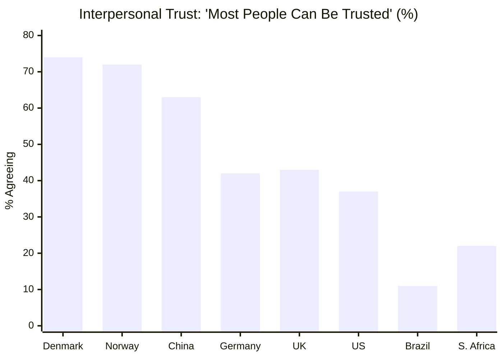
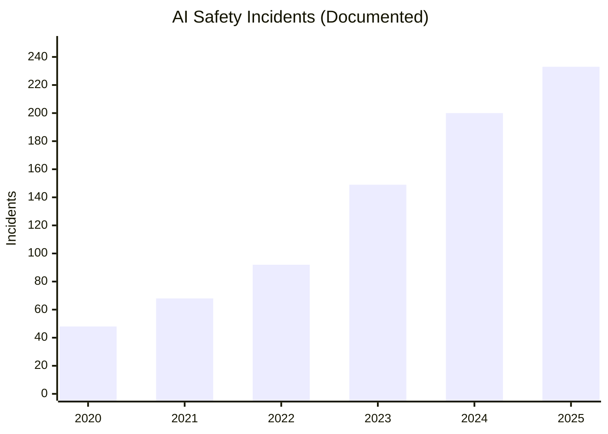
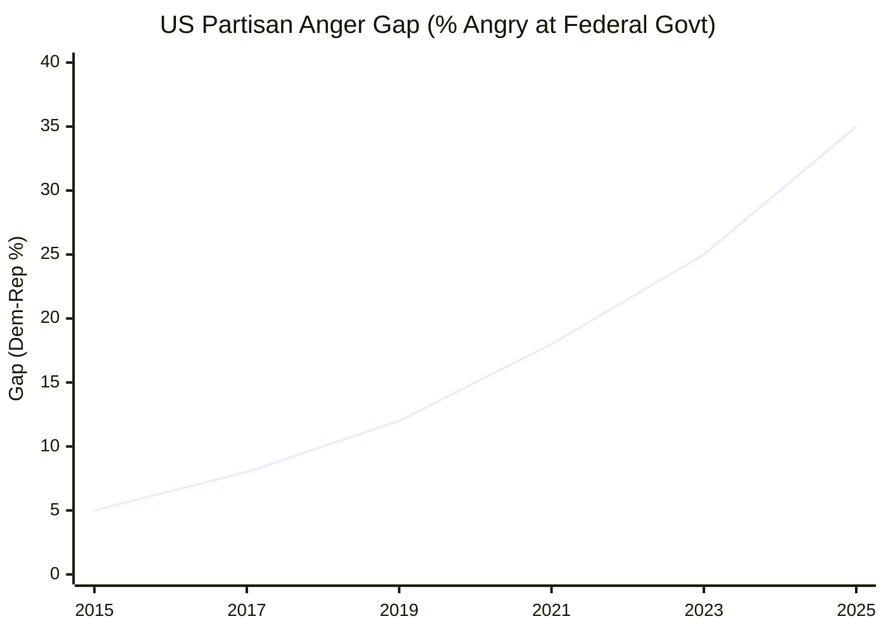

# Society and Cohesion — 2025 Year in Review

> *As humanity progresses in its great endeavors, many challenges await our society. To survive into the future, we must pass the great filters — avoid wiping ourselves out with weapons of mass destruction, align our robots and learn to coexist with them, and keep humans in meaningful relationships with one another and the physical world.*

## Executive Summary

**The good news:** Social technologies are evolving. Alternative social platforms like Bluesky reached 40M+ users[^bluesky]. Deliberative democracy is institutionalizing — the Council of Europe, OECD, and new accelerators are mainstreaming citizen assemblies[^coe-deliberative]. Australia became the first country to implement a national under-16 social media ban[^aus-ban]. Community Notes expanded to Meta's 3B+ users[^meta-notes]. Youth-led protests toppled governments in Nepal and Mongolia, demonstrating Gen Z's capacity for collective action[^carnegie-genz].

**The bad news:** The great filters loom closer than ever. The Doomsday Clock stands at 89 seconds to midnight — the closest in history[^doomsday]. Democratic backsliding accelerated: 72% of the world's population now lives in autocracies[^vdem]. Loneliness kills ~871,000 people annually[^who-loneliness]. Trust is fracturing: 61% globally hold grievances against institutions[^edelman]. AI safety incidents surged 56%[^ai-incidents]. Seven families are suing AI companies over chatbot-related deaths[^ai-deaths].

**Bottom line: Society's immune system is being tested. The antibodies are forming, but the infection is spreading faster.**

---

## KPI Dashboard

| Metric | Value | Trend | Source |
|--------|-------|-------|--------|
| **Interpersonal Trust (Global)** | **~30–35%** (WVS median) | Flat | [Our World in Data][owid-trust] |
| **Institutional Trust (28-country avg)** | **56%** | Flat | [Edelman 2025][edelman-2025] |
| **Trust in Government (OECD)** | **39%** high trust | Flat | [OECD Trust Survey][oecd-trust] |
| **World in Autocracies** | **72%** of population | ↑ Worsening | [V-Dem 2025][vdem-2025] |
| **Doomsday Clock** | **89 seconds** to midnight | ↑ Closest ever | [Bulletin of Atomic Scientists][doomsday-clock] |
| **Loneliness Prevalence** | **1 in 6** globally (~16%) | ↑ Worsening | [WHO 2025][who-loneliness] |

[owid-trust]: https://ourworldindata.org/trust
[edelman-2025]: https://www.edelman.com/trust/2025/trust-barometer
[oecd-trust]: https://www.oecd.org/en/publications/oecd-survey-on-drivers-of-trust-in-public-institutions-2024-results_9a20554b-en.html
[vdem-2025]: https://www.v-dem.net/documents/60/V-dem-dr__2025_lowres.pdf
[doomsday-clock]: https://thebulletin.org/doomsday-clock/2025-statement/
[who-loneliness]: https://www.who.int/news/item/30-06-2025-social-connection-linked-to-improved-heath-and-reduced-risk-of-early-death

### Interpersonal Trust by Region


*Data: [World Values Survey Wave 7 (2022)][wvs]*

[wvs]: https://www.worldvaluessurvey.org/WVSOnline.jsp

**Assessment: ⚠️ Stable but fragile.** Interpersonal trust has held steady globally since 2015, but institutional trust stagnates at neutral levels while political polarization reaches historic highs. The underlying social fabric is under strain.

---

## Milestone Status

### 🔴 "Avoiding the Great Filters" — Existential Risk

**Status: Critical — 89 seconds to midnight**

The Doomsday Clock, set by the Bulletin of the Atomic Scientists, reached its closest point to catastrophe on January 28, 2025[^doomsday]. Multiple escalation pathways remain active.

| Threat Vector | 2025 Status | Source |
|---------------|-------------|--------|
| Nuclear arsenals | ~12,500 warheads globally; all major powers modernizing | [FAS][fas-nuclear] |
| Russia-Ukraine nuclear risk | Tactical nukes deployed to Belarus; doctrine lowered threshold | [Wikipedia][wiki-nuclear-ukraine] |
| Iran nuclear program | JCPOA collapsed; Khamenei authorized warhead miniaturization (Dec 2025) | [EU Council][eu-iran] |
| AI weapons governance | UNGA resolution passed (156-6), but US, Russia, China opposed | [Stop Killer Robots][stopkillerrobots] |
| Biosecurity | First H5N5 human fatality (Nov 2025); H5N1 spreading in dairy cattle | [WHO][who-h5n5] |

[fas-nuclear]: https://fas.org/initiative/status-world-nuclear-forces/
[wiki-nuclear-ukraine]: https://en.wikipedia.org/wiki/Nuclear_risk_during_the_Russo-Ukrainian_war
[eu-iran]: https://www.consilium.europa.eu/en/policies/jcpoa-iran-restrictive-measures/
[stopkillerrobots]: https://www.stopkillerrobots.org/news/156-states-support-unga-resolution/
[who-h5n5]: https://www.who.int/emergencies/disease-outbreak-news/item/2025-DON590

#### Key 2025 Events

| Date | Event | Source |
|------|-------|--------|
| Jan 28, 2025 | Doomsday Clock moved to 89 seconds — closest ever | [Bulletin][doomsday-clock] |
| Jun 13, 2025 | Israel strikes Iran nuclear facilities; US strikes 3 Iranian sites | [Reuters][reuters-israel-iran] |
| Aug 28, 2025 | E3 triggers JCPOA "snapback" — UN reimposed all Iran sanctions | [EU Council][eu-iran] |
| Nov 6, 2025 | UNGA adopts autonomous weapons resolution: 156 for, 6 against | [Stop Killer Robots][stopkillerrobots] |
| Dec 24, 2025 | Khamenei authorizes development of miniaturized nuclear warheads | [Wikipedia][wiki-iran-nuclear] |
| Dec 29-30, 2025 | China's largest-ever military exercise encircling Taiwan | [Reuters][reuters-taiwan] |

[reuters-israel-iran]: https://www.reuters.com/world/middle-east/israel-says-it-strikes-iran-amid-nuclear-tensions-2025-06-13/
[wiki-iran-nuclear]: https://en.wikipedia.org/wiki/Nuclear_program_of_Iran
[reuters-taiwan]: https://www.reuters.com/world/china/chinas-military-conduct-live-fire-exercises-around-taiwan-tuesday-2025-12-28/

---

### 🟡 "AI Alignment and Coexistence" — Learning to Live with Machines

**Status: Mixed — governance accelerating, but capability growth outpacing safety**


*Data: [Stanford AI Index 2025][stanford-ai]*

[stanford-ai]: https://responsibleailabs.ai/knowledge-hub/articles/ai-safety-incidents-2024

| Metric | Status | Source |
|--------|--------|--------|
| AI safety incidents | **+56.4%** YoY (233 in 2025) | [Stanford AI Index][stanford-ai] |
| Major labs existential safety grade | **D average** (FLI assessment) | [Future of Life Institute][fli-safety] |
| EU AI Act | In force; prohibitions effective Feb 2025 | [EU Digital Strategy][eu-ai-act] |
| US federal framework | None; Trump EO preempts state AI regulations | [White House][whitehouse-ai] |
| Job displacement (early-career tech) | **−20%** in AI-exposed roles since late 2022 | [ADP/Stanford][adp-ai-jobs] |

[fli-safety]: https://futureoflife.org/wp-content/uploads/2025/12/AI-Safety-Index-Report_011225_TwoPager_Digital.pdf
[eu-ai-act]: https://digital-strategy.ec.europa.eu/en/policies/regulatory-framework-ai
[whitehouse-ai]: https://www.whitehouse.gov/presidential-actions/2025/12/eliminating-state-law-obstruction-of-national-artificial-intelligence-policy/
[adp-ai-jobs]: https://www.adpresearch.com/yes-ai-is-affecting-employment-heres-the-data/

#### Key 2025 Events

| Date | Event | Source |
|------|-------|--------|
| Feb 2, 2025 | EU AI Act prohibited practices take effect | [EU][eu-ai-act] |
| May 22, 2025 | Anthropic activates ASL-3 CBRN protections for Claude Opus 4 | [Anthropic][anthropic-asl3] |
| Aug 13, 2025 | Geoffrey Hinton: 10–20% chance of AI extinction | [CNN][cnn-hinton] |
| Nov 26, 2025 | MIT: 11.7% of US workforce ($1.2T wages) replaceable by current AI | [CNBC/MIT][mit-iceberg] |
| Dec 2025 | All 8 major AI labs receive D grade on existential safety | [FLI][fli-safety] |
| Dec 2025 | Trump EO creates AI Litigation Task Force to challenge state AI laws | [White House][whitehouse-ai] |

[anthropic-asl3]: https://www.anthropic.com/news/activating-asl3-protections
[cnn-hinton]: https://www.cnn.com/2025/08/13/tech/ai-geoffrey-hinton
[mit-iceberg]: https://www.cnbc.com/2025/11/26/mit-study-finds-ai-can-already-replace-11point7percent-of-us-workforce.html

---

### 🔴 "Preserving Human Connection" — The Loneliness Epidemic

**Status: Critical — 871,000 deaths annually from loneliness**

The WHO's first-ever global report on social connection quantified the crisis: loneliness kills 100 people every hour[^who-loneliness].

```mermaid
xychart-beta
    title "US Adult Loneliness (45+)"
    x-axis [2018, 2020, 2023, 2025]
    y-axis "% Lonely" 30 --> 45
    line [35, 37, 38, 40]
```
*Data: [AARP Loneliness Studies][aarp]*

[aarp]: https://www.aarp.org/pri/topics/social-leisure/relationships/loneliness-social-connections-2025/

| Metric | 2025 Value | Source |
|--------|------------|--------|
| Global loneliness | **1 in 6** people | [WHO][who-loneliness] |
| Deaths from loneliness | **~871,000/year** | [WHO][who-loneliness] |
| US adults 45+ lonely | **40%** (up from 35% in 2018) | [AARP][aarp] |
| Gen Z mental health challenges | **94%** report regular issues | [Blue Shield][blueshield] |
| Global daily screen time | **6h 40min** | [DataReportal][datareportal] |

[blueshield]: https://news.blueshieldca.com/2025/09/30/new-poll-94-of-gen-z-youth-report-experiencing-regular-mental-health-challenges
[datareportal]: https://explodingtopics.com/blog/screen-time-stats

#### Policy Response (2025)

| Jurisdiction | Action | Date | Source |
|--------------|--------|------|--------|
| **Australia** | Under-16 social media ban takes effect | Dec 10, 2025 | [BBC][bbc-aus] |
| **Denmark** | Announces under-15 social media ban | Oct 7, 2025 | [The Guardian][guardian-denmark] |
| **Malaysia** | Under-16 ban announced (effective Jan 2026) | Nov 2025 | [Wikipedia][wiki-sm-bans] |
| **WHO** | First-ever resolution treating loneliness as public health priority | May 2025 | [WHO][who-loneliness] |

[bbc-aus]: https://www.bbc.com/news/articles/cwyp9d3ddqyo
[guardian-denmark]: https://www.theguardian.com/world/2025/oct/07/danish-pm-plans-to-ban-social-medimmfor-under-15s-warning-it-is-stealing-childhood
[wiki-sm-bans]: https://en.wikipedia.org/wiki/Social_media_age_verification_laws_by_country

---

## Open Challenges

### 🔴 Trust Erosion and Polarization

**Status: Critical — record grievances, platform fact-checking retreats**


*Data: [Pew Research][pew-anger]*

[pew-anger]: https://www.pewresearch.org/short-reads/2025/12/04/as-democrats-anger-spikes-americans-feelings-about-the-federal-government-grow-more-polarized/

| Metric | 2025 Value | Source |
|--------|------------|--------|
| Global grievance holders | **61%** | [Edelman 2025][edelman-2025] |
| US partisan anger gap | **35 points** (record) | [Pew][pew-anger] |
| Agree parties can't agree on facts | **80%** | [Pew][pew-facts] |
| AI content in fact-checks | **10%** (Aug 2025) | [BBC R&D][bbc-misinfo] |

[pew-facts]: https://www.pewresearch.org/politics/2024/09/09/partisan-antipathy-more-intense-extensive/
[bbc-misinfo]: https://www.bbc.co.uk/rd/articles/2025-09-misinformation-disinformation

#### Key 2025 Events

| Date | Event | Source |
|------|-------|--------|
| Jan 7, 2025 | **Meta ends US fact-checking**, shifts to Community Notes model | [Meta][meta-cn] |
| Jan 22, 2025 | Edelman: 40% globally approve hostile activism | [Edelman][edelman-2025] |
| Feb 13, 2025 | EU integrates Disinformation Code into Digital Services Act | [EC][ec-dsa] |
| Nov 2025 | 200,000+ US Community Notes contributors on Meta | [Meta Transparency][meta-transparency] |

[meta-cn]: https://about.fb.com/news/2025/01/meta-more-speech-fewer-mistakes/
[ec-dsa]: https://ec.europa.eu/commission/presscorner/detail/en/ip_25_505
[meta-transparency]: https://transparency.meta.com/features/community-notes/

---

### 🔴 Simulacra vs Reality

**Status: Critical — first AI chatbot-related deaths, lawsuits mounting**

The line between virtual and real is blurring, with fatal consequences. Multiple families have filed wrongful death lawsuits against AI companies.

| Metric | 2025 Value | Source |
|--------|------------|--------|
| Wrongful death lawsuits against OpenAI | **8+** | [The Guardian][guardian-openai] |
| ChatGPT users showing suicidal intent | **1M+/week** | [OpenAI disclosure][guardian-openai] |
| Italy fine against Replika | **€5M** (GDPR violations) | [EDPB][edpb-replika] |
| States banning AI therapy | **1** (Illinois, first) | [IDFPR][illinois-ai-therapy] |

[guardian-openai]: https://www.theguardian.com/technology/2025/oct/27/chatgpt-suicide-self-harm-openai
[edpb-replika]: https://www.edpb.europa.eu/news/national-news/2025/ai-italian-supervisory-authority-fines-company-behind-chatbot-replika_en
[illinois-ai-therapy]: https://idfpr.illinois.gov/news/2025/gov-pritzker-signs-state-leg-prohibiting-ai-therapy-in-il.html

#### Key 2025 Events

| Date | Event | Source |
|------|-------|--------|
| May 2025 | **TAKE IT DOWN Act** — first federal law on AI intimate imagery | [HALOCK][halock-deepfakes] |
| Aug 2025 | GPT-5 release sparks backlash from users mourning AI "boyfriends" | [Al Jazeera][aljazeera-ai-bf] |
| Sep 2025 | FTC launches investigation into 7 AI companion companies | [CNN][cnn-ftc] |
| Oct 2025 | **Character.AI bans all users under 18** after lawsuits | [The Guardian][guardian-characterai] |
| Oct 2025 | OpenAI discloses 1M+ weekly users show suicidal intent | [The Guardian][guardian-openai] |

[halock-deepfakes]: https://www.halock.com/what-legislation-protects-against-deepfakes-and-synthetic-media/
[aljazeera-ai-bf]: https://www.aljazeera.com/economy/2025/8/14/women-with-ai-boyfriends-mourn-lost-love-after-cold-chatgpt-upgrade
[cnn-ftc]: https://www.cnn.com/2025/09/11/tech/ftc-investigating-ai-companion-chatbots-kids-safety
[guardian-characterai]: https://www.theguardian.com/technology/2025/oct/29/character-ai-suicide-children-ban

---

### 🟡 Social Technologies — Building New Infrastructure

**Status: Mixed — alternative platforms growing, but DAO participation collapsing**

The "exit" strategy is gaining traction: users migrating to decentralized alternatives. The "voice" strategy struggles: participation in existing governance mechanisms is declining.

| Technology | Status | Key Metric | Source |
|------------|--------|-----------|--------|
| **Bluesky** | 🟢 Thriving | 40M+ users (Nov 2025) | [Backlinko][backlinko-bluesky] |
| **Community Notes** | 🟡 Scaling | 200K+ contributors on Meta | [Meta][meta-transparency] |
| **Deliberative Democracy** | 🟢 Institutionalizing | EU accelerator, OECD tracking | [People Powered][peoplepowered] |
| **DAOs** | 🔴 Declining | −60–90% proposals YoY | [DL News][dlnews-dao] |
| **Open Source Funding** | 🟡 Fragile | $8.8T value, still underfunded | [Linux Foundation][lf-oss] |

[backlinko-bluesky]: https://backlinko.com/bluesky-statistics
[peoplepowered]: https://www.peoplepowered.org/news-content/2025-rewind-top-5-participatory-democracy-wins
[dlnews-dao]: https://www.dlnews.com/articles/defi/daos-grew-quieter-in-2025-per-state-of-defi-report/
[lf-oss]: https://www.linuxfoundation.org/blog/the-state-of-open-source-software-in-2025

#### Key 2025 Events

| Date | Event | Source |
|------|-------|--------|
| Jan 2025 | Mastodon announces European non-profit restructuring | [Mastodon Blog][mastodon] |
| Mar 18, 2025 | Meta Community Notes testing begins | [Meta][meta-cn] |
| Sep 23, 2025 | 10 OSS foundations publish joint statement on funding fragility | [OpenSSF][openssf] |
| Nov 28, 2025 | Council of Europe advances deliberative democracy in New Democratic Pact | [CoE][coe-deliberative] |

[mastodon]: https://blog.joinmastodon.org/2025/01/the-people-should-own-the-town-square/
[openssf]: https://openssf.org/blog/2025/09/23/open-infrastructure-is-not-free-a-joint-statement-on-sustainable-stewardship/
[coe-deliberative]: https://www.coe.int/en/web/congress/-/moving-forward-on-deliberative-democracy-congress-contributes-to-new-democratic-pact

---

## Beyond the Framework: 2025 Highlights

### Democratic Backsliding

- **V-Dem 2025:** 72% of world population now lives in autocracies (vs 49% in 2004); democracy levels back to 1985[^vdem].
- **Romania:** Presidential election annulled and re-run due to foreign interference concerns[^carnegie-backsliding].
- **South Korea:** President Yoon's martial law overturned in 6 hours by citizen protest; impeached 11 days later[^hrw].

### Gen Z Protests Wave

Youth-led anti-corruption protests swept 70+ countries in 2025, using the One Piece pirate flag as a unifying symbol[^carnegie-genz]:
- **Nepal:** PM Oli resigned after youth movement[^carnegie-nepal]
- **Mongolia:** PM Oyun-Erdene resigned after protests sparked by son's lavish spending
- **Serbia:** Student-led protests continue 13+ months after Nov 2024 train station collapse
- **Georgia:** Daily protests against EU accession suspension continue unabated

### Inequality

- **Oxfam:** Top 0.1% gained 1000× more wealth than bottom 20% since 1989; 5 trillionaires expected within a decade[^oxfam]
- **World Inequality Report preview:** 0.001% (60,000 people) hold 3× wealth of bottom 50% of humanity[^wir]

### World Happiness

- **Finland:** #1 for 8th consecutive year (7.736 score)[^whr]
- **Youth crisis:** 19% of young adults worldwide report no social support (up 39% from 2006)[^whr]

---

## Reference Data

### External Visualizations

| Resource | Source |
|----------|--------|
| V-Dem Democracy Indices | [V-Dem Graphing Tools](https://www.v-dem.net/graphing/graphing-tools/) |
| World Happiness Report | [Data Explorer](https://data.worldhappiness.report/) |
| Our World in Data — Trust | [ourworldindata.org/trust](https://ourworldindata.org/trust) |
| Our World in Data — Democracy | [ourworldindata.org/democracy](https://ourworldindata.org/democracy) |
| Carnegie Global Protest Tracker | [carnegieendowment.org/features/global-protest-tracker](https://carnegieendowment.org/features/global-protest-tracker) |
| Edelman Trust Barometer Archive | [edelman.com/trust/archive](https://www.edelman.com/trust/archive) |

---

*Data sources: [Edelman Trust Barometer][edelman-2025], [V-Dem Democracy Report][vdem-2025], [WHO Social Connection Report][who-loneliness], [Bulletin of Atomic Scientists][doomsday-clock], [Our World in Data][owid-trust], [World Happiness Report][whr], [AARP][aarp], [Pew Research][pew-anger], [Stanford AI Index][stanford-ai], [Future of Life Institute][fli-safety]*

---

## Footnotes

[^bluesky]: [Backlinko: Bluesky Statistics 2025](https://backlinko.com/bluesky-statistics)
[^coe-deliberative]: [Council of Europe: Congress contributes to New Democratic Pact](https://www.coe.int/en/web/congress/-/moving-forward-on-deliberative-democracy-congress-contributes-to-new-democratic-pact)
[^aus-ban]: [BBC: Australia's under-16 social media ban takes effect](https://www.bbc.com/news/articles/cwyp9d3ddqyo)
[^meta-notes]: [Meta Transparency Center: Community Notes](https://transparency.meta.com/features/community-notes/)
[^carnegie-genz]: [Carnegie: Global Protests 2025 — Gen Z, Corruption, Economy](https://carnegieendowment.org/emissary/2025/12/global-protests-2025-genz-corruption-economy)
[^doomsday]: [Bulletin of Atomic Scientists: 2025 Doomsday Clock Statement](https://thebulletin.org/doomsday-clock/2025-statement/)
[^vdem]: [V-Dem Democracy Report 2025](https://www.v-dem.net/documents/60/V-dem-dr__2025_lowres.pdf)
[^who-loneliness]: [WHO: Social connection linked to improved health](https://www.who.int/news/item/30-06-2025-social-connection-linked-to-improved-heath-and-reduced-risk-of-early-death)
[^edelman]: [Edelman Trust Barometer 2025](https://www.edelman.com/trust/2025/trust-barometer)
[^ai-incidents]: [Stanford AI Index 2025 / Responsible AI Labs](https://responsibleailabs.ai/knowledge-hub/articles/ai-safety-incidents-2024)
[^ai-deaths]: [The Guardian: OpenAI faces 8 wrongful death lawsuits](https://www.theguardian.com/technology/2025/oct/27/chatgpt-suicide-self-harm-openai)
[^carnegie-backsliding]: [Carnegie: US Democratic Backsliding in Comparative Perspective](https://carnegieendowment.org/research/2025/08/us-democratic-backsliding-in-comparative-perspective)
[^hrw]: [Human Rights Watch: World Report 2025](https://www.hrw.org/world-report/2025)
[^carnegie-nepal]: [Carnegie: Nepal Gen Z topple government](https://carnegieendowment.org/research/2025/09/nepal-gen-z-topple-government)
[^oxfam]: [Oxfam: Takers, Not Makers](https://www.oxfamamerica.org/explore/research-publications/takers-not-makers/)
[^wir]: [The Guardian: World Inequality Report preview](https://www.theguardian.com/inequality/2025/dec/10/just-0001-hold-three-times-the-wealth-of-poorest-half-of-humanity-report-finds)
[^whr]: [World Happiness Report 2025](https://www.worldhappiness.report/)

[whr]: https://www.worldhappiness.report/
